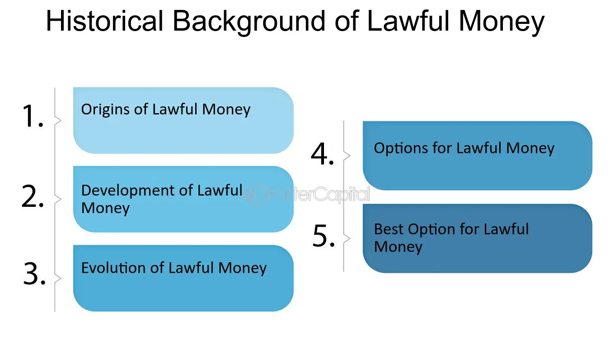

## Table of Contents

## What is the basic definition of lawful money?

Lawful money is money that is recognized by a country's government as being valid for use in paying debts and taxes. It is the official currency that people can use without any legal issues. In the United States, for example, lawful money includes coins and currency notes issued by the government, like dollar bills and quarters.

This type of money is important because it helps keep the economy stable. When everyone uses the same type of money, it makes buying and selling things easier and more trustworthy. Without lawful money, it would be hard to know if the money you are using is real or if it will be accepted by others.

## How does lawful money differ from other types of money?

Lawful money is the money that a country's government says is okay to use for paying things like bills and taxes. It's the official money that everyone in that country agrees to use. For example, in the United States, dollar bills and coins are lawful money. This kind of money is important because it makes sure that everyone is using the same type of money, which makes buying and selling things easier and more trustworthy.

Other types of money might not be backed by the government. For example, cryptocurrencies like Bitcoin are not considered lawful money because they are not issued by any government. They can be used to buy things, but they are not as widely accepted as lawful money. Also, some places might use things like gold or silver as money, but unless the government says it's okay, it's not lawful money. These other types of money can be riskier because they might not be accepted everywhere and their value can change a lot.

## What are the historical origins of lawful money?

The idea of lawful money started a long time ago when people needed a way to trade things easily. In the old days, people used things like shells, beads, or even salt to buy and sell stuff. But as countries and governments grew, they started making their own money. This money was backed by the government, which meant people could trust it more. For example, in ancient China, they used coins made of metal, and the government said these coins were the official money to use.

Over time, different countries came up with their own versions of lawful money. In the United States, the Coinage Act of 1792 set up the U.S. dollar as the official money. This act said that the dollar would be made of silver and gold, and it would be the money that everyone had to use. As time went on, paper money became more common, and governments started using it as lawful money too. Today, lawful money is usually the paper and coins that a country's government says is okay to use for buying things and paying taxes.

## Which countries have used lawful money in their economic systems?

Almost every country in the world uses lawful money in their economic systems. For example, the United States uses the U.S. dollar, which is backed by the government and used for all kinds of transactions. Other countries like Japan use the yen, and the United Kingdom uses the pound. These currencies are all considered lawful money because their governments say they are the official money to use.

In Europe, many countries use the euro, which is the lawful money for countries in the Eurozone. This means that people in places like Germany, France, and Italy all use the same money, which makes trading between these countries easier. Even countries that are not in the Eurozone, like Sweden with its krona or Switzerland with its franc, have their own lawful money that is used within their borders.

Historically, countries like ancient China used coins made of metal as lawful money, and the Roman Empire used the denarius. These examples show that the idea of lawful money has been around for a long time and is used by countries all over the world to make sure their economies run smoothly.

## What are the legal characteristics that define lawful money?

Lawful money is money that a country's government says is okay to use for paying things like bills and taxes. It is the official money that everyone in that country agrees to use. For example, in the United States, dollar bills and coins are lawful money. This kind of money is important because it makes sure that everyone is using the same type of money, which makes buying and selling things easier and more trustworthy.

The main legal characteristic of lawful money is that it is backed by the government. This means the government says it is the real money to use, and it can be used to pay debts and taxes without any problems. If you use lawful money, you know it will be accepted by other people and businesses. This is different from other types of money, like cryptocurrencies or gold, which might not be backed by the government and might not be accepted everywhere.

## How has the concept of lawful money evolved over time?

The idea of lawful money started a long time ago when people needed a way to trade things easily. In the old days, people used things like shells, beads, or even salt to buy and sell stuff. But as countries and governments grew, they started making their own money. This money was backed by the government, which meant people could trust it more. For example, in ancient China, they used coins made of metal, and the government said these coins were the official money to use. Over time, different countries came up with their own versions of lawful money. In the United States, the Coinage Act of 1792 set up the U.S. dollar as the official money. This act said that the dollar would be made of silver and gold, and it would be the money that everyone had to use.

As time went on, the concept of lawful money changed a lot. Paper money became more common, and governments started using it as lawful money too. Today, lawful money is usually the paper and coins that a country's government says is okay to use for buying things and paying taxes. The big change over time is that lawful money is now mostly made of paper and coins, not just metal like in the old days. Also, the idea of what counts as lawful money has stayed the same: it's the money that the government says is good to use, and it helps keep the economy stable by making sure everyone uses the same type of money.

## What role does lawful money play in modern financial systems?

In modern financial systems, lawful money is super important because it's the money that everyone agrees to use. It's the money that the government says is okay to use for buying things and paying taxes. This makes it easier for people to trade with each other because they know that everyone will accept this money. For example, in the United States, everyone uses dollars, so if you want to buy something, you can use dollars and the other person will take them. This helps keep the economy running smoothly because everyone is using the same type of money.

Lawful money also helps keep things stable. Because it's backed by the government, people trust it more than other types of money like cryptocurrencies. This trust is important because it means people are more likely to use lawful money for their everyday needs. When people trust the money, it helps the economy grow because people are more willing to spend and invest. So, lawful money is a big part of making sure the financial system works well and everyone can buy and sell things without worrying about whether the money is good or not.

## Can you explain the relationship between lawful money and central banks?

Lawful money is the money that a country's government says is okay to use for buying things and paying taxes. Central banks are really important because they help make sure there's enough lawful money in the country. They do this by controlling how much money is made and how it's used. For example, in the United States, the Federal Reserve is the central bank, and it decides how many dollar bills should be printed and how much money banks can lend out.

Central banks also help keep the value of lawful money stable. They do this by setting interest rates and using other tools to make sure the money doesn't lose its value too quickly. If the value of money stays stable, people trust it more and are more likely to use it for buying and selling things. This helps the economy grow because people feel safe using the money that the central bank and the government say is good to use.

## What are the economic implications of using lawful money?

Using lawful money helps keep the economy stable and makes it easier for people to buy and sell things. When everyone uses the same money that the government says is okay, it builds trust. People know that if they get paid in lawful money, they can use it to buy things without any problems. This trust is important because it encourages people to spend and invest, which helps the economy grow. If people didn't trust the money, they might not spend as much, and the economy could slow down.

Lawful money also helps control inflation, which is when prices go up over time. Central banks, like the Federal Reserve in the United States, can control how much lawful money is in the economy. If there's too much money, prices might go up too fast. But if the central bank keeps the amount of money just right, it can help keep prices stable. This makes life easier for everyone because they know that their money will still be worth about the same amount in the future.

## How do international laws and treaties affect the use of lawful money?

International laws and treaties can affect how countries use their lawful money by setting rules about how money can be used across borders. For example, countries might agree to use the same type of money, like how many European countries use the euro. This makes it easier for people in different countries to buy and sell things with each other because they're using the same money. Also, treaties can set rules about how much money can move between countries, which helps keep the world's economy stable.

Another way international laws and treaties affect lawful money is by setting rules to stop things like money laundering and fraud. These rules help make sure that the money people use is real and not being used for illegal activities. When countries work together on these rules, it helps build trust in the money system. This trust is important because it makes people more likely to use lawful money for buying and selling things, which helps the economy grow.

## What are the current debates surrounding the definition and use of lawful money?

One big debate about lawful money is whether cryptocurrencies like Bitcoin should be considered as lawful money. Some people think that since cryptocurrencies are not backed by any government, they should not be seen as lawful money. They worry that using cryptocurrencies could make it harder to keep the economy stable because their value can change a lot. On the other hand, some people believe that cryptocurrencies could be a new kind of lawful money if governments start to accept and regulate them. This debate is important because it could change how people use money in the future.

Another debate is about how much control central banks should have over lawful money. Some people think that central banks should have a lot of power to control how much money is in the economy and to keep prices stable. They believe this helps keep the economy running smoothly. But others argue that too much control by central banks can lead to problems like inflation or even economic crises. They think that people should have more freedom to choose what kind of money they use, which could mean using things like gold or cryptocurrencies alongside lawful money. This debate affects how governments and central banks manage their economies.

## What future trends might influence the concept of lawful money?

One big trend that might change lawful money is the rise of digital money. More and more people are using apps and online services to pay for things. This could lead to governments making their own digital versions of lawful money, like digital dollars or euros. These digital currencies would be backed by the government, just like paper money, but they would be easier to use online. This could make buying and selling things faster and safer, but it might also bring new challenges, like how to keep digital money secure and how to stop people from using it for illegal things.

Another trend is the growing interest in cryptocurrencies. Even though they are not lawful money now, some people think that in the future, governments might start to accept and regulate them. If this happens, cryptocurrencies could become a new kind of lawful money. This would change how people think about money and could make it easier to use money across different countries. But it could also make the economy less stable if the value of these cryptocurrencies goes up and down a lot. So, the future of lawful money might include both traditional money and new digital forms, depending on what governments decide to do.

## References & Further Reading

1. **Books**:
   - "The History of Money: From Barter to Bitcoin" by Jack Weatherford. This book provides an extensive overview of the evolution of currencies from ancient to modern times.
   - "The Age of Cryptocurrency: How Bitcoin and Digital Money Are Challenging the Global Economic Order" by Paul Vigna and Michael J. Casey. This offers insights into how digital currencies are reshaping financial systems.
   - "Algorithmic Trading: Winning Strategies and Their Rationale" by Ernie Chan. It covers various algorithmic trading strategies with practical insights for traders.

2. **Academic Articles**:
   - "Lawful Money and Fiat Money: A Legal Perspective" published in the Journal of Financial Regulation. This article examines the distinctions and legal implications of different types of money.
   - "The Role of Algorithmic Trading in Financial Markets" from the Journal of Finance and Economics. This paper analyses the effects of algorithmic trading on market operations and efficiency.

3. **Online Resources**:
   - [Investopedia](https://www.investopedia.com) has numerous articles explaining financial concepts, historical currency developments, and the basics of algorithmic trading.
   - [Federal Reserve’s official website](https://www.federalreserve.gov): Offers comprehensive resources on monetary policy and historical currency data relevant to the United States.

4. **Online Courses & Lectures**:
   - Coursera offers a course titled "Introduction to the History of Money and Finance" which covers crucial developments in the monetary system.
   - edX provides a module on "Algorithmic Trading and Finance Models" that explains trading models and their applications.

5. **Institutional Publications**:
   - Publications by the [International Monetary Fund (IMF)](https://www.imf.org) provide detailed examinations of global monetary systems and policy measures.
   - Reports from the [Bank for International Settlements (BIS)](https://www.bis.org) discuss various aspects of lawful money and its implications on global finance.

6. **Research Papers**:
   - "The Evolution and Future of Lawful Money" explores the transformation of lawful money over centuries. Available on [ResearchGate](https://www.researchgate.net).

7. **Blogs and Forums**:
   - The [QuantStart blog](https://www.quantstart.com) focuses on algorithmic trading strategies and quantitative finance concepts.
   - [Stack Exchange's Quantitative Finance](https://quant.stackexchange.com) is a forum discussing trading algorithms, quantitative finance, and related coding practices.

These resources provide foundational and advanced knowledge on currency history, lawful money, and [algorithmic trading](/wiki/algorithmic-trading), essential for anyone seeking a profound understanding of these crucial financial aspects.

