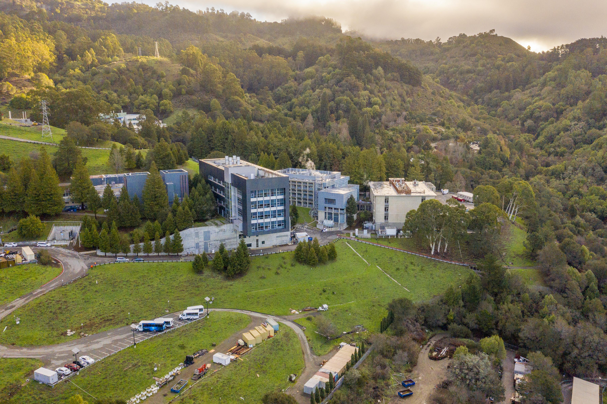

## Table of Contents

## What is the Lawrence Berkeley National Laboratory (LBNL)?

The Lawrence Berkeley National Laboratory, often called LBNL, is a research center in Berkeley, California. It is run by the University of California and supported by the U.S. Department of Energy. Scientists at LBNL work on many different topics, like energy, the environment, and new technologies. The lab was started in 1931 by a famous scientist named Ernest Lawrence, who won a Nobel Prize.

LBNL is known for its big discoveries and inventions. For example, it helped develop many important technologies, including the cyclotron, which is a type of particle accelerator. The lab also works on making energy more sustainable and finding new ways to use it. Many researchers from around the world come to LBNL to use its special equipment and work with its experts.

## Where is LBNL located?

LBNL is in Berkeley, California. It is on a hill called the Berkeley Hills, close to the University of California, Berkeley campus. You can see the San Francisco Bay from there.

The lab's main address is 1 Cyclotron Road, Berkeley, CA 94720. It's easy to find because it's right near the UC Berkeley campus. Many people visit the lab because it's in such a nice spot and has lots of important research going on.

## When was LBNL founded?

LBNL was founded in 1931. A famous scientist named Ernest Lawrence started it. He won a Nobel Prize for his work. The lab is run by the University of California and gets money from the U.S. Department of Energy.

The lab is in Berkeley, California, on a hill called the Berkeley Hills. It's close to the University of California, Berkeley campus. Scientists at LBNL work on many different things like energy, the environment, and new technologies. They have made many important discoveries and inventions, like the cyclotron, which is a type of particle [accelerator](/wiki/accelerator).

## Who founded LBNL?

LBNL was founded by a scientist named Ernest Lawrence. He started the lab in 1931. Ernest Lawrence won a Nobel Prize for his work. The lab is in Berkeley, California, and it is run by the University of California. The U.S. Department of Energy gives the lab money to do its research.

Scientists at LBNL work on many different topics. They study things like energy, the environment, and new technologies. The lab is famous for making important discoveries and inventions. One of their big inventions is the cyclotron, which is a type of particle accelerator. Many researchers from around the world come to LBNL to use its special equipment and work with its experts.

## What is the mission of LBNL?

The mission of LBNL is to solve big problems that affect the world. They want to make energy cleaner and more sustainable. They also study how to protect the environment and make new technologies that can help people. The lab works on many different projects to find new ways to use energy and make the world a better place.

Scientists at LBNL work together to make important discoveries. They use special tools and machines to do their research. The lab is famous for inventing things like the cyclotron, which helps scientists learn about tiny particles. Many researchers from around the world come to LBNL to use its equipment and work with its experts.

## What are some of the major research areas at LBNL?

LBNL focuses on many important research areas. One big area is energy. Scientists at the lab work on making energy cleaner and more sustainable. They study things like solar power, wind power, and new ways to store energy. They also look at how to make buildings use less energy. This can help save money and protect the environment.

Another major area is the environment. Researchers at LBNL study climate change and how to stop it. They look at how pollution affects the air and water. They also work on ways to clean up pollution and protect nature. This helps make the world a healthier place for everyone.

LBNL also does a lot of work in technology and science. They study tiny particles and how they work. This can help us understand the universe better. They also work on new materials and technologies that can be used in many different ways. This includes things like better batteries, new types of computers, and even new medicines.

## How does LBNL contribute to energy research?

LBNL works hard to make energy cleaner and better for the world. They study many types of energy, like solar power and wind power. Scientists at the lab try to find new ways to use these kinds of energy so they can replace energy that comes from dirty sources like coal and oil. They also look at how to store energy better. This means they work on making batteries that can hold more power and last longer. By doing this, LBNL helps make energy more sustainable, which is good for the environment.

Another way LBNL helps with energy research is by making buildings use less energy. They study how to make buildings more energy-efficient. This means finding ways to use less power for heating, cooling, and lighting. By making buildings use less energy, LBNL helps save money and reduce pollution. Their research can make a big difference in how we use energy every day.

## What are some notable achievements or discoveries made at LBNL?

LBNL has made many important discoveries and inventions. One of the most famous is the cyclotron. This machine helps scientists study tiny particles. It was invented by Ernest Lawrence, the person who started the lab. The cyclotron helped scientists learn a lot about how the world works at a very small level. Another big achievement is in the area of energy. LBNL helped develop new ways to use solar power and wind power. They also worked on making better batteries that can store more energy and last longer.

LBNL has also made big steps in understanding the universe. They helped discover dark energy, which is a mysterious force that affects how the universe grows. This discovery changed how scientists think about the universe. In the field of biology, LBNL helped develop new ways to study DNA and other tiny parts of cells. This has helped scientists learn more about how living things work. All these achievements show how LBNL's work can change our world in many different ways.

## How is LBNL funded?

LBNL gets its money from the U.S. Department of Energy. This is the main way the lab is funded. The Department of Energy gives LBNL the money it needs to do its research and keep the lab running. This funding helps scientists at LBNL work on important projects that can make the world a better place.

Besides the money from the Department of Energy, LBNL also gets some funding from other places. Sometimes, the lab works with other groups like universities or companies. These partners can give money to help with specific projects. This extra funding helps LBNL do even more research and make more discoveries.

## What is the organizational structure of LBNL?

LBNL is run by the University of California and gets its money from the U.S. Department of Energy. The lab has a director who is in charge of everything. The director makes sure the lab is doing its job and following the rules. The director also works with other leaders at the lab to plan what research to do and how to spend the money.

The lab is divided into different groups called divisions. Each division focuses on a specific area of research, like energy or the environment. Each division has a leader who works with scientists to do their research. These leaders report to the director and help make sure their division is doing important work. This way, LBNL can work on many different projects at the same time and make big discoveries.

LBNL also works with other groups outside the lab. They partner with universities, companies, and other research centers. These partnerships help LBNL get more money and do more research. By working together, LBNL can solve big problems and make new inventions that help the world.

## How does LBNL collaborate with other institutions?

LBNL works with many other groups to do its research. They partner with universities, companies, and other research centers. These partnerships help LBNL get more money and share ideas. By working together, they can solve big problems and make new inventions that help the world. For example, LBNL might work with a university to study new ways to use solar power or with a company to develop better batteries.

These collaborations are important because they let LBNL use special tools and machines that other places have. Sometimes, LBNL needs equipment that is very expensive or hard to find. By partnering with other groups, they can use this equipment without having to buy it themselves. This helps LBNL do more research and make more discoveries. Working together also means that LBNL can learn from other experts and share their own knowledge, which makes their research even better.

## What future projects or initiatives is LBNL currently planning?

LBNL is always planning new projects and initiatives to keep making the world better. One big project they are working on is called the Advanced Light Source Upgrade (ALS-U). This project will make their light source much stronger. This will help scientists study tiny things like atoms and molecules in new ways. They hope this will lead to new discoveries in areas like medicine and materials science.

Another project LBNL is planning is in the area of energy. They want to build a big facility to study how to make energy cleaner and more sustainable. This facility will help them work on things like better solar panels and wind turbines. They also want to find new ways to store energy, like making better batteries. These projects will help LBNL keep leading the way in making energy better for everyone.

## References & Further Reading

[1]: Arute, F., Arya, K., Babbush, R., et al. (2019). ["Quantum supremacy using a programmable superconducting processor."](https://www.nature.com/articles/s41586-019-1666-5) Nature, 574(7779), 505-510.

[2]: Preskill, J. (2018). ["Quantum Computing in the NISQ era and beyond."](https://quantum-journal.org/papers/q-2018-08-06-79/) Quantum, 2, 79.

[3]: Childs, A. M., Kothari, R., & Somma, R. (2017). ["Quantum algorithms for systems of linear equations with exponentially improved dependence on precision."](https://journals.aps.org/prresearch/references/10.1103/PhysRevResearch.6.043031) SIAM Journal on Computing, 46(6), 1920-1950.

[4]: Mohseni, M., Read, P., Neven, H., et al. (2017). ["Commercialize quantum technologies in under a decade."](https://www.nature.com/articles/543171a) Nature, 543, 171-174.

[5]: Bergstra, J., Bardenet, R., Bengio, Y., & Kégl, B. (2011). ["Algorithms for Hyper-Parameter Optimization."](https://dl.acm.org/doi/10.5555/2986459.2986743) Advances in Neural Information Processing Systems 24.

[6]: ["Advances in Financial Machine Learning"](https://www.amazon.com/Advances-Financial-Machine-Learning-Marcos/dp/1119482089) by Marcos Lopez de Prado

[7]: ["Machine Learning for Algorithmic Trading"](https://github.com/stefan-jansen/machine-learning-for-trading) by Stefan Jansen