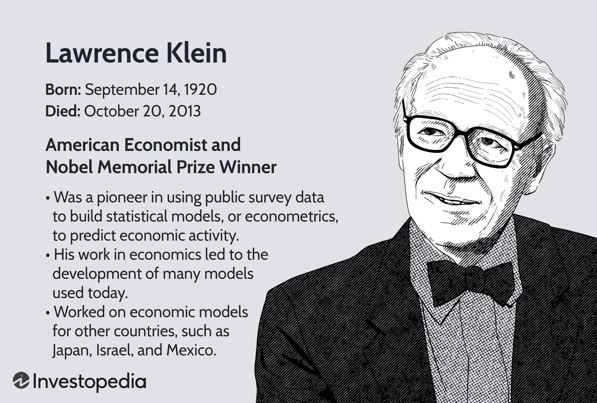

## Table of Contents

## Who is Lawrence Klein and what is his significance in economics?

Lawrence Klein was an American economist born in 1920 and passed away in 2013. He is most famous for his work in developing econometric models, which are mathematical models used to study economic systems. Klein won the Nobel Prize in Economics in 1980 for his work on these models. He used them to make predictions and understand how different parts of the economy, like employment, prices, and production, interact with each other.

Klein's most well-known model is called the Klein-Goldberger model, which he developed with his colleague Arthur Goldberger. This model was one of the first to be used to forecast economic trends and help with policy decisions. Governments and businesses found it very useful because it helped them understand what might happen in the economy in the future. Klein's work changed the way economists think about and study the economy, making econometrics a key part of economic analysis.

## What is econometrics and how does it relate to economics?

Econometrics is a branch of economics that uses math and statistics to study economic data. It helps economists turn big sets of numbers into useful information. For example, if you want to know how changes in interest rates affect how much people spend, econometrics can help you figure that out by looking at past data.

Econometrics is really important in economics because it helps economists make predictions and test their ideas. When economists have a theory about how the economy works, they can use econometrics to see if the data supports their theory. This makes economics more like a science, where you can check if your ideas are right or wrong. So, econometrics is a big part of how economists understand and explain the world.

## What were Lawrence Klein's major contributions to the field of econometrics?

Lawrence Klein made big contributions to econometrics by creating detailed math models of the economy. He helped build the Klein-Goldberger model with his friend Arthur Goldberger. This model was one of the first to help predict what might happen in the economy. It looked at things like jobs, prices, and how much stuff people made. Governments and businesses used this model to plan better and make smarter choices about the future.

Another big thing Klein did was win the Nobel Prize in Economics in 1980. He got this award for his work on econometric models. His models showed how different parts of the economy work together. This helped economists understand the economy better and make more accurate guesses about what might happen next. Klein's work changed how economists study and think about the economy, making econometrics a key part of their toolkit.

## How did Lawrence Klein's work influence economic policy?

Lawrence Klein's work had a big impact on economic policy by giving governments and businesses tools to predict what might happen in the economy. His Klein-Goldberger model was one of the first models that could forecast economic trends. This helped policymakers make better decisions. For example, if the model predicted high unemployment, the government might create job programs to help people find work. By using Klein's models, leaders could plan ahead and try to keep the economy stable.

Klein's models also helped economists test their ideas about how the economy works. This made economic policy more scientific because policymakers could see if their plans were working or not. If a policy didn't work as expected, they could change it based on what the models showed. Klein's work made it easier for governments to use data to guide their decisions, which led to smarter economic policies that aimed to help more people.

## Can you explain the Klein-Goldberger model and its impact on econometric modeling?

The Klein-Goldberger model is a big math model that Lawrence Klein made with his friend Arthur Goldberger. It looks at different parts of the economy, like jobs, prices, and how much stuff people make. The model uses numbers from the past to guess what might happen in the future. It was one of the first models that could do this, and it helped people understand how the economy works better. Governments and businesses used it to plan ahead and make better choices.

The Klein-Goldberger model changed how economists do their work. Before this model, economists had a harder time predicting what would happen in the economy. But with this model, they could use numbers to make better guesses. This made econometric modeling more important because it showed that math and numbers could help us understand the economy. Other economists started making their own models, and this led to more ways to study and predict economic trends.

## What role did Lawrence Klein play in the development of macroeconomic forecasting?

Lawrence Klein played a big role in making macroeconomic forecasting better. He made a famous model called the Klein-Goldberger model with his friend Arthur Goldberger. This model used numbers from the past to guess what might happen in the economy in the future. It looked at things like jobs, prices, and how much stuff people made. Governments and businesses used this model to plan ahead and make better choices. Before Klein's work, it was harder to predict what would happen in the economy. His model made it easier for people to see what might happen next.

Klein's work changed how economists think about and study the economy. He showed that using math and numbers could help us understand and predict economic trends. This made macroeconomic forecasting more scientific and useful. Because of Klein, other economists started making their own models to study the economy. His ideas helped make econometrics a key part of economics. Klein's work helped make the economy more predictable, which helped governments and businesses plan better.

## How did Lawrence Klein's work on econometric models help in understanding economic cycles?

Lawrence Klein's work on econometric models helped economists understand economic cycles better by using math to look at past data. He made models that could show how things like jobs, prices, and production change over time. These models helped economists see patterns in the economy, like when it grows or shrinks. By studying these patterns, they could learn more about why economic cycles happen and how long they might last.

Klein's most famous model, the Klein-Goldberger model, was especially useful for understanding economic cycles. It used numbers from the past to predict what might happen in the future. This helped economists see how different parts of the economy affect each other during different parts of the cycle. For example, they could see how a change in jobs might lead to changes in spending and prices. Klein's work made it easier for economists to study and predict economic cycles, which helped governments and businesses plan better.

## What are some of the criticisms or limitations of Lawrence Klein's econometric approaches?

Lawrence Klein's econometric models, while groundbreaking, faced some criticisms and limitations. One big issue was that these models relied a lot on past data to predict the future. But the economy can change in ways that are hard to predict, like new technology or big world events. So, the models might not always be right because they couldn't account for these surprises. Another problem was that the models were very complex. They needed a lot of numbers and math, which made them hard to use and understand for some people. This complexity could make it tough for policymakers to trust the models completely.

Another criticism was that Klein's models sometimes didn't capture the full picture of the economy. They focused a lot on numbers and math, but the economy is also affected by things like people's feelings and government policies. These factors can be hard to put into a model. Some economists thought that Klein's models might miss important parts of how the economy works because of this. Despite these limitations, Klein's work was still very important because it helped start a new way of studying the economy that is still used today.

## How has the field of econometrics evolved since Lawrence Klein's foundational work?

Since Lawrence Klein's foundational work, the field of econometrics has grown a lot. Economists have made new models that can handle more data and look at more parts of the economy. They use computers to do the math, which lets them study bigger and more complicated problems. New methods, like [machine learning](/wiki/machine-learning), help economists find patterns in data that were hard to see before. These new tools make it easier to predict what might happen in the economy and test new ideas.

Another big change is that econometrics now looks at more than just numbers. Economists have found ways to include things like people's feelings and government rules in their models. This makes the models more realistic and useful for understanding the economy. Even though Klein's models were very important, today's econometrics can do more because of these new ideas and tools. Klein's work helped start it all, and now econometrics keeps getting better to help us understand and predict the economy.

## What are some of the advanced econometric techniques that were influenced by Klein's methodologies?

Since Lawrence Klein's work, econometrics has grown to include many new techniques. One big change is the use of computers to handle more data and do more complex math. This has led to new methods like time series analysis, which looks at how things change over time, and panel data analysis, which studies data from different groups over time. These methods help economists see patterns and make better predictions about the economy. Another important technique is vector autoregression (VAR), which looks at how different parts of the economy affect each other. Klein's models helped start these ideas, and now they are used to study all sorts of economic questions.

Another advanced technique influenced by Klein's work is the use of machine learning in econometrics. Machine learning uses computers to find patterns in big sets of data that might be hard for people to see. This can help economists make more accurate predictions and test new ideas about how the economy works. Klein's focus on using data to understand the economy paved the way for these new methods. Today, economists also use techniques like structural equation modeling, which looks at the relationships between different parts of the economy, and simulation methods, which help test what might happen if certain things change. All these techniques build on Klein's idea that math and data can help us understand and predict economic trends.

## How do contemporary econometricians build upon or diverge from Klein's original theories and models?

Contemporary econometricians build on Lawrence Klein's original theories and models by using more advanced math and computers to study the economy. Klein's work showed that you could use numbers and data to understand and predict economic trends. Today, economists use even more data and new methods like machine learning to find patterns that were hard to see before. They also use techniques like time series analysis and panel data analysis to look at how things change over time and across different groups. These new tools help economists make better predictions and test new ideas about the economy, building on what Klein started.

At the same time, some econometricians have moved away from Klein's original models in certain ways. Klein's models were very focused on numbers and math, but today's economists also try to include things like people's feelings and government policies in their models. This makes the models more realistic and useful for understanding the economy. While Klein's models were groundbreaking, they were also complex and sometimes hard to use. Modern econometricians try to make their models simpler and easier to understand, so more people can use them to make decisions. Even though they might diverge from Klein's exact methods, his foundational work still influences how economists think about and study the economy today.

## What are the current applications of Klein's econometric models in global economic analysis?

Lawrence Klein's econometric models are still used today to help understand and predict what's happening in the global economy. Governments and big businesses use these models to make plans and decisions. For example, they might use the models to guess how changes in one country's economy could affect other countries. This is important because the world's economies are all connected. By looking at data from different countries, economists can see how things like trade, jobs, and prices might change in the future.

Klein's models have also helped with making economic policies that work better. When countries work together on things like trade agreements or fighting climate change, they need to understand how their actions will affect the global economy. Klein's models give them a way to look at the big picture and make smart choices. Even though the models have been updated and improved over time, the basic idea of using math and data to study the economy, which Klein started, is still a big part of how economists work today.

## References & Further Reading

[1]: Klein, L. R. (1983). ["The Economics of Supply Characterization."](https://archive.org/details/economicsofsuppl0000klei_g8z2) The American Economic Review.

[2]: Granger, C. W. J., & Newbold, P. (1974). ["Spurious Regressions in Econometrics."](https://www.sciencedirect.com/science/article/pii/0304407674900347) Journal of Econometrics.

[3]: Engle, R. F. (1982). ["Autoregressive Conditional Heteroscedasticity with Estimates of the Variance of United Kingdom Inflation."](https://www.semanticscholar.org/paper/Autoregressive-conditional-heteroscedasticity-with-Engle/2ee6cb87fc81ecd78d161c4a92c9dfce00c8961c) Econometrica.

[4]: Hamilton, J. D. (1994). ["Time Series Analysis."](https://api.pageplace.de/preview/DT0400.9780691218632_A40156688/preview-9780691218632_A40156688.pdf) Princeton University Press.

[5]: Pagan, A. (1984). ["Econometric Issues in the Analysis of Regressions with Generated Regressors."](https://www.jstor.org/stable/2648877) International Economic Review.

[6]: ["Econometric Models and Economic Forecasts"](https://www.semanticscholar.org/paper/Econometric-models-and-economic-forecasts-Pindyck-Rubinfeld/d6173a39c3681d7035d9d8d772d03476417bea7e) by Robert S. Pindyck and Daniel L. Rubinfeld

[7]: Tsay, R. S. (2010). ["Analysis of Financial Time Series,"](https://onlinelibrary.wiley.com/doi/book/10.1002/9780470644560) 3rd Edition, Wiley.