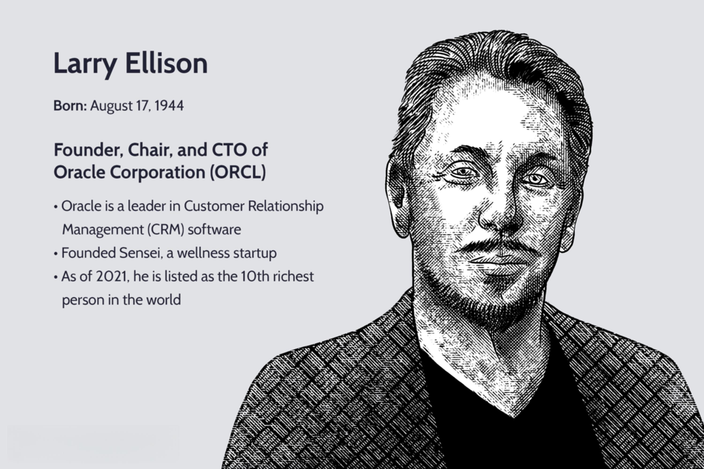

Lawrence Leibowitz has been a prominent figure in the financial markets, renowned for his impactful role in algorithmic trading and technological advancements. His career has been marked by significant contributions to the evolution of trading systems and market structures, making him a pivotal force in modern finance.

Leibowitz's influence in algorithmic trading is noteworthy, as he has been instrumental in developing strategies that enhance market efficiency and structure. His work in algorithmic trading has helped shape the way financial markets operate today, emphasizing speed, precision, and data-driven decision-making. These contributions have not only improved trading operations but have also contributed to the broader application of technology in finance.

His career trajectory is impressive, encompassing leadership roles at several major financial institutions. Leibowitz served as the Chief Operating Officer at NYSE Euronext, where he oversaw operations during a transformative period for the exchange. His leadership at UBS Americas Equities and strategic initiatives at other financial firms have been marked by a focus on innovation and technological integration.

Notable achievements in technology and finance further highlight his impact. As a co-founder of Bunker Capital, a hedge fund, he demonstrated his expertise in navigating complex financial markets. His roles at REDIBook ECN and Credit Suisse are additional testaments to his capacity to drive change and implement strategic initiatives that benefit both financial institutions and market participants.

Throughout his career, Lawrence Leibowitz has played a critical role in marrying technology with finance, leading to advancements that continue to influence the industry. His work has not only advanced the institutions he has been a part of but has also set new standards in the global financial markets. These contributions underscore a legacy of innovation and leadership that continues to resonate in today's technology-driven financial landscape.

## Table of Contents

## Early Career and Education

Lawrence Leibowitz, a prominent figure in the financial industry, embarked on his educational journey with a strong academic foundation in economics. He graduated with an economics degree from Princeton University, a prestigious institution known for its rigorous curriculum and emphasis on critical thinking and analysis. This educational background played a crucial role in shaping his analytical skills and understanding of economic principles, which later became instrumental in his career within the financial markets.

Following his academic pursuits, Leibowitz entered the professional world, securing initial roles in various financial firms where he gained early exposure to trading activities. These positions provided him with practical experience and a comprehensive understanding of the financial industry's mechanisms. During this period, Leibowitz was able to apply his academic knowledge to real-world situations, developing a keen insight into market dynamics and the intricacies of trading.

His early career was marked by an environment that demanded a profound comprehension of financial principles and the ability to navigate complex market scenarios. This exposure helped him form the foundational insights necessary for his future leadership roles in the industry. Leibowitz's early experiences were characterized by a combination of theoretical knowledge from his academic studies and practical application gained through hands-on involvement in the financial sector. This blend of education and experience laid the groundwork for his significant contributions to the financial industry, particularly in areas related to trading and market strategies.

## Career Highlights

Lawrence Leibowitz's career is marked by significant contributions to major financial institutions and strategic impacts in the trading industry. As Chief Operating Officer (COO) at NYSE Euronext, Leibowitz played a pivotal role in managing the complex operations of one of the world's largest exchange groups. His responsibilities included overseeing the integration of technology and operations following the merger of NYSE and Euronext, a strategic move that sought to enhance the group's competitiveness in a rapidly evolving financial market. The integration was a formidable task, demanding not only operational acumen but also a deep understanding of both American and European market dynamics.

Before his tenure at NYSE Euronext, Leibowitz's role at UBS Americas Equities involved spearheading strategic initiatives aimed at strengthening UBS's equities trading capabilities. His initiatives focused on optimizing trading processes and improving market share, crucial for maintaining the bank's competitive edge. Leibowitz's role in developing and implementing these strategies underscored his ability to adapt to changing market conditions and leverage technology to advance trading efficiency.

In addition to his leadership roles at major financial firms, Leibowitz co-founded Bunker Capital, a [hedge fund](/wiki/hedge-fund-trading-strategies) where he demonstrated his expertise in investment strategies and fund management. This venture further allowed him to refine his skills in financial analysis and risk management, offering him a more entrepreneurial perspective on the financial markets.

Leibowitz also held critical positions at REDIBook ECN and Credit Suisse, companies known for their contributions to electronic trading. At REDIBook, an electronic communications network (ECN), he played a significant part in the development of advanced trading technologies that enhanced transaction efficiency and reduced trading costs. His work at Credit Suisse further cemented his reputation as a leader in employing technology to streamline trading operations and improve market accessibility.

Overall, Leibowitz's career highlights reflect a blend of strategic leadership, an adept understanding of financial technologies, and a talent for guiding major institutions through complex market landscapes. His contributions have had a lasting impact on the efficiency and functionality of financial market operations globally.

## Leadership at Incapture Technologies

Lawrence Leibowitz's tenure as CEO of Incapture Technologies marked a significant period of innovation and development in financial markets technology. Under his leadership, Incapture Technologies focused on addressing the growing demand for sophisticated technology solutions in the financial sector.

Leibowitz spearheaded strategic initiatives that aimed at enhancing the efficiency and capability of financial market operations. These initiatives included the development of proprietary technologies designed to streamline processes and improve the analytic capabilities of financial firms. The company's technological advancements during his leadership sought to deliver scalable solutions, integrating complex data analytics with robust risk management tools. This was crucial in helping financial institutions navigate and manage the increasing complexities of modern financial markets.

One of the key developments under Leibowitz's guidance was the emphasis on building infrastructure that could support the evolving landscape of [algorithmic trading](/wiki/algorithmic-trading). This involved creating platforms that facilitated high-frequency trading and offered real-time data analytics, thus improving market [liquidity](/wiki/liquidity-risk-premium) and price discovery. Leibowitz's vision was pivotal in ensuring that Incapture Technologies remained at the forefront of technological innovation, providing tools that significantly enhanced trading strategies and execution.

Moreover, Leibowitz's leadership was characterized by a commitment to fostering a culture of continuous innovation, ensuring that Incapture Technologies could adapt to new challenges and leverage emerging opportunities in the financial markets. By prioritizing research and development, the company was able to maintain a competitive edge, offering cutting-edge solutions to a diverse portfolio of clients.

Through these transformative efforts, Lawrence Leibowitz solidified Incapture Technologies' position as a leader in financial markets technology, leaving a lasting impact on the industry’s approach to integrating technology with traditional financial services.

## Contributions to Algo Trading

Lawrence Leibowitz has played a pivotal role in advancing algorithmic trading, significantly influencing market structure and efficiency. His work in developing sophisticated algorithmic trading strategies has been instrumental in transforming how trading is executed across global financial markets. By leveraging technology to optimize trading processes, Leibowitz contributed to the enhancement of liquidity, price discovery, and the reduction of transaction costs.

Leibowitz's approach to algorithmic trading involves the utilization of complex mathematical models and computational algorithms to automate trading decisions. These strategies often employ a combination of statistical analysis, [machine learning](/wiki/machine-learning) models, and market signals to generate trading opportunities. For instance, algorithmic trading systems can be designed to identify [arbitrage](/wiki/arbitrage) opportunities, market trends, or execute orders at the best possible prices while minimizing market impact.

Through his participation in industry forums and committees, Leibowitz has contributed to shaping policies and best practices in algorithmic trading. His involvement has helped address concerns related to market fairness and stability, especially in the context of high-frequency trading ([HFT](/wiki/high-frequency-trading-strategies)). By advocating for transparency and improved regulatory measures, Leibowitz has played a crucial role in fostering a trading environment that balances innovation with risk management.

The impact of Leibowitz's contributions to algorithmic trading is evident in the enhanced efficiency of financial markets. His work has led to more effective order execution processes and contributed to the evolution of trading platforms that support vast volumes of trades executed at high speeds. This has resulted in narrower bid-ask spreads, which benefit both institutional and retail investors.

Overall, Leibowitz's influence in algorithmic trading extends beyond strategy development. By engaging with industry stakeholders and contributing his expertise to policy-making processes, he has helped advance the technological and regulatory frameworks that underpin modern trading ecosystems. His contributions continue to resonate, driving ongoing improvements in market operations and efficiency.

## Current Roles and Responsibilities

Lawrence Leibowitz currently holds several key positions in the technology and finance sectors. As the President and a board member of Crux Informatics, Leibowitz plays a crucial role in steering the company's strategic direction. Crux Informatics focuses on optimizing data delivery and transformation, ensuring that financial firms and other enterprises access the data they require efficiently and reliably. This involves leveraging cutting-edge technology to streamline processes, enhance data quality, and reduce operational costs. His leadership at Crux is instrumental in driving innovation and ensuring the company remains at the forefront of data solutions in the financial services industry.

In addition to his role at Crux Informatics, Leibowitz serves on the boards of various notable companies. His board membership at Cowen Inc., a diversified financial services firm, highlights his continuing influence and active involvement in the financing industry. At Cowen, Leibowitz contributes to strategic decision-making processes that shape the firm's investment strategies and business development initiatives. Furthermore, his position on the board of Enfusion, a provider of cloud-based investment management software, underscores his commitment to advancing technology solutions within the financial sector. Enfusion's platform integrates various facets of investment management, including portfolio management, order and execution management, and analytics, areas where Leibowitz's expertise proves invaluable.

Beyond these board roles, Leibowitz provides advisory insights to multiple entities operating in the intersections of technology and finance. His extensive experience and proven track record make him a sought-after advisor for companies navigating the complex financial technology landscape. Through his advisory work, Leibowitz supports companies in strategy formation, technological innovations, and market expansion, leveraging his profound understanding of algorithmic trading, data management, and financial market infrastructures.

Lawrence Leibowitz's current roles and responsibilities reflect his profound impact and ongoing commitment to fostering innovation and efficiency within the financial and technological landscapes. His expertise continues to influence various organizations, aiding them in adapting to and thriving amidst rapid technological advancements and evolving market demands.

## Future Outlook and Contributions

Lawrence Leibowitz is poised to continue his significant contributions to the technology and finance sectors, largely through his leadership roles and expertise in algorithmic trading and market innovation. As the financial industry increasingly leans toward automation and data-driven decision-making, Leibowitz is well-positioned to influence the evolution of algorithmic trading strategies further. His deep understanding of market structures and the intricacies of electronic trading systems gives him the tools to impact both the efficiency and transparency of financial markets.

Leibowitz's vision for market innovation likely includes an enhanced focus on data management and analytics. With the surge of data generated in financial markets, the ability to process and analyze this information swiftly and accurately is vital. Improved data management not only increases market efficiency but also supports the development of more sophisticated trading algorithms. Leibowitz's role in entities like Crux Informatics highlights his commitment to advancing data infrastructure, which can facilitate better data integration and access for financial institutions.

In algorithmic trading, one can anticipate his continued advocacy for strategies that leverage machine learning and [artificial intelligence](/wiki/ai-artificial-intelligence). These technologies can be pivotal in predicting market movements and optimizing trading models. For example, machine learning models can process large datasets to find patterns that human analysts might not recognize, thus informing trading strategies that react to real-time market changes. The potential application of Python libraries like TensorFlow or scikit-learn in developing such models underscores their relevance in creating more adaptive and robust trading systems.

Moreover, Leibowitz's engagement on various boards and as an advisor positions him as a significant influence in steering the finance-tech industry towards innovation. His expected contributions also encompass advancing technology solutions that facilitate regulatory compliance and risk management, providing a holistic approach to market stability and integrity. His vision likely includes fostering environments where technological advancements can coincide with ethical considerations and regulatory frameworks, ensuring sustainable growth in the financial sector.

In summary, Lawrence Leibowitz's future outlook is centered around leveraging cutting-edge technology to enhance the capabilities of financial markets. His foresight into integrating data-driven methodologies and advancing algorithmic trading strategies suggests a pivotal role in shaping the next phase of financial market evolution. As such, his ongoing contributions will likely have lasting impacts on how markets operate and adapt to new technological landscapes.

## Conclusion

Lawrence Leibowitz's career is marked by significant contributions to the financial markets, particularly in algorithmic trading and technological advancements. His strategic leadership in various high-profile roles has shaped the structure and efficiency of financial trading systems globally. As the Chief Operating Officer at NYSE Euronext, Leibowitz played a pivotal role in modernizing exchange operations, which contributed to enhanced market liquidity and greater transparency.

His vision and execution in algorithmic trading have permanently altered market dynamics, introducing innovative strategies that have streamlined trading processes and improved market responsiveness. This work not only influenced the structure of the financial markets but also set new standards for trading efficiency.

Furthermore, Leibowitz's leadership at Incapture Technologies, among other entities, underscores his commitment to advancing financial technology. He has been at the forefront of integrating data management solutions which continue to catalyze growth in financial services.

Leibowitz's ongoing contributions through advisory roles and board memberships ensure that his influence remains instrumental in shaping future market innovations and technological advancements. His enduring impact on the financial industry is marked by a legacy of innovation, strategic foresight, and unwavering dedication to improving financial systems.

## References & Further Reading

[1]: Bergstra, J., Bardenet, R., Bengio, Y., & Kégl, B. (2011). ["Algorithms for Hyper-Parameter Optimization."](https://dl.acm.org/doi/10.5555/2986459.2986743) Advances in Neural Information Processing Systems 24.

[2]: ["Advances in Financial Machine Learning"](https://www.amazon.com/Advances-Financial-Machine-Learning-Marcos/dp/1119482089) by Marcos Lopez de Prado

[3]: ["Evidence-Based Technical Analysis: Applying the Scientific Method and Statistical Inference to Trading Signals"](https://www.amazon.com/Evidence-Based-Technical-Analysis-Scientific-Statistical/dp/0470008741) by David Aronson

[4]: ["Machine Learning for Algorithmic Trading"](https://books.google.com/books/about/Machine_Learning_for_Algorithmic_Trading.html?id=4f30DwAAQBAJ) by Stefan Jansen

[5]: ["Quantitative Trading: How to Build Your Own Algorithmic Trading Business"](https://www.amazon.com/Quantitative-Trading-Build-Algorithmic-Business/dp/1119800064) by Ernest P. Chan