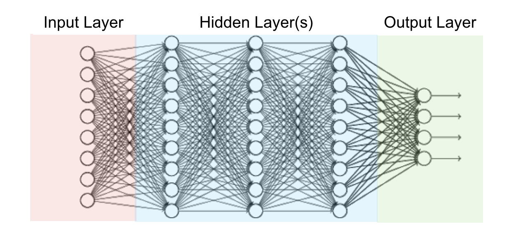

## Table of Contents

## What is Layer in the context of machine learning?

In machine learning, a layer refers to a collection of nodes or neurons that work together to process data. Think of it like a team where each member has a specific job, but they all work towards a common goal. In neural networks, which are a type of machine learning model, layers are stacked on top of each other to form a deep structure. The first layer, called the input layer, receives the raw data. The last layer, known as the output layer, gives the final result. Any layers in between are called hidden layers, and they help the network learn complex patterns by breaking down the problem into simpler parts.

Each layer in a neural network performs specific mathematical operations on the data it receives. For example, a common operation is a weighted sum followed by an activation function. If $$x_1, x_2, ..., x_n$$ are the inputs to a neuron, and $$w_1, w_2, ..., w_n$$ are the corresponding weights, the neuron computes the sum $$z = w_1x_1 + w_2x_2 + ... + w_nx_n$$. Then, an activation function like the sigmoid function, $$ \sigma(z) = \frac{1}{1 + e^{-z}} $$, is applied to $$z$$ to produce the output. This process is repeated across all neurons in a layer, and the outputs become the inputs for the next layer. By adjusting the weights through a process called training, the network learns to make better predictions or classifications.

## How does Layer help in managing machine learning models?

Layers help manage machine learning models by organizing the complex computations into simpler, manageable parts. Imagine you're trying to solve a big puzzle. Instead of looking at all the pieces at once, you sort them into groups. Each group, or layer, focuses on a specific part of the puzzle. In machine learning, each layer processes the data in a way that makes it easier for the next layer to understand. This step-by-step approach helps the model learn and make better predictions.

For example, in a neural network, the first layer might look at the raw data, like pixels in an image. It then passes this information to the next layer, which might start recognizing simple shapes. As the data moves through more layers, the model can identify more complex patterns, like objects in the image. By breaking down the problem into layers, the model can handle big and complicated tasks more easily. This makes it simpler to train the model and adjust it to perform better.

## What are the key features of Layer for machine learning?

Layers in [machine learning](/wiki/machine-learning) help break down complex problems into simpler parts. Imagine you're trying to solve a big puzzle. Instead of looking at all the pieces at once, you sort them into groups. Each group, or layer, focuses on a specific part of the puzzle. In a [neural network](/wiki/neural-network), the first layer might look at the raw data, like pixels in an image. It then passes this information to the next layer, which might start recognizing simple shapes. As the data moves through more layers, the model can identify more complex patterns, like objects in the image. This step-by-step approach makes it easier for the model to learn and make better predictions.

Each layer in a neural network performs specific mathematical operations on the data it receives. For example, a common operation is a weighted sum followed by an activation function. If $$x_1, x_2, ..., x_n$$ are the inputs to a neuron, and $$w_1, w_2, ..., w_n$$ are the corresponding weights, the neuron computes the sum $$z = w_1x_1 + w_2x_2 + ... + w_nx_n$$. Then, an activation function like the sigmoid function, $$ \sigma(z) = \frac{1}{1 + e^{-z}} $$, is applied to $$z$$ to produce the output. This process is repeated across all neurons in a layer, and the outputs become the inputs for the next layer. By adjusting the weights through a process called training, the network learns to make better predictions or classifications.

## How does Layer integrate with existing data science workflows?

Layers in machine learning fit nicely into existing data science workflows by breaking down complex problems into simpler steps. Imagine you're trying to solve a big puzzle. Instead of looking at all the pieces at once, you sort them into groups. Each group, or layer, focuses on a specific part of the puzzle. In data science, you might start with raw data and use layers to process it step by step. This way, you can easily see how the data changes and improves as it moves through each layer.

For example, in a neural network, the first layer might look at the raw data, like pixels in an image. It then passes this information to the next layer, which might start recognizing simple shapes. As the data moves through more layers, the model can identify more complex patterns, like objects in the image. This step-by-step approach makes it easier for data scientists to understand and refine their models. By adjusting the weights through a process called training, the network learns to make better predictions or classifications. If $$x_1, x_2, ..., x_n$$ are the inputs to a neuron, and $$w_1, w_2, ..., w_n$$ are the corresponding weights, the neuron computes the sum $$z = w_1x_1 + w_2x_2 + ... + w_nx_n$$. Then, an activation function like the sigmoid function, $$ \sigma(z) = \frac{1}{1 + e^{-z}} $$, is applied to $$z$$ to produce the output. This process is repeated across all neurons in a layer, and the outputs become the inputs for the next layer.

## What are the benefits of using Layer for model deployment?

Using layers for model deployment makes the process easier and more organized. Imagine you're trying to solve a big puzzle. Instead of looking at all the pieces at once, you sort them into groups. Each group, or layer, focuses on a specific part of the puzzle. In machine learning, layers help break down the model into smaller, manageable parts. This makes it simpler to deploy the model because you can see how each part works and how they fit together. It's like having a clear map that shows you exactly where to go.

Layers also help improve the model's performance. As data moves through each layer, it gets processed and refined. For example, in a neural network, the first layer might look at the raw data, like pixels in an image. It then passes this information to the next layer, which might start recognizing simple shapes. As the data moves through more layers, the model can identify more complex patterns, like objects in the image. This step-by-step approach helps the model learn and make better predictions. If $$x_1, x_2, ..., x_n$$ are the inputs to a neuron, and $$w_1, w_2, ..., w_n$$ are the corresponding weights, the neuron computes the sum $$z = w_1x_1 + w_2x_2 + ... + w_nx_n$$. Then, an activation function like the sigmoid function, $$ \sigma(z) = \frac{1}{1 + e^{-z}} $$, is applied to $$z$$ to produce the output. This process is repeated across all neurons in a layer, and the outputs become the inputs for the next layer.

## How can Layer be used to scale machine learning operations?

Layers help scale machine learning operations by breaking down complex tasks into smaller, more manageable parts. Imagine you're trying to solve a big puzzle. Instead of looking at all the pieces at once, you sort them into groups. Each group, or layer, focuses on a specific part of the puzzle. In machine learning, this means you can add more layers to handle bigger and more complex data sets. This makes it easier to process a lot of information quickly and efficiently, which is important when you're working with large amounts of data.

As data moves through each layer, it gets processed and refined. For example, in a neural network, the first layer might look at the raw data, like pixels in an image. It then passes this information to the next layer, which might start recognizing simple shapes. As the data moves through more layers, the model can identify more complex patterns, like objects in the image. This step-by-step approach helps the model learn and make better predictions. If $$x_1, x_2, ..., x_n$$ are the inputs to a neuron, and $$w_1, w_2, ..., w_n$$ are the corresponding weights, the neuron computes the sum $$z = w_1x_1 + w_2x_2 + ... + w_nx_n$$. Then, an activation function like the sigmoid function, $$ \sigma(z) = \frac{1}{1 + e^{-z}} $$, is applied to $$z$$ to produce the output. This process is repeated across all neurons in a layer, and the outputs become the inputs for the next layer. By using layers, you can scale your machine learning operations to handle more data and make more accurate predictions.

## What types of models can be managed using Layer?

Layers can be used to manage many types of machine learning models, especially neural networks. Think of neural networks like a team of workers where each worker, or neuron, has a specific job. The layers help break down the big job into smaller tasks. For example, in a neural network, the first layer might look at raw data, like pixels in an image. It then passes this information to the next layer, which might start recognizing simple shapes. As the data moves through more layers, the model can identify more complex patterns, like objects in the image. This step-by-step approach helps the model learn and make better predictions.

Layers are also useful for other types of models, like convolutional neural networks (CNNs) and recurrent neural networks (RNNs). CNNs are good at understanding images and videos because they can recognize patterns in different parts of the image. RNNs are great for working with sequences of data, like text or time series. In both cases, layers help by breaking down the problem into smaller parts. For example, if $$x_1, x_2, ..., x_n$$ are the inputs to a neuron, and $$w_1, w_2, ..., w_n$$ are the corresponding weights, the neuron computes the sum $$z = w_1x_1 + w_2x_2 + ... + w_nx_n$$. Then, an activation function like the sigmoid function, $$ \sigma(z) = \frac{1}{1 + e^{-z}} $$, is applied to $$z$$ to produce the output. This process is repeated across all neurons in a layer, and the outputs become the inputs for the next layer. By using layers, these models can handle big and complex tasks more easily.

## How does Layer handle data versioning and model reproducibility?

Layers help with data versioning and model reproducibility by keeping track of how data changes as it moves through each layer. Imagine you're trying to solve a big puzzle. Instead of looking at all the pieces at once, you sort them into groups. Each group, or layer, focuses on a specific part of the puzzle. In machine learning, layers help by breaking down the model into smaller, manageable parts. This way, you can see exactly how the data changes and improves as it moves through each layer. By keeping a record of these changes, you can go back and check how the data was processed at any point, which helps with versioning and making sure your results are reproducible.

For example, in a neural network, the first layer might look at the raw data, like pixels in an image. It then passes this information to the next layer, which might start recognizing simple shapes. As the data moves through more layers, the model can identify more complex patterns, like objects in the image. If $$x_1, x_2, ..., x_n$$ are the inputs to a neuron, and $$w_1, w_2, ..., w_n$$ are the corresponding weights, the neuron computes the sum $$z = w_1x_1 + w_2x_2 + ... + w_nx_n$$. Then, an activation function like the sigmoid function, $$ \sigma(z) = \frac{1}{1 + e^{-z}} $$, is applied to $$z$$ to produce the output. This process is repeated across all neurons in a layer, and the outputs become the inputs for the next layer. By keeping track of these steps, you can ensure that your model works the same way every time, which is important for reproducibility.

## What security measures does Layer implement for machine learning projects?

Layers help keep machine learning projects safe by making sure the data stays private and secure as it moves through each layer. Imagine you're trying to solve a big puzzle. Instead of looking at all the pieces at once, you sort them into groups. Each group, or layer, focuses on a specific part of the puzzle. In machine learning, layers help by breaking down the model into smaller, manageable parts. This way, you can control who sees the data at each step, making it harder for anyone to steal or mess with it. By keeping the data safe at every layer, you can protect your project from security risks.

For example, in a neural network, the first layer might look at the raw data, like pixels in an image. It then passes this information to the next layer, which might start recognizing simple shapes. As the data moves through more layers, the model can identify more complex patterns, like objects in the image. If $$x_1, x_2, ..., x_n$$ are the inputs to a neuron, and $$w_1, w_2, ..., w_n$$ are the corresponding weights, the neuron computes the sum $$z = w_1x_1 + w_2x_2 + ... + w_nx_n$$. Then, an activation function like the sigmoid function, $$ \sigma(z) = \frac{1}{1 + e^{-z}} $$, is applied to $$z$$ to produce the output. This process is repeated across all neurons in a layer, and the outputs become the inputs for the next layer. By keeping track of these steps and securing the data at each point, you can make sure your machine learning project stays safe and secure.

## How does Layer support collaboration among data science teams?

Layers help data science teams work together by breaking down big machine learning projects into smaller, easier parts. Imagine you're trying to solve a big puzzle. Instead of looking at all the pieces at once, you sort them into groups. Each group, or layer, focuses on a specific part of the puzzle. In machine learning, this means different team members can work on different layers. For example, one person might focus on the first layer that looks at raw data, while another works on a later layer that recognizes complex patterns. This way, everyone can see how their part fits into the bigger picture, making it easier to collaborate and share ideas.

As data moves through each layer, it gets processed and refined. For instance, in a neural network, the first layer might look at the raw data, like pixels in an image. It then passes this information to the next layer, which might start recognizing simple shapes. As the data moves through more layers, the model can identify more complex patterns, like objects in the image. If $$x_1, x_2, ..., x_n$$ are the inputs to a neuron, and $$w_1, w_2, ..., w_n$$ are the corresponding weights, the neuron computes the sum $$z = w_1x_1 + w_2x_2 + ... + w_nx_n$$. Then, an activation function like the sigmoid function, $$ \sigma(z) = \frac{1}{1 + e^{-z}} $$, is applied to $$z$$ to produce the output. This process is repeated across all neurons in a layer, and the outputs become the inputs for the next layer. By working on different layers, team members can see how their work affects the overall model, making it easier to collaborate and improve the project together.

## What are some advanced use cases of Layer in enterprise settings?

In enterprise settings, layers can be used to handle big and complex data sets, making it easier for companies to analyze and use their data. For example, a company might use layers in a neural network to process customer data and predict what customers might want to buy next. The first layer could look at raw data, like what customers have bought before. The next layers might start recognizing patterns, like what products are often bought together. As the data moves through more layers, the model can make more accurate predictions about what customers might want, helping the company make better decisions.

Layers also help companies work with different types of data, like images, text, and numbers. For example, a healthcare company might use layers in a [convolutional neural network](/wiki/convolutional-neural-network) (CNN) to analyze medical images. The first layer could look at the raw pixels of an X-ray. The next layers might start recognizing edges and shapes, and as the data moves through more layers, the model can identify specific medical conditions. This helps doctors make better diagnoses and treatment plans. If $$x_1, x_2, ..., x_n$$ are the inputs to a neuron, and $$w_1, w_2, ..., w_n$$ are the corresponding weights, the neuron computes the sum $$z = w_1x_1 + w_2x_2 + ... + w_nx_n$$. Then, an activation function like the sigmoid function, $$ \sigma(z) = \frac{1}{1 + e^{-z}} $$, is applied to $$z$$ to produce the output. This process is repeated across all neurons in a layer, and the outputs become the inputs for the next layer. By using layers, companies can handle complex tasks and make better use of their data.

## How can Layer be customized to fit specific machine learning needs?

Layers can be customized to fit specific machine learning needs by changing the way each layer processes data. Imagine you're trying to solve a big puzzle. Instead of looking at all the pieces at once, you sort them into groups. Each group, or layer, focuses on a specific part of the puzzle. In machine learning, you can adjust the layers to work better with your data. For example, if you're working with images, you might use more layers to recognize different shapes and patterns. If you're working with text, you might use layers that are good at understanding words and sentences. By changing the number of layers, the type of layers, and how they connect, you can make the model work better for your specific needs.

For example, in a neural network, the first layer might look at the raw data, like pixels in an image. It then passes this information to the next layer, which might start recognizing simple shapes. As the data moves through more layers, the model can identify more complex patterns, like objects in the image. If $$x_1, x_2, ..., x_n$$ are the inputs to a neuron, and $$w_1, w_2, ..., w_n$$ are the corresponding weights, the neuron computes the sum $$z = w_1x_1 + w_2x_2 + ... + w_nx_n$$. Then, an activation function like the sigmoid function, $$ \sigma(z) = \frac{1}{1 + e^{-z}} $$, is applied to $$z$$ to produce the output. This process is repeated across all neurons in a layer, and the outputs become the inputs for the next layer. By adjusting these steps, you can make the model more accurate and better suited to your specific machine learning task.