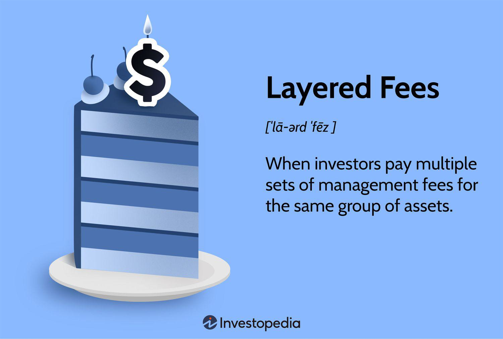

## Table of Contents

## What are layered fees?

Layered fees are charges that come in different levels or stages. Imagine you are building a cake with many layers. Each layer of the cake can have its own price. In the same way, layered fees can add up as you go through different steps or use different services. For example, when you use a money transfer service, you might pay one fee to send the money, another fee for converting the currency, and yet another fee for receiving the money on the other end.

These fees can sometimes be hard to notice because they are spread out over different parts of a service. It's important to look at all the fees together to understand the total cost. For instance, if you are using an online platform, you might see a small fee for signing up, another fee for using certain features, and additional fees for withdrawing money. By adding up all these layered fees, you can see the full picture of what you are paying for the service.

## How do layered fees differ from flat fees?

Layered fees are like a set of charges that come in different steps or layers. Each part of a service might have its own fee, and these fees can add up as you use more parts of the service. For example, if you use a ride-sharing app, you might pay one fee for the ride, another fee for a premium service, and another fee for a tip. These fees can be tricky because they are spread out, and you might not see the total cost until you add them all up.

On the other hand, flat fees are simple and straightforward. They are a single charge for the whole service, no matter how many parts or steps are involved. Using the ride-sharing app again, a flat fee would mean you pay one set price for the entire ride, no matter if you use extra features or not. Flat fees are easier to understand because you know the total cost right away, without having to add up different charges.

## Can you explain the basic structure of layered fees?

Layered fees are like building blocks of charges that you pay for different parts of a service. Imagine you're playing a game where you need to pay a little bit of money each time you move to a new level or use a special feature. In real life, this could be like using a bank where you pay one fee to open an account, another fee to make a withdrawal, and another fee to use an ATM. Each of these fees is a layer, and they all add up to the total cost of using the bank's services.

These fees can be hard to keep track of because they are spread out over different steps or parts of the service. It's like trying to solve a puzzle where you need to find all the pieces to see the full picture. For example, if you're using an online platform, you might pay a fee to sign up, another fee to use certain tools, and yet another fee to withdraw your money. By adding up all these layers, you can finally see how much the service is really costing you.

## What are the common scenarios where layered fees are applied?

Layered fees are often used in financial services. For example, when you use a bank, you might pay a fee to open an account, another fee to make a deposit, and yet another fee to withdraw money. These fees can add up, making the total cost of using the bank higher than you might expect. It's like paying a little bit each time you do something with your account.

Another common scenario is in online platforms and apps. If you use a ride-sharing app, you might pay a base fare for the ride, a fee for using a premium service, and a tip for the driver. Each of these fees is a layer, and they all add up to the total cost of your trip. It's important to look at all these layers to understand how much you're really paying.

Layered fees can also be found in investment services. When you invest in a fund, you might pay a fee to buy into the fund, another fee for managing your investment, and a fee when you sell your shares. Each of these fees adds to the total cost of your investment, and it's helpful to know all the layers to see the full picture of what you're paying.

## How are layered fees calculated?

Layered fees are calculated by adding up the different charges you pay for using different parts of a service. Imagine you are using a bank. You might pay one fee to open an account, another fee to make a deposit, and another fee to withdraw money. Each of these fees is a layer, and when you add them all up, you get the total cost of using the bank's services. It's like building a tower where each block is a fee, and the height of the tower is the total cost.

These fees can be tricky because they are spread out over different steps or parts of the service. For example, if you're using an online platform, you might pay a fee to sign up, another fee to use certain tools, and yet another fee to withdraw your money. To find out the total cost, you need to add up all these layers. It's like solving a puzzle where you need to find all the pieces to see the full picture of what you're paying for the service.

## What are the advantages of using layered fees for a business?

Using layered fees can help a business make more money. When a business charges a fee for each part of a service, they can earn a little bit of money from many different places. For example, a bank might charge a fee to open an account, another fee to make a deposit, and another fee to withdraw money. By doing this, the bank can add up all these small fees to make a bigger total. This way, the business can get more money from each customer, even if the individual fees are small.

Layered fees can also help a business offer more choices to customers. When a business breaks down their service into different parts, customers can pick and choose what they want to pay for. For example, an online platform might charge a fee to sign up, another fee to use certain tools, and yet another fee to withdraw money. This way, customers can decide which parts of the service they want to use and only pay for those parts. This can make the service more flexible and attractive to different customers.

## What are the potential drawbacks of layered fees for consumers?

Layered fees can be confusing for consumers. When you have to pay a little bit of money for each part of a service, it can be hard to keep track of all the fees. For example, if you use a bank, you might pay a fee to open an account, another fee to make a deposit, and another fee to withdraw money. By the time you add up all these small fees, the total cost can be much higher than you expected. It's like trying to solve a puzzle where you need to find all the pieces to see the full picture of what you're paying.

Another problem with layered fees is that they can make it hard to compare different services. When each service breaks down their fees into different parts, it can be tricky to see which one is the best deal. For example, if you're looking at two online platforms, one might charge a fee to sign up and another fee to use certain tools, while the other platform might have different fees for different features. It's like trying to compare two cakes where each layer has a different price. You need to add up all the layers to see which cake is really cheaper.

## How can one estimate the total cost when dealing with layered fees?

To estimate the total cost when dealing with layered fees, you need to add up all the different fees you will pay for using the service. Imagine you are using a bank. You might pay a fee to open an account, another fee to make a deposit, and another fee to withdraw money. Each of these fees is a layer, and when you add them all up, you get the total cost of using the bank's services. It's like building a tower where each block is a fee, and the height of the tower is the total cost.

Sometimes, it can be hard to know all the fees upfront. For example, if you're using an online platform, you might pay a fee to sign up, another fee to use certain tools, and yet another fee to withdraw your money. To find out the total cost, you need to look at all the different parts of the service and add up all the fees. It's like solving a puzzle where you need to find all the pieces to see the full picture of what you're paying for the service.

## What regulatory considerations should businesses be aware of when implementing layered fees?

When businesses use layered fees, they need to follow rules set by regulators to make sure they are fair to customers. These rules can come from government agencies that watch over industries like banking, finance, or online services. The main goal is to make sure that businesses are clear about all the fees they charge. This means businesses have to show all the fees in a way that is easy for customers to understand. If businesses don't follow these rules, they could get in trouble and face fines or other penalties.

Another important thing for businesses to think about is how to avoid misleading customers. Regulators want to make sure that customers know the total cost of using a service before they start. This means businesses need to be careful about how they present their fees. They should not hide fees or make them hard to find. By being open and honest about all the fees, businesses can build trust with their customers and stay on the right side of the law.

## How do layered fees impact financial planning and budgeting?

Layered fees can make financial planning and budgeting more complicated. When you have to pay a little bit of money for each part of a service, it's hard to know the total cost upfront. For example, if you use a bank, you might pay a fee to open an account, another fee to make a deposit, and another fee to withdraw money. By the time you add up all these small fees, the total cost can be much higher than you expected. This makes it tricky to plan your budget because you need to keep track of all the different fees and add them up to see how much you're really spending.

To manage layered fees in your budget, you need to be careful and pay close attention to all the fees. It's a good idea to write down all the fees you expect to pay for using a service. For example, if you're using an online platform, you might pay a fee to sign up, another fee to use certain tools, and yet another fee to withdraw your money. By adding up all these fees, you can get a better idea of the total cost and plan your budget more accurately. This way, you can avoid surprises and make sure you have enough money to cover all the fees.

## What advanced strategies can businesses use to optimize layered fee structures?

Businesses can optimize layered fee structures by carefully analyzing how customers use their services. By looking at data, they can see which parts of the service are used the most and adjust the fees for those parts to make more money. For example, if a lot of people use a certain feature on an app, the business might charge a higher fee for that feature. They can also offer discounts or special deals for using multiple parts of the service, which can encourage customers to use more features and pay more fees. This way, the business can make the most out of their layered fee structure.

Another strategy is to make the fees clear and easy to understand for customers. When businesses are open about all the fees, customers are more likely to trust them and keep using their services. This means showing all the fees in a simple way, maybe with a chart or a list, so customers can see the total cost before they start using the service. By being honest about the fees, businesses can build a good relationship with their customers and make more money in the long run.

## How can data analytics be used to assess the effectiveness of layered fee models?

Data analytics can help businesses see how well their layered fee models are working. By looking at customer data, businesses can find out which fees are making the most money and which ones are not. For example, if a lot of people are using a certain feature and paying the fee for it, the business knows that fee is working well. On the other hand, if a fee is not bringing in much money, the business might need to change it or get rid of it. By studying the data, businesses can make smart choices about their fees and make more money.

Another way data analytics can help is by showing how customers feel about the layered fees. Businesses can use surveys and feedback to see if customers think the fees are fair or if they are confusing. If a lot of customers are unhappy with a certain fee, the business can adjust it to make customers happier. By using data to understand what customers like and don't like, businesses can make their layered fee models better and keep their customers coming back.

## What is the fee structure in algo trading?

Algorithmic trading involves executing trades and managing technical infrastructure, introducing a specific fee structure distinct from traditional trading. While automation can reduce some transaction costs by optimizing trade execution, it simultaneously incurs technology-related expenses. Understanding both fixed and variable costs in this context is essential for effective cost management.

### Fixed Costs

Fixed costs in [algorithmic trading](/wiki/algorithmic-trading) refer to the expenses that remain constant regardless of trading [volume](/wiki/volume-trading-strategy) or activity levels. These include costs for acquiring and maintaining trading software, hardware infrastructure, and connectivity services. Setting up an algorithmic trading operation typically requires investments in high-speed internet connections, dedicated servers, and secure networks to ensure fast and reliable execution of trades. Additionally, traders may need to invest in data feeds and subscription services that provide real-time market data and analysis tools necessary for developing trading algorithms.

### Variable Costs

Variable costs fluctuate according to trading volume and market activity. Key components include transaction fees, such as those levied by exchanges for order execution, and brokerage fees. Algorithmic trading often involves executing a high number of trades rapidly, which can lead to significant variable costs if not managed effectively. These costs can include both per-share fees and per-trade fees, and their cumulative impact can be substantial for high-frequency trading strategies.

### Comparison to Traditional Brokerage Fees

Unlike traditional brokerage fees, which may charge investors a flat commission per trade or a percentage of assets under management, algorithmic trading fees are more granular and closely tied to the quantity and speed of transactions. Traditional brokers typically focus on charging for advisory services and portfolio management, whereas algorithmic trading fees often focus on the technical execution and infrastructure components. These include costs for order routing and execution, as well as potential market impact and slippage costs—factors representing the difference between the expected price of a trade and the actual executed price, often influenced by the speed and volume of trades.

### Financial Calculus in Assessing True Trading Costs

Accurately assessing the true costs of algorithmic trading requires a comprehensive financial calculus that accounts for all direct and indirect expenses. Traders must consider the total cost of ownership of trading technology, including amortization of fixed costs and scaling of variable costs relative to trading volumes. To optimize cost-efficiency, traders can implement strategies such as optimizing trade execution algorithms to minimize slippage and leveraging co-location services to reduce latency, which can be mathematically represented by the following formula for trade execution cost $C$:

$$
C = (P_{market} - P_{exec}) \times V + \text{Exchange Fees} + \text{Brokerage Fees}
$$

where $P_{market}$ is the market price at the time of the order, $P_{exec}$ is the execution price, and $V$ is the volume of shares traded. This formula helps traders quantify the real impact of market conditions and infrastructure on their overall trading costs.

In summary, effective management of the fee structure in algorithmic trading necessitates a deep understanding of both fixed and variable costs, a strategic approach to minimizing these expenses, and careful consideration of how they differ from traditional brokerage models.

## References & Further Reading

[1]: Aldridge, I. (2013). ["High-Frequency Trading: A Practical Guide to Algorithmic Strategies and Trading Systems."](https://www.amazon.com/High-Frequency-Trading-Practical-Algorithmic-Strategies/dp/1118343506) Wiley.

[2]: Kissell, R. (2013). ["The Science of Algorithmic Trading and Portfolio Management."](https://www.sciencedirect.com/book/9780124016897/the-science-of-algorithmic-trading-and-portfolio-management) Academic Press.

[3]: Narang, R. K. (2009). ["Inside the Black Box: A Simple Guide to Quantitative and High-Frequency Trading."](https://onlinelibrary.wiley.com/doi/book/10.1002/9781118267738) Wiley.

[4]: Johnson, B. R. (2010). ["Algorithmic Trading & DMA: An Introduction to Direct Access Trading Strategies."](https://archive.org/details/algorithmictradi0000john) 4Myeloma Press.

[5]: De Prado, M. L. (2018). ["Advances in Financial Machine Learning."](https://www.amazon.com/Advances-Financial-Machine-Learning-Marcos/dp/1119482089) Wiley.