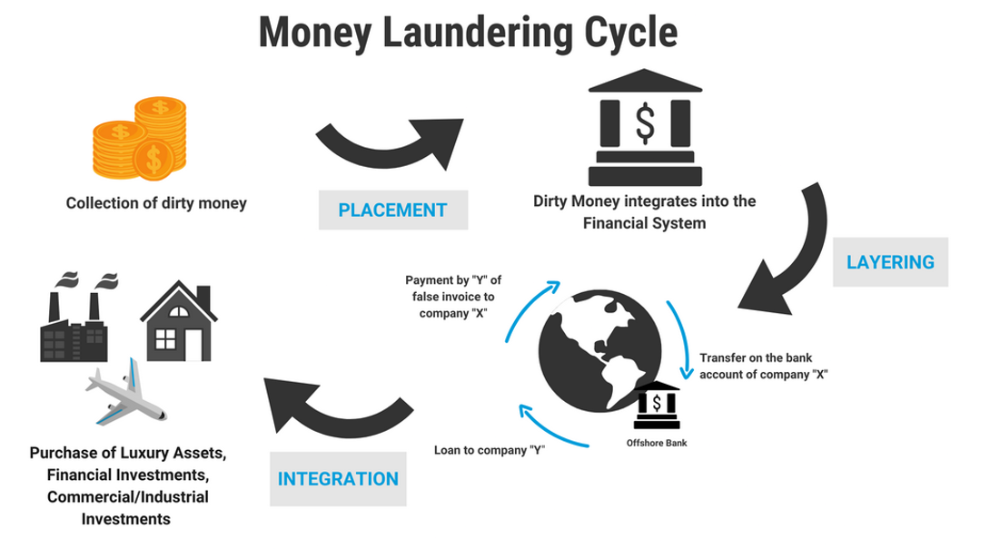

Layering is a highly debated strategy within the arena of algorithmic trading. It revolves around the tactical placement and subsequent cancellation of trade orders with the primary goal of manipulating stock prices. This strategy is often executed in high-frequency trading (HFT) environments, where the speed and volume of trades enhance the ability to influence market perceptions. By artificially creating an apparent demand or supply through these placed orders, traders aim to generate a deceptive illusion of market activity. This can sway other market participants, causing them to make trading decisions based on the manipulated data, ultimately pushing the stock price in a desired direction.

The mechanics of layering are sophisticated and technically intricate, relying on advanced algorithms to execute hundreds or thousands of trades in milliseconds. Despite its technological complexity, the essence of layering is regarded as manipulative and unfair. Consequently, it is deemed illegal in many jurisdictions, as it undermines market integrity and transparency. Regulatory bodies around the world take a firm stance against such practices, labeling them as a form of market manipulation.

This article provides a comprehensive exploration of layering, examining its objectives and the mechanisms by which it operates within the trading ecosystem. It further addresses the legal frameworks established to combat this unfair practice and scrutinizes how modern surveillance techniques are employed to detect and prevent layering. Through this examination, the article also highlights notable case studies that illustrate the real-world impact and consequences of engaging in such manipulative trading tactics.

## Table of Contents

## Understanding Layering

Layering is a sophisticated tactic employed by certain traders to manipulate financial markets by creating a misleading picture of demand or supply. The process begins with the placement of multiple orders at different price levels. These orders are not intended to be executed; instead, they aim to give the false impression of heightened market activity. By artificially inflating or deflating the apparent demand or supply, layering influences other market participants, inducing them to perceive price trends that do not exist.

Consider a scenario where a trader desires to purchase a security at a lower price. Initially, they place several large sell orders above the current market price. This sequence suggests an impending increase in supply, causing others in the market to perceive a potential price drop. As these participants react by selling their holdings, the security's price begins to decline, enabling the trader to buy at the lower, manipulated price point. Once the objective is achieved, the initial deceptive orders are canceled, and the genuine buy orders are executed.

This orchestration of market pressures can be succinctly described using basic economic principles. If $Q_d$ represents the quantity demanded and $Q_s$ the quantity supplied, layering disrupts the natural equilibrium $(Q_d = Q_s)$ by simulating excess supply $(Q_s > Q_d)$ or demand $(Q_d > Q_s)$. By artificially manipulating these conditions, layering alters the perception of a security's value, thereby misleading participants who rely on apparent market signals.

The main objective of layering is price movement to a favorable position without actual market exposure through the misleading orders. This tactic benefits from the rapid execution and [liquidity](/wiki/liquidity-risk-premium) provided by modern trading platforms, especially within high-frequency trading environments. The swift cancellation of initial orders, once the desired price movement is achieved, contributes to the difficulty in detection and regulation of such practices.

In summary, layering exploits the automated and reactionary nature of modern financial markets by projecting false market trends, which affects the behavior of other traders. This calculated manipulation of market perception not only fosters unethical trading practices but also destabilizes market integrity, necessitating rigorous regulatory scrutiny and advanced detection methodologies.

## Regulatory and Ethical Considerations

Layering is widely recognized as a manipulative trading practice that violates the principles of fair and transparent financial markets. As a form of market manipulation, layering is illegal in numerous jurisdictions, including the United States and the European Union. This practice undermines market integrity, leading regulatory bodies such as the U.S. Securities and Exchange Commission (SEC) and the Financial Industry Regulatory Authority (FINRA) to enforce stringent regulations against it.

The SEC and FINRA, along with other global regulatory entities, have implemented a comprehensive legal framework to detect and prevent such manipulative strategies. Under the U.S. Securities Exchange Act, layering is prohibited as it interferes with the market's natural supply and demand dynamics, creating artificial price movements. Regulatory measures are designed to preserve investor confidence and protect legitimate market participants from fraudulent activities.

Traders found guilty of engaging in layering face a range of severe penalties. These penalties include substantial monetary fines, the imposition of trading bans, and in extreme cases, imprisonment. The SEC has frequently emphasized its commitment to deterring manipulative trading practices by pursuing enforcement actions against individuals and firms engaged in layering. The consequences for traders not only amount to financial losses but also damage to personal and professional reputations, which can have long-lasting impacts on their careers.

Enforcement actions are bolstered by advanced surveillance technologies that regulators use to monitor trading activities. These systems scan for patterns indicative of layering, employing algorithms capable of analyzing large volumes of trading data across multiple markets. Despite these technological advancements, the detection of layering remains difficult due to the sophisticated and rapid nature of the trades involved. As a result, regulatory bodies continuously enhance their surveillance capabilities and update their regulatory guidelines to address new challenges presented by evolving market practices.

Moreover, ethical considerations also play a critical role in discouraging layering. Ethical trading practices are essential for maintaining trust and transparency within financial markets. Educational initiatives aimed at traders, alongside rigorous compliance programs within financial institutions, foster a culture of integrity that prioritizes ethical over opportunistic trading behaviors. By adhering to legal standards and ethical norms, market participants contribute to a more stable and fair trading environment, thereby supporting the overall health of the financial system.

In summary, the regulatory and ethical considerations surrounding layering reflect a unified effort to prevent market manipulation and protect the integrity of global financial markets. Regulatory bodies continue to adapt their approaches to detect and penalize manipulative practices effectively, ensuring that markets operate fairly and efficiently for all participants.

## Detecting and Preventing Layering

Regulatory bodies have increasingly relied on advanced surveillance systems to identify patterns indicative of layering, a deceptive trading practice aimed at creating a false impression of market demand or supply. These systems utilize algorithms capable of analyzing large volumes of trading data in real-time, searching for indicative patterns such as the placement and abrupt cancellation of large orders that do not translate into actual trades. This analytical capability is critical for distinguishing genuine market activity from manipulative practices designed to mislead other market participants.

Technological innovations have significantly enhanced the monitoring of trading activities. High-frequency trading platforms, for instance, generate voluminous transaction data that serve as a rich source for these surveillance systems. Machine learning algorithms play a crucial role in this context. By training on historical data, they can recognize previously identified patterns of manipulation and flag suspicious activities that deviate from normative trading behaviors.

Despite the sophistication of current technology, detecting layering poses considerable challenges. The practice’s complexity and rapid execution often camouflage it within legitimate trading operations. Traders engaged in layering might use numerous small orders across different securities and exchanges, creating a facade of fragmented yet coordinated activity that is difficult to isolate and identify as suspicious. The high speed with which high-frequency trading is conducted further complicates detection efforts, as manipulative actions can occur and be reversed in fractions of a second, often too quickly for traditional regulatory scrutiny.

Preventing layering in financial markets demands a multi-faceted approach. Robust market monitoring systems need to be complemented by strict broker supervision to ensure that trading practices adhere to ethical standards. This includes setting up internal compliance mechanisms within brokerage firms to detect such activities before external regulatory intervention becomes necessary. Education is another pivotal component; traders must be well-informed about the legal and ethical boundaries of market conduct. Continuous education initiatives can help traders understand the repercussions of engaging in manipulative practices, thus fostering an ethical market culture.

Ultimately, while technology provides powerful tools for the detection and prevention of layering, effective regulation also relies on the collaboration between regulatory bodies, financial institutions, and traders themselves. This collaborative effort is essential to uphold market integrity and protect investors from the adverse impacts of such manipulative strategies.

## Case Studies and Examples

High-profile cases of layering, such as those involving Swift Trade, serve as prominent examples of regulatory enforcement against market manipulation. Swift Trade, a Canadian firm, depicted the global scope of the issue when it was sanctioned for engaging in deceptive trading practices. The firm was accused of executing a colossal number of orders to manipulate the appearance of market demand and supply, thereby influencing prices to its advantage. This case is noteworthy not only for the scale of the activity but also for how it demonstrated the interconnected nature of global financial markets, as the company's activities spanned multiple countries, thereby complicating regulatory responses.

Swift Trade's operations utilized quick order placements and cancellations, a hallmark of layering, aimed at deceiving other market participants. Regulatory investigations revealed that these activities led to artificial price movements, allowing Swift Trade to profit at the expense of genuine investors. The unfolding of this case underlined the enforcement capabilities of financial regulators, as multiple jurisdictions, including the United States and the United Kingdom, coordinated efforts to hold the firm accountable. Financial penalties imposed were substantial, with Swift Trade facing fines amounting to millions of dollars, alongside the reputational damage incurred from the fallout.

The legal proceedings against Swift Trade illustrated the mechanisms by which authorities seek to deter such practices. It highlighted the crucial role of surveillance technology capable of identifying suspicious trading patterns and enforcing compliance with regulations aimed at safeguarding market integrity. Moreover, the case underscored the significant financial risks for firms engaging in manipulative strategies. Beyond monetary penalties, the reputational damage can be severe, affecting the company's future operations and standing in the financial industry.

In addition to Swift Trade, other instances of enforcement have shown that regulators are increasingly vigilant in identifying and prosecuting layering activities. These cases collectively emphasize the importance of robust regulatory frameworks and the severe consequences for violations. The overarching lesson from such examples is the critical need for market participants to adhere to ethical practices and be aware of the increasing sophistication of surveillance tools used by authorities to uphold fair trading environments.

## Conclusion

Layering exemplifies the potential misuse of advanced technological capabilities within financial markets. This manipulative practice underscores the pressing need for traders to thoroughly comprehend its mechanisms and implications, ensuring they navigate the complexities of trading without breaching regulatory frameworks. Layering not only violates market rules but can also undermine ethical standards, leading to substantial legal and reputational consequences for involved parties.

Understanding the intricacies of layering is crucial for traders to steer clear of regulatory traps. Awareness of the methods and consequences associated with such practices helps maintain a fair trading environment. Regulatory bodies have implemented stringent measures to counteract these forms of market manipulation; however, the role of individual traders and firms remains paramount. Continuous education in ethical trading and market regulations is essential, promoting practices that safeguard the integrity and fairness of financial markets.

Enhancing regulatory vigilance and fostering a culture of ethical trading are vital components in the battle against market manipulation. Advancements in technology offer both challenges and tools in this endeavor. While they enable sophisticated manipulative strategies like layering, they also provide the means to detect and prevent such activities. As market dynamics evolve, so too must the vigilance of regulatory bodies, leveraging technological innovations to uphold market integrity. Collaborative efforts between regulators, trading firms, and educational institutions are essential in developing robust systems and fostering a culture of transparent and honest trading.

Ultimately, the responsibility to preserve the integrity of financial markets lies not only with regulatory entities but also with each participant. By committing to ethical trading practices and remaining vigilant against manipulative strategies, the industry can mitigate risks and promote a stable, efficient trading environment that benefits all participants.

## References & Further Reading

[1]: Aldridge, I. (2013). ["High-Frequency Trading: A Practical Guide to Algorithmic Strategies and Trading Systems"](https://www.ahmetbeyefendi.com/wp-content/uploads/2020/07/High-Frequency-Trading-Irene-Aldridge.pdf). Wiley.

[2]: Cartea, A., Jaimungal, S., & Penalva, J. (2015). ["Algorithmic and High-Frequency Trading"](https://assets.cambridge.org/97811070/91146/frontmatter/9781107091146_frontmatter.pdf). Cambridge University Press.

[3]: De Luca, R. (2021). ["Detecting Intentional Bounces: A Methodological Approach to Spot Layering Strategies in High-Frequency Trading."](https://tennistonic.com/tennis-news/827460/updated-r2-prediction-h2h-of-luca-nardis-draw-vs-alcaraz-lehecka-draper-medvedev-to-win-the-doha/) Transportation Research Part E: Logistics and Transportation Review.

[4]: U.S. Securities and Exchange Commission (SEC). ["SEC Charges High-Frequency Trading Firm with Fraudulent Trading to Manipulate Closing Prices."](https://en.wikipedia.org/wiki/U.S._Securities_and_Exchange_Commission)

[5]: Budish, E., Cramton, P., & Shim, J. (2015). ["The High-Frequency Trading Arms Race: Frequent Batch Auctions as a Market Design Response."](https://academic.oup.com/qje/article/130/4/1547/1916146) The Quarterly Journal of Economics.