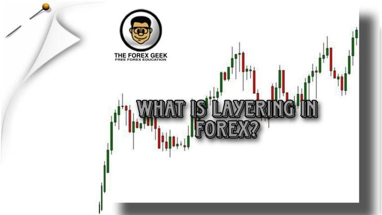

Layering is a controversial yet sophisticated strategy in algorithmic trading, commonly used to manipulate stock prices and market activities. This trading tactic involves placing multiple buy or sell orders with the intention of creating a false sense of demand or supply in the market. Although the orders appear legitimate, they are often canceled before execution, misleading other market participants and potentially influencing stock prices. This deceptive practice leverages high-frequency trading technologies to rapidly place and withdraw orders, making it challenging for market surveillance systems to detect and combat effectively.

Though considered unethical and often illegal, layering remains a topic of interest due to its significant impact on high-frequency trading. The strategy is designed to benefit the manipulator by inducing other traders to react to the phony demand or supply, thus allowing the manipulator to execute their true trading intentions at more favorable prices. The prevalence of layering highlights the darker aspects of algorithmic trading, raising important questions about market integrity and fairness.

In this article, we will explore what layering involves, its implications in trading, and how regulatory bodies respond to these practices. Regulatory agencies, such as the U.S. Securities and Exchange Commission (SEC) and the Financial Industry Regulatory Authority (FINRA), have implemented stringent measures to tackle market manipulation, including layering. These organizations continually develop and employ advanced technologies to detect and prosecute offenders, reaffirming their commitment to maintaining equitable trading environments.

We will also discuss the challenges of detecting and preventing layering, and provide insights for traders seeking to navigate these complex waters responsibly. The rapidly evolving nature of algorithmic trading tools necessitates continuous adaptation of detection techniques, and both regulatory bodies and market participants must remain vigilant and informed about emerging threats.

By understanding the nuances of layering, traders can better protect themselves and contribute to a more transparent trading environment. Familiarity with regulatory standards, coupled with a commitment to ethical trading practices, will empower traders to avoid entanglement in manipulative schemes and support the integrity of financial markets. Through collaborative efforts among regulators, trading platforms, and individual traders, the industry can work towards reducing the risks associated with layering, ensuring fair and transparent market conditions for all participants.

## Table of Contents

## Understanding Layering in Algo Trading

Layering in algorithmic trading refers to the strategic placement of multiple orders intended to create a misleading perception of market demand or supply. This practice is designed to sway the perceived movement of stock prices in a manner favorable to the trader orchestrating the layering. 

The process typically involves placing numerous buy or sell orders that the trader never intends to execute. By doing so, it artificially inflates or deflates the apparent interest in a particular asset, thereby influencing other market participants’ behavior. Once the market responds and the price shifts as desired, the manipulative trader cancels the initial deceptive orders and executes genuine trades at the newly favorable price levels. This combination of order placement and cancellation, driven by deception, can significantly sway market dynamics albeit temporarily.

Layering leverages advanced [algorithmic trading](/wiki/algorithmic-trading) programs to facilitate these rapid placement and cancellation activities. These programs can execute thousands of orders within milliseconds, rendering the detection of such tactics by traditional surveillance methods exceedingly challenging. The algorithms are designed to react to market conditions instantaneously, making human intervention or observation impractical without technological aid.

Traders who employ layering do so to manipulate market participants into trading at less advantageous prices. For instance, a trader looking to purchase stocks at a lower price might create the illusion of abundant supply by layering sell orders, influencing the price downward. Conversely, a flurry of buy orders can feign demand, driving prices up before a strategic sale.

Though layering may seem beneficial to those who exploit it, the practice carries profound legal and ethical ramifications. Regulatory authorities classify it as a form of market manipulation, as it undermines fair market principles and erodes trust among participants. Markets operate on the premise of genuine supply and demand forces; when these are distorted, it can lead to inefficiencies and potential financial harm to unsuspecting traders. Thus, while layering might yield short-term gains for manipulative traders, its consequences contribute to a broader discussion on trading ethics and legal compliance.

## Legal Implications and Regulatory Response

Regulatory authorities such as the Securities and Exchange Commission (SEC) and the Financial Industry Regulatory Authority (FINRA) have established stringent measures against layering due to its potential to manipulate market dynamics. Layering is categorized under fraudulent activities because it distorts genuine market supply and demand, thereby misleading investors and traders. Such manipulative practices are punishable under law, with consequences including substantial fines, trading bans, and, in severe instances, imprisonment for those involved.

The nature of high-frequency trading ([HFT](/wiki/high-frequency-trading-strategies)) adds layers of complexity to identifying and proving instances of layering. Traditionally, market manipulations were more overt and identifiable; however, with the advent of HFT and algorithmic techniques, these manipulations can occur at speeds and volumes that challenge existing surveillance and detection methods. The rapid execution of orders, combined with swift cancellations, creates an environment where manipulative tactics can evade detection, necessitating continual advancements in regulatory technologies and methodologies.

The case of Swift Trade serves as a prominent example of the significant repercussions entities can face when found culpable of engaging in such manipulative strategies. Swift Trade was penalized heavily for orchestrating a layering strategy across international markets, which had widespread implications on market confidence. This case illustrates the global reach of regulatory enforcement and the serious consequences of ignoring compliance requirements.

Traders and firms must remain vigilant and well-informed regarding these regulations to ensure their trading activities do not inadvertently cross the line into illegality. Regular education, compliance training, and a strong ethical foundation help traders align their strategies with legal and regulatory standards, thereby fostering a more transparent and trustworthy trading environment. The onus is on practitioners within the market to routinely assess the legality of their tactics and adjust their methodologies to uphold the integrity of the financial markets.

## Detection and Technology's Role

Advanced market surveillance systems and algorithmic detection tools are indispensable in identifying potential layering activities within financial markets. These technologies employ sophisticated algorithms to scrutinize large volumes of trading data, systematically flagging patterns and behaviors that suggest potential market manipulation. A primary indicator of layering involves high order cancellation rates, which can signal attempts to artificially influence stock prices by creating an illusion of supply or demand. Another telltale sign is abnormally rapid order activities, where transactions are placed and cancelled at speeds unattainable by manual trading.

Regulatory bodies, such as the Securities and Exchange Commission (SEC) and the Financial Industry Regulatory Authority (FINRA), heavily rely on these technological advancements. The pace of innovation in trading strategies, particularly with high-frequency trading, necessitates parallel advancements in detection capabilities. By leveraging cutting-edge computing power and algorithmic analysis, these organizations can effectively monitor trading environments, detect irregularities in real-time, and initiate regulatory actions when necessary.

The role of technology extends beyond mere detection. It also aids in the development of proactive measures to prevent market manipulation. Machine learning models and [artificial intelligence](/wiki/ai-artificial-intelligence) (AI) algorithms are increasingly deployed to improve the accuracy of surveillance systems. For instance, unsupervised learning techniques, such as clustering and anomaly detection, can identify novel forms of manipulation that were previously unknown. Python libraries like scikit-learn and TensorFlow provide tools that enable the implementation of such models.

Despite these advancements, challenges persist. The dynamic nature of financial markets means that manipulators continuously adapt, devising more sophisticated methods to avoid detection. Hence, a continuous cycle of technology enhancement and adaptation is essential. Collaboration between technology developers, regulatory agencies, and the financial industry is crucial to refine these systems and ensure their effectiveness.

In conclusion, while the utilization of advanced detection tools and technologies has significantly bolstered efforts to curb manipulative practices like layering, ongoing vigilance and upgrade of these systems are necessary. Accountability and transparency in trading can only be sustained through robust technological frameworks that can anticipate and respond to the evolving tactics of market manipulators.

## Preventing Layering in Trading

To prevent layering in trading, a concerted effort involving regulatory bodies, trading platforms, and individual traders is critical. Brokers and platforms play a pivotal role in this ecosystem; they must implement robust surveillance systems designed to detect suspicious patterns indicative of market manipulation. These systems should feature algorithms capable of monitoring trading activities for signs such as high order cancellation rates or rapid order activity, which are common indicators of layering.

Additionally, brokers have a responsibility to educate their clients about ethical trading practices and the legal consequences of engaging in market manipulation. This education can be disseminated through workshops, seminars, and continuous communication efforts highlighting the importance of adhering to ethical standards. Traders, for their part, need to remain informed about the potential repercussions of manipulative strategies and align their trading activities with legal and ethical norms.

Moreover, the proactive reporting of suspicious activities by individuals within the trading community can significantly enhance the effectiveness of regulatory efforts. When traders report anomalies or questionable behavior, it empowers regulatory bodies to respond more swiftly and decisively to potential threats to market integrity. Such transparency and accountability help in preventing unscrupulous practices and in maintaining confidence in financial markets.

Ultimately, fostering an environment of transparency and accountability is paramount to mitigate the risks associated with layering. Through the collaborative efforts of all stakeholders—regulators, platforms, and traders—the industry can cultivate a more secure and ethical trading environment, thereby safeguarding market integrity.

## Conclusion

Layering is a deceptive trading strategy that undermines market integrity by manipulating stock prices and misleading market participants. It creates an artificial landscape where traders are influenced by fictitious demand or supply, leading to skewed decisions and potential financial losses. This trading tactic can destabilize markets and erode trust among investors and institutions.

Advancements in detection technology, such as sophisticated algorithmic surveillance systems, provide some defense against layering by identifying suspicious trading patterns and high cancellation rates. However, relying solely on technology is insufficient. A more comprehensive approach is needed, encompassing regulatory oversight, ethical practices, and trader education. Implementing strict regulations and punishing offenders can deter layering activities, but proactive measures are equally crucial.

Traders should act responsibly and consider how their actions contribute to or detract from market trust. Ethical trading not only supports market integrity but also protects individual traders from legal repercussions and reputational damage. Understanding the dynamics and implications of layering is essential. By educating themselves, traders can stay vigilant against manipulative tactics and ensure their strategies align with legal and ethical standards.

In a rapidly evolving trading environment, where new strategies and technologies continually emerge, maintaining ethical conduct and adhering to regulations is vital. This ensures sustained market trust and stability, fostering a trading ecosystem where fair practices prevail and manipulation is minimized.

## References & Further Reading

[1]: U.S. Securities and Exchange Commission. ["SEC Charges Firm and CEO With Layering Manipulation Scheme."](https://www.sec.gov/newsroom/press-releases/2019-205) March 4, 2019.

[2]: Financial Industry Regulatory Authority (FINRA). ["FINRA Fines Firms Total of $1.4 Million for Best Execution and Supervisory Violations Related to Algorithmic Trading."](https://www.finra.org/arbitration-mediation/dispute-resolution-services-statistics) January 29, 2019.

[3]: Harris, L. (2003). ["Trading and Exchanges: Market Microstructure for Practitioners."](https://www.amazon.com/Trading-Exchanges-Market-Microstructure-Practitioners/dp/0195144708) Oxford University Press.

[4]: Aldridge, I. (2013). ["High-Frequency Trading: A Practical Guide to Algorithmic Strategies and Trading Systems."](https://www.amazon.com/High-Frequency-Trading-Practical-Algorithmic-Strategies/dp/1118343506) John Wiley & Sons.

[5]: U.S. Commodity Futures Trading Commission. ["CFTC Charges Trading Firm and CEO with Spoofing and Layering in Treasury Futures Markets."](https://en.wikipedia.org/wiki/Commodity_Futures_Trading_Commission) April 5, 2019.

[6]: ["The Handbook of High-Frequency Trading: A Practical Guide to Algorithmic Strategies and Trading Systems"](https://www.amazon.com/High-Frequency-Trading-Practical-Algorithmic-Strategies/dp/1118343506) by Greg N. Gregoriou

[7]: Stoll, H. R. (2000). ["Presidential Address: Friction."](https://onlinelibrary.wiley.com/doi/abs/10.1111/0022-1082.00259) The Review of Financial Studies, 13(2), 393–417. 

[8]: Cartea, Á., Jaimungal, S., & Penalva, J. (2015). ["Algorithmic and High-Frequency Trading."](https://assets.cambridge.org/97811070/91146/frontmatter/9781107091146_frontmatter.pdf) Cambridge University Press.