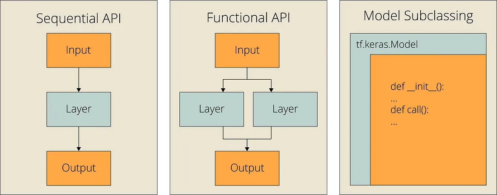

## Table of Contents

## What is the Layers API in TensorFlow?

The Layers API in TensorFlow is a part of the TensorFlow library that makes it easier to build and manage neural networks. It provides a set of high-level functions and classes that allow you to create layers in your neural network without having to write a lot of code. For example, instead of manually defining weights and biases and writing the forward pass for a convolutional layer, you can simply use the `Conv2D` class from the Layers API. This makes your code cleaner and easier to read and maintain.

The Layers API is particularly useful because it handles many of the common tasks that come up when building neural networks. It automatically manages the creation of variables (like weights and biases), and it can also handle regularization and initialization strategies. For instance, if you want to add a dense layer with a specific activation function and regularization, you can do so with just a few lines of code. This abstraction not only simplifies the process of building models but also helps in reusing code across different projects.

## How does the Layers API simplify the process of building neural networks?

The Layers API in TensorFlow makes building neural networks easier by providing ready-to-use building blocks. Instead of writing a lot of code to create each part of a neural network, you can use simple functions and classes from the Layers API. For example, if you want to add a convolutional layer, you don't need to manually set up the weights and biases or write the math for the convolution. You can just use the `Conv2D` class, which does all that work for you. This means your code becomes shorter and easier to understand.

Another way the Layers API simplifies things is by handling common tasks automatically. It takes care of creating and managing variables like weights and biases, and it can also apply regularization and initialization strategies without you having to write extra code. For instance, if you want to add a dense layer with a specific activation function and some regularization, you can do it with just a few lines. This not only makes your code cleaner but also helps you reuse parts of your code in different projects, saving you time and effort.

## What are the basic types of layers available in TF.Layers?

In TensorFlow's Layers API, you can find several basic types of layers that help you build neural networks easily. Some common ones are dense layers, convolutional layers, and pooling layers. Dense layers, also called fully connected layers, are used to connect every neuron in one layer to every neuron in another layer. You can use them for tasks like classification or regression. Convolutional layers are great for processing images or other grid-like data. They use filters to detect features in the data, which can help in tasks like image recognition. Pooling layers, on the other hand, reduce the size of the data by taking the maximum or average value in a certain area, which helps in making the model more efficient.

Each type of layer in the TF.Layers API comes with options to customize how it works. For example, with a dense layer, you can set the number of neurons, the activation function, and whether to use regularization. You can create a dense layer like this: ```python
tf.keras.layers.Dense(units=64, activation='relu', kernel_regularizer=tf.keras.regularizers.l2(0.01))
```. For convolutional layers, you can choose the number of filters, the size of the filters, and the stride. A simple convolutional layer might look like this: ```python
tf.keras.layers.Conv2D(filters=32, kernel_size=(3, 3), activation='relu')
```. Pooling layers let you decide the size of the pool and the type of pooling, like max pooling or average pooling. An example of a max pooling layer is: ```python
tf.keras.layers.MaxPooling2D(pool_size=(2, 2))
```. These options make it easy to tailor your neural network to your specific needs.

## How do you create a simple neural network using TF.Layers?

To create a simple [neural network](/wiki/neural-network) using TF.Layers, you start by importing the necessary modules from TensorFlow. Then, you define your model by stacking layers on top of each other. For example, if you want to build a network for classifying images, you might start with a convolutional layer to detect features in the images. You can add this layer using `tf.keras.layers.Conv2D`, specifying the number of filters and the size of the filters. After the convolutional layer, you might add a pooling layer with `tf.keras.layers.MaxPooling2D` to reduce the size of the data and make the model more efficient. Finally, you can add a dense layer with `tf.keras.layers.Dense` for the final classification.

Here is an example of how to create a simple neural network using TF.Layers:

```python
import tensorflow as tf

# Define the model
model = tf.keras.Sequential([
    tf.keras.layers.Conv2D(filters=32, kernel_size=(3, 3), activation='relu', input_shape=(28, 28, 1)),
    tf.keras.layers.MaxPooling2D(pool_size=(2, 2)),
    tf.keras.layers.Flatten(),
    tf.keras.layers.Dense(units=128, activation='relu'),
    tf.keras.layers.Dense(units=10, activation='softmax')
])

# Compile the model
model.compile(optimizer='adam', loss='sparse_categorical_crossentropy', metrics=['accuracy'])
```

In this example, we create a model that starts with a convolutional layer with 32 filters of size 3x3, followed by a max pooling layer that reduces the data size by half. Then, we flatten the data and pass it through a dense layer with 128 neurons, and finally, another dense layer with 10 neurons for classification. The model is then compiled with an optimizer and loss function, ready to be trained on data.

## What is the difference between a dense layer and a convolutional layer in TF.Layers?

A dense layer, also known as a fully connected layer, connects every neuron in one layer to every neuron in the next layer. This means that if you have 10 neurons in the first layer and 5 neurons in the second layer, each of the 10 neurons will connect to each of the 5 neurons, making a total of 50 connections. Dense layers are often used at the end of a neural network for tasks like classification or regression because they can combine features from the entire input. You can create a dense layer in TF.Layers like this: ```python
tf.keras.layers.Dense(units=64, activation='relu')
```.

A convolutional layer, on the other hand, is designed to work with data that has a grid-like structure, such as images. Instead of connecting every neuron to every other neuron, a convolutional layer uses filters to detect features in the data. These filters slide over the input data, applying the same operation to different parts of the data, which helps the network learn spatial hierarchies in the data. This makes convolutional layers very useful for tasks like image recognition. You can create a convolutional layer in TF.Layers like this: ```python
tf.keras.layers.Conv2D(filters=32, kernel_size=(3, 3), activation='relu')
```.

## How can you use regularization techniques with TF.Layers?

Regularization techniques help prevent overfitting in neural networks by adding a penalty to the loss function. In TF.Layers, you can apply regularization to the weights of your layers using different methods like L1 and L2 regularization. L1 regularization adds the absolute value of the weights to the loss function, encouraging sparsity in the model. L2 regularization, on the other hand, adds the squared value of the weights, which tends to keep the weights small but not exactly zero. You can use these techniques in TF.Layers by specifying a `kernel_regularizer` when you create a layer. For example, to add L2 regularization to a dense layer, you can do this: ```python
tf.keras.layers.Dense(units=64, activation='relu', kernel_regularizer=tf.keras.regularizers.l2(0.01))
```.

Another way to use regularization in TF.Layers is through dropout, which randomly sets a fraction of input units to zero during training. This helps the network learn more robust features by preventing it from relying too much on any single neuron. You can add dropout to your model using the `Dropout` layer. For example, to add a dropout layer with a rate of 0.5, you can do this: ```python
tf.keras.layers.Dropout(0.5)
```. Both L1/L2 regularization and dropout can be combined in a single model to improve its performance and generalization.

## What are some advanced layer types available in TF.Layers and their uses?

In TF.Layers, you can find advanced layer types like LSTM and GRU layers, which are great for working with sequences like text or time series data. These layers are part of a group called recurrent neural networks (RNNs). They remember past inputs and use that information to make better predictions. For example, when predicting the next word in a sentence, an LSTM layer can remember the context of earlier words. You can create an LSTM layer like this: ```python
tf.keras.layers.LSTM(units=64, return_sequences=True)
```. GRU layers work similarly but are a bit simpler and faster to train. They are useful when you want a model that is quick but still good at handling sequences.

Another advanced layer type is the BatchNormalization layer, which helps your neural network learn faster and be more stable. It does this by normalizing the inputs to each layer, making sure they have a mean of zero and a standard deviation of one. This can help prevent the "vanishing gradient" problem, where the gradients get too small during training, making it hard for the network to learn. You can add a BatchNormalization layer like this: ```python
tf.keras.layers.BatchNormalization()
```. There's also the Embedding layer, which is useful for turning words or other tokens into vectors that a neural network can understand. This is especially helpful for natural language processing tasks. You can create an Embedding layer like this: ```python
tf.keras.layers.Embedding(input_dim=1000, output_dim=64)
```. These advanced layers give you more tools to build powerful and efficient models for different types of data.

## How do you implement custom layers in TF.Layers?

Creating a custom layer in TF.Layers is like making a new tool for your neural network. You start by defining a class that inherits from `tf.keras.layers.Layer`. In this class, you need to write two main methods: `build` and `call`. The `build` method is where you set up the weights and other variables your layer will use. The `call` method is where you write the math that your layer will do when it processes data. For example, if you want to make a layer that squares its input, you might write something like this:

```python
class SquareLayer(tf.keras.layers.Layer):
    def __init__(self, **kwargs):
        super(SquareLayer, self).__init__(**kwargs)

    def build(self, input_shape):
        # No trainable weights needed for this layer
        super(SquareLayer, self).build(input_shape)

    def call(self, inputs):
        return tf.square(inputs)

    def compute_output_shape(self, input_shape):
        return input_shape
```

Once you have your custom layer, you can use it in your model just like any other layer from TF.Layers. You can add it to a `tf.keras.Sequential` model or use it in a more complex model with the functional API. This lets you build models that do exactly what you need, even if the standard layers don't quite fit your task. For example, you could use your `SquareLayer` in a model like this:

```python
model = tf.keras.Sequential([
    tf.keras.layers.Dense(64, activation='relu', input_shape=(10,)),
    SquareLayer(),
    tf.keras.layers.Dense(1)
])
```

This way, you can make your neural network do special things that the regular layers can't do, making your models more powerful and flexible.

## What are best practices for optimizing performance when using TF.Layers?

When using TF.Layers, one of the best ways to optimize performance is by using batch normalization. Batch normalization helps your model learn faster and be more stable. It does this by normalizing the inputs to each layer, making sure they have a mean of zero and a standard deviation of one. This can help prevent the "vanishing gradient" problem, where the gradients get too small during training, making it hard for the network to learn. You can add batch normalization easily with `tf.keras.layers.BatchNormalization()`. This can make your training faster and your model more accurate.

Another important practice is to use the right activation functions. ReLU (Rectified Linear Unit) is a good choice for many layers because it helps avoid the vanishing gradient problem and speeds up training. You can use it like this: ```python
tf.keras.layers.Dense(64, activation='relu')
```. Also, consider using dropout to prevent overfitting. Dropout randomly sets a fraction of input units to zero during training, which helps the network learn more robust features. You can add dropout with `tf.keras.layers.Dropout(0.5)`. By using these techniques, you can make your models run better and give more accurate results.

## How does TF.Layers integrate with other TensorFlow APIs like TF.Keras?

TF.Layers is a part of TensorFlow that makes it easier to build neural networks by providing ready-to-use layers. These layers can be used directly in TF.Keras, which is TensorFlow's high-level API for building and training models. For example, you can create a model using TF.Keras's Sequential API and add layers from TF.Layers like `Conv2D` or `Dense`. This integration means you can take advantage of TF.Layers' simplicity while using TF.Keras's powerful model-building and training tools. You can create a model like this: ```python
model = tf.keras.Sequential([
    tf.keras.layers.Conv2D(filters=32, kernel_size=(3, 3), activation='relu', input_shape=(28, 28, 1)),
    tf.keras.layers.MaxPooling2D(pool_size=(2, 2)),
    tf.keras.layers.Flatten(),
    tf.keras.layers.Dense(units=128, activation='relu'),
    tf.keras.layers.Dense(units=10, activation='softmax')
])
```.

Using TF.Layers within TF.Keras also means you can benefit from other TensorFlow features, such as easy model compilation and training. After defining your model with TF.Layers, you can compile it with TF.Keras's `compile` method, specifying the optimizer, loss function, and metrics. Then, you can train your model using the `fit` method, which makes it simple to feed in your data and start the training process. This seamless integration between TF.Layers and TF.Keras helps you build efficient and effective neural networks without having to manage low-level details.

## What are common pitfalls and how to avoid them when using TF.Layers?

One common pitfall when using TF.Layers is choosing the wrong layer types or sizes for your task. If you pick layers that don't match your data or problem, your model might not work well. For example, using too many dense layers for image data can make your model slow and less accurate. To avoid this, think about what your data looks like and what you want your model to do. For images, convolutional layers are usually better because they can find patterns in the data. You can use them like this: ```python
tf.keras.layers.Conv2D(filters=32, kernel_size=(3, 3), activation='relu')
```. For other types of data, like sequences, LSTM or GRU layers might be more helpful.

Another pitfall is not using regularization properly, which can lead to overfitting. Overfitting happens when your model learns the training data too well and doesn't work as well on new data. To prevent this, you can use techniques like L2 regularization or dropout. L2 regularization adds a penalty to the loss function to keep the weights small, which you can do like this: ```python
tf.keras.layers.Dense(units=64, activation='relu', kernel_regularizer=tf.keras.regularizers.l2(0.01))
```. Dropout randomly turns off some neurons during training, which you can add like this: ```python
tf.keras.layers.Dropout(0.5)
```. By using these techniques, you can make your model more general and perform better on new data.

## How can TF.Layers be used in transfer learning scenarios?

Transfer learning is a way to use a model that was trained on one task to help with another task. With TF.Layers, you can do this by taking a pre-trained model and adding new layers on top of it. For example, if you have a model that's good at recognizing objects in pictures, you can use its early layers to find features in new pictures, and then add new layers to classify those pictures in a different way. This can save a lot of time and effort because you don't have to train the whole model from scratch. You can use the pre-trained layers like this: ```python
base_model = tf.keras.applications.VGG16(weights='imagenet', include_top=False, input_shape=(224, 224, 3))
x = base_model.output
x = tf.keras.layers.GlobalAveragePooling2D()(x)
x = tf.keras.layers.Dense(1024, activation='relu')(x)
predictions = tf.keras.layers.Dense(num_classes, activation='softmax')(x)
model = tf.keras.Model(inputs=base_model.input, outputs=predictions)
```.

When using TF.Layers for transfer learning, it's important to decide which parts of the pre-trained model to keep frozen and which parts to let change during training. Usually, you freeze the early layers because they learn general features that are useful for many tasks, and you let the new layers you add change to fit your specific task. This way, the model can use what it already knows about images or other data and learn just what it needs to know for your new task. You can freeze the layers like this: ```python
for layer in base_model.layers:
    layer.trainable = False
```. By doing this, you can make your model work well on your new task without starting from scratch.