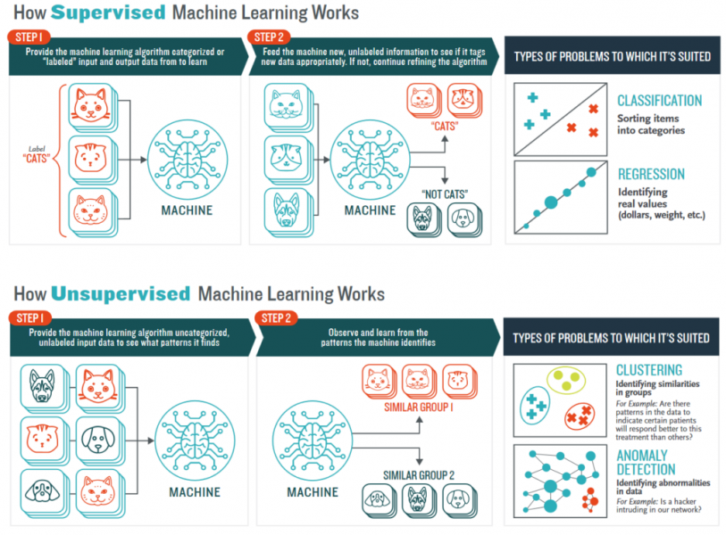

## Table of Contents

## What are Layout Annotation Models in the context of machine learning?

Layout Annotation Models are tools used in machine learning to understand and label the structure of documents or images. They help machines recognize where different parts of a document, like text blocks, images, or tables, are located on a page. For example, when you upload a document to a computer, these models can identify where the title is, where the main text starts, and where any pictures or graphs are placed. This is important for tasks like digitizing old books or sorting through large collections of documents automatically.

These models work by using algorithms to analyze the visual features of a document. They look at things like the size and position of text, the presence of lines or borders, and the spacing between different elements. Once trained on many examples, the model can predict the layout of new documents it hasn't seen before. This makes it easier for computers to process and understand documents in a way that's similar to how a human would. Layout Annotation Models are essential in fields like document analysis, digital libraries, and automated data extraction.

## How do Layout Annotation Models differ from traditional image recognition models?

Layout Annotation Models and traditional image recognition models both work with visual data, but they have different goals. Traditional image recognition models focus on identifying what objects are in an image. For example, they can tell if a picture has a cat, a tree, or a car. These models look at the whole image and classify it or identify specific objects within it. They are commonly used in applications like security cameras or photo tagging on social media.

On the other hand, Layout Annotation Models are designed to understand the structure and organization of a document or image. Instead of just recognizing objects, these models figure out where different parts of the document are located. For instance, they can pinpoint where the title, paragraphs, images, and tables are on a page. This is really useful for tasks like turning old [books](/wiki/algo-trading-books) into digital versions or sorting through lots of documents quickly. While traditional image recognition models might tell you there's text in an image, Layout Annotation Models will tell you exactly where that text is and how it's organized.

## What is the primary goal of using Layout Annotation Models?

The main goal of using Layout Annotation Models is to help computers understand how documents or images are organized. They look at things like where the title, text blocks, images, and tables are placed on a page. This helps in tasks like turning old books into digital versions or sorting through lots of documents quickly and easily.

By figuring out the layout, these models make it easier for machines to process and understand documents in a way that's similar to how a human would. They are important in fields like digital libraries, where they help organize and access information more efficiently. Overall, Layout Annotation Models improve how we handle and use documents by making the structure clear to computers.

## Can you explain the basic architecture of a Layout Annotation Model?

The basic architecture of a Layout Annotation Model usually starts with a [convolutional [neural network](/wiki/neural-network)](/wiki/convolutional-neural-network) (CNN). This part of the model looks at the image or document and picks out important features like edges, lines, and text. The CNN helps the model understand what's in the image by breaking it down into smaller parts. Once the CNN has done its job, the features it found are sent to the next part of the model.

The next part of the model often uses a type of neural network called a recurrent neural network (RNN) or a more advanced version called a [long short](/wiki/equity-long-short)-term memory (LSTM) network. These networks are good at understanding sequences and patterns. They use the features from the CNN to figure out where different parts of the document are, like where the title is or where the images start. By looking at the order and arrangement of these features, the model can label the layout of the document accurately.

In summary, a Layout Annotation Model combines the strengths of CNNs for feature extraction and RNNs or LSTMs for understanding the layout. This two-step process allows the model to both recognize what's in the document and understand how it's organized, making it useful for tasks like document digitization and automated data extraction.

## What datasets are commonly used to train Layout Annotation Models?

To train Layout Annotation Models, researchers often use datasets that contain images or scans of documents with different layouts. One popular dataset is the "PubLayNet" dataset, which has over a million images of scientific articles. Each image in PubLayNet is labeled to show where the title, text, figures, and tables are located. Another common dataset is "DocBank," which includes over 500,000 document images with detailed annotations about the layout. These datasets help the models learn to recognize different parts of a document and understand how they are arranged.

In addition to PubLayNet and DocBank, the "PRImA Layout Analysis Dataset" is also widely used. This dataset has images of historical documents and modern magazines, all labeled with information about the layout. The variety in these datasets helps the models handle different types of documents, from old books to new magazines. By training on these diverse datasets, Layout Annotation Models can become better at understanding and labeling the structure of any document they encounter.

## How does BoundaryNet specifically approach the problem of layout annotation?

BoundaryNet is a special kind of Layout Annotation Model that focuses on finding the edges or boundaries of different parts of a document. Instead of looking at the whole document to figure out where things are, BoundaryNet pays attention to the lines and spaces that separate different sections. It uses a technique called edge detection to identify these boundaries. By doing this, BoundaryNet can accurately pinpoint where the title ends and the text begins, or where an image is separated from the surrounding text.

This approach helps BoundaryNet handle documents with complex layouts more effectively. For example, if a document has a lot of tables or figures, BoundaryNet can still figure out where each part starts and ends. By focusing on the boundaries, the model can work well even when the document's layout is not very clear or when parts of the document are close together. This makes BoundaryNet a useful tool for tasks like digitizing old books or sorting through large collections of documents automatically.

## What are the key performance metrics used to evaluate Layout Annotation Models?

The main way to check how well Layout Annotation Models work is by using something called the Intersection over Union (IoU) score. This score tells us how much the model's guess about where things are on a page matches up with the actual spots. If the model says a title is in one spot, and it's right, the IoU score will be high. We want this score to be as close to 1 as possible. If it's 1, that means the model got it exactly right. If it's 0, the model guessed wrong completely.

Another important thing to look at is the F1 score. This score mixes two other scores: precision and recall. Precision tells us how many of the model's guesses were right, and recall tells us how many of the actual spots the model found. The F1 score is a good way to see if the model is both guessing right and finding all the important parts of the document. A high F1 score means the model is doing a good job at both. Together, IoU and F1 scores help us understand how well a Layout Annotation Model can figure out a document's layout.

## What challenges are commonly faced when training Layout Annotation Models?

Training Layout Annotation Models can be tough because of the variety of document layouts out there. Documents can be books, magazines, or scientific papers, and each type can have a different way of organizing text, images, and tables. This makes it hard for the model to learn what's normal and what's not. Also, the quality of the documents can be a problem. Old books might be faded or have stains, which can confuse the model about where things start and end. Getting enough good data to train the model is another challenge. You need lots of examples with clear labels to teach the model well, but collecting and labeling all those documents takes a lot of time and effort.

Another challenge is making sure the model works well on new documents it hasn't seen before. This is called generalization. If the model only sees one type of document during training, like scientific papers, it might not do well on a magazine layout. To fix this, you need a diverse set of documents in your training data. But even then, the model might still struggle with very unique or messy layouts. Lastly, the model needs to be fast and efficient. If it takes too long to figure out a document's layout, it won't be useful for tasks like quickly sorting through lots of documents. Balancing accuracy, speed, and the ability to handle different layouts is a big challenge in training these models.

## How can transfer learning be applied to improve the performance of Layout Annotation Models?

Transfer learning can make Layout Annotation Models better by using what they already know from one task to help with another. Imagine you teach a model to find titles and text in scientific papers. Later, you want it to do the same thing but with magazines. Instead of starting from scratch, you can use what the model learned about scientific papers to help it understand magazines faster. This saves time and makes the model more accurate because it already knows some things about how documents are laid out. By fine-tuning the model on the new task, it can quickly learn the small differences between scientific papers and magazines.

To do this, you start with a model that's already good at finding layouts in one type of document. Then, you give it new examples of the type of document you want it to work on, like magazines. You let the model keep most of what it learned before but adjust a little to fit the new documents. This way, the model doesn't have to learn everything from the beginning, which makes training faster and often leads to better results. Transfer learning is like giving the model a head start, making it easier for it to handle different kinds of documents and layouts.

## What are some advanced techniques used in BoundaryNet to enhance layout detection?

BoundaryNet uses a special way to find the edges of different parts of a document. It focuses on the lines and spaces that separate sections, like the edges around a title or a picture. By using edge detection, BoundaryNet can tell where one part of the document ends and another begins. This helps the model work well even when the document's layout is complicated or when parts are very close together. For example, if a document has many tables and figures, BoundaryNet can still figure out where each part starts and ends by looking at the boundaries.

To make BoundaryNet even better at finding these edges, it uses something called a [convolutional neural network](/wiki/convolutional-neural-network) (CNN) to look at the document and pick out important features like lines and text. After that, it uses another type of network, like a recurrent neural network (RNN) or a long short-term memory (LSTM) network, to understand the order and pattern of these features. This two-step process helps BoundaryNet not only see the edges but also understand how the document is organized. By focusing on the boundaries and using these advanced techniques, BoundaryNet becomes really good at figuring out the layout of all kinds of documents, from old books to modern magazines.

## How do Layout Annotation Models handle varying document types and layouts?

Layout Annotation Models are designed to understand different kinds of documents, like books, magazines, and scientific papers. These documents can have different layouts, with text, images, and tables placed in various ways. To handle this, the models are trained on a wide range of document types. This helps them learn what different layouts look like and how to find the important parts, no matter where they are on the page. By seeing many examples, the model gets better at recognizing patterns and figuring out where things are, even if the document looks different from what it's seen before.

One way these models handle different layouts is by using advanced techniques like edge detection. For example, BoundaryNet focuses on the lines and spaces that separate different sections of a document. This helps it find the edges of titles, text blocks, and images, no matter how they are arranged. By looking at these boundaries, the model can work well with documents that have complex layouts or parts that are close together. This makes it easier for the model to understand and label the structure of any document it encounters, from old books to new magazines.

## What future developments are expected in the field of Layout Annotation Models?

In the future, Layout Annotation Models are expected to become even better at understanding and labeling the structure of documents. One big change might be that these models will be able to handle more types of documents, like handwritten notes or very old books with messy layouts. They might also get faster and more accurate, thanks to new ways of training them, like using more powerful computers or better algorithms. Another exciting possibility is that these models could start working together with other kinds of [artificial intelligence](/wiki/ai-artificial-intelligence), like those that understand the meaning of text. This could help them not only find where things are on a page but also understand what those things mean.

Another area where we might see growth is in making these models easier to use for everyone. Right now, they can be hard to set up and use, but in the future, they might become simpler and more user-friendly. This could mean more people and businesses using them to quickly sort through and understand large collections of documents. Also, as technology keeps improving, Layout Annotation Models might start being used in new ways, like helping with real-time document analysis or working in virtual reality environments. All these changes could make these models a lot more helpful and widely used in the future.

## References & Further Reading

[1]: Xu, Y., Li, D., Zhang, K., & Wu, X. (2019). ["PubLayNet: largest dataset ever for document layout analysis."](https://arxiv.org/abs/1908.07836) arXiv preprint arXiv:1908.07836.

[2]: Li, D., Cui, L., Huang, S., Wei, F., & Zhou, M. (2020). ["DocBank: A benchmark dataset for document layout analysis."](https://arxiv.org/abs/2006.01038) arXiv preprint arXiv:2006.01038.

[3]: Antonacopoulos, A., Christodoulakis, D., Gatos, B., Katsis, A., & Papamarkos, N. (2009). ["ICDAR 2009 Page Segmentation Competition."](https://www.researchgate.net/publication/220860840_ICDAR2009_page_segmentation_competition) IEEE 10th International Conference on Document Analysis and Recognition.

[4]: He, K., Gkioxari, G., Dollar, P., & Girshick, R. (2017). ["Mask R-CNN."](https://ieeexplore.ieee.org/document/8237584) Proceedings of the IEEE International Conference on Computer Vision (ICCV).

[5]: Xie, S., Tu, Z. (2015). ["Holistically-Nested Edge Detection."](https://arxiv.org/abs/1504.06375) Proceedings of the IEEE International Conference on Computer Vision (ICCV).