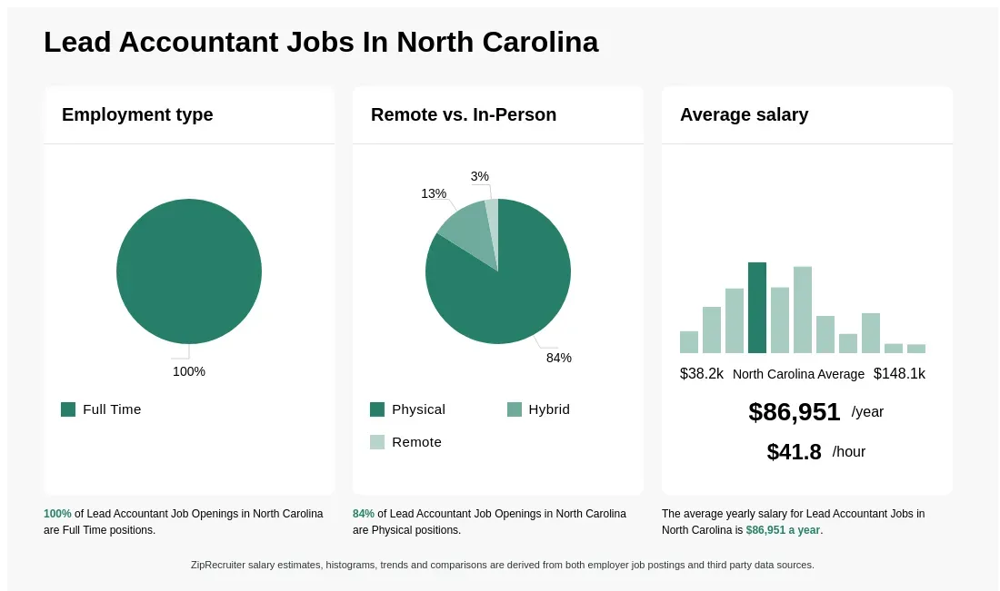

The financial management landscape is continuously evolving, influenced by the intersection of accounting, financial strategy, and the incorporation of advanced technologies such as algorithmic trading. As organizations strive to enhance profitability and efficiency, the integration of these elements becomes paramount. Accounting plays a foundational role in this landscape, where the accounting lead and accountant function as pivotal players in managing and steering financial decisions. The accounting lead is primarily responsible for overseeing financial systems, ensuring precise financial reporting and compliance, and facilitating strategic decisions that align with organizational goals. Accountants, working under the guidance of accounting leaders, focus on the meticulous preparation and analysis of financial data, enabling accurate and reliable financial operations.

The advent of algorithmic trading marks a significant transformation in financial markets, driven by the capabilities of technology to process complex data sets rapidly and execute trades with high precision. This form of trading employs mathematical models and algorithms to make trading decisions automatically, revolutionizing how trades are conducted by prioritizing factors such as speed and accuracy. By utilizing data analytics and machine learning, algorithmic trading systems can develop sophisticated trading strategies that were previously unattainable.



Integrating accounting practices with financial strategies and algorithmic trading enhances the effectiveness of financial decision-making. Financial statements and data inputs are crucial for developing robust trading algorithms, providing a comprehensive view of an organization's financial health and potential risks. By uniting accounting data with algorithmic trading, companies can forecast market trends more accurately and optimize their investment approaches for improved profitability.

The synthesis of these domains not only modernizes financial management practices but also equips organizations to navigate the complexities of the financial environment efficiently. Accountants and financial strategists who adapt to this integrated approach can thereby achieve a competitive edge, driven by a deeper understanding and strategic utilization of technological advancements.

## Table of Contents

## The Role of an Accounting Lead in Financial Management

An accounting lead plays a crucial role in modern financial management by providing both leadership and strategic support in an organization's financial operations. As primarily tasked with overseeing financial reporting and analysis, accounting leads ensure that the organization maintains accurate and timely financial records. This reliability in financial documentation is foundational for strategic decision-making, as it enables the organization's leadership team to develop informed strategies for growth, cost management, and asset allocation.

A critical component of the accounting lead's responsibilities includes ensuring compliance with the complex landscape of financial regulations. They must possess a firm understanding of regulatory requirements, such as Generally Accepted Accounting Principles (GAAP) and International Financial Reporting Standards (IFRS). Ensuring adherence to these regulations not only maintains the organization's legal and ethical standing but also builds investor and stakeholder trust.

Ethical judgment and integrity are cornerstones of effective accounting leadership. Accounting leads are responsible for upholding ethical accounting practices amidst the pressure of financial targets and competitive markets. This responsibility includes accurately representing the organization's financial position, transparently reporting any discrepancies, and ensuring that financial practices align with both ethical standards and organizational values.

Skills necessary for effective accounting leadership include a strong analytical acumen and the capacity to interpret complex financial data. An accounting lead must be adept at using financial analysis tools and techniques to provide actionable insights that guide executive decisions. This encompasses the ability to identify financial trends, forecast future financial scenarios, and evaluate investments and risks.

Moreover, accounting leads are challenged to continuously adapt to evolving technologies and integrate these innovations into financial practices. Their role increasingly involves leveraging advanced analytical tools and software, which enhance the precision and efficiency of financial analysis. Embracing technology helps in not only improving reporting accuracy but also in empowering accounting leads to provide deeper insights into financial data, thereby solidifying their role as strategic partners in financial decision-making.

In conclusion, the role of an accounting lead in financial management is multi-faceted, requiring a blend of technical knowledge, leadership skills, and ethical aptitude. Their ability to ensure compliance, maintain ethical practices, and provide strategic insights is vital for the organization's financial health and long-term success.

## Accountant in Charge: Supervising and Strategizing

An accountant in charge plays a crucial role in supervising and strategizing during financial audits. Their primary responsibility is to oversee the auditing processes, ensuring adherence to accounting standards and methodologies that contribute to the accuracy and reliability of financial information. By managing audit teams and coordinating with various departments, accountants in this role ensure that all financial transactions are meticulously recorded and analyzed, minimizing discrepancies and errors.

They play an instrumental part in verifying financial statements, assessing financial controls, and validating compliance with regulatory requirements. This involves reviewing balance sheets, income statements, and cash flow statements to detect inconsistencies or indications of fraud. Their supervision is vital to upholding the financial integrity of the organization, which in turn builds trust with stakeholders and investors.

Maintaining strong client relationships and upholding confidentiality are key elements of their duties. An accountant in charge must ensure that sensitive financial information is protected, which is pivotal in fostering trust and securing long-term business partnerships. They engage regularly with clients to understand their financial objectives and constraints, providing them with tailored advice and solutions. This customer-centric approach not only enhances the client's experience but also strengthens the firm's reputation.

The role of an accountant in charge is evolving with the integration of technology into auditing processes. They now utilize sophisticated auditing software and digital tools to streamline operations, improve efficiency, and provide more accurate insights. These technological advancements allow for real-time data processing and analysis, making audits less time-consuming while increasing their precision. Furthermore, the adoption of Artificial Intelligence (AI) and [machine learning](/wiki/machine-learning) can facilitate predictive analytics and anomaly detection, aiding accountants in identifying potential risks pre-emptively.

However, this technological shift also demands that accountants in charge continually update their skills to keep pace with digital innovations. Training in data analytics, cybersecurity, and advanced auditing software becomes essential to harness these tools effectively. By integrating these technological tools into their auditing processes, accountants can offer deeper strategic insights and contribute significantly to the organization’s financial health.

## Financial Management: Bridging Accounting and Strategy

Accounting serves as a critical foundation for financial management strategies by providing detailed financial analysis, records, and data essential for informed decision-making. Financial managers use this data to devise strategies that focus on maximizing organizational profitability while ensuring resource efficiency and sustainability.

**Strategic Roles of Financial Managers**

Financial managers act as architects of a company's financial strategy, overseeing the allocation of essential resources to enhance financial outcomes. Their roles extend beyond basic accounting, entailing the development of comprehensive plans that align financial activities with organizational goals. By analyzing financial statements, budget forecasts, and economic trends, managers have the tools to evaluate performance and predict future financial scenarios. This capacity enables them to identify areas where cost management can be improved and investments optimized.

**Tools and Techniques from Management Accounting**

Management accounting equips financial managers with tools that support tactical and strategic decision-making. Techniques such as variance analysis, cost-[volume](/wiki/volume-trading-strategy)-profit (CVP) analysis, and activity-based costing (ABC) play a crucial role in understanding cost behavior and profitability. For instance, CVP analysis helps managers in determining the break-even point by analyzing the relationship between costs, revenue, and profits. Activity-based costing provides insights into the indirect costs related to specific products or services, allowing for more accurate pricing strategies.

Example of CVP Python code:
```python
def break_even_point(fixed_costs, variable_costs, price_per_unit):
    return fixed_costs / (price_per_unit - variable_costs)

fixed_costs = 50000  # example fixed costs
variable_costs = 10  # cost per unit
price_per_unit = 20  # selling price per unit

break_even_units = break_even_point(fixed_costs, variable_costs, price_per_unit)
print("Break-even point in units:", break_even_units)
```

This code snippet calculates the break-even point, helping managers make informed decisions about pricing and production levels.

**Synergy Between Accounting and Financial Management**

The integration of accounting and financial management fosters a synergy that is vital for achieving organizational objectives. Accounting provides quantitative insights that form the backbone of financial strategies. It aids managers in setting realistic financial targets, assessing risk, and ensuring compliance with financial regulations. The synergy between these fields promotes transparency, accountability, and strategic coherence across the organization.

Through this integration, financial managers can deliver analyses that enhance strategic planning and organizational performance. This holistic approach ensures that financial management is not only focused on present needs but also on sustainable growth and long-term success.

## Algorithmic Trading in Financial Markets

Algorithmic trading represents a transformative innovation within modern financial markets, radically altering traditional trading practices by leveraging computational power and advanced algorithms. This method involves executing trades using pre-programmed instructions that account for variables such as timing, price, and volume. The evolution of [algorithmic trading](/wiki/algorithmic-trading) has been driven by its ability to increase the speed and precision of trade executions, thereby maximizing efficiency and minimizing human error.

The primary advantage of algorithmic trading lies in its speed and precision. Through automation, trades can be executed in milliseconds, a pace impossible for human traders to match. This rapid execution allows traders to capitalize on fleeting market opportunities, often translating small price discrepancies into substantial profits over numerous transactions. Additionally, algorithms enhance decision-making accuracy by processing vast datasets more swiftly and effectively than a human could. This capability reduces the likelihood of errors induced by manual trading and human emotions.

Data analytics and machine learning play integral roles in developing sophisticated trading algorithms. Machine learning algorithms, for instance, utilize historical data to identify trends and patterns, facilitating predictive insights that inform trading strategies. These algorithms continuously refine their predictions based on new data, improving their accuracy and performance over time. Python, a popular programming language among quants, offers a range of libraries such as pandas, NumPy, and scikit-learn, which are used to develop, backtest, and deploy algorithmic trading strategies. An illustrative Python snippet for a simple moving average crossover strategy might look like this:

```python
import pandas as pd

def moving_average_crossover_strategy(prices, short_window, long_window):
    signals = pd.DataFrame(index=prices.index)
    signals['price'] = prices
    signals['short_mavg'] = prices.rolling(window=short_window).mean()
    signals['long_mavg'] = prices.rolling(window=long_window).mean()
    signals['signal'] = 0.0
    signals['signal'][short_window:] = np.where(signals['short_mavg'][short_window:] > signals['long_mavg'][short_window:], 1.0, 0.0)
    signals['positions'] = signals['signal'].diff()
    return signals

prices = pd.Series([...])  # Sample price data
signals = moving_average_crossover_strategy(prices, short_window=40, long_window=100)
```

Several case studies illustrate the effective use of algorithmic trading in financial management. A notable example is Renaissance Technologies, a [hedge fund](/wiki/hedge-fund-trading-strategies) known for its flagship Medallion Fund, which relies heavily on algorithmic trading strategies. The fund's success, generating annualized returns of over 60% before fees, underscores the potential of well-designed algorithms to deliver exceptional financial outcomes.

Another case is Barclays Capital, which uses algorithmic software to execute large-volume trades with minimal market impact. These algorithms effectively slice large trades into smaller parts, facilitating better price optimization without significantly altering market prices.

In summary, algorithmic trading has emerged as a cornerstone of contemporary financial market operations, redefining how trades are executed and how market data is leveraged. Its reliance on data analytics and machine learning continues to grow, promising further advancements in trading strategies and efficacy.

## Integrating Accounting Data in Algorithmic Trading

Integrating accounting data into algorithmic trading presents a significant opportunity to enhance trading strategies and forecasting. Accounting data, primarily sourced from financial statements, provides a comprehensive overview of a company's financial health, making it a valuable input for trading algorithms. Key accounting metrics such as revenue growth, profitability ratios (like the return on equity or ROE), and [liquidity](/wiki/liquidity-risk-premium) ratios (such as the current ratio) offer critical insights into a company's operational efficiency and financial stability. By incorporating these data points, traders can develop algorithms that make more informed decisions, ultimately leading to improved trading outcomes.

The integration of financial statements and ratios facilitates a multi-faceted approach to algorithmic trading. For instance, algorithms can be designed to detect patterns or anomalies in earnings announcements or forecast future stock performance based on historical financial data trends. A common method is the use of the Price-to-Earnings (P/E) ratio. A lower than average P/E ratio could indicate undervaluation, prompting a potential buy signal in trading algorithms. Conversely, a high P/E ratio might suggest overvaluation, leading to a sell decision.

Despite its potential, merging accounting with algorithmic trading also presents challenges. The quality and timeliness of accounting data can affect the reliability of algorithms. Moreover, discrepancies in financial reporting standards globally may lead to inconsistent data, complicating algorithm development when trading across international markets. Additionally, the quantitative nature of trading algorithms may overlook qualitative factors inherent in accounting reports, like management commentary, which can also influence stock performance.

Opportunities abound when addressing these challenges. The advancement in machine learning and natural language processing (NLP) can help integrate qualitative data from financial reports. Algorithms can analyze management commentary or footnotes to financial statements using sentiment analysis to gain additional insights into company outlooks.

There are numerous examples of successful integration. Hedge funds and trading firms have reported enhanced profitability by leveraging accounting data. For instance, algorithms using comprehensive financial statement analysis have shown improved forecasting accuracy, particularly when predicting earnings surprises before public announcements. Firms that have successfully integrated these elements often maintain a competitive edge due to their ability to anticipate market moves more accurately.

In summary, incorporating accounting data into algorithmic trading strategies significantly bolsters trading efficacy. While challenges like data quality and standardization exist, emerging technologies in data analysis and machine learning pave the way for overcoming these hurdles, offering lucrative opportunities for trading success.

## Challenges and Future Directions

Integrating financial management, accounting, and algorithmic trading presents a confluence of challenges and opportunities. One of the primary challenges is ensuring data accuracy. In the context of algorithmic trading, where decisions are driven by patterns in data, even slight inaccuracies can lead to substantial financial discrepancies. The precision in accounting data must be maintained to prevent errors in financial statements, which can skew trading strategies.

Ethical considerations play a pivotal role in this integration. The use of predictive analytics and machine learning in trading raises concerns about market manipulation and transparency. Financial professionals must adhere to ethical standards to maintain trust and integrity in markets. Regulatory compliance is equally critical. As financial technologies evolve, regulatory frameworks strive to keep pace, necessitating vigilant compliance to prevent legal repercussions. Financial systems must adhere to international standards such as IFRS or GAAP, along with regulations specific to trading like MiFID II in the European Union or Dodd-Frank in the United States.

Artificial intelligence (AI) and machine learning stand at the forefront of future developments in financial accounting and trading. AI's capacity to analyze vast datasets quickly and accurately enhances financial modeling, predictive analysis, and risk management. Machine learning algorithms can identify complex patterns unobservable to human analysts, thus refining trading strategies significantly. Moreover, these technologies can automate routine accounting tasks, freeing professionals to focus on strategic decision-making.

For future financial professionals to excel in this integrated environment, they must acquire a unique blend of skills. Proficiency in data analysis and familiarity with AI and machine learning technologies becomes indispensable. Understanding the ethical implications and regulatory requirements of financial technology is also critical. Continuous professional development and interdisciplinary learning will be necessary to adapt to this dynamic landscape. As the financial sector continues to evolve with technological advancement, professionals equipped with these skills will be positioned to leverage synergies among accounting, financial management, and algorithmic trading for strategic advantage.

## Conclusion

The integration of accounting, financial management, and algorithmic trading is reshaping the landscape of financial decision-making. By combining accurate financial reporting, strategic oversight, and technological advancements, organizations are poised to make more informed and timely decisions. Accounting provides the quantitative data necessary for understanding an organization’s financial health, while financial management utilizes this data to formulate strategies aimed at maximizing profitability and ensuring sustainability. Algorithmic trading, with its reliance on real-time data and sophisticated algorithms, enhances the precision and speed of trading operations, enabling firms to quickly capitalize on market opportunities.

The ongoing need for adaptation and learning in this rapidly changing environment cannot be overstated. Technological advancements such as [artificial intelligence](/wiki/ai-artificial-intelligence) and machine learning are continually evolving, challenging financial professionals to keep pace. Mastery of new tools and techniques is essential not only for maintaining competitiveness but also for ensuring compliance with evolving regulatory standards and ethical practices.

Financial professionals have the opportunity to leverage these synergies for significant competitive advantage. By integrating comprehensive financial data with strategic analysis and automated trading systems, professionals can achieve higher degrees of efficiency and accuracy in financial planning and execution. This holistic approach empowers them to anticipate market trends, optimize resource allocation, and ultimately drive organizational success in an increasingly complex financial landscape.

## References & Further Reading

[1]: Bergstra, J., Bardenet, R., Bengio, Y., & Kégl, B. (2011). ["Algorithms for Hyper-Parameter Optimization."](https://dl.acm.org/doi/10.5555/2986459.2986743) Advances in Neural Information Processing Systems 24.

[2]: ["Advances in Financial Machine Learning"](https://www.amazon.com/Advances-Financial-Machine-Learning-Marcos/dp/1119482089) by Marcos Lopez de Prado

[3]: ["Evidence-Based Technical Analysis: Applying the Scientific Method and Statistical Inference to Trading Signals"](https://www.amazon.com/Evidence-Based-Technical-Analysis-Scientific-Statistical/dp/0470008741) by David Aronson

[4]: ["Machine Learning for Algorithmic Trading"](https://github.com/stefan-jansen/machine-learning-for-trading) by Stefan Jansen

[5]: ["Quantitative Trading: How to Build Your Own Algorithmic Trading Business"](https://www.amazon.com/Quantitative-Trading-Build-Algorithmic-Business/dp/1119800064) by Ernest P. Chan