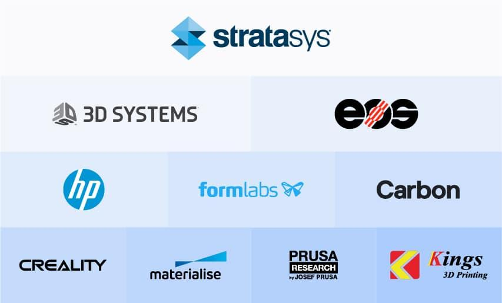

## Table of Contents

## What is 3D printing and how does it work?

3D printing is a way to make objects by building them up layer by layer. It's like drawing a picture, but instead of using a pen on paper, you use a special machine that adds material bit by bit until the object is complete. This technology can use different materials like plastic, metal, or even food to create all sorts of things, from toys to parts for machines.

The process starts with a digital design, which is like a blueprint of the object you want to make. This design is sent to the 3D printer, which reads it and knows exactly where to put the material. The printer then lays down thin layers of the material, one on top of the other, slowly building up the object. Each layer sticks to the one below it, and as more layers are added, the object starts to take shape until it's finished and ready to use.

## What are the different types of 3D printing technologies?

There are several types of 3D printing technologies, each with its own way of making objects. One common type is Fused Deposition Modeling (FDM), where a plastic filament is heated and squeezed out of a nozzle, kind of like a hot glue gun. The printer moves the nozzle around, laying down the plastic in thin layers until the object is complete. Another type is Stereolithography (SLA), which uses a liquid resin that hardens when a laser shines on it. The laser traces the shape of each layer on the surface of the resin, and the hardened layers build up to form the object.

Another popular technology is Selective Laser Sintering (SLS), where a laser is used to fuse together particles of powder, like plastic or metal. The laser draws the shape of each layer in the powder, melting it together, and then more powder is added for the next layer. There's also Digital Light Processing (DLP), which is similar to SLA but uses a digital light projector to cure the resin all at once instead of using a laser. Each of these technologies has its own strengths and is used for different kinds of projects depending on what material you need and how detailed you want the object to be.

## Who are the leading companies in the 3D printing industry?

Some of the top companies in the 3D printing world are Stratasys and 3D Systems. Stratasys is known for making printers that use FDM technology, which is great for making strong plastic parts. They also have printers that use PolyJet technology, which can make very detailed and colorful objects. 3D Systems, on the other hand, offers a wide range of technologies like SLA and SLS. They are famous for their high-quality printers that can make very precise objects, which are often used in industries like healthcare and aerospace.

Another big name is EOS, which is a leader in SLS technology. They make printers that are used a lot in manufacturing because they can make strong metal and plastic parts. Then there's Formlabs, which is known for making affordable SLA printers. These are popular with small businesses and hobbyists because they are easier to use and don't cost as much as the big industrial printers. Each of these companies plays a big role in making 3D printing more popular and useful for different kinds of projects.

## What products and services do these leading companies offer?

Stratasys offers a variety of 3D printers that use different technologies. Their FDM printers are great for making strong plastic parts, which are used in industries like automotive and aerospace. They also have PolyJet printers that can make very detailed and colorful objects, which are perfect for making prototypes and models. Besides selling printers, Stratasys provides materials like different kinds of plastic and software to help design and print objects. They also offer services like training and support to help their customers get the most out of their printers.

3D Systems is known for their wide range of 3D printing technologies, including SLA and SLS. Their printers are used to make very precise objects, which are important in fields like healthcare, where they make things like dental implants, and in aerospace, where they make parts for planes. 3D Systems also sells materials, software, and provides services like training and maintenance for their printers. They have a strong focus on helping their customers with custom solutions, which means they work closely with businesses to meet their specific needs.

EOS is a leader in SLS technology and their printers are often used in manufacturing. They make printers that can produce strong metal and plastic parts, which are used in industries like automotive and medical. EOS not only sells printers but also provides materials and software to support their customers. They offer services like consulting and training to help businesses use 3D printing in their production processes. Formlabs, on the other hand, focuses on making affordable SLA printers that are popular with small businesses and hobbyists. Their printers are easy to use and come with materials and software that make it simple to create detailed objects at home or in a small workshop.

## How do these companies compare in terms of market share and revenue?

Stratasys and 3D Systems are two of the biggest players in the 3D printing market. Stratasys has a strong market share, especially in the industrial and professional sectors. They are known for their FDM and PolyJet technologies and have a wide range of products that cater to different needs. In terms of revenue, Stratasys reported around $600 million in 2022. On the other hand, 3D Systems also holds a significant market share, focusing on high-precision technologies like SLA and SLS. Their revenue was around $600 million as well in 2022, showing that both companies are neck and neck in terms of financial performance.

EOS and Formlabs also have notable positions in the market but on a different scale. EOS, known for its SLS technology, has a strong presence in the industrial manufacturing sector. Their revenue in 2022 was around $350 million, which shows they are a bit smaller than Stratasys and 3D Systems but still a major player. Formlabs, with its focus on affordable SLA printers, targets a different segment of the market, mainly small businesses and hobbyists. Their revenue was around $150 million in 2022, indicating a smaller but growing presence in the 3D printing industry.

## What are the unique selling points of each leading 3D printing company?

Stratasys is known for its strong and reliable 3D printers that use FDM and PolyJet technologies. FDM printers are great for making strong plastic parts, which are used a lot in industries like car making and airplane building. PolyJet printers can make very detailed and colorful objects, which is perfect for making prototypes and models. Stratasys also offers a lot of different materials and software to help their customers design and print their objects. They have a big focus on helping businesses use 3D printing to make their work better and faster.

3D Systems is famous for its wide range of 3D printing technologies, like SLA and SLS. Their printers can make very precise objects, which is important in fields like healthcare, where they make things like dental implants, and in aerospace, where they make parts for planes. 3D Systems not only sells printers but also provides materials, software, and services like training and maintenance. They work closely with businesses to create custom solutions that meet their specific needs, making them a go-to company for high-quality and detailed 3D printing.

EOS and Formlabs each have their own special strengths. EOS is a leader in SLS technology and their printers are often used in big manufacturing to make strong metal and plastic parts. They offer materials, software, and services like consulting and training to help businesses use 3D printing in their production processes. Formlabs, on the other hand, makes affordable SLA printers that are popular with small businesses and hobbyists. Their printers are easy to use and come with materials and software that make it simple to create detailed objects at home or in a small workshop.

## How have these companies contributed to the advancement of 3D printing technology?

Stratasys has played a big role in making 3D printing better. They made FDM technology popular, which lets people make strong plastic parts. This has been really helpful for industries like car making and airplane building. They also made PolyJet technology, which can make very detailed and colorful objects. This is great for making prototypes and models. Stratasys has worked hard to make their printers easier to use and more reliable, which has helped more businesses use 3D printing in their work.

3D Systems has also done a lot to advance 3D printing. They have developed many different technologies, like SLA and SLS, which can make very precise objects. This is important for fields like healthcare, where they make things like dental implants, and aerospace, where they make parts for planes. 3D Systems has also focused on working closely with businesses to create custom solutions that meet their specific needs. This has helped make 3D printing more useful for a wide range of projects.

EOS and Formlabs have also made important contributions. EOS has been a leader in SLS technology, which is used a lot in big manufacturing to make strong metal and plastic parts. They have helped make 3D printing a part of the production process for many businesses. Formlabs has made 3D printing more accessible by creating affordable SLA printers that are easy to use. This has allowed small businesses and hobbyists to start using 3D printing at home or in small workshops.

## What are the current trends and innovations in 3D printing led by these companies?

Stratasys and 3D Systems are always working on new things to make 3D printing better. Stratasys has been focusing on making their printers easier to use and more reliable. They've been working on new materials that can be used in their printers, like different kinds of plastic that are stronger and more flexible. They've also been working on software that makes it easier for people to design and print their objects. This helps more businesses use 3D printing in their work, making it faster and cheaper to make things.

3D Systems has been pushing the boundaries with their technologies like SLA and SLS. They've been working on making their printers more precise, which is really important for industries like healthcare and aerospace. They've also been developing new materials, like special kinds of metal and plastic, that can be used in their printers. 3D Systems has been working on custom solutions for businesses, helping them use 3D printing in new and creative ways. This has made 3D printing more useful for a wide range of projects.

EOS and Formlabs have also been leading the way with new innovations. EOS has been focusing on making their SLS printers even better for big manufacturing. They've been working on new materials and software that make it easier for businesses to use 3D printing in their production processes. Formlabs has been making their affordable SLA printers even easier to use. They've been working on new materials and software that help small businesses and hobbyists create detailed objects at home or in small workshops. These innovations are making 3D printing more accessible and useful for everyone.

## How do these companies address sustainability and environmental concerns in 3D printing?

Stratasys and 3D Systems are both working to make 3D printing more sustainable. Stratasys has been focusing on using materials that are better for the environment. They have developed plastics that can be recycled and reused, which helps reduce waste. They also have printers that use less energy, making them more eco-friendly. Stratasys is trying to help businesses make things in a way that is kinder to the planet.

3D Systems is also doing its part to address environmental concerns. They are working on new materials that are more sustainable, like biodegradable plastics. They are also trying to make their printers more energy-efficient. 3D Systems is helping businesses find ways to use 3D printing that create less waste and pollution. Both companies are committed to making 3D printing a greener technology.

## What are the challenges faced by these companies in the 3D printing industry?

One big challenge for companies like Stratasys, 3D Systems, EOS, and Formlabs is keeping up with new technology. 3D printing is always changing, and these companies need to keep making their printers better and more useful. This means they have to spend a lot of money on research and development to stay ahead. If they don't, other companies might make better printers and take away their customers.

Another challenge is making 3D printing more affordable. Right now, some 3D printers and materials can be really expensive, which makes it hard for small businesses and hobbyists to use them. Companies like Formlabs are trying to make cheaper printers, but it's still a big challenge. They need to find ways to make their products less expensive without losing quality, so more people can use 3D printing.

Lastly, there's the challenge of making 3D printing more sustainable. People are more worried about the environment now, and they want to use technologies that are good for the planet. Companies like Stratasys and 3D Systems are working on using materials that can be recycled and making printers that use less energy. But it's not easy, and they need to keep finding new ways to make 3D printing greener.

## How are these companies expanding their reach globally and into different sectors?

Stratasys, 3D Systems, EOS, and Formlabs are working hard to reach more people all over the world. They do this by opening new offices and partnering with other businesses in different countries. This helps them sell their 3D printers and materials to more customers. They also go to big trade shows and events around the world to show off their new products and meet new people. By doing this, they can learn what people in different countries need and want, and then make products that fit those needs.

These companies are also trying to use 3D printing in more industries. Stratasys and 3D Systems are working with companies in healthcare to make things like dental implants and hearing aids. They are also helping businesses in the car and airplane industries make strong parts. EOS is focusing on big manufacturing, helping companies make metal and plastic parts faster and cheaper. Formlabs is making it easier for small businesses and schools to use 3D printing by making affordable printers. By working with different industries, these companies can show how useful 3D printing can be and help more businesses use it.

## What future developments can we expect from these leading 3D printing companies?

In the future, we can expect Stratasys to keep making their 3D printers easier to use and more reliable. They will probably work on new materials that are even stronger and more flexible. They might also make software that helps people design and print their objects even better. This will help more businesses use 3D printing to make things faster and cheaper. Stratasys will also focus on making their printers more eco-friendly by using materials that can be recycled and using less energy.

3D Systems will likely keep pushing the limits of their technologies like SLA and SLS. They will work on making their printers even more precise, which is important for industries like healthcare and aerospace. They might also develop new materials, like special kinds of metal and plastic, that can be used in their printers. 3D Systems will continue to work closely with businesses to create custom solutions, helping them use 3D printing in new and creative ways. They will also focus on making their printers more sustainable by using biodegradable materials and making them more energy-efficient.

EOS and Formlabs will also keep innovating. EOS will focus on making their SLS printers even better for big manufacturing. They will work on new materials and software that make it easier for businesses to use 3D printing in their production processes. Formlabs will keep making their affordable SLA printers even easier to use. They will work on new materials and software that help small businesses and hobbyists create detailed objects at home or in small workshops. Both companies will also work on making their printers more sustainable and eco-friendly.

## References & Further Reading

[1]: Hull, C. (2019). ["Additive Manufacturing: 3D Printing for Prototyping and Manufacturing."](https://onlinelibrary.wiley.com/doi/10.1155/2019/9656938) Springer.

[2]: Gibson, I., Rosen, D. W., & Stucker, B. (2015). ["Additive Manufacturing Technologies: 3D Printing, Rapid Prototyping, and Direct Digital Manufacturing."](https://link.springer.com/book/10.1007/978-1-4939-2113-3) Springer.

[3]: Chua, C. K., & Leong, K. F. (2015). ["3D Printing and Additive Manufacturing: Principles and Applications (with Companion Media Pack) – Fifth Edition of Rapid Prototyping."](https://pmc.ncbi.nlm.nih.gov/articles/PMC7575635/) World Scientific Publishing Company.

[4]: ("Artificial Intelligence in 3D Printing."). IDC Research Report. Retrieved from [IDC](https://www.researchgate.net/publication/351924546_Artificial_Intelligence_in_3D_Printing).

[5]: Hargrave, M. (2021). ["How Algorithmic Trading Works."](https://ungeracademy.com/posts/algorithmic-trading-what-is-it-and-how-does-it-work) Investopedia.