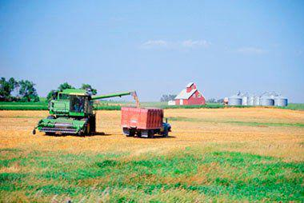

Agricultural production and distribution represent key pillars in the economic frameworks of nations around the globe. In an era where food security is a critical concern, the agricultural sector's ability to sustain the global population is intertwined with its influence on trade and economic stability. The industry's significance extends beyond feeding billions, serving as a foundation for the livelihoods of millions while contributing substantially to national GDPs through both domestic production and international trade. Global agricultural dynamics are shaped by a few leading powerhouse nations known for their extensive output in quantity and diversity of produce.

In examining the landscape of global food production, we identify the top countries whose agricultural capabilities position them as central players in maintaining food security. Each of these countries utilizes a unique combination of natural resources, technological advancements, and strategic economic policies to maximize agricultural output.

With technological innovation rapidly transforming every sector, agriculture is no exception. Algorithmic trading emerges as a modern method that optimizes agricultural markets by enhancing trading efficiency and minimizing market volatility, thereby impacting commodity prices on a global scale. Likewise, these technologies serve as powerful tools for predicting trends, managing market risks, and optimizing investment portfolios, further underscoring the significance of agricultural markets in the broader economic picture.

As the agriculture sector continues to evolve, understanding the intricate dynamics of leading agricultural producers and exporters, alongside advancements in trading technologies, is paramount to ensuring sustained global food security. This comprehensive examination aims to shed light on these critical aspects, addressing both the challenges and opportunities presented by contemporary agricultural practices and market dynamics.

## Table of Contents

## Top Agricultural Producers

China, India, and the United States emerge as the foremost agricultural producers globally, each leveraging unique geographical, technological, and socio-economic advantages to maintain their dominant positions.

China leads the world in agricultural output with a diversified array of crops such as rice, wheat, and vegetables. This diversity is supported by the nation's expansive arable lands, which cover approximately 119 million hectares, making it one of the largest farming areas worldwide. China's government policies also play a pivotal role in bolstering its agricultural sector, providing subsidies and technological support to farmers. With a focus on increasing productivity, the nation has embraced agricultural innovations, including the development of high-yield crop varieties and modern irrigation systems, further solidifying its leading status in global agriculture.

India ranks second in agricultural production, benefiting from a rich diversity of agricultural products. The country's extensive agricultural prowess is largely attributed to its massive rural workforce, with agriculture employing over 40% of the Indian population. Favourable climatic conditions across different regions support the cultivation of a wide range of crops, from staple grains like rice and wheat to various fruits, vegetables, and legumes. Despite challenges such as resource limitations and infrastructural constraints, India continues to advance through targeted governmental initiatives that aim to enhance farmers' access to markets, credit, and technology.

The United States is a key player in global agriculture, utilizing advanced technology and large-scale farming practices to maintain its competitiveness. The U.S. agricultural sector is characterized by high-efficiency production methods, extensive mechanization, and the use of genetically modified crops to increase yields and resilience. The diverse climate across different states facilitates a broad spectrum of agricultural activities, from grain and oilseed production in the Midwest to fruit and vegetable farming in California and Florida. Additionally, robust research and development efforts focused on precision agriculture and sustainable practices contribute significantly to the sector’s continual growth and productivity.

In summary, China, India, and the United States lead the world in agricultural production through a combination of vast natural resources, supportive governmental policies, and technological advancements. Their distinctive approaches to agriculture not only ensure food security for their populations but also position them as influential players in the global agricultural market.

## Leading Agricultural Exporters

The United States, Brazil, and the Netherlands are prominent actors in the global agricultural export market, each contributing uniquely to the worldwide supply of various agricultural commodities.

The United States stands at the forefront as a major exporter, thanks to its robust output of commodities such as corn, soybeans, and wheat. The prevalence of advanced farming techniques, large-scale operations, and mechanization has enabled the U.S. to optimize production efficiency and maintain its competitive edge. The U.S. agricultural sector benefits significantly from its diverse climate and expansive arable land, which support a wide range of crop and livestock production systems. The implementation of genetically modified organisms (GMOs) and cutting-edge agricultural research has further propelled the United States' market position globally. According to the United States Department of Agriculture (USDA), the country remains one of the top exporters due to these technological advancements and an efficient supply chain network.

Brazil emerges as a powerhouse in the export of beef, coffee, and soybeans. Blessed with a favorable climate and extensive farmland, Brazil has leveraged these resources to become a leading supplier in these categories. Brazilian beef is renowned for its quality, and the country's coffee exports account for a significant portion of global coffee supply. Soybeans, another crucial export product, considerably impact Brazil's research in sustainable farming and agri-technologies. According to the Food and Agriculture Organization (FAO), Brazil's agricultural prowess is supported by land reform policies and investments in infrastructure, which have enabled it to expand its agricultural frontiers sustainably.

The Netherlands, though relatively small in terms of land area, has achieved international recognition for its agricultural exports, specifically in high-value flower and dairy products. The Netherlands' strategic location in Europe, coupled with a sophisticated logistics network, allows for efficient distribution across the continent. Dutch expertise in horticulture is exemplified by its status as one of the world's largest exporters of flowers, particularly tulips. Additionally, the dairy sector is a significant contributor to its export economy. The efficiency of Dutch farming practices is enhanced by technological innovations and research in sustainable agriculture methods, reinforcing the country's competitive advantage in exports. As per Statistics Netherlands (CBS), the success of the Dutch agricultural sector is largely due to its integration of technology and emphasis on sustainable production techniques.

In conclusion, these three countries exemplify different strategies and resources that contribute to their leading positions in global agricultural exports, underpinning the importance of innovation, sustainability, and efficient logistics in the contemporary agricultural landscape.

## Algorithmic Trading in Agriculture

Algorithmic trading is significantly transforming the agricultural sector by enhancing the efficiency of trading processes and reducing market [volatility](/wiki/volatility-trading-strategies). By employing advanced computational models, this technology enables the execution of large volumes of trades at an unprecedented speed, which directly impacts the pricing of agricultural commodities.

These algorithms analyze massive datasets rapidly, incorporating diverse factors such as historical price trends, weather patterns, and geopolitical events that may influence commodity markets. By leveraging [machine learning](/wiki/machine-learning) techniques, these systems can continuously adapt to new data, improving the accuracy of market predictions. For instance, a common [algorithmic trading](/wiki/algorithmic-trading) strategy employed is mean reversion, which assumes that prices and returns eventually move back towards the mean or average, thereby enabling traders to profit from short-term deviations.

The implementation of algorithmic trading in agriculture also involves sophisticated risk management and portfolio optimization practices. Algorithms can identify risk factors in real-time and make adjustments to minimize potential losses. For example, the Value at Risk (VaR) is a statistical technique used to assess the level of financial risk within a firm or investment portfolio over a specific timeframe. These algorithms calculate the VaR to decide the optimal amount of commodity exposure while maintaining the desired level of risk.

In terms of practical applications, algorithmic trading is integrated into platforms used by agricultural commodity exchanges, such as the Chicago Mercantile Exchange (CME). Here, machine learning algorithms can predict future price movements based on past volumes and open interest data. This predictive capability is pivotal for stakeholders, including farmers, traders, and policymakers, to make informed decisions that align with market dynamics.

Moreover, the integration of Artificial Intelligence (AI) in these algorithms facilitates more complex decision-making processes, such as pattern recognition, which can further refine trading strategies. Such advancements contribute not only to optimizing portfolios but also to stabilizing agricultural markets, ultimately supporting global food security efforts by ensuring more predictable pricing and availability of essential agricultural products.

In conclusion, as algorithmic trading continues to evolve, its role in agricultural markets becomes increasingly vital. By fostering enhanced trading strategies and advancing market efficiency, it presents a substantial opportunity for growth and stability within the agricultural sector.

## Challenges and Opportunities

Global agriculture faces numerous challenges, including climate change, resource scarcity, and policy shifts, which significantly impact productivity. Climate change affects crop yields through variations in temperature, precipitation patterns, and the occurrence of extreme weather events. For instance, increased temperatures and altered rainfall patterns can stress crops, reducing their productivity and altering the geographic distribution of farming viability [1].

Resource scarcity, particularly concerning water and arable land, poses additional constraints. Agricultural operations consume about 70% of freshwater resources worldwide, making efficient water use crucial as population growth and urbanization increase demand [2]. Land degradation further threatens arable land availability, limiting the potential for agricultural expansion.

Policy shifts, such as changes in trade agreements, subsidies, and environmental regulations, can lead to significant implications for agricultural sectors globally. Nations may impose tariffs or remove subsidies, affecting competitive positioning and ultimately altering production methods and trade flows.

Despite these challenges, several opportunities arise through technological advancements. Precision agriculture uses data analytics, GPS, and remote sensing to optimize field-level management regarding crop farming. This technology enables farmers to apply inputs like fertilizers and water more efficiently, thereby enhancing yields and reducing waste.

Genetically Modified Organisms (GMOs) represent another opportunity, offering increased resistance to pests and diseases and improved nutritional profiles. GMOs can help stabilize food production by lowering the risk of crop failures and enhancing food quality.

The integration of Artificial Intelligence (AI) and the Internet of Things (IoT) into farming practices is revolutionizing agricultural management. AI algorithms can process vast quantities of data to predict weather patterns, identify pest outbreaks, and suggest optimal planting times. IoT devices, such as soil sensors and drones, provide real-time data, allowing farmers to monitor crop health and soil conditions continuously.

Sustainability remains a central focus in mitigating agriculture's environmental impact while boosting production. Practices such as crop rotation, agroforestry, and the application of organic fertilizers contribute to soil health and biodiversity. Innovations in this space aim to reduce greenhouse gas emissions, conserve water, and enhance carbon sequestration in soil.

Continuous research and development in these areas are essential to address the challenges of feeding a growing global population sustainably and effectively. Leveraging technology and innovative practices is not only pivotal for overcoming current challenges but also for harnessing future opportunities to enhance global agricultural productivity.

---

[1] Intergovernmental Panel on Climate Change (IPCC). (2014). Climate Change 2014: Impacts, Adaptation, and Vulnerability.

[2] Food and Agriculture Organization of the United Nations (FAO). (2014). Water for Food Security and Nutrition.

## Conclusion

As agriculture remains a cornerstone of global economies, the adoption of new technologies and practices is vital. The leading agricultural producers and exporters play an essential role in shaping the landscape of global food security. By leveraging their production capabilities, these countries contribute to the availability and distribution of food worldwide. Recognizing the impact of technology, particularly in the form of algorithmic trading, offers an opportunity to enhance efficiency and reduce volatility in agricultural markets. The integration of advanced algorithms allows for the swift processing of vast quantities of data, offering insights that enable better decision-making for both short-term trading and long-term agricultural planning.

Collaborative efforts between nations are crucial for addressing the persistent challenges faced by the industry, such as climate change and resource scarcity. Shared knowledge and resources can help develop sustainable agricultural practices that preserve the environment while ensuring productivity. Cutting-edge technologies, from precision agriculture to AI and IoT, provide innovative solutions that can transform farming methods and boost production capabilities. This ongoing innovation is key to not only tackling current issues but also positioning the global agricultural industry for future success.

In this interconnected world, continuous innovation and international cooperation will play a pivotal role in developing resilient agricultural practices. By fostering partnerships and utilizing technological advancements, the industry can progress towards achieving enhanced global food security, ultimately benefitting both producers and consumers alike.

## References & Further Reading

[1]: Intergovernmental Panel on Climate Change (IPCC). (2014). ["Climate Change 2014: Impacts, Adaptation, and Vulnerability."](https://www.ipcc.ch/report/ar5/wg2/)

[2]: Food and Agriculture Organization of the United Nations (FAO). (2014). ["Water for Food Security and Nutrition."](https://openknowledge.fao.org/server/api/core/bitstreams/f6b32ac3-74c8-4c4b-ac6b-60a21d74202f/content)

[3]: United States Department of Agriculture (USDA). ["Economic Research Service - Commodities & Products."](https://www.ers.usda.gov/data-products/)

[4]: López de Prado, M. (2018). ["Advances in Financial Machine Learning."](https://www.amazon.com/Advances-Financial-Machine-Learning-Marcos/dp/1119482089) John Wiley & Sons.

[5]: Patel, H., & Zaveri, M. (2017). ["Algorithmic Trading."](https://epubs.siam.org/doi/10.1137/16M106282X) Springer.

[6]: Janssen, M., Rutz, C., & George, S. (2020). ["Automated Trading in Agricultural Commodity Markets."](https://www.researchgate.net/publication/228735855_Biofuel_technology_handbook) Agricultural Economics.