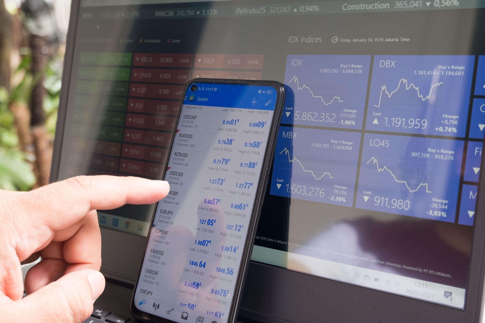

Forex trading, commonly known as FX trading, involves the exchange of one currency for another and stands as one of the most dynamic markets worldwide. It operates 24 hours a day, five days a week, across major financial centers, offering opportunities for traders to participate in the ups and downs of currency price fluctuations. With the rapid advancements in technology, forex trading has become more accessible, thanks to the development of numerous trading applications and algorithmic trading software specifically designed for forex markets.

These technological advancements have revolutionized the way traders engage with the forex market. Modern trading applications offer an array of features that enhance trading efficiency, from providing real-time market data and live news updates to advanced charting tools and technical analysis functionalities. Furthermore, many applications are equipped with algorithmic trading capabilities, allowing traders to automate their strategies based on pre-defined criteria, thereby optimizing their trading performance.

This article aims to explore some of the top forex trading applications that are leading the market in terms of features, user-friendliness, and overall performance. Whether you are a novice trader seeking educational resources or an experienced trader looking for advanced trading tools, these apps provide a variety of functionalities tailored to meet diverse trading needs. By leveraging the right trading app, traders can significantly enhance their ability to navigate the forex market efficiently and profitably.

## Table of Contents

## What to Look for in a Forex Trading App

When choosing a forex trading app, several features are critical for maximizing trading potential. First and foremost, real-time market data and news alerts are indispensable for staying informed and making timely decisions. Having access to up-to-the-minute information allows traders to respond quickly to market shifts and leverage opportunities as they arise. This feature can be particularly beneficial during periods of high volatility, where prices can change rapidly.

A user-friendly interface is another paramount consideration. An app that facilitates easy navigation and provides quick access to trading tools can streamline the trading process. This is essential for maintaining efficiency, especially for traders who engage in frequent transactions. Intuitive design reduces the learning curve for beginners and enhances the overall user experience, which is vital for both novice and experienced traders.

Advanced charting options and technical analysis tools are also crucial components of a competent forex trading app. These features enable traders to perform comprehensive market analyses, detect trends, and make data-driven decisions. Technical analysis tools may include indicators such as Moving Averages, Relative Strength Index (RSI), and Bollinger Bands, which can provide deeper insights into market conditions. Tools that offer customizable charts, historical data, and predictive analytics can significantly enhance a trader's strategy and decision-making process.

Furthermore, for beginners looking to understand market dynamics, apps that offer educational resources are highly beneficial. Educational materials can include tutorials, articles, webinars, and interactive modules that cover fundamental and advanced trading concepts. These resources not only help in building a solid foundation of [forex](/wiki/forex-system) knowledge but also assist in developing effective trading strategies.

In conclusion, selecting a forex trading app with real-time data access, a user-friendly interface, advanced charting capabilities, and educational resources can substantially improve a trader's ability to navigate the forex market efficiently and effectively. These features combine to form a robust platform that supports informed trading decisions and strategic execution.

## Top Forex Trading Apps of 2024

Several forex trading apps have earned recognition in 2024, primarily due to their comprehensive features and high levels of user satisfaction. A well-designed forex trading app can be a vital tool for traders seeking efficiency and success in the fast-paced world of currency exchange.

**NetDania Stock and Forex Trader** emerges as a leading choice for forex traders. Renowned for its extensive functionality, NetDania offers a user-friendly interface that helps both beginners and seasoned traders navigate the turbulent forex market efficiently. The app provides extensive features, including real-time streaming price quotes, charting tools, and a wide array of indicators, making it a versatile tool for diverse trading strategies.

**The Bloomberg app** stands out as a crucial resource for traders seeking comprehensive market news and analysis. Well-known for its rigorous and real-time data streaming capabilities, Bloomberg provides traders with access to a plethora of financial information, ensuring they stay informed about global market movements. This app delivers up-to-the-minute news and analytics, helping traders make informed and timely decisions.

**Thinkorswim Mobile by Charles Schwab** offers an all-inclusive trading platform tailored for active traders. This app is recognized for its customizable trading features, which allow traders to adapt the platform to their specific trading style and preferences. With an array of advanced charting options and sophisticated technical analysis tools, Thinkorswim Mobile enables users to engage in a more analytical approach to trading, supporting both complex strategies and the tracking of multiple asset classes.

These apps cater to a diverse range of trader needs, from novice to professional, offering unique features that can significantly enhance trading outcomes. Whether it's the robust ease-of-use of NetDania, the in-depth data capabilities of Bloomberg, or the customizable features of Thinkorswim Mobile, these platforms provide the essential tools to navigate the forex market effectively.

 to Algorithmic Trading

Algorithmic trading, often referred to as algo trading, is a method of executing trading orders using automated pre-programmed software and algorithms. This approach allows traders to make swift decisions based on predefined criteria without manual intervention. The primary appeal of [algorithmic trading](/wiki/algorithmic-trading) lies in its ability to process large volumes of data and execute trades at speeds and frequencies that are almost impossible for a human trader to achieve.

Algorithms are designed to follow a set of instructions which can include timing, price, quantity, or any other model. A typical example might be to buy a stock if its 50-day moving average goes below its 200-day moving average. The strategies employed in algorithmic trading are varied, ranging from high-frequency trading ([HFT](/wiki/high-frequency-trading-strategies)) which deals with a large number of orders at extremely high speeds, to more strategy-based algorithms like trend-following systems that monitor market movements to determine optimal entry and [exit](/wiki/exit-strategy) points.

The popularity of algorithmic trading in forex markets is largely driven by the quest for increased efficiency and precision in trade execution. By leveraging advanced algorithms, traders can minimize human error, optimize trading opportunities, and achieve consistent results. Moreover, algorithms can be backtested using historical market data to fine-tune strategies before live deployment, offering a significant advantage over traditional trading methods.

Understanding algorithmic strategies is essential for traders aiming to fully harness market opportunities. Engaging with these strategies involves appreciating their complexities along with their substantial potential benefits. This knowledge enables traders to optimize their trading plans effectively, thereby enhancing their potential for financial gain in the dynamically changing forex markets. As technology continues to advance, the role of algorithmic trading is expected to grow, offering new opportunities and challenges for traders worldwide.

## Best Apps for Algorithmic Trading

Certain forex applications have emerged as leaders in algorithmic trading, owing to their robust features and technology infrastructure that accommodate sophisticated trading needs.

**IC Markets** stands out due to its versatile execution policies and support for multiple platforms. It offers access to MetaTrader 4 (MT4), MetaTrader 5 (MT5), and cTrader, providing a flexible environment for deploying algorithmic strategies. MT4 and MT5 platforms are particularly favored for their Expert Advisors (EAs), which allow traders to automate complex trading strategies without manual intervention. These platforms also support backtesting capabilities, enabling traders to evaluate their strategies against historical data before live deployment.

**FXCM (Forex Capital Markets)** is another notable app, offering comprehensive educational resources and tools for developing personalized automated trading systems. The platform's application programming interface (API) supports a variety of programming languages, including Python and Java, which are widely used for crafting custom trading algorithms. FXCM also provides access to its proprietary Marketscope charting package, enhancing traders' ability to conduct technical analysis and integrate it into their automated systems.

**Interactive Brokers**, known for its exhaustive market access, presents robust API trading options that cater to professional and advanced users. Through its Trader Workstation (TWS) API, traders can seamlessly execute trades and manage their portfolios programmatically. The API supports Java, C++, Python, and several other programming languages, allowing for high customization of trading strategies. Interactive Brokers also offers algorithmic trading tools that facilitate the implementation of strategies like mean reversion or momentum trading, effectively leveraging market data to optimize trading decisions.

By leveraging these apps, traders can automate their strategies, manage risks more effectively, and improve performance through technological advancements. Whether it is accommodating high-frequency trading algorithms or executing complex multi-leg options strategies, these platforms provide the necessary infrastructure for efficient algo trading operations.

## FAQs About Forex and Algo Trading Apps

### Can you get rich by trading forex? 

The forex market is renowned for its high [liquidity](/wiki/liquidity-risk-premium) and potential for profit. However, achieving substantial wealth through forex trading is dependent on several factors. A robust trading strategy, deep market understanding, and disciplined execution are critical. Traders must be adept at analyzing trends, managing risks, and leveraging technical and [fundamental analysis](/wiki/fundamental-analysis) to identify profitable opportunities. While some traders may achieve significant wealth, forex trading also carries substantial risks, including potential financial losses. Success in forex trading requires a balanced approach, continuous learning, and the ability to adapt to market conditions.

### Is it possible to trade forex on a mobile phone?

Yes, trading forex on a mobile phone is not only possible but increasingly popular due to advancements in mobile technology. Modern trading apps provide comprehensive tools for trading on the go, including real-time data, charting capabilities, and order execution. These apps are designed to be user-friendly, ensuring that traders can access markets, monitor their trades, and execute orders from anywhere with an internet connection. The convenience offered by mobile trading apps has made it easier for traders to stay connected to the market 24/7.

### Which trading apps are best for beginners?

For beginners, selecting a trading app with a user-friendly interface and educational resources is crucial. Apps that offer demo accounts, tutorials, and access to educational materials can significantly enhance a novice trader's learning experience. User-friendly navigation, clear charting tools, and easy access to customer support are other important considerations. Apps like NetDania and FXCM, known for their comprehensive educational features and intuitive design, are often recommended for beginners seeking to understand the basics of forex trading.

### What are the risks of algorithmic trading?

Algorithmic trading, while offering the promise of increased efficiency and speed, also carries inherent risks. Algorithms can amplify market risks if not properly managed. For instance, technical glitches or poorly designed strategies can result in significant trading losses. Moreover, algorithmic trading can contribute to market [volatility](/wiki/volatility-trading-strategies) during periods of high-frequency trades. Traders employing algorithmic strategies must ensure robust risk management practices, continuous monitoring, and regular updates to their algorithms to mitigate potential adverse effects. Managing these risks requires technical expertise and a comprehensive understanding of both the software and the market dynamics.

## Conclusion

Algorithmic trading software enhances the trading landscape by embedding a layer of sophistication that automates strategic actions. This technology empowers traders to execute orders with greater speed and precision than manual trading allows. By defining rules based on historical data, traders can set their software to analyze major market indicators and execute trades autonomously, even capitalizing on fleeting opportunities that may be missed otherwise.

For both beginners and seasoned traders, selecting the right forex trading app is pivotal to achieving success. An app equipped with robust algorithmic capabilities can streamline trading processes and augment decision-making, thus facilitating better market outcomes. Beginners benefit from educational tools and intuitive interfaces that these apps often provide, helping them grasp complex trading concepts with ease. Experienced traders, on the other hand, can leverage enhanced charting and technical analysis features, setting up advanced algos tailored to their strategies.

Careful consideration of an app's features, such as its data integration, analysis tools, and automation capabilities, is crucial. Optimal app choice allows traders to manage risks efficiently, experiment with various strategies, and ultimately, refine their trading performance in the dynamic forex market. Whether starting your forex journey or looking to enhance your trading toolkit, the appropriate app can be a significant asset in navigating the complexities of global currency trading.

## References & Further Reading

[1]: Bergstra, J., Bardenet, R., Bengio, Y., & Kégl, B. (2011). ["Algorithms for Hyper-Parameter Optimization."](https://dl.acm.org/doi/10.5555/2986459.2986743) Advances in Neural Information Processing Systems 24.

[2]: ["Advances in Financial Machine Learning"](https://www.amazon.com/Advances-Financial-Machine-Learning-Marcos/dp/1119482089) by Marcos Lopez de Prado

[3]: ["Evidence-Based Technical Analysis: Applying the Scientific Method and Statistical Inference to Trading Signals"](https://www.amazon.com/Evidence-Based-Technical-Analysis-Scientific-Statistical/dp/0470008741) by David Aronson

[4]: ["Machine Learning for Algorithmic Trading"](https://github.com/stefan-jansen/machine-learning-for-trading) by Stefan Jansen

[5]: ["Quantitative Trading: How to Build Your Own Algorithmic Trading Business"](https://www.amazon.com/Quantitative-Trading-Build-Algorithmic-Business/dp/1119800064) by Ernest P. Chan