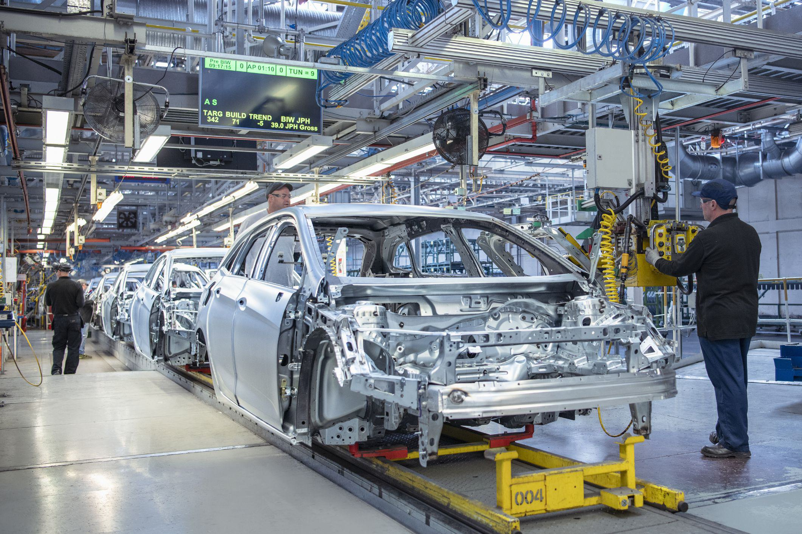

The global automotive industry stands as a pivotal pillar in the global economic framework, deeply influencing technological innovation and shaping consumer preferences across diverse markets. The industry is characterized by a dynamic landscape, where key players such as China, the United States, Japan, and Germany dominate car production. These nations are not only major producers of automobiles but also leaders in setting technological and regulatory standards that ripple through global markets.

Analyzing trends in car production unveils vital insights into broader economic conditions, reflecting periods of growth or contraction. For instance, an increase in vehicle production often correlates with economic expansion phases, driven by heightened consumer demand and increased investment in infrastructure. Conversely, declines may indicate economic slowdowns or shifts in consumer preferences towards other forms of transportation or new technological offerings, such as electric vehicles (EVs).



Technological advancements, particularly in EVs, hybrid technology, and efficient manufacturing processes, have redefined standards within the industry. Countries at the forefront of these technologies drive global trends, influencing not only what cars are produced but also how they are marketed and consumed worldwide.

This article explores how these top car-producing countries have shaped the automotive industry and highlights the emerging role of algorithmic trading. Traditionally associated with finance, algorithmic trading techniques are increasingly impacting the automotive sector. By leveraging data analytics and automated decision-making processes, these techniques optimize various aspects of car production, from supply chain logistics to market forecasting. This intersection of traditional manufacturing expertise with innovative algorithmic applications paves the way for enhanced efficiency and adaptability in a constantly evolving marketplace.

## Table of Contents

## The World's Leading Car Producers

The global automotive industry is heavily influenced by the leading car-producing countries: China, the United States, Japan, and Germany. These nations annually produce millions of vehicles while setting the pace for innovation and advances in automotive technology.

China stands as the most prolific car manufacturer, producing over 30 million vehicles in 2023. This dominance is propelled by its robust manufacturing capabilities and significant investments in the electric vehicle (EV) market. Chinese companies like SAIC Motor and BYD are pivotal, leveraging government policies favoring green technologies and infrastructure development to boost production capacities.

The United States holds a legacy of automotive innovation, with companies such as Ford, General Motors, and Tesla shaping both traditional and electric vehicle markets. Tesla, in particular, has revolutionized the EV sector, establishing the U.S. as a leader in automotive innovation. However, the industry faces challenges from global supply chain disruptions, necessitating adaptive strategies to maintain production levels.

Japan's automotive industry is renowned for precision and efficiency with major players like Toyota, Honda, and Nissan leading the charge. Japan's focus on hybrid and fuel-cell technology meets the rising demand for sustainable vehicles. Furthermore, Japan's automotive export market significantly influences global car production trends, promoting high standards of quality and efficiency worldwide.

Germany is synonymous with engineering excellence and luxury vehicles, primarily through brands such as Volkswagen, BMW, and Mercedes-Benz. Despite its reputation for luxury cars, Germany is strategically advancing electric vehicle production to keep pace with industry trends. Economic incentives and innovations continue to fortify Germany's position in the global automotive sector.

Each of these countries faces distinct economic and regulatory challenges that impact car production. For instance, regulatory standards related to emissions and safety drive innovation and reforms in manufacturing processes. Additionally, economic factors such as labor costs, access to raw materials, and trade policies further influence production strategies and outputs, affecting their global impact. As the automotive industry evolves, these four countries will continue to be at the forefront, shaping the future trajectory of the sector.

## China: The Automotive Giant

China maintains its position as the world's largest car producer, reaching a milestone of over 30 million vehicles manufactured in 2023. This achievement underscores the nation's pivotal role in the global automotive industry. In recent years, Chinese companies such as SAIC Motor and BYD have been at the forefront of automobile production, particularly emphasizing their contributions to the electric vehicle (EV) market. SAIC Motor, a state-owned enterprise, has consistently led production figures with its expansive portfolio, covering traditional vehicles, hybrids, and EVs. On the other hand, BYD, originally a battery manufacturer, has emerged as a leader in the electric vehicle sector, focusing on innovation in battery technology and sustainable transport solutions.

The rapid growth of China's automotive sector can be attributed significantly to government policies and strategic investments in infrastructure. The Chinese government has implemented a range of policies designed to boost automotive production and adoption of new energy vehicles (NEVs). These policies include substantial subsidies for electric vehicles, investment in charging infrastructure, and stricter emission standards aimed at reducing pollution and reliance on fossil fuels. For instance, government incentives for both manufacturers and consumers have made electric vehicles more economically viable, fostering their widespread adoption across the country.

Moreover, investments in infrastructure have played a crucial role in supporting the automotive industry's expansion. China's focus on developing comprehensive transport networks, including roads, highways, and urban transit systems, has facilitated smoother logistics and supply chain operations. This infrastructural development has also encouraged the proliferation of charging stations, addressing one of the critical bottlenecks in the adoption of electric vehicles.

China's automotive industry has also capitalized on its extensive supply chain ecosystem. The presence of a wide range of component manufacturers within the country reduces dependence on imports and allows for greater control over quality and cost. This vertical integration enhances production efficiency and scalability, enabling Chinese automakers to meet both domestic and international demand effectively.

In summary, China's status as the leading car producer globally is underpinned by substantial government support, strategic infrastructural investments, and the innovative prowess of companies like SAIC Motor and BYD. These elements together have solidified China's role as a key player in shaping the future of the automotive industry, particularly in the transition toward sustainable mobility solutions.

## United States: Innovation and Legacy

The United States has long been a central player in the automotive industry, thanks to the contributions of pioneering companies such as Ford and General Motors. These companies have not only solidified the country's reputation in traditional vehicle manufacturing but have also adapted to include a strong emphasis on electric vehicles (EVs). The U.S.'s automotive landscape has evolved significantly in response to shifting consumer preferences and advancements in technology, making it a key leader in automotive innovation.

A significant [factor](/wiki/factor-investing) in the U.S. maintaining its leadership role is the rise of Tesla, a company that has fundamentally disrupted the traditional automotive market. Since its inception, Tesla has prioritized sustainable energy and advanced technology, bringing EVs into mainstream consciousness. In 2023, Tesla continues to dominate the American EV market, not just in terms of sales but also through its influence on other manufacturers, who are increasingly pivoting toward electric models to compete within the industry.

Despite these advancements, the U.S. automotive sector faces several challenges, particularly in maintaining production levels amidst global supply chain disruptions. These disruptions have been exacerbated by various factors, such as geopolitical tensions and pandemic-induced manufacturing slowdowns, which have highlighted vulnerabilities in global and local supply chains. However, these challenges also present opportunities for the U.S. to innovate in supply chain resilience and production methods.

The American automotive industry has responded by investing in domestic production capabilities to reduce dependency on international suppliers. There is also an increased focus on developing digital solutions to optimize manufacturing processes, which can include leveraging [artificial intelligence](/wiki/ai-artificial-intelligence) for predictive maintenance and logistics optimization. The integration of Industry 4.0 technologies is another strategic move, which includes the use of IoT devices to streamline operations and enhance productivity.

Overall, the United States continues to be a formidable force in the global automotive arena, driving both innovation and legacy in traditional and electric vehicles. The sector’s ability to navigate current challenges and exploit emerging opportunities will shape its future trajectory and maintain its leadership status in the international market.

## Japan: Excellence and Efficiency

Japan's automotive industry is recognized worldwide for its commitment to excellence, efficiency, and quality. Dominated by major corporations such as Toyota, Honda, and Nissan, Japan has established itself as a leader in vehicle manufacturing. This standing is largely attributed to the nation's emphasis on precision engineering and innovative technology.

A distinguishing feature of Japan’s automotive industry is its pioneering efforts in hybrid and fuel-cell technologies. This focus aligns with the increasing global demand for sustainable vehicles. Toyota, for example, revolutionized the market with the launch of the Prius in 1997, the world's first mass-produced hybrid car. The company's commitment to sustainability continues with advancements in hydrogen fuel-cell technology, evidenced by the Toyota Mirai. Similarly, Honda and Nissan have made significant strides in developing hybrid and electric vehicles, providing models like the Honda Clarity and the Nissan Leaf, further consolidating Japan's position at the forefront of environmentally friendly automotive technologies.

Japan's automotive prowess extends beyond its domestic market. Export markets have been crucial for the Japanese automotive industry, not only as a source of revenue but also as a means of influencing global car production trends. In 2022, Japan exported approximately 4.3 million vehicles, a testament to its substantial presence in international markets. The country's vehicles are prized for their reliability, advanced technology, and fuel efficiency, making them particularly popular in regions such as North America and Europe.

Moreover, the Japanese automotive industry sets global benchmarks in manufacturing processes. The principles of lean manufacturing and the Toyota Production System (TPS) have been widely adopted around the world, underscoring Japan’s influence on global production standards. These methodologies emphasize waste reduction, continuous improvement, and efficiency, which are critical for maintaining competitiveness in the automotive sector.

In summary, Japan’s automotive industry exemplifies a blend of tradition and innovation. Its focus on high-quality manufacturing and sustainable technology not only strengthens its domestic market but also enhances its role in the global automotive landscape. As the industry evolves, Japan's practices and technologies will likely continue to shape the future of car production worldwide.

## Germany: Engineering and Luxury

Germany is renowned for its automotive industry, especially its production of high-quality luxury vehicles. This reputation is largely attributed to leading manufacturers such as Volkswagen, BMW, and Mercedes-Benz. These companies are synonymous with precision engineering, sophisticated design, and innovative technologies. The country's automotive sector significantly contributes to the national economy, with the industry being one of the largest employers and accounting for a substantial portion of Germany's exports. 

In recent years, German automotive manufacturers have strategically focused on electric vehicles (EVs) in response to changing consumer preferences and environmental regulations. Volkswagen, for instance, has launched its ‘Electric Offensive’ strategy, aiming to produce approximately 70 different EV models by 2030. Similarly, BMW and Mercedes-Benz have announced plans to increase their electric and hybrid offerings significantly by the mid-2020s. These strategies are geared not only towards meeting growing consumer demand but also towards adhering to stricter emissions legislation established by the European Union.

Economically, the transition to electric vehicles presents both challenges and opportunities for Germany. On one hand, the shift requires substantial investments in research and development, retooling of manufacturing facilities, and workforce retraining. On the other hand, it provides an opportunity for Germany to maintain its competitive edge in the global automotive market. As traditional internal combustion engines (ICE) become less prevalent, the expertise in EV technology positions Germany as a continued leader in automotive innovation.

Looking forward, Germany's automotive sector is likely to play a pivotal role in advancing global transportation systems. The integration of advanced manufacturing techniques, including automation and industry 4.0 technologies, will be crucial in enhancing production efficiency and vehicle quality. Additionally, the rise of autonomous driving technology represents a frontier that German companies are actively exploring. Sustainable practices, such as using renewable energy sources in manufacturing processes and designing recyclable vehicles, are also expected to shape the future of the industry.

Overall, Germany's strong heritage in automotive engineering, combined with its proactive adoption of electric vehicle technologies, positions it well for continued leadership in the global automotive industry.

## Algorithmic Trading in the Automotive Industry

Algorithmic trading, traditionally associated with financial markets, is increasingly influencing the automotive industry. This transformation is evident through enhanced efficiency and precision in production, supply chain management, and market forecasting. By leveraging data analytics and automated systems, automotive companies optimize their operations, aligning with real-time market dynamics and consumer demands.

Data analytics plays a crucial role in this transformation. By utilizing large datasets, companies can predict trends, manage inventories, and adjust production schedules accordingly. For instance, predictive analytics can analyze historical sales data to forecast demand, enabling manufacturers to align their production levels to market needs. This helps prevent overproduction and reduces inventory costs. Here is an example of how such predictive modeling might be implemented in Python:

```python
import pandas as pd
from sklearn.model_selection import train_test_split
from sklearn.linear_model import LinearRegression

# Sample data
data = pd.read_csv('historical_sales.csv')
X = data[['Month', 'Advertisement_Spend', 'Economic_Indicator']]
y = data['Sales']

# Split data into training and test sets
X_train, X_test, y_train, y_test = train_test_split(X, y, test_size=0.2, random_state=42)

# Train linear regression model
model = LinearRegression()
model.fit(X_train, y_train)

# Predict future sales
future_data = [[7, 20000, 5.0]]  # Example future scenario
predicted_sales = model.predict(future_data)
print(f"Predicted Sales: {predicted_sales[0]}")
```

Automated systems further enhance the automotive landscape by streamlining supply chain management. Algorithms can analyze supplier performance, optimize logistics routes, and monitor inventory in real time. This has led to significant cost reductions and increased reliability in delivery schedules.

Market forecasting is another area where [algorithmic trading](/wiki/algorithmic-trading) provides significant advantages. By analyzing various economic indicators, consumer trends, and geopolitical factors, algorithms can offer insights into future market conditions, allowing companies to strategize more effectively. This is pivotal in an industry where changes in consumer preferences can rapidly affect production and sales strategies.

Integrating algorithmic trading into car production presents challenges. The complexity of automotive manufacturing necessitates robust algorithms capable of processing diverse datasets and adapting to fluctuating variables. Additionally, there is an inherent risk in over-relying on automated systems, as unforeseen events can dramatically alter market conditions, which may not be fully captured by algorithms.

Despite these challenges, the benefits of algorithmic trading in the automotive industry are profound. Companies can achieve greater operational efficiency, better manage resources, and gain a competitive edge through enhanced predictive capabilities. As the industry continues to evolve, algorithmic trading is poised to become a fundamental component of modern automotive strategy, driving innovation and efficiency across the sector.

## Conclusion

The current state of the automotive industry underscores a significant evolution led by key car-producing countries, each influencing the sector's trajectory with unique contributions. China, the United States, Japan, and Germany continue to set the pace for global automotive production, innovation, and technology development. As these nations forge ahead, the integration of traditional manufacturing with cutting-edge algorithmic trading has become increasingly pivotal. This convergence offers the potential to enhance manufacturing efficiency, streamline supply chain management, and drive forward innovations in vehicle design and production processes.

Algorithmic trading, through its reliance on data analytics and automated decision-making systems, can optimize production schedules, anticipate supply chain disruptions, and improve market responsiveness. For instance, predictive analytics can leverage historical and real-time data to forecast demand trends, enabling manufacturers to adjust their production outputs accordingly. This dynamic approach not only helps in minimizing wastage but also ensures that production capabilities align closely with market needs.

Furthermore, the ability of algorithmic systems to process vast data sets at unprecedented speeds means automakers can engage in more informed decision-making processes. These systems can identify inefficiencies in production lines and recommend real-time adjustments, ensuring minimal downtime and optimal resource utilization. As these technologies mature, the industry is expected to witness significant reductions in operational costs and improvements in product quality.

The future trajectory of the global automotive industry appears promising, with a strong focus on sustainability, path-breaking technologies, and innovative manufacturing techniques. As traditional automotive prowess combines with advanced algorithmic solutions, the industry is poised to achieve new levels of efficiency and creativity. The ongoing developments suggest a future where agile production capabilities can meet diverse consumer demands, fostering a transportation landscape that is not only economically and technologically advanced but also more sustainable and responsive to environmental challenges.

In conclusion, the automotive industry's path forward lies in harnessing the collective strengths of traditional craftsmanship and modern technological advancements. The integration of these elements not only promises to redefine car production but also to shape the broader future of transportation, aligning with global priorities of efficiency, innovation, and environmental sustainability.

## References & Further Reading

[1]: Dyer, J., & Nobeoka, K. (2000). ["Creating and managing a high-performance knowledge-sharing network: The Toyota case."](https://www.jstor.org/stable/3094191) Strategic Management Journal.

[2]: Busch, T., Foxon, T. J., Taylor, P. G., & Taylor, S. R. (2018). ["The impact of industrial networks on national policymaking: A case study of the German automotive industry."](https://www.sciencedirect.com/science/article/pii/S2210422417302496) Environment and Planning C: Politics and Space.

[3]: Lee, K., & Tsuji, M. (2002). ["Automobile recycling in Japan—Setting an example for Asia's developing countries."](https://onlinelibrary.wiley.com/doi/10.1002/9780470650851.ch2) Habitat International.

[4]: Mazzella, F., & Sundararajan, A. (2016). ["China's Evolving Automotive Industry."](https://book-v2.usesession.com/About/virtual-library/fetch.php/Walking_The_Path_Of_Love_Joseph_J_Mazzella.pdf) Asia Pacific Business Review.

[5]: Schmid, S., & Groschopf, W. (2016). ["Innovation in the German automotive sector: Critical success factors for the early development phases of radical innovations."](https://pmc.ncbi.nlm.nih.gov/articles/PMC8423277/) Journal of Business Research.