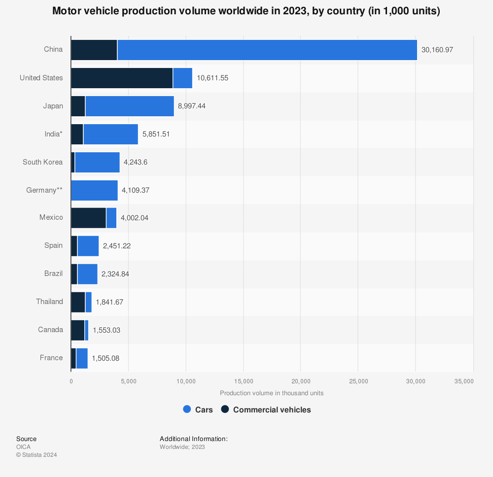

## Table of Contents

## What are the top countries known for automotive manufacturing?

The top countries known for automotive manufacturing are Japan, Germany, and the United States. Japan is famous for its reliable and innovative cars. Brands like Toyota, Honda, and Nissan are well-known around the world. Japan focuses a lot on making cars that last a long time and are good for the environment.

Germany is also a big name in car making. It is known for luxury and high-performance cars. Brands like Mercedes-Benz, BMW, and Audi come from Germany. German cars are often seen as symbols of quality and engineering excellence. Many people dream of owning a German car because of their reputation.

The United States has a long history of making cars too. Famous American car brands include Ford, General Motors, and Chrysler. The U.S. is known for making big, strong cars like trucks and SUVs. American car companies have been important in the global market for many years and continue to innovate.

## How is the automotive industry defined and measured in these countries?

The automotive industry in Japan, Germany, and the United States is defined by the companies that make cars, trucks, and parts for these vehicles. In Japan, the industry includes big companies like Toyota and Honda, which not only make cars but also parts and technology for cars. The industry is measured by how many cars they make each year, how much money they make from selling cars, and how many people work in the factories. Japan is known for making a lot of cars and being good at making them last a long time.

In Germany, the automotive industry includes famous brands like Mercedes-Benz and BMW. These companies are known for making high-quality and luxury cars. The industry is measured by the number of cars produced, the money earned from selling cars, and the number of jobs created in the car-making process. Germany is famous for its focus on engineering and making cars that perform well and look good.

In the United States, the automotive industry is made up of companies like Ford and General Motors. They make a lot of cars, especially big trucks and SUVs. The industry is measured by how many vehicles are made each year, the revenue from selling these vehicles, and the number of people employed in the industry. The U.S. has a long history of car making and is known for its big vehicles and the impact of its car companies on the global market.

## What historical factors contributed to the rise of automotive manufacturing in these countries?

Japan's automotive industry grew after World War II. The country needed to rebuild its economy, so it focused on making good products that people around the world would want to buy. Companies like Toyota and Honda started making cars that were reliable and affordable. They also learned to make cars quickly and efficiently using new methods like "just-in-time" manufacturing. Over time, Japanese cars became known for their quality and innovation, especially in fuel efficiency and hybrid technology. This helped Japan become a leader in the global car market.

Germany's rise in automotive manufacturing started in the late 19th century with inventors like Karl Benz and Gottlieb Daimler. They built the first cars, and soon companies like Mercedes-Benz and BMW were making luxury cars known for their quality and performance. Germany focused on engineering and making cars that were not just transportation but also a status symbol. After World War II, Germany continued to grow its car industry by investing in technology and innovation. Today, German cars are still seen as some of the best in the world because of their focus on quality and engineering.

In the United States, the automotive industry took off in the early 20th century with Henry Ford's assembly line. This new way of making cars made them cheaper and faster to produce. Ford, General Motors, and Chrysler became big names in the car world. The U.S. focused on making cars that were big and powerful, which matched the American love for space and performance. Over the years, the U.S. car industry faced challenges but continued to innovate, especially in making big trucks and SUVs. Today, the U.S. remains a major player in the global automotive market because of its history and ongoing efforts to improve car-making.

## What are the current production statistics for leading automotive countries?

Japan makes a lot of cars every year. In 2022, Japan produced about 7.8 million cars. This number shows how big and important the car industry is in Japan. Toyota and Honda are big names that help Japan stay a top car maker. Japan also focuses on making cars that are good for the environment, like hybrids and electric cars.

Germany is another big car maker. In 2022, Germany made around 3.5 million cars. Companies like Mercedes-Benz, BMW, and Volkswagen are famous all over the world. German cars are known for being high quality and luxurious. Germany keeps working on new technology to make their cars even better.

The United States also makes a lot of cars. In 2022, the U.S. produced about 10 million vehicles. Ford, General Motors, and Stellantis are some of the big companies in the U.S. American cars are often big, like trucks and SUVs. The U.S. car industry is important for the country's economy and keeps trying new things to stay competitive.

## Which car brands are most associated with each leading country?

In Japan, the car brands most associated with the country are Toyota, Honda, and Nissan. These companies are known around the world for making reliable cars that last a long time. Toyota is famous for its hybrid cars like the Prius, which are good for the environment. Honda is also known for its fuel-efficient cars and motorcycles. Nissan is recognized for its innovative designs and electric cars like the Nissan Leaf.

In Germany, the car brands most associated with the country are Mercedes-Benz, BMW, and Audi. These brands are known for making luxury cars that are high quality and perform well. Mercedes-Benz is famous for its elegant and comfortable cars. BMW is known for its sporty and powerful vehicles. Audi is recognized for its sleek designs and advanced technology. German cars are often seen as symbols of status and engineering excellence.

In the United States, the car brands most associated with the country are Ford, General Motors (GM), and Chrysler (now part of Stellantis). Ford is famous for its trucks and the iconic Mustang sports car. General Motors includes popular brands like Chevrolet and Cadillac, known for their big vehicles like the Suburban and Escalade. Chrysler, now under Stellantis, is recognized for its minivans and the Jeep brand, which is famous for its off-road vehicles. American cars are often big and powerful, reflecting the country's love for space and performance.

## How do government policies affect automotive manufacturing in these countries?

In Japan, the government helps the car industry by making rules that encourage making cars that are good for the environment. They give money to companies that make electric and hybrid cars, like Toyota and Honda. This helps Japan stay a leader in green technology. The government also works with car companies to make sure they follow strict safety rules. This makes sure Japanese cars are safe and reliable, which is why people around the world trust them.

In Germany, the government supports the car industry by investing in technology and research. They give money to companies like Mercedes-Benz and BMW to make new kinds of cars, like electric ones. This helps Germany keep making high-quality cars that people want to buy. The government also has strict rules about emissions, which means German cars have to be clean and good for the environment. This helps Germany stay a top car maker known for luxury and performance.

In the United States, the government affects the car industry by setting rules about safety and emissions. They make sure cars are safe for people to drive and don't harm the environment too much. The government also gives money to companies like Ford and General Motors to help them make new kinds of cars, like electric vehicles. This helps the U.S. car industry stay strong and competitive. The government's support is important for keeping the car industry a big part of the country's economy.

## What technological advancements are being made in the automotive sectors of these countries?

In Japan, car companies like Toyota and Honda are working on new technology to make cars better for the environment. They are making more hybrid and electric cars, like the Toyota Prius and the Nissan Leaf. These cars use less gas and help reduce pollution. Japan is also working on self-driving cars, which can drive themselves without a person. This technology can make driving safer and easier. Japanese car companies are always trying to find new ways to make cars that are good for the planet and easy to use.

In Germany, car makers like Mercedes-Benz and BMW are focusing on making luxury cars even better. They are working on electric cars that are fast and comfortable, like the Mercedes EQS and the BMW iX. These cars have new technology that makes them quiet and smooth to drive. Germany is also working on self-driving cars and making them safer with new sensors and computers. German car companies want to keep making cars that people see as high quality and special.

In the United States, car companies like Ford and General Motors are making big changes too. They are working on electric trucks and SUVs, like the Ford F-150 Lightning and the GMC Hummer EV. These vehicles are strong and can go far on one charge. The U.S. is also working on self-driving cars and making them smarter with new technology. American car companies want to keep making big, powerful cars that people love, but also make them cleaner and safer.

## How does the workforce skill level impact automotive manufacturing in these countries?

In Japan, the workforce is very skilled and this helps the car industry a lot. Japanese workers are known for being good at making things carefully and quickly. They use a special way of working called "kaizen," which means always trying to make things better. This helps companies like Toyota and Honda make cars that are reliable and last a long time. The skilled workers also help Japan make new technology, like hybrid and electric cars, which are good for the environment.

In Germany, the workforce is also very skilled, which is important for making high-quality cars. German workers go through a lot of training to learn how to make cars that are perfect. They focus on making luxury cars that people see as special. This skill helps companies like Mercedes-Benz and BMW make cars that are not just good but also look nice and work well. The skilled workers also help Germany make new kinds of cars, like electric ones, and keep the country a leader in car making.

In the United States, the workforce has a mix of skills that help the car industry. American workers are good at making big vehicles like trucks and SUVs, which are popular in the U.S. They also work on new technology, like electric cars, to keep up with changes in the car world. The skills of American workers help companies like Ford and General Motors make strong and powerful cars. This keeps the U.S. car industry important and competitive around the world.

## What are the major challenges faced by the automotive industry in these leading countries?

In Japan, the automotive industry faces challenges like competition from other countries and changing what people want in cars. More people want electric and hybrid cars, so companies like Toyota and Honda need to make more of these. This means spending a lot of money on new technology. Also, Japan has an aging population, which means fewer young people are working in factories. This can make it hard to keep making cars at the same speed. Japan needs to find ways to keep being a leader in making cars that are good for the environment.

In Germany, the car industry is dealing with strict rules about emissions and the need to make more electric cars. Companies like Mercedes-Benz and BMW have to change how they make cars to meet these rules. This can be expensive and take time. Germany also faces competition from other countries that are making cheaper cars. German car makers need to keep making high-quality cars that people want to buy, even as the world changes. They need to keep investing in new technology to stay ahead.

In the United States, the automotive industry is challenged by the need to make more electric vehicles and meet new emission standards. Companies like Ford and General Motors are working on electric trucks and SUVs, but it's a big change from making gas cars. This can be costly and take time. The U.S. also faces competition from other countries, and some people worry about jobs moving to places where it's cheaper to make cars. American car companies need to keep making big, strong vehicles that people love, while also making them cleaner and more efficient.

## How do these countries compare in terms of innovation and R&D in the automotive sector?

Japan is known for being very good at making new technology in the car world. They spend a lot of time and money on research and development (R&D) to make cars that are good for the environment. Companies like Toyota and Honda are leaders in making hybrid and electric cars, like the Toyota Prius and the Nissan Leaf. Japan also works on self-driving cars, which can drive themselves without a person. This technology can make driving safer and easier. Japanese car companies are always trying to find new ways to make cars that are good for the planet and easy to use.

Germany is also a leader in car technology, focusing on making luxury cars even better. They spend a lot on R&D to make new kinds of cars, like electric ones, that are fast and comfortable. Mercedes-Benz and BMW are working on cars like the Mercedes EQS and the BMW iX, which use new technology to make them quiet and smooth to drive. Germany is also working on self-driving cars and making them safer with new sensors and computers. German car companies want to keep making cars that people see as high quality and special, so they invest a lot in new technology.

In the United States, car companies like Ford and General Motors are also working on new technology. They are making electric trucks and SUVs, like the Ford F-150 Lightning and the GMC Hummer EV, which are strong and can go far on one charge. The U.S. is also working on self-driving cars and making them smarter with new technology. American car companies want to keep making big, powerful cars that people love, but also make them cleaner and safer. They spend a lot on R&D to stay competitive and meet new standards for emissions and safety.

## What are the future projections for the automotive industry in these countries?

In Japan, the future of the car industry looks like it will focus a lot on making cars that are good for the environment. More and more people want electric and hybrid cars, so companies like Toyota and Honda will keep working on these. They will spend a lot of money on new technology to make these cars better and cheaper. Japan will also keep trying to make self-driving cars, which can drive themselves without a person. This can make driving safer and easier. But Japan will need to find ways to deal with fewer young people working in factories because of the aging population.

In Germany, the car industry will keep making luxury cars but will also focus a lot on electric cars. Companies like Mercedes-Benz and BMW will spend a lot on research to make electric cars that are fast and comfortable. They will need to meet strict rules about emissions, so they will keep working on making their cars cleaner. Germany will also keep trying to make self-driving cars safer with new technology. But they will face competition from other countries that make cheaper cars, so they will need to keep making high-quality cars that people want to buy.

In the United States, the future of the car industry will see more electric trucks and SUVs. Companies like Ford and General Motors will work on making these vehicles better and more popular. They will spend a lot on new technology to meet new rules about emissions and safety. The U.S. will also keep working on self-driving cars to make them smarter. But they will need to deal with competition from other countries and worries about jobs moving to places where it's cheaper to make cars. American car companies will need to keep making big, strong vehicles that people love, while also making them cleaner and more efficient.

## How do global economic trends influence automotive manufacturing in these leading countries?

Global economic trends have a big impact on car making in Japan, Germany, and the United States. When the world economy is doing well, people have more money to buy cars, so car companies in these countries can sell more cars and make more money. But when the economy is not doing well, like during a recession, people might not want to buy new cars. This can make it hard for car companies to make money and they might have to make fewer cars. Also, if the price of things like steel and gas goes up, it can cost more to make cars, which can affect how much money car companies make.

Another way global economic trends affect car making is through trade and competition. If other countries start making cars that are cheaper or better, it can be hard for car companies in Japan, Germany, and the U.S. to sell their cars. They might need to lower their prices or make their cars even better to stay competitive. Also, if there are new rules about trade, like tariffs, it can make it more expensive to sell cars in other countries. This can make it harder for car companies to grow and make money. So, car companies in these countries need to keep an eye on what's happening in the world economy and be ready to change how they do things.

## References & Further Reading

[1]: Dyer, J., & Nobeoka, K. (2000). ["Creating and managing a high-performance knowledge-sharing network: The Toyota case."](https://www.jstor.org/stable/3094191) Strategic Management Journal.

[2]: Busch, T., Foxon, T. J., Taylor, P. G., & Taylor, S. R. (2018). ["The impact of industrial networks on national policymaking: A case study of the German automotive industry."](https://www.sciencedirect.com/science/article/pii/S2210422417302496) Environment and Planning C: Politics and Space.

[3]: Lee, K., & Tsuji, M. (2002). ["Automobile recycling in Japan—Setting an example for Asia's developing countries."](https://onlinelibrary.wiley.com/doi/10.1002/9780470650851.ch2) Habitat International.

[4]: Mazzella, F., & Sundararajan, A. (2016). ["China's Evolving Automotive Industry."](https://book-v2.usesession.com/About/virtual-library/fetch.php/Walking_The_Path_Of_Love_Joseph_J_Mazzella.pdf) Asia Pacific Business Review.

[5]: Schmid, S., & Groschopf, W. (2016). ["Innovation in the German automotive sector: Critical success factors for the early development phases of radical innovations."](https://pmc.ncbi.nlm.nih.gov/articles/PMC8423277/) Journal of Business Research.