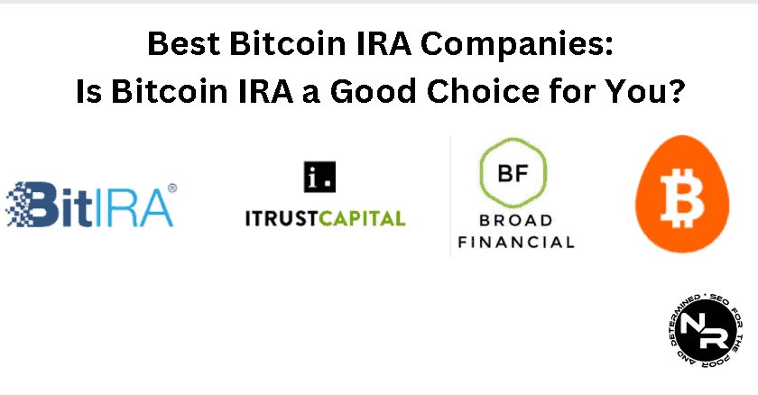

Cryptocurrency Individual Retirement Accounts (IRAs) represent a novel approach to retirement planning, offering a means to incorporate digital assets into long-term savings strategies. As the popularity of cryptocurrencies like Bitcoin continues to surge, an increasing number of investors are considering them viable components of retirement portfolios. This trend is underscored by the growing interest in Bitcoin and other digital currencies as a hedge against traditional economic fluctuations and inflation.

The appeal of cryptocurrency IRAs lies partly in the potential for algorithmic trading, which can significantly enhance portfolio returns. Algorithmic trading leverages computer algorithms to execute trades at high speeds and with greater precision, potentially optimizing the gains from volatile yet potentially lucrative cryptocurrency markets. This form of trading introduces a sophisticated layer of management to a crypto IRA, potentially increasing the value of the investments over time.



Selecting an appropriate IRA company for cryptocurrency investments is crucial, as it directly impacts the security, convenience, and profitability of the retirement account. Investigating reputable providers with established track records ensures that investors benefit from a secure trading environment, comprehensive support, and a broad selection of digital assets.

This article provides an in-depth analysis of the leading cryptocurrency IRA providers, examining their unique offerings and evaluating factors vital to making informed investment decisions. As cryptocurrencies continue to integrate into the financial systems, understanding the landscape of crypto IRAs becomes essential for those considering this innovative retirement planning strategy.

## Table of Contents

## What is a Cryptocurrency IRA?

A Cryptocurrency Individual Retirement Account (IRA) is a self-directed retirement account that allows investors to include cryptocurrencies like Bitcoin as part of their retirement portfolio. Unlike traditional IRAs, which typically consist of stocks, bonds, and mutual funds, a Cryptocurrency IRA provides diversification by enabling investments in digital currencies. This modern approach to retirement planning has gained popularity as digital assets continue to emerge as both innovative and lucrative investment options.

The primary advantage of incorporating cryptocurrencies like Bitcoin in a retirement portfolio is the potential for high returns. Historically, Bitcoin and other cryptocurrencies have experienced significant price appreciation, offering substantial growth opportunities. Furthermore, cryptocurrencies have low correlation with traditional asset classes, which can enhance diversification and potentially reduce overall portfolio risk. 

One of the appealing features of Cryptocurrency IRAs is the prospect of tax advantages. Similar to traditional IRAs, a Cryptocurrency IRA allows for tax-deferred growth, meaning the investments can grow without being subject to capital gains taxes until withdrawals begin. In the case of a Roth Cryptocurrency IRA, contributions are made with after-tax dollars, but qualified withdrawals in retirement are tax-free. These arrangements can be particularly beneficial for investments in high-growth assets like cryptocurrencies, allowing investors to capitalize on compound growth over time.

However, investing in a Cryptocurrency IRA is not without risks. The [volatility](/wiki/volatility-trading-strategies) inherent in the [cryptocurrency](/wiki/cryptocurrency) market can lead to significant price fluctuations, posing a risk to retirement savings. Moreover, regulatory uncertainties surrounding cryptocurrencies can affect their value and legality, adding another layer of risk. Additionally, the largely digital nature of cryptocurrencies presents security concerns, including potential hacking threats and fraud risks, necessitating robust security measures from IRA providers.

There are several types of Cryptocurrency IRAs available, mirroring the categories of traditional IRAs. A Traditional Cryptocurrency IRA allows for pre-tax contributions, aiding in reducing taxable income, with taxes being paid upon withdrawal. A Roth Cryptocurrency IRA, on the other hand, facilitates tax-free withdrawals in retirement after initial post-tax contributions. The Simplified Employee Pension (SEP) Cryptocurrency IRA is designed for self-employed individuals or small businesses, offering higher contribution limits than Traditional or Roth IRAs.

Cryptocurrency IRAs represent a progressive shift in retirement investing, offering both promise and peril. By understanding their unique features and associated risks, investors can better navigate the decision-making process in adding digital assets to their retirement savings strategy.

## Benefits of Investing in Cryptocurrency for Retirement

Investing in cryptocurrency for retirement offers several potential benefits, primarily due to the unique characteristics of digital currencies. One of the most significant advantages is the potential for high returns, largely driven by the substantial volatility associated with cryptocurrencies. Unlike traditional financial assets, cryptocurrencies like Bitcoin and Ethereum often experience sharp and rapid price fluctuations, presenting opportunities for significant appreciation. This volatility, however, also introduces a higher risk element, hence investors should assess their risk tolerance levels before committing funds to a cryptocurrency IRA.

Diversification plays a key role in retirement investment strategies, and incorporating cryptocurrencies can enhance diversification in a portfolio. Traditional assets such as stocks and bonds can be complemented by digital currencies, which often exhibit low correlation with traditional markets. This low correlation can help reduce the overall portfolio risk by spreading exposure across different asset classes, potentially stabilizing returns during market turbulences.

The increasing adoption of cryptocurrencies in financial markets is another reason to consider them for retirement investing. Major financial institutions are beginning to recognize and incorporate digital currencies into their services. This growing acceptance is evident in moves by entities such as PayPal and Tesla to accept Bitcoin payments, as well as various traditional investment firms offering cryptocurrency products to clients. This adoption signifies a shift towards broader acceptance, potentially enhancing [liquidity](/wiki/liquidity-risk-premium) and stability in the cryptocurrency market over time.

Long-term growth prospects of major cryptocurrencies are also promising. Bitcoin and Ethereum, being the largest in terms of market capitalization, have shown consistent growth patterns over the years. Bitcoin, often referred to as 'digital gold', is seen by many as a hedge against inflation and currency devaluation, providing a store of value with limited supply. Ethereum, with its smart contract capabilities, forms the backbone of decentralized finance (DeFi) and non-fungible tokens (NFTs), sectors poised for substantial long-term growth. These technologies provide compelling growth narratives that can contribute to a positive outlook for these digital assets.

Overall, while investing in cryptocurrencies for retirement can offer numerous benefits, it is essential to approach these investments with a clear understanding of both their potential and associated risks. Retirement investors should conduct thorough research and consider their own financial goals and risk appetite to optimize their portfolio strategies effectively.

## Understanding Algorithmic Trading in Bitcoin IRAs

Algorithmic trading refers to the use of computer algorithms to execute trading orders based on predefined criteria or strategies. In the context of cryptocurrency investments, including Bitcoin IRAs, [algorithmic trading](/wiki/algorithmic-trading) provides a method to exploit market inefficiencies and execute trades at optimal prices. Its relevance to cryptocurrency investments stems from the ability to automatically analyze large volumes of market data, identify trading opportunities, and execute orders at high speeds, which are essential in the volatile cryptocurrency market.

AI and algorithms can optimize trading strategies in a crypto IRA by automating decision-making processes. An algorithm can be trained to recognize patterns and trends in market data, enabling the development of sophisticated trading strategies. Machine learning models, in particular, can enhance these strategies by continuously learning from new data and adjusting to changing market conditions. For example, a simple moving average crossover strategy can be implemented to automatically buy or sell based on the crossing of short-term and long-term moving averages. In Python, this can be written as:

```python
import pandas as pd

def moving_average_strategy(prices, short_window=40, long_window=100):
    signals = pd.DataFrame(index=prices.index)
    signals['signal'] = 0.0

    signals['short_mavg'] = prices['Close'].rolling(window=short_window, min_periods=1, center=False).mean()
    signals['long_mavg'] = prices['Close'].rolling(window=long_window, min_periods=1, center=False).mean()

    signals['signal'][short_window:] = np.where(signals['short_mavg'][short_window:] > signals['long_mavg'][short_window:], 1.0, 0.0)
    signals['positions'] = signals['signal'].diff()

    return signals
```

The advantages of using algorithmic trading in a crypto IRA include improved timing and efficiency. Algorithms can process market data much faster than a human trader, enabling rapid response to market changes. This is crucial in the highly volatile crypto market where price fluctuations can occur within seconds. Efficiency is also enhanced as algorithms can execute trades 24/7, ensuring no trading opportunity is missed.

Several case studies and examples highlight the success of algorithmic strategies in the crypto market. For instance, some hedge funds and proprietary trading firms have leveraged algorithms to generate significant returns, even in bear markets. A notable example is the use of [arbitrage](/wiki/arbitrage) strategies, where algorithms exploit price differences of the same asset across different exchanges. These strategies can capitalize on inefficiencies unique to the cryptocurrency market, such as varying liquidity levels and exchange latency.

In conclusion, algorithmic trading offers significant advantages for Bitcoin IRAs by optimizing the execution of trades and leveraging the inherent volatility of the cryptocurrency market for potential gains. As AI technologies evolve, they will further enhance the effectiveness of these strategies, making them an invaluable tool for managing cryptocurrency investments within a retirement portfolio.

## Top 5 Best IRA Companies for Cryptocurrency Investments

### Top 5 Best IRA Companies for Cryptocurrency Investments

Cryptocurrency IRAs have emerged as a popular option for individuals looking to diversify their retirement portfolios with digital assets. Several IRA companies specialize in facilitating cryptocurrency investments, each offering unique features, competitive fees, and varying levels of customer support. Below is an overview of the top five IRA companies in this space:

1. **Bitcoin IRA**

   Bitcoin IRA is one of the pioneers in the cryptocurrency IRA industry, offering a platform for investing in a wide range of digital assets, including Bitcoin, Ethereum, and Ripple. This company has built a strong reputation with high customer ratings and positive reviews for its ease of use and robust security measures. Bitcoin IRA boasts a user-friendly platform that includes a mobile app for convenient access to account information and trading. They offer educational resources to help customers make informed investment decisions.

   - **Fees**: Bitcoin IRA charges a one-time service fee for setting up the account and an annual custodial fee.
   - **Trust Ratings**: Generally high due to their solid reputation and years of experience in the market.
   - **Unique Offerings**: The platform provides a proprietary algorithm for optimizing investments and a 24/7 real-time trading feature.

2. **iTrustCapital**

   iTrustCapital stands out for its low-cost structure, transparency, and a diverse selection of cryptocurrencies available for investment. The company allows users to trade within their IRA accounts without incurring high transaction fees. According to customer reviews, iTrustCapital's platform is intuitive and reliable, with strong emphasis on security.

   - **Fees**: They charge a flat monthly fee, with transaction fees that are lower than many competitors.
   - **Trust Ratings**: High, owing to excellent customer service and transparent pricing.
   - **Unique Offerings**: Offers a learning center with comprehensive educational materials, including videos and webinars.

3. **BitIRA**

   BitIRA prioritizes security and compliance, making it a trusted choice for cautious investors. The company provides end-to-end insurance for digital assets stored within the IRA, ensuring protection against theft, fraud, and hacking incidents. BitIRA's customer reviews highlight its thorough rolling over process from traditional IRAs, with personalized guidance available.

   - **Fees**: Charges include an initial setup fee and annual custodian fees.
   - **Trust Ratings**: Strong, with particular praise for their security protocols.
   - **Unique Offerings**: A fully insured cold storage solution for cryptocurrency assets.

4. **Coin IRA**

   Coin IRA offers tailored services to meet individual investment goals, providing access to a diverse range of cryptocurrencies. They emphasize customer education, guiding users through every step of the cryptocurrency investment process. Their platform is highly praised for both customer support and advisory services.

   - **Fees**: The fee structure is not published publicly, which can be a disadvantage for some users.
   - **Trust Ratings**: Positive, with specific commendations for customer service.
   - **Unique Offerings**: Personal consultation sessions and detailed investment guides tailored to client needs.

5. **Equity Trust**

   Equity Trust is a well-established self-directed IRA provider that has integrated cryptocurrency investment into its offerings. Known for its diverse set of investment options, it provides a flexible platform for managing various assets, including digital currencies. Customers appreciate the breadth of investment opportunities and the robust service.

   - **Fees**: Includes annual account maintenance fees and asset holding fees, among others.
   - **Trust Ratings**: Generally favorable, particularly due to their longevity in the self-directed IRA industry.
   - **Unique Offerings**: Access to a wide array of investment assets beyond cryptocurrencies, along with a comprehensive support portal.

In conclusion, choosing the right IRA company for cryptocurrency investments requires careful consideration of fees, security, available services, and customer support. Each of these top companies brings unique strengths to the table, allowing investors to tailor their choices based on individual needs and investment strategies.

## Factors to Consider When Choosing a Cryptocurrency IRA Company

When selecting a cryptocurrency IRA company, several critical factors must be taken into account to ensure both the security and growth potential of retirement investments. These factors play a crucial role in safeguarding assets and optimizing returns.

### Security and Insurance
Security is paramount in cryptocurrency investments due to the rising incidents of cyber theft and hacking. It is essential that a cryptocurrency IRA company implements robust security protocols, including cold storage solutions, multi-signature wallets, and two-[factor](/wiki/factor-investing) authentication. Insurance policies are equally vital as they provide protection against potential losses due to cyber breaches. Look for companies that offer comprehensive insurance coverage for digital assets, ensuring that investments are safeguarded against unforeseeable events.

### Fee Structure and Cost-Effectiveness
The fee structure of a cryptocurrency IRA provider has a direct impact on the profitability of investments. Companies typically charge setup fees, annual maintenance fees, and trading fees. It is important to compare these fees to assess cost-effectiveness, as high fees can erode potential returns over time. Some providers offer tiered fee structures or reduced rates for larger investments, allowing for more cost-efficient management of portfolios.

### Trading Platforms and Tools
A reliable trading platform is essential for efficient cryptocurrency trading and portfolio management. Consider IRA companies that offer advanced trading platforms with features such as real-time market data, analytics, and customizable dashboards. For investors interested in algorithmic trading, it is beneficial to choose providers that offer API access or integrate with third-party services that facilitate automated trading strategies. These tools enhance the ability to execute trades swiftly and capitalize on market opportunities.

### Range of Cryptocurrencies and Investment Options
The diversity of available investment options can significantly influence portfolio performance. It is advisable to select a cryptocurrency IRA provider that supports a broad range of cryptocurrencies, including major assets like Bitcoin and Ethereum, as well as promising altcoins. A wider selection allows for diversified asset allocation, reducing risk through exposure to various segments of the cryptocurrency market.

### Customer Service and Educational Resources
High-quality customer service is crucial for addressing investor inquiries and resolving issues promptly. Look for companies with strong reputations for customer support, including multiple contact channels and responsive service teams. Additionally, educational resources such as webinars, articles, and tutorials can be invaluable, particularly for individuals new to cryptocurrency investing. These resources help investors build their knowledge base, stay informed about market trends, and make well-informed decisions.

In summary, when choosing a cryptocurrency IRA company, prioritize security, cost-effectiveness, comprehensive trading tools, diverse investment options, and superior customer service. These considerations are essential for protecting assets and maximizing the growth potential of retirement portfolios.

## Potential Challenges and Risks of Crypto Retirement Accounts

Cryptocurrency retirement accounts, such as cryptocurrency IRAs, present a unique set of challenges and risks that investors must consider. The volatile nature and evolving regulatory landscape of cryptocurrencies play a significant role in shaping the investment environment of these assets.

Volatility is a defining characteristic of cryptocurrencies, with prices often experiencing dramatic swings within short periods. For instance, Bitcoin has seen its value fluctuate by thousands of dollars in a single day. This price volatility can lead to substantial gains, but also considerable losses, making it a double-edged sword for retirement accounts that typically prioritize stable, long-term growth.

Regulatory risks are another major concern for cryptocurrency investors. The legal status of cryptocurrencies varies widely across countries and even within regions of the same country. Regulatory bodies are continually adjusting their frameworks to accommodate the unique nature of digital currencies. Such changes can significantly impact the value and legality of cryptocurrency IRAs, potentially leading to substantial financial implications for investors.

Security concerns, including hacking and fraud, pose significant risks to cryptocurrency accounts. Unlike traditional financial systems, cryptocurrency transactions are irreversible, meaning that any unauthorized access can result in permanent loss. The decentralized nature of cryptocurrencies, while offering numerous benefits, makes them an attractive target for cybercriminals. Investing in a cryptocurrency IRA necessitates rigorous security protocols, including the use of cold wallets, two-factor authentication, and regular security audits.

Market unpredictability and technological changes further complicate the landscape. The cryptocurrency market is still in a nascent stage, characterized by rapid technological advancements and shifts in market dynamics. New algorithms, blockchain technologies, and financial instruments constantly emerge, which can quickly render existing strategies obsolete. Investors need to remain agile and informed to navigate these changes effectively.

To manage the inherent risks of cryptocurrency IRAs, investors can adopt multiple risk management strategies. Diversification remains a core principle; by spreading investments across various cryptocurrencies and asset classes, investors can mitigate the impact of price volatility on their portfolios. Additionally, employing stop-loss orders and setting clear investment thresholds can help in limiting potential losses. Engaging with cryptocurrency IRA companies that prioritize security and regulatory compliance is also crucial in safeguarding investments.

Staying informed about regulatory developments, technological innovations, and market trends is vital for minimizing risks associated with cryptocurrency retirement accounts. Regularly reviewing and adjusting investment strategies in response to these factors will empower investors to better navigate the complexities of the cryptocurrency market.

## Conclusion

Investing in cryptocurrency IRAs presents a compelling blend of potential benefits and inherent risks. Cryptocurrencies, due to their volatility, can offer substantial returns, making them an attractive addition to a retirement portfolio. However, this same volatility underscores the importance of a comprehensive risk management strategy. The security risks involved, such as hacking and fraud, necessitate that investors choose a reputable and reliable IRA provider. These providers not only establish the integrity and safety of investments but also support informed decision-making through robust customer service and educational resources.

Diversification is another critical element of successful retirement planning, especially when incorporating volatile assets like cryptocurrencies. By spreading investments across various asset classes, investors can mitigate the overall risk and increase the likelihood of stable returns. Due diligence in understanding one’s own investment strategy, the capabilities and reputation of the IRA provider, and the broader market dynamics is essential for navigating the evolving landscape of cryptocurrency investments.

Staying informed about market trends and technological advancements in algorithmic trading can further enhance the management of a crypto IRA portfolio. Algorithmic trading offers the possibility of optimized trading strategies and improved efficiency. Engaging with the tools and platforms offered by IRA companies can elevate the potential of cryptocurrency investments by ensuring precise and timely decision-making. Investors must remain vigilant and adaptive to market changes to leverage these technologies effectively.

In conclusion, while cryptocurrency IRAs offer high growth prospects, they also require a disciplined approach to managing their risks. Choosing the right IRA provider, embracing diversification, and keeping abreast of market and technological developments are vital steps to securing a financially sound retirement future.

## References & Further Reading

[1]: Bergstra, J., Bardenet, R., Bengio, Y., & Kégl, B. (2011). ["Algorithms for Hyper-Parameter Optimization."](https://dl.acm.org/doi/10.5555/2986459.2986743) Advances in Neural Information Processing Systems 24.

[2]: ["Advances in Financial Machine Learning"](https://www.amazon.com/Advances-Financial-Machine-Learning-Marcos/dp/1119482089) by Marcos Lopez de Prado

[3]: ["Evidence-Based Technical Analysis: Applying the Scientific Method and Statistical Inference to Trading Signals"](https://www.amazon.com/Evidence-Based-Technical-Analysis-Scientific-Statistical/dp/0470008741) by David Aronson

[4]: ["Machine Learning for Algorithmic Trading"](https://github.com/PacktPublishing/Machine-Learning-for-Algorithmic-Trading-Second-Edition) by Stefan Jansen

[5]: ["Quantitative Trading: How to Build Your Own Algorithmic Trading Business"](https://books.google.com/books/about/Quantitative_Trading.html?id=j70yEAAAQBAJ) by Ernest P. Chan