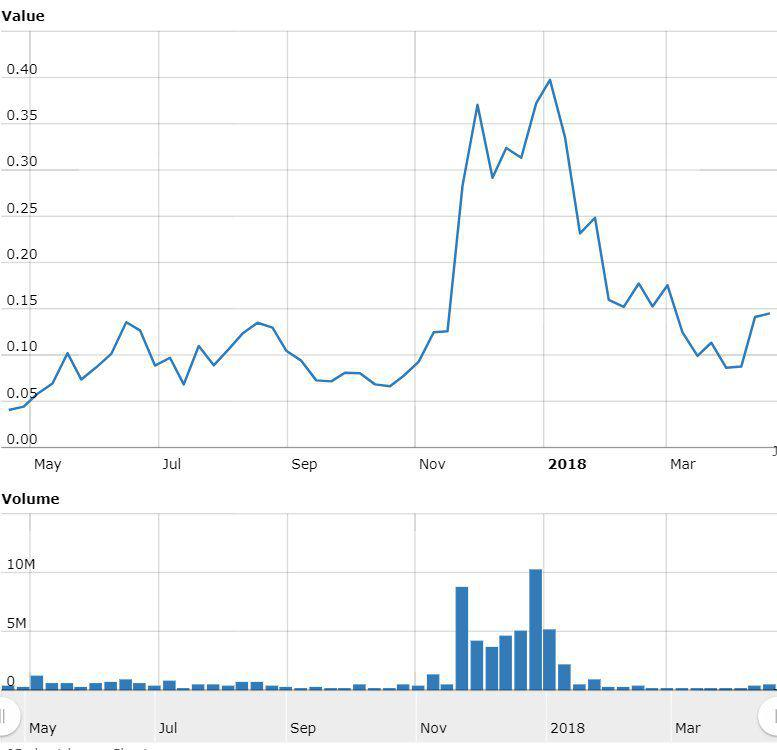

In the rapidly evolving digital age, the intersection of innovative industries often leads to groundbreaking developments. One such convergence is currently occurring at the crossroads of the cannabis industry, cryptocurrencies, and algorithmic trading. At first glance, these fields might appear disparate; however, they share common trajectories characterized by rapid growth, technological integration, and significant regulatory challenges.

The cannabis industry is experiencing substantial expansion due to increasing legalization across various nations, which is prompting economic growth and triggering technological advancements. Parallelly, cryptocurrencies are disrupting traditional financial systems by introducing digital economies that bypass conventional banking constraints. These digital currencies, exemplified by Bitcoin and Ethereum, offer solutions to the banking challenges faced by cannabis businesses due to federal regulations in many countries.



Algorithmic trading, known for its precision and speed, represents a transformative force capable of enhancing liquidity and reducing transaction costs in financial markets. In the context of both the cannabis and cryptocurrency sectors, algorithmic trading offers a new frontier for speculative and strategic investment, potentially capitalizing on market volatility and price fluctuations.

The convergence of these industries presents a wealth of opportunities, yet it also poses challenges, particularly related to legal compliance and technological integration. By examining how these industries are interconnecting, we gain insights into the opportunities they present and the potential impacts on investors and consumers. This convergence symbolizes a shift in how markets operate and interact on a global scale, heralding an era of innovative investment strategies for stakeholders willing to navigate its complexities.

## Table of Contents

## The Cannabis Industry: Growth and Technological Advancements

The legalization of cannabis across various regions has been a catalyst for economic growth, attracting substantial technological innovations aimed at enhancing operational efficiency and transparency. A significant technological advancement within the cannabis industry is the integration of blockchain technology. Blockchain's decentralized and immutable ledger provides robust supply chain transparency, addressing critical issues such as product tracing and authenticity verification. By recording every step of the cultivation, processing, and distribution process on a blockchain, stakeholders can ensure compliance with regulatory standards and build consumer trust. This move towards transparency is crucial in an industry where regulatory scrutiny is stringent, and provenance assurance is paramount.

In parallel, the emergence of cannabis-focused fintech solutions is revolutionizing traditional market operations. These solutions address the financial challenges unique to the cannabis sector, especially in jurisdictions where conventional banking services are limited due to federal constraints. Fintech innovations offer alternative financial services, such as secure payment processing, lending, and investment platforms tailored specifically for cannabis businesses. This financial inclusion is vital for driving industry growth and stability, enabling cannabis companies to conduct transactions more efficiently and securely.

Understanding these technological advancements lays the groundwork for analyzing the intersection of cannabis markets with cryptocurrencies and [algorithmic trading](/wiki/algorithmic-trading). As blockchain and fintech gain traction, they create pathways for cryptocurrencies as alternative transaction methods, introducing a digital economy layer resistant to traditional financial barriers. The ability to leverage blockchain for transparent supply chains and fintech for financial operations underlines the increasing interdependence of technology and cannabis.

The regulatory landscape surrounding cannabis is complex and multifaceted, presenting a dual nature of challenges and opportunities. Navigating this landscape requires innovations that not only comply with legal frameworks but also anticipate evolving regulations. Companies that successfully integrate technological solutions into their operations are better equipped to adapt to these regulatory changes, positioning themselves as leaders in the cannabis market's digital transformation.

As we observe industry leaders embracing technology, the future of cannabis seems poised to be heavily reliant on digital solutions. This digital shift is likely to optimize operations, enhance compliance, and unlock new market opportunities, signifying a paradigm shift in how cannabis businesses function and thrive in a competitive global market. As technology continues to influence the cannabis industry, it stands as a testament to how digital innovations can drive economic growth and reshape traditional sectors.

## Cryptocurrencies: A Catalyst for the New Economy

Cryptocurrencies have emerged as a pivotal influence in transforming global financial systems, heralding a new era of digital economies. As decentralized digital assets, cryptocurrencies facilitate numerous advantages, particularly within sectors like cannabis that face unique financial challenges. The confluence of cannabis and cryptocurrencies is primarily driven by the banking restrictions imposed on the cannabis industry due to federal regulations in several countries, notably the United States. Traditional financial institutions often hesitate to service cannabis-related businesses, creating a need for alternative financial solutions. Cryptocurrencies such as Bitcoin and Ethereum offer a compelling solution by providing secure, decentralized payment channels that bypass traditional banking systems.

Bitcoin, the pioneering [cryptocurrency](/wiki/cryptocurrency), functions as a global medium of exchange, enabling secure transactions without intermediaries. It leverages blockchain technology to maintain an immutable ledger, ensuring transparency and trustworthiness. Ethereum, another prominent cryptocurrency, extends the functionality of blockchain by enabling smart contracts. These self-executing contracts with the terms of the agreement directly written into code have significant applications, including automated compliance and secure transactions, which are particularly advantageous for cannabis businesses seeking streamlined operations in a convoluted regulatory environment.

The adoption of cryptocurrencies in the cannabis industry is gradually gaining traction. For instance, some cannabis businesses have started accepting Bitcoin payments to facilitate transactions that might otherwise be complicated by banking restrictions. This not only addresses the issue of financial inclusivity but also attracts a technologically savvy customer base that values privacy and innovation. Furthermore, cryptocurrencies enhance the accessibility of international markets for cannabis companies by simplifying cross-border transactions. Traditional cross-border payments often involve complex regulations, high fees, and extended processing times. In contrast, cryptocurrencies enable near-instantaneous transactions at a fraction of the cost, thus providing a new layer of financial freedom and potentially expanding the market reach for cannabis products.

Moreover, the inherent characteristics of cryptocurrencies, such as their decentralized nature and cryptographic security, mitigate some of the risks associated with fraud and data breaches. By ensuring that financial transactions are both transparent and secure, cryptocurrencies build trust among stakeholders in the cannabis industry. Nevertheless, businesses must remain vigilant against the [volatility](/wiki/volatility-trading-strategies) inherent in cryptocurrencies, which poses a risk to financial stability if not carefully managed.

In summary, cryptocurrencies offer transformative potential for the cannabis industry by addressing critical financial challenges and unlocking new opportunities for growth and efficiency. As the digital economy continues to evolve, the integration of cryptocurrencies into cannabis businesses may not only streamline operations but also pave the way for more innovative approaches to addressing industry-specific hurdles.

## Algorithmic Trading and Its Role in Cannabis and Cryptocurrency Markets

Algorithmic trading, characterized by its automation, speed, and precision, has become a crucial component in both the stock and cryptocurrency markets. Its transformative potential is increasingly evident in emerging sectors like cannabis and cryptocurrencies. In these markets, the application of algorithmic trading can significantly enhance [liquidity](/wiki/liquidity-risk-premium), lower transaction costs, and leverage price volatility to maximize returns.

In the cannabis market, algorithmic trading algorithms can be employed to improve market efficiency by ensuring that trades are executed at the best possible prices. This is particularly important in markets with lower liquidity, where price slippages can occur. By executing trades more quickly and efficiently than human traders, algorithms can facilitate a smoother trading experience. Additionally, these systems help in capitalizing on the volatile nature of developing markets, such as cannabis, where price movements can be erratic and substantial.

For the cryptocurrency market, algorithmic trading plays a pivotal role in ensuring market robustness. The decentralized nature of cryptocurrencies often results in high volatility and fragmented liquidity across exchanges. Algorithmic trading strategies such as [arbitrage](/wiki/arbitrage), market-making, and trend-following are employed to address these challenges. 

- **Arbitrage** involves exploiting the price discrepancies of cryptocurrencies across different exchanges. By buying low on one platform and selling high on another, traders can secure risk-free profits. 

- **Market-making** is another strategy where algorithms provide liquidity to the market by simultaneously offering to buy and sell cryptocurrency. This helps narrow the bid-ask spread, promoting market stability.

- **Trend-following** is a strategy that capitalizes on the momentum of price movements. Algorithms identify emerging trends and automatically execute trades in the direction of those trends, aiming to benefit from sustained market movements.

The integration of these strategies within algorithmic trading platforms enhances market efficiency and provides stability in otherwise volatile environments.

As governments worldwide begin to regulate these industries more stringently, the adaptability and precision of algorithmic trading become invaluable. Regulatory frameworks may impose constraints on trading practices, making it essential for trading algorithms to quickly adapt to changing laws and market conditions. This adaptability ensures compliance with new regulations while maintaining trading efficiency and profitability.

Python, a popular language due to its robust libraries and ease of use, is frequently employed to develop these trading algorithms. For example, the following Python snippet illustrates a simple arbitrage strategy in the cryptocurrency market:

```python
import ccxt

exchange_1 = ccxt.binance()
exchange_2 = ccxt.kraken()

symbol = 'BTC/USDT'

def get_price(exchange, symbol):
    ticker = exchange.fetch_ticker(symbol)
    return ticker['last']

while True:
    price_1 = get_price(exchange_1, symbol)
    price_2 = get_price(exchange_2, symbol)

    if price_1 < price_2:
        print(f"Arbitrage Opportunity: Buy on Binance at {price_1} and sell on Kraken at {price_2}")
    elif price_2 < price_1:
        print(f"Arbitrage Opportunity: Buy on Kraken at {price_2} and sell on Binance at {price_1}")
```

This script checks the price of Bitcoin on two exchanges and identifies opportunities to profit from price differences. In practice, more sophisticated algorithms would consider transaction fees and execution time to optimize profitability.

In summary, the role of algorithmic trading in the cannabis and cryptocurrency markets presents both opportunities and challenges. Its ability to adapt to evolving market dynamics and regulatory landscapes ensures that it remains a significant tool for investors and traders seeking to optimize their strategies in these rapidly evolving sectors.

## Challenges and Opportunities at the Convergence

Blending the cannabis industry with cryptocurrencies and algorithmic trading presents both significant challenges and considerable opportunities. These industries, while promising, must navigate complex regulatory frameworks that vary widely across jurisdictions. Legal compliance is a primary obstacle as cannabis laws differ internationally, impacting the ability of businesses to operate seamlessly across borders. This regulatory uncertainty extends to cryptocurrencies, where governments are still defining their stances on digital assets, contributing to market volatility and complexity.

Technological integration presents another challenge. Interfacing diverse tech solutions across these industries requires robust systems capable of handling complex transactions. Cybersecurity remains a critical concern, especially with the rise of blockchain and digital currencies. Sophisticated cyber threats target both crypto and cannabis enterprises, underscoring the necessity for advanced security measures to protect sensitive data and financial transactions.

Despite these hurdles, opportunities are plentiful. The convergence enables novel investment avenues, inviting investors to diversify their portfolios with cannabis-backed crypto assets and algorithm-driven trading strategies. Innovations in supply chain management, such as blockchain for transparency and tracking in cannabis logistics, promise enhanced efficiency and compliance monitoring. Additionally, cryptocurrencies facilitate expanded global trade capabilities by providing secure and decentralized payment solutions, circumventing traditional banking barriers.

Early adopters reveal valuable insights. Businesses that have effectively integrated these technologies demonstrate the importance of strategic partnerships and agile adaptation to regulatory landscapes. However, not all ventures succeed; some struggle with scalability and integration issues, highlighting the importance of thorough planning and risk management.

Looking forward, success in these converged industries will hinge on navigating regulatory landscapes while fostering technological innovation. The ability to adapt to changing regulations, coupled with continuous technological advancement, will be key determinants of future growth and success. Stakeholders must remain vigilant, informed, and prepared to capitalize on emerging trends to harness the full potential of this convergence.

## Conclusion

The intersection of cannabis, cryptocurrencies, and algorithmic trading is a fascinating crossroads of growth and innovation. This fusion represents a dynamic phase in the evolution of markets, creating a unique ecosystem for investment and technological advancement. As each sector continues to mature, they collectively offer investors unprecedented opportunities for diversification and growth. The adaptation of cryptocurrencies in cannabis transactions, coupled with the efficiency and precision of algorithmic trading, paves the way for new financial paradigms.

Navigating the challenges at this convergence will require strategic thinking, adaptability, and a thorough understanding of both technology and regulation. For investors and industry participants, staying informed about emerging trends becomes critical. Technology continues to reshape the operational landscape of these industries, and keeping abreast of regulatory changes will be essential for making informed decisions and ensuring compliance.

Ultimately, the fusion of these sectors could signify a monumental shift in the way markets operate and interact globally. As traditional financial models and supply chains undergo transformation, the potential for increased market efficiency, security, and global trade capabilities expands. Stakeholders who successfully harness the synergies of cannabis, cryptocurrency, and algorithmic trading stand to benefit from significant economic and organizational advantages, heralding a new era of market integration and interaction.

## References & Further Reading

[1]: Zohar, A., & Eisenberg, S. (2011). ["Algorithmic Trading."](https://onlinelibrary.wiley.com/doi/full/10.1111/j.1540-6261.2010.01624.x) International Monetary Fund.

[2]: Sabet, K. (2013). ["Reefer Sanity: Seven Great Myths About Marijuana"](https://learnaboutsam.org/wp-content/uploads/2013/05/SevenMyths-final-OH12.pdf). Beaufort Books.

[3]: Narayanan, A., Bonneau, J., Felten, E., Miller A., & Goldfeder, S. (2016). ["Bitcoin and Cryptocurrency Technologies."](https://press.princeton.edu/books/hardcover/9780691171692/bitcoin-and-cryptocurrency-technologies) Princeton University Press.

[4]: Shin, L. (2020). ["The Cryptocurrency Investor: How to Capitalize on the Bitcoin Boom"](https://www.youtube.com/watch?v=w-Ew7PW4LCo) Kogan Page.

[5]: Malhotra, P. (2021). ["The Business of Cannabis: New Policies for the New Marijuana Industry"](https://resources.caih.jhu.edu/papersCollection/browse/download/the_business_of_cannabis_new_policies_for_the_new_marijuana_industry.pdf). Taylor & Francis.