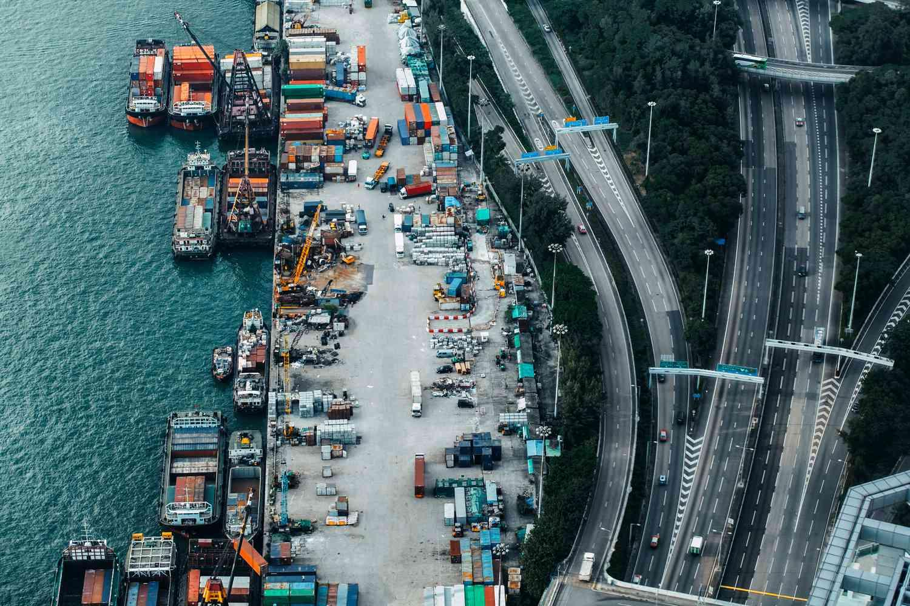

The energy sector in China plays a pivotal role in both domestic and international markets, distinguishing itself as a significant contributor to global energy dynamics. Central to this sector are the natural gas companies, which are increasingly utilizing advanced technologies to bolster their trading capabilities. These enterprises are at the forefront of integrating innovative solutions to maintain competitiveness in a rapidly evolving energy landscape.

In recent years, algorithmic trading has emerged as a transformative force within the energy commodities market, particularly impacting natural gas trading. This automated approach harnesses complex algorithms and high-speed data analytics to enhance market efficiency and trading dynamics. By employing sophisticated computational techniques, companies can execute trades with increased precision, speed, and volume, ultimately optimizing their market strategies.



This article focuses on the integration of algorithmic trading within Chinese natural gas companies, with special attention to industry leaders such as Sinopec Shanghai Petrochemical Co., Ltd. (SHI) and China National Petroleum Corporation's subsidiary, PetroChina (PTR). These prominent entities are leveraging technological innovations to refine their trading operations and influence market trends.

By examining the role of algorithmic trading, we uncover its potential impacts on the future of the industry. Understanding these advancements is key for stakeholders aiming to navigate and thrive within China's dynamic energy market. As technological and regulatory landscapes continue to shift, businesses that adapt and innovate will shape the future of natural gas trading in China.

## Table of Contents

## Overview of Chinese Natural Gas Companies

China's natural gas industry is highly influenced by three major companies: Sinopec, PetroChina, and the China National Offshore Oil Corporation (CNOOC). These entities are pivotal not only in domestic energy production but also in their international operations, making them formidable players in the global energy market.

Sinopec, officially known as China Petroleum & Chemical Corporation, is one of the largest integrated energy and chemical companies in the world. It engages in a wide array of operations including oil and gas exploration, refining, and marketing, as well as production and sales of petrochemical and chemical products. Sinopec's strategic focus lies on upgrading its refining and chemical business alongside expanding its natural gas and new energy production activities. Given its operations across numerous countries, Sinopec significantly contributes to China's natural gas imports, leveraging efficient logistics and strategic partnerships worldwide.

PetroChina, the publicly traded arm of the China National Petroleum Corporation (CNPC), is another dominant force with substantial influence in the natural gas markets. CNPC, and consequently PetroChina, has extensive upstream operations which involve exploration and production activities across China and numerous ventures in Central Asia and the Middle East. PetroChina’s robust infrastructure, including a vast network of pipelines, enables it to facilitate large-scale distributions of natural gas, both imported and domestically produced, across China. Through strategic international investments and partnerships, PetroChina continually augments its production capacity, contributing to China's energy security and its strategic economic interests abroad.

CNOOC, the primary offshore oil and gas producer in China, plays a crucial role in enhancing the nation’s natural gas supply. With its expertise in offshore drilling and production, CNOOC focuses on exploring and developing hydrocarbon resources in Chinese waters and investing in liquefied natural gas (LNG) terminals to increase import capacity. CNOOC’s market strategy emphasizes expanding its LNG trading capacity to secure diversified and stable natural gas sources, thereby mitigating domestic supply fluctuations and bolstering the country’s energy security.

Sinopec Shanghai Petrochemical Co., Ltd. (SHI) and PetroChina (PTR) are particularly noteworthy due to their operational scale and international reach. Both companies exploit extensive technology and capital investment to drive growth and efficiency. SHI focuses primarily on refining and petrochemical processing, aiming to foster innovation in the development of environmentally friendly products. Meanwhile, PTR, under PetroChina, aligns its strategies with global energy transformation trends, emphasizing sustainable practices and investments in alternative energies.

The growth trajectories of these companies illustrate comprehensive market strategies that include technological advancements, expansion of overseas operations, and adaptation to evolving market and regulatory environments. Through strategic mergers, acquisitions, and partnerships, Chinese natural gas companies have strengthened their influence across global markets, ensuring a continued leadership position in the energy sector.

## The Role of Algorithmic Trading in Energy Markets

Algorithmic trading, or algo trading, involves the use of computer programs to automate trading decisions, and it has revolutionized financial markets with unmatched efficiency and speed. This technological innovation enables sophisticated data analysis and rapid execution of trades, minimizing human intervention and thereby reducing the risk of human error. In the energy industry, [algorithmic trading](/wiki/algorithmic-trading) is gaining [momentum](/wiki/momentum), with a specific focus on markets such as natural gas.

Algo trading systems are intricately designed to process massive volumes of data, which include historical price data, market trends, economic indicators, and even social media sentiment, to facilitate informed trading decisions. These systems encompass various strategies, from simple moving averages to complex predictive models employing [machine learning](/wiki/machine-learning). For instance, an algorithm could be programmed to buy assets if a short-term moving average crosses above a long-term moving average, indicating a potential upward trend.

In natural gas markets, the importance of managing data and making swift decisions is amplified due to the volatile nature of energy prices. Algorithms excel in risk management by employing statistical models to predict prices and assess market conditions. They use techniques such as regression analysis to forecast price movements and value-at-risk (VaR) models to understand potential loss exposures.

One key advantage of algorithmic trading in this sector is [liquidity](/wiki/liquidity-risk-premium) provision. Liquidity refers to the ease with which an asset can be bought or sold in the market without affecting its price. Algo trading enhances liquidity by ensuring that there are always parties willing to buy and sell, thus stabilizing the market. This is achieved through techniques such as [market making](/wiki/market-making), where algorithms simultaneously place buy and sell orders for the same asset, [earning](/wiki/earning-announcement) the spread between the two.

A practical implementation of algorithmic trading can be carried out using Python, a popular programming language in the finance industry due to its extensive libraries like Pandas for data manipulation, NumPy for numerical operations, and Scikit-learn for machine learning. Below is a simple example of a Python algorithm that implements a moving average crossover strategy:

```python
import pandas as pd

# Load historical price data
data = pd.read_csv('natural_gas_prices.csv')

# Calculate short-term and long-term moving averages
data['Short_MA'] = data['Price'].rolling(window=40).mean()
data['Long_MA'] = data['Price'].rolling(window=100).mean()

# Generate trading signals
data['Signal'] = 0
data['Signal'][40:] = np.where(data['Short_MA'][40:] > data['Long_MA'][40:], 1, 0)

# Calculate daily returns
data['Return'] = data['Signal'].shift(1) * (data['Price'].pct_change())

# Print the cumulative returns of the strategy
print(data['Return'].cumsum())
```

This script reads historical price data, computes moving averages, generates trading signals, and calculates returns, providing a basic framework for developing more sophisticated strategies. In conclusion, algorithmic trading systems are pivotal in optimizing trades by swiftly analyzing market data and executing transactions at opportune moments, fundamentally transforming the natural gas market and the broader energy sector.

## How Chinese Natural Gas Companies Embrace Algorithmic Trading

Chinese natural gas companies like Sinopec Shanghai Petrochemical Co., Ltd. (SHI) and PetroChina (PTR) are increasingly incorporating algorithmic trading to gain competitive advantages in the global market. This technological adoption enhances their trading efficiency, aids in market trend forecasting, and maximizes profitability. 

Algorithmic trading involves the use of complex algorithms to analyze numerous market variables in real-time and make informed trading decisions. The primary goal for these companies is to optimize their trades by evaluating market conditions swiftly and executing buying or selling actions at the most opportune times. This capability is particularly valuable in the highly volatile natural gas market, where prices can fluctuate significantly due to geopolitical events, weather conditions, and supply-demand dynamics.

SHI and PTR leverage advanced data analytics to refine their trading strategies. They utilize big data algorithms that incorporate machine learning and [artificial intelligence](/wiki/ai-artificial-intelligence) to process vast amounts of historical and real-time data. For instance, machine learning models can predict price movements by learning patterns from past market behavior. Such models are continuously refined and improved upon based on new data inputs, enabling a more dynamic and responsive trading strategy.

These companies are also increasingly engaged in partnerships with technology developers to bolster their algorithmic trading capabilities. Collaborations with tech firms help Chinese natural gas enterprises access cutting-edge trading software and analytics tools tailored to the energy market's unique demands. These partnerships facilitate the deployment of state-of-the-art electronic trading platforms equipped with sophisticated risk management modules that help manage market exposure effectively.

Specific examples of successful implementations include the integration of automated trading systems into their trading desks, allowing for faster transaction execution and better control over trading processes. Moreover, algorithmic trading systems are instrumental in liquidity provision, ensuring that SHI and PTR can efficiently manage large trading volumes without significant market disruption.

Overall, the strategic embrace of algorithmic trading by Chinese natural gas companies like SHI and PTR has been crucial in enhancing their market competitiveness. It ensures their ability to navigate complex market environments, optimize trading operations, and sustain profitability in a challenging economic landscape.

## Benefits and Challenges of Algo Trading in Natural Gas

Algorithmic trading in the natural gas sector provides several key benefits. Firstly, it leads to increased trading volumes by enabling traders to execute high-frequency transactions much faster than traditional methods. The automation of trading processes significantly reduces transaction costs, as it minimizes the need for human intervention and negates the impact of emotional decision-making. The precision of algorithmic systems also helps in reducing human errors, ensuring that trades are executed based on data-driven insights rather than intuition or incomplete information.

Despite its advantages, algorithmic trading also presents several challenges. One major concern is market [volatility](/wiki/volatility-trading-strategies). Algorithms can react to market events rapidly, which, while beneficial, can also lead to excessive trading and potentially accentuate volatility during periods of market stress. The rapid execution of trades might exacerbate price swings rather than stabilizing markets.

Systemic risk is another significant challenge. As more trading entities rely on similar algorithms, there is a risk that they will collectively respond to market events in the same way, leading to coordinated movements that can destabilize financial systems. This homogeneity of algorithmic responses can increase the risk of market crashes, where a large number of trades occur within a short time span.

Moreover, algorithmic trading requires constant technological upgrades to stay competitive. The sophistication of trading algorithms demands up-to-date hardware and software to process extensive datasets efficiently and execute trades at optimal speeds. This requirement presents a significant financial and logistical challenge to companies maintaining algorithmic trading systems.

Chinese natural gas companies encounter unique challenges due to regulatory environments and technological infrastructure. The regulatory landscape in China continuously evolves, necessitating that these companies adapt their algorithmic strategies to comply with new rules and standards. Regulatory bodies might impose restrictions on trading strategies to control market volatility and systemic risk.

Furthermore, the technological infrastructure required for efficient algorithmic trading can be inconsistent, particularly in regions where technological connectivity is less developed. This inconsistency can hinder the performance of algorithmic trading systems and place additional burdens on companies to invest in infrastructure improvements.

In summary, while algorithmic trading offers considerable benefits to the natural gas market, including increased efficiency and reduced costs, it also comes with challenges that must be managed. Addressing these will require careful consideration of systemic risks, ongoing technological improvement, and an adaptive approach to regulatory changes, particularly in the context of the Chinese market.

## Future Prospects for Algorithmic Trading in the Chinese Energy Sector

The future of algorithmic trading in China's natural gas sector appears promising as technological advancements continue to intertwine with global markets. The rise of machine learning and artificial intelligence is expected to further enhance trading strategies by providing sophisticated tools for trend analysis and risk management. With algorithms becoming integral to decision-making processes, companies are likely to increase their investment in technology to remain competitive and agile amidst fluctuating market dynamics.

Chinese natural gas companies are anticipated to allocate significant resources towards research and development to refine their algorithmic trading systems. This includes investing in high-performance computing infrastructure and hiring skilled data scientists to develop and maintain advanced algorithms. Moreover, adopting blockchain technology could optimize transaction transparency and security, providing an added layer of reliability in trade executions.

Economic policy shifts and market changes also play crucial roles in shaping the future landscape of algorithmic trading. As China continues to reform its energy policies to promote cleaner energy sources, natural gas companies must innovate to align their trading strategies with these regulatory changes. Anticipated policies aimed at liberalizing natural gas prices and improving market access will further encourage the adoption of cutting-edge trading technologies.

The evolving geopolitical climate and international trade relations will also impact China's natural gas sector. Companies need to anticipate and strategically respond to policy changes that affect global energy trade flows. This requires robust scenario analysis and stress-testing mechanisms within their algorithmic frameworks to forecast and mitigate potential risks.

In conclusion, while the future of algorithmic trading in China's natural gas sector is filled with opportunities, it also demands continuous adaptation and innovation to keep pace with technological progress and policy developments. Chinese companies embracing these challenges are likely to position themselves as leaders in the global energy market, leveraging technology to optimize their trading operations and maintain a competitive edge.

## Conclusion

Algorithmic trading is poised to become a critical component of the Chinese natural gas market's evolution. Companies such as Sinopec Shanghai Petrochemical Co., Ltd. (SHI) and PetroChina (PTR) are leveraging cutting-edge technologies to maintain their standing at the global energy sector’s forefront. By integrating algorithmic systems, these enterprises enhance trading efficiency and market responsiveness, positioning themselves advantageously amid intense competitive pressures.

The full potential of algorithmic trading in this context depends on understanding and overcoming its inherent challenges. Risks such as market volatility and the demands for constant technological updates must be carefully managed. Moreover, the regulatory environment in China and the necessary technological infrastructure introduce additional layers of complexity. Companies must stay proactive in developing robust risk management strategies and investing in adaptive technology to mitigate these challenges effectively.

As stakeholders increasingly adapt to these technological innovations, the intersection of algorithmic trading with the energy sector has the potential to transform market dynamics. This transformation could lead to more efficient market operations, potentially benefiting consumers and stakeholders alike. The continued advancements in algorithmic technology promise a future where both systemic efficiency and strategic market positioning are optimized. As the industry evolves, the robust utilization of algorithmic trading will likely serve as a key differentiator in the global energy landscape.

## References & Further Reading

[1]: Bergstra, J., Bardenet, R., Bengio, Y., & Kégl, B. (2011). ["Algorithms for Hyper-Parameter Optimization."](https://dl.acm.org/doi/10.5555/2986459.2986743) Advances in Neural Information Processing Systems 24.

[2]: ["Advances in Financial Machine Learning"](https://www.amazon.com/Advances-Financial-Machine-Learning-Marcos/dp/1119482089) by Marcos Lopez de Prado

[3]: ["Evidence-Based Technical Analysis: Applying the Scientific Method and Statistical Inference to Trading Signals"](https://www.amazon.com/Evidence-Based-Technical-Analysis-Scientific-Statistical/dp/0470008741) by David Aronson

[4]: ["Machine Learning for Algorithmic Trading"](https://github.com/stefan-jansen/machine-learning-for-trading) by Stefan Jansen

[5]: ["Quantitative Trading: How to Build Your Own Algorithmic Trading Business"](https://www.amazon.com/Quantitative-Trading-Build-Algorithmic-Business/dp/1119800064) by Ernest P. Chan