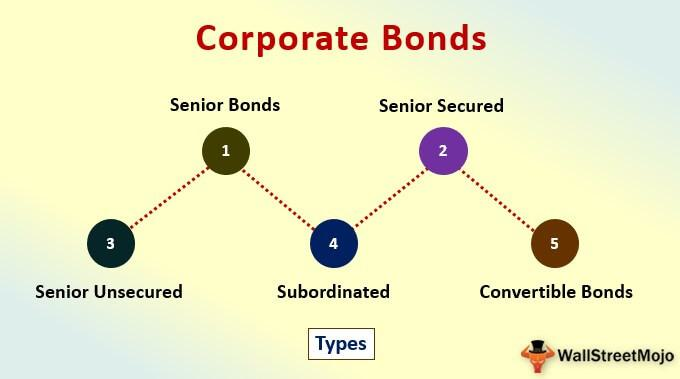

In today’s fast-paced financial landscape, investing has become more complex yet exciting, thanks to a plethora of options available including mutual funds, corporate bond funds, and algorithmic trading. These diverse opportunities provide investors with a vast array of choices for constructing their portfolios, each offering unique benefits and challenges. Navigating the intricate world of investments demands that investors make informed decisions on asset allocation to maximize potential returns while effectively managing risks.

This multifaceted investment environment offers mutual funds as a cornerstone option, providing diversification and professional management. Corporate bond funds further diversify offerings with the inclusion of fixed-income securities from various corporations, appealing to those seeking consistent income streams. Meanwhile, the advent of algorithmic trading brings a technological edge, enabling high-speed, precise trade executions and data-driven strategies. Each component plays a vital role in building portfolios that are not only diversified but also resilient against market volatility.



Our discussion focuses on the synergy between mutual funds, corporate bond funds, and algorithmic trading. Understanding how these elements interact contributes to a comprehensive strategy that leverages diversification and technological advancements. We evaluate the benefits of forging an integrated approach, recognizing the hurdles that come with technological dependencies and regulatory compliance. Additionally, we explore strategic integrations and innovation in the investment landscape, providing investors with cutting-edge tools to stay ahead of market dynamics.

With the relentless pace of financial technological advancements, investors must seize opportunities to enhance returns while maintaining a balanced risk posture. Embracing these changes through education and adaptability is crucial as market conditions and technologies continue to evolve. By effectively blending mutual funds, corporate bond funds, and algorithmic trading, investors can unlock the full potential of modern investment strategies, positioning themselves for success in a continually shifting economic environment.

## Table of Contents

## Understanding Investment Mutual Funds

Mutual funds represent pooled investment vehicles encompassing diverse asset classes such as stocks, bonds, and other securities, professionally managed by asset managers. This collective investment mechanism enables individual investors to partake in a diversified portfolio without directly purchasing each security. The fundamental advantage of mutual funds lies in their ability to mitigate risk through diversification, reducing the impact of poor performance by any single investment within the portfolio.

Several types of mutual funds exist, each targeting distinct investment goals and risk appetites. Stock funds primarily invest in equities and are suitable for investors seeking growth potential, albeit with higher risk. They can be further categorized into growth, value, or index funds, based on investment strategy. Bond funds, on the other hand, focus on fixed-income securities, offering lower risk and generally more stable returns. Balanced funds incorporate both stocks and bonds, striving to provide a middle ground with moderate risk and return characteristics.

Investors considering mutual funds must account for associated costs. Management fees and expense ratios are inherent to mutual funds, covering operational expenses, manager salaries, and other administrative costs. These fees, typically expressed as a percentage of the fund's average assets, directly affect net returns. Therefore, a careful evaluation of expense ratios is crucial for optimizing investment outcomes.

Lastly, understanding that mutual funds are actively managed by professionals who make strategic investment decisions can be beneficial. This management alleviates the need for individual investors to monitor market trends daily, while still providing opportunities to adjust holdings and optimize portfolio performance aligned with overall investment objectives.

## The Role of Corporate Bond Funds

Corporate bond funds are investment vehicles that pool funds from multiple investors to purchase a diversified portfolio of bonds issued by various corporations. This diversification offers investors exposure to a wide range of fixed-income securities without having to purchase each bond individually. Corporate bonds are debt securities wherein the issuer is a corporation, and these bonds often fall into two main categories based on their credit ratings: investment-grade and high-yield (or non-investment grade) bonds.

Investment-grade bonds are those rated 'BBB-' or higher by Standard & Poor's or 'Baa3' or higher by Moody's. These bonds typically have a lower risk of default, offering more stability and conservative growth potential. On the other hand, high-yield bonds, also known as "junk bonds," are rated 'BB+' or lower and come with higher risk but potentially greater returns due to their lower credit quality. The choice between investment-grade and high-yield bonds depends on the risk tolerance and income needs of the investor.

One of the main appeals of corporate bond funds is their potential for higher yields compared to government bonds. This is because corporations generally have to offer higher interest rates, also known as yields, to compensate for the higher risk of default compared to most sovereign issuers. The yield equation for a bond is given by:

$$
\text{Yield} = \frac{\text{Annual Coupon Payment}}{\text{Current Market Price}}
$$

Higher yields can be attractive to investors seeking increased income, particularly in low-interest-rate environments. However, it is crucial to understand that higher yields usually go hand-in-hand with higher risk.

Liquidity and risk profiles are essential considerations for investors in corporate bond funds. Liquidity refers to the ease with which an asset can be bought or sold in the market without affecting its price. Corporate bonds, especially those that are non-investment grade, can be less liquid than government bonds, meaning investors might face difficulties in selling them quickly without impacting prices unfavorably. A Python snippet to illustrate the calculation of a simple bond's price based on its yield might look like this:

```python
def calculate_bond_price(face_value, coupon_rate, yield_rate, periods):
    coupon_payment = face_value * coupon_rate
    price = (coupon_payment * (1 - (1 + yield_rate) ** -periods) / yield_rate) + (face_value / (1 + yield_rate) ** periods)
    return price

face_value = 1000  # example face value of the bond
coupon_rate = 0.05  # 5% annual coupon rate
yield_rate = 0.06  # 6% annual yield required by investors
periods = 10  # number of periods (years)

bond_price = calculate_bond_price(face_value, coupon_rate, yield_rate, periods)
print(f"Bond Price: ${bond_price:.2f}")
```

The risk profile of a corporate bond fund is determined by the types of bonds it holds and their respective credit quality. High-yield funds will inherently possess a higher risk profile but may offer greater returns, whereas investment-grade funds will appeal to risk-averse investors willing to accept lower yields for greater stability.

In summary, corporate bond funds offer a means to invest in a diversified portfolio of corporate bonds with varying credit quality. They generally provide higher income potential compared to government bonds, though they [carry](/wiki/carry-trading) additional risks such as [liquidity](/wiki/liquidity-risk-premium) and default risk that should be carefully considered by investors looking to tailor their portfolios to specific financial objectives.

## Algorithmic Trading in Modern Finance

Algorithmic trading, often referred to as 'algo trading', represents a significant advancement in the financial industry, utilizing computer algorithms to execute trades at unprecedented speeds and efficiencies. This innovative approach relies on the capability of algorithms to process complex calculations and make data-driven decisions within fractions of a second, thereby providing substantial improvements in trading efficiency and reducing the likelihood of human error. By automating the trading process, [algorithmic trading](/wiki/algorithmic-trading) enhances market liquidity and facilitates the seamless execution of trades across various financial instruments.

A variety of strategies are employed in algorithmic trading to capitalize on market opportunities. One common strategy is trend-following, where algorithms identify and exploit market trends, buying when prices are rising and selling when they begin to fall. Another popular approach is [arbitrage](/wiki/arbitrage), which seeks to profit from price discrepancies of the same asset in different markets or forms. Portfolio rebalancing is also frequently used, allowing for the automated adjustment of asset allocations to maintain a desired risk level or investment strategy.

To function effectively, algorithmic trading systems necessitate robust technical infrastructure and access to real-time data. The infrastructure must support the rapid execution of trades and accommodate large volumes of data, which are analyzed to identify optimal trading opportunities. High-frequency trading, a subset of algorithmic trading characterized by extremely short holding periods and high transaction volumes, typically requires specialized hardware and software solutions to achieve the desired performance levels.

While algorithmic trading offers undeniable benefits, such as increased speed and precision, it also presents challenges. The dependence on technology necessitates rigorous testing and validation of algorithmic strategies to ensure their reliability and effectiveness in varying market conditions. Furthermore, maintaining continuous access to high-quality, real-time data is critical, as any disruptions or inaccuracies can significantly impact the performance of trading strategies.

Overall, algorithmic trading has become an integral part of modern finance, enabling traders to execute sophisticated strategies with greater agility and accuracy. As technology continues to evolve, the importance of algorithmic trading is likely to grow, with ongoing innovations further enhancing its capabilities and applications in the financial markets.

## Integrating Mutual Funds and Algo Trading

The integration of algorithmic trading into mutual fund management optimizes trade execution and reduces transaction costs by employing sophisticated computer algorithms. These algorithms facilitate rapid and accurate transactions, which is essential in today's fast-paced financial markets. By automating processes, algorithmic trading eliminates human errors, resulting in more precise and efficient trade execution.

Algorithms play a crucial role in maintaining optimal asset allocation within mutual funds. They can analyze vast datasets to predict market trends and discern patterns, enabling fund managers to make informed investment decisions. Consequently, these algorithms enhance diversification by recommending a mixture of assets tailored to varying risk profiles and investment timelines.

Moreover, algorithmic trading identifies market opportunities that might be inaccessible through traditional trading methods. It scans real-time market data, highlighting arbitrage opportunities and price discrepancies across different exchanges. This capability allows fund managers to capitalize on market inefficiencies swiftly, thereby increasing potential returns.

Technological advancements contribute significantly to adapting investment strategies in response to changing market conditions. For instance, [machine learning](/wiki/machine-learning) and [artificial intelligence](/wiki/ai-artificial-intelligence) can be incorporated to develop predictive models that evolve as new data becomes available. The use of these technologies ensures that mutual fund managers can promptly adjust their strategies, responding agilely to [volatility](/wiki/volatility-trading-strategies) and other market dynamics.

The synergy between algorithmic trading and mutual fund management offers a balanced approach by combining human insight with computational precision. While algorithms provide data-driven recommendations, the human aspect remains vital in decision-making, especially when interpreting qualitative factors such as economic indicators or geopolitical events. This combination leverages the strengths of both human intuition and technological prowess, creating an optimal investment strategy that maximizes efficiency while managing risk effectively.

## Challenges and Considerations

Algorithmic trading, although revolutionary in its capability to execute trades with high efficiency and precision, introduces specific challenges that investors and financial institutions must carefully manage. One primary concern is operational risk, which encompasses the potential for system failures, coding errors, or malfunctions in the execution process. These risks can lead to significant financial losses, highlighting the necessity for rigorous testing and debugging of algorithms in controlled environments prior to deployment.

Moreover, algorithmic trading operates within a framework that necessitates strict adherence to regulatory compliance. Regulatory bodies such as the Securities and Exchange Commission (SEC) in the United States impose guidelines to ensure market integrity and transparency. Algorithmic strategies must be developed with these regulations in mind, requiring continual updates and adjustments as regulatory landscapes evolve.

Another critical aspect of algorithmic trading involves the need for continual [backtesting](/wiki/backtesting). Backtesting is a process wherein trading strategies are evaluated using historical data to ascertain their potential effectiveness. This step is crucial to identify the strengths and weaknesses of a strategy before it is applied in real-time trading conditions. The importance of rigorous backtesting cannot be overstated, as it helps in eliminating biases and ensures that algorithms have proven their efficacy in various market scenarios before live implementation.

Furthermore, investors must be vigilant about their dependency on technology infrastructure and the risks associated with it. The performance and reliability of algorithmic trading systems are intrinsically linked to their technological ecosystem, including hardware, software, and data feeds. For example, disruptions in data feeds, whether due to technical failures or cyber-attacks, can lead to incorrect trading decisions and financial loss. Thus, implementing robust cybersecurity measures and having contingency plans are essential components of a successful algorithmic trading strategy.

Developing a comprehensive understanding of the capabilities and limitations of algorithmic tools is vital. While algorithms can process large datasets and execute complex strategies rapidly, they are not infallible and require human oversight. Recognizing the limitations of algorithms, such as their inability to adapt seamlessly to unforeseen market changes or black swan events, ensures that human judgment remains an integral part of the decision-making process.

In summary, while algorithmic trading brings unprecedented efficiency to financial markets, it demands a meticulous approach to risk management, regulatory compliance, and technological resilience. Understanding the myriad challenges and proactively addressing them will enable investors to harness the full potential of algorithmic trading while safeguarding their portfolios against unforeseen adversities.

## Conclusion

The intertwining of mutual funds, corporate bond funds, and algorithmic trading represents a significant evolution in investment strategy, offering a dynamic and resilient approach to portfolio management. This integration leverages technological advancements that empower investors to optimize returns while maintaining a balanced risk profile. The use of sophisticated algorithms allows for real-time market analysis, precise trade execution, and efficient portfolio rebalancing. 

Technological progress in trading platforms and data analytics enhances the ability to identify market opportunities, allowing for more informed investment decisions. As such, investors who embrace these tools can potentially achieve superior performance compared to traditional methods.

However, as financial markets and the technologies that serve them continue to advance, continuous education and adaptability become critical. Investors must stay informed about new developments in algorithmic trading and changes in regulatory environments to ensure compliance and operational integrity. Staying updated also includes being aware of new data sources and computational tools that can further refine trading strategies.

In summary, by embracing the integration of mutual funds, corporate bond funds, and algorithmic trading, investors can unlock the full potential of modern investment strategies. This holistic approach not only provides opportunities for enhanced returns but also equips investors with the tools necessary to navigate the complexities of today's financial landscape effectively.

## References & Further Reading

[1]: ["Introduction to the Economics and Mathematics of Financial Markets"](https://archive.org/download/IntroductionToFinancialMarkets/Introduction%20to%20financial%20markets.pdf) by Jaksa Cvitanic and Fernando Zapatero

[2]: ["The Handbook of Fixed Income Securities"](https://www.amazon.com/Handbook-Fixed-Income-Securities-Ninth/dp/1260473899) by Frank J. Fabozzi

[3]: Bodie, Z., Kane, A., & Marcus, A. J. (2014). ["Investments"](https://books.google.com/books/about/EBOOK_Investments_Global_edition.html?id=BMsvEAAAQBAJ)

[4]: ["Algorithmic Trading: Winning Strategies and Their Rationale"](https://www.amazon.com/Algorithmic-Trading-Winning-Strategies-Rationale-ebook/dp/B00CY5HC0U) by Ernest P. Chan

[5]: ["Fixed Income Securities: Tools for Today's Markets"](https://www.amazon.com/Fixed-Income-Securities-Markets-Finance/dp/1119835550) by Bruce Tuckman and Angel Serrat