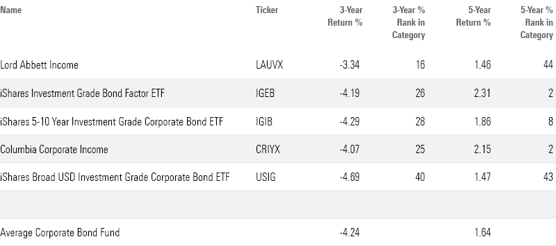

## Table of Contents

## What are corporate bond funds?

Corporate bond funds are investment funds that pool money from many investors to buy corporate bonds. These bonds are debt securities issued by companies to raise money for various purposes, like expanding their business or paying off other debts. When you invest in a corporate bond fund, you're essentially lending money to these companies through the fund, and in return, you receive interest payments.

These funds can be a good way to diversify your investment portfolio because they offer exposure to a variety of companies and industries. They can also provide a steady stream of income through the interest payments from the bonds. However, like any investment, they come with risks. The value of the bonds can go up and down, and there's a chance that the companies might not be able to pay back the money they borrowed. So, it's important to understand these risks before investing in corporate bond funds.

## Why should someone invest in corporate bond funds?

Someone might want to invest in corporate bond funds because they can offer a steady income. These funds collect money from many people and use it to buy bonds from different companies. These companies then pay interest on those bonds, and that interest gets shared with everyone who invested in the fund. This can be a good way to get regular payments, which can be helpful if you're looking for a way to make money without having to sell your investments.

Another reason to invest in corporate bond funds is to spread out your risk. When you put your money into these funds, you're not just betting on one company; you're investing in a whole bunch of them. This means if one company has trouble paying back its bond, it won't hurt your whole investment. Plus, these funds can help you own a piece of many different kinds of businesses, which can make your overall investment safer. Just remember, while they can be safer than putting all your money in one place, there's still a chance you could lose money if the companies can't pay back their bonds.

## What are the different types of corporate bond funds?

Corporate bond funds come in different types, each with its own way of investing. One type is called investment-grade bond funds. These funds buy bonds from companies that are seen as pretty safe and likely to pay back their loans. They usually give you a smaller but more reliable income. Another type is high-yield bond funds, also known as junk bond funds. These funds buy bonds from companies that might be riskier, so they have to offer higher interest rates to get people to lend them money. This means you could get more money back, but there's also a bigger chance the companies might not be able to pay you back.

There are also short-term, intermediate-term, and long-term corporate bond funds. Short-term bond funds invest in bonds that will be paid back quickly, usually in one to three years. These are less risky because you don't have to wait long to get your money back. Intermediate-term bond funds hold bonds that will be paid back in three to ten years, and long-term bond funds hold bonds that take more than ten years to be paid back. The longer you have to wait, the more risk there is that something could go wrong, but you might also get a higher interest rate for waiting longer.

Lastly, there are diversified and sector-specific corporate bond funds. Diversified funds spread their money across many different kinds of companies and industries, which can help lower your risk. Sector-specific funds focus on one type of industry, like technology or energy. These can be riskier because if something bad happens to that industry, it could affect all the bonds in the fund. But if you believe in the future of a certain industry, you might want to invest in a sector-specific fund to possibly get higher returns.

## How do corporate bond funds generate returns for investors?

Corporate bond funds generate returns for investors mainly through the interest payments they receive from the bonds they hold. When a company issues a bond, it agrees to pay back the money it borrowed plus interest over time. The fund collects these interest payments and then shares them with its investors. This is why corporate bond funds can be a good choice if you're looking for a steady income, because you get a part of the interest payments regularly.

The value of the bonds in the fund can also go up or down, which can affect the returns. If the market thinks a company is doing well, the price of its bonds might go up, and the fund's value could increase too. On the other hand, if people think a company is in trouble, the price of its bonds might drop, which could lower the fund's value. So, besides the interest payments, investors can also make money if they sell their shares in the fund for more than they paid, but they could lose money if they have to sell for less.

## What are the risks associated with investing in corporate bond funds?

Investing in corporate bond funds comes with some risks that you should know about. One big risk is that the companies might not be able to pay back the money they borrowed. If a company gets into financial trouble, it might miss interest payments or not pay back the bond at all. This is called default risk, and it's more likely with high-yield or junk bonds, where the companies are already seen as riskier.

Another risk is that the value of the bonds in the fund can go up and down. If interest rates go up, the price of existing bonds usually goes down because new bonds will be issued with higher interest rates, making the old ones less attractive. This is called interest rate risk. Also, if the market thinks a company is doing worse than expected, the price of its bonds might drop, which can lower the value of the fund. This is known as market risk.

Lastly, there's something called liquidity risk. Sometimes, it might be hard to sell your shares in the fund quickly or at a good price, especially if a lot of people want to sell at the same time. This can be a problem if you need your money back in a hurry. So, while corporate bond funds can be a good way to earn income and spread out your investments, it's important to understand these risks before you decide to invest.

## How can one evaluate the performance of a corporate bond fund?

To evaluate the performance of a corporate bond fund, you should look at a few key things. One important thing is the fund's total return, which is how much money the fund has made or lost over a certain time. This includes both the interest payments from the bonds and any changes in the value of the bonds. You can compare the total return of the fund to other similar funds or to a benchmark, like a bond index, to see if it's doing well. Another thing to check is the fund's yield, which tells you how much income you're getting from the interest payments. A higher yield might look good, but remember that it could also mean the fund is taking more risk.

Another way to evaluate a corporate bond fund is by looking at its risk and how it manages that risk. You can do this by checking the fund's credit quality, which shows how likely the companies are to pay back their bonds. Funds with higher credit quality are usually safer but might offer lower returns. Also, look at the fund's duration, which tells you how sensitive the fund is to changes in interest rates. A longer duration means the fund's value could go up or down more if interest rates change. Finally, consider the fund's expense ratio, which is how much it costs to run the fund. A lower expense ratio means more of the fund's returns go to you instead of being used to pay for the fund's costs.

## What are some leading corporate bond funds available in the market?

Some well-known corporate bond funds that people often look at are the Vanguard Total Bond Market Index Fund (VBTLX) and the iShares Core U.S. Aggregate Bond ETF (AGG). The Vanguard fund is popular because it tries to match the performance of a wide range of bonds, including corporate bonds, by following a bond index. It's good for people who want a safe and easy way to invest in bonds without spending too much on fees. The iShares ETF is also popular and works in a similar way, but it's an exchange-traded fund, which means you can buy and sell it like a stock during the day.

Another good option is the PIMCO Investment Grade Corporate Bond Fund (PIGIX), which focuses on bonds from companies that are seen as pretty safe. PIMCO is known for its bond expertise, and this fund tries to give you a steady income with a bit less risk than funds that invest in riskier bonds. If you're okay with taking on more risk for the chance of higher returns, you might want to check out the Fidelity High Income Fund (SPHIX). This fund invests in high-yield or junk bonds, which can offer bigger interest payments but also come with a higher chance that the companies might not pay back their loans.

These funds are just a few examples, and there are many others out there. It's important to look at things like the fund's fees, how well it's been doing, and how much risk it takes before you decide to invest. Talking to a financial advisor can also help you pick the right fund for your goals and how much risk you're comfortable with.

## What factors should be considered when choosing a corporate bond fund?

When choosing a corporate bond fund, one of the main things to think about is how much risk you're okay with. Some funds invest in safe, investment-grade bonds from big, stable companies. These funds might not give you the highest returns, but they're less likely to lose money. Other funds might go for high-yield or junk bonds, which can offer bigger interest payments but come with a higher chance that the companies might not pay back their loans. You should also look at the fund's duration, which tells you how sensitive it is to changes in interest rates. A longer duration means the fund's value could go up or down more if interest rates change.

Another important factor is the fund's fees. Every fund charges an expense ratio, which is how much it costs to run the fund. A lower expense ratio means more of the fund's returns go to you instead of being used to pay for the fund's costs. You should also check the fund's total return, which shows how much money the fund has made or lost over time. This includes both the interest payments from the bonds and any changes in the value of the bonds. Comparing the total return to other similar funds or to a bond index can help you see if the fund is doing well. Talking to a financial advisor can also help you pick the right fund for your goals and how much risk you're comfortable with.

## How do interest rate changes affect corporate bond funds?

When interest rates change, it can have a big effect on corporate bond funds. If interest rates go up, the price of the bonds in the fund usually goes down. This happens because new bonds will be issued with higher interest rates, making the old bonds less attractive to investors. So, if you want to sell your shares in the fund, you might get less money than you expected. This is called interest rate risk, and it's something to think about when you're choosing a corporate bond fund. Funds with longer durations are more sensitive to these changes, so their values can go up or down more.

On the other hand, if interest rates go down, the price of the bonds in the fund usually goes up. This is because the old bonds with higher interest rates become more valuable compared to new bonds with lower rates. So, if you sell your shares in the fund at this time, you might get more money than you expected. But remember, while changes in interest rates can affect the value of your investment, the interest payments from the bonds can still give you a steady income. It's important to understand how interest rate changes might affect your corporate bond fund and to think about this when you're planning your investments.

## What is the role of credit ratings in corporate bond funds?

Credit ratings are like report cards for companies that issue bonds. They tell you how likely a company is to pay back the money it borrowed. When you invest in a corporate bond fund, the fund managers look at these ratings to decide which bonds to buy. If a bond has a high credit rating, it means the company is seen as pretty safe and likely to pay back its loans. These bonds are called investment-grade bonds, and funds that buy them are usually safer but might not offer the highest returns. On the other hand, bonds with low credit ratings are riskier because the companies might have a harder time paying back their loans. These are called high-yield or junk bonds, and funds that invest in them can offer bigger interest payments but come with more risk.

The credit ratings of the bonds in a fund can affect how well the fund does. If a lot of the bonds in the fund have high credit ratings, the fund might be more stable and less likely to lose money. But if the ratings of the bonds go down, it could mean the companies are having trouble, and the value of the fund could drop. This is why it's important for fund managers to keep an eye on the credit ratings and make changes to the fund if needed. As an investor, you should also pay attention to the credit quality of the bonds in the fund to understand how much risk you're taking on.

## How do leading corporate bond funds manage their portfolios?

Leading corporate bond funds manage their portfolios by carefully choosing which bonds to buy and sell. They look at things like the credit ratings of the companies issuing the bonds, how much interest the bonds pay, and how long it will take for the bonds to be paid back. Fund managers try to balance the risk and the reward by picking a mix of safe, investment-grade bonds and riskier, high-yield bonds. They also keep an eye on the economy and interest rates, which can affect the value of the bonds. If they think interest rates might go up, they might buy bonds with shorter durations to reduce the risk of losing money.

These funds also use a strategy called diversification to spread out their risk. Instead of putting all their money into bonds from just a few companies, they invest in bonds from many different companies and industries. This way, if one company has trouble paying back its bond, it won't hurt the whole fund. Fund managers also regularly check the credit ratings of the bonds they hold and might sell some bonds and buy others if they think the ratings are going to change. By doing all these things, leading corporate bond funds try to give their investors a good return while keeping the risk as low as possible.

## What advanced strategies do expert investors use when investing in corporate bond funds?

Expert investors often use a strategy called laddering when investing in corporate bond funds. Laddering means they buy bonds that will be paid back at different times. Some bonds might be paid back in a year, others in three years, and some in ten years. This helps spread out the risk because if interest rates go up or down, not all their money is affected at the same time. It also means they get regular interest payments and can reinvest the money from bonds that are paid back into new bonds, possibly at better rates.

Another strategy is to actively manage their investments. Instead of just buying a fund and holding onto it, expert investors might move their money around based on what's happening in the economy and the bond market. They might sell bonds from a fund that they think is going to do worse and buy bonds from a fund that they think is going to do better. This can be more work, but it can also help them make more money if they're good at predicting what's going to happen. They also pay close attention to the credit ratings of the bonds in the funds they invest in, and might switch to funds with safer or riskier bonds depending on their goals and how much risk they're okay with.

## What is the Role of Corporate Bond Funds?

Corporate bond funds are investment vehicles that pool funds from multiple investors to purchase a diversified portfolio of bonds issued by various corporations. This diversification offers investors exposure to a wide range of fixed-income securities without having to purchase each bond individually. Corporate bonds are debt securities wherein the issuer is a corporation, and these bonds often fall into two main categories based on their credit ratings: investment-grade and high-yield (or non-investment grade) bonds.

Investment-grade bonds are those rated 'BBB-' or higher by Standard & Poor's or 'Baa3' or higher by Moody's. These bonds typically have a lower risk of default, offering more stability and conservative growth potential. On the other hand, high-yield bonds, also known as "junk bonds," are rated 'BB+' or lower and come with higher risk but potentially greater returns due to their lower credit quality. The choice between investment-grade and high-yield bonds depends on the risk tolerance and income needs of the investor.

One of the main appeals of corporate bond funds is their potential for higher yields compared to government bonds. This is because corporations generally have to offer higher interest rates, also known as yields, to compensate for the higher risk of default compared to most sovereign issuers. The yield equation for a bond is given by:

$$
\text{Yield} = \frac{\text{Annual Coupon Payment}}{\text{Current Market Price}}
$$

Higher yields can be attractive to investors seeking increased income, particularly in low-interest-rate environments. However, it is crucial to understand that higher yields usually go hand-in-hand with higher risk.

Liquidity and risk profiles are essential considerations for investors in corporate bond funds. Liquidity refers to the ease with which an asset can be bought or sold in the market without affecting its price. Corporate bonds, especially those that are non-investment grade, can be less liquid than government bonds, meaning investors might face difficulties in selling them quickly without impacting prices unfavorably. A Python snippet to illustrate the calculation of a simple bond's price based on its yield might look like this:

```python
def calculate_bond_price(face_value, coupon_rate, yield_rate, periods):
    coupon_payment = face_value * coupon_rate
    price = (coupon_payment * (1 - (1 + yield_rate) ** -periods) / yield_rate) + (face_value / (1 + yield_rate) ** periods)
    return price

face_value = 1000  # example face value of the bond
coupon_rate = 0.05  # 5% annual coupon rate
yield_rate = 0.06  # 6% annual yield required by investors
periods = 10  # number of periods (years)

bond_price = calculate_bond_price(face_value, coupon_rate, yield_rate, periods)
print(f"Bond Price: ${bond_price:.2f}")
```

The risk profile of a corporate bond fund is determined by the types of bonds it holds and their respective credit quality. High-yield funds will inherently possess a higher risk profile but may offer greater returns, whereas investment-grade funds will appeal to risk-averse investors willing to accept lower yields for greater stability.

In summary, corporate bond funds offer a means to invest in a diversified portfolio of corporate bonds with varying credit quality. They generally provide higher income potential compared to government bonds, though they [carry](/wiki/carry-trading) additional risks such as [liquidity](/wiki/liquidity-risk-premium) and default risk that should be carefully considered by investors looking to tailor their portfolios to specific financial objectives.

## References & Further Reading

[1]: ["Introduction to the Economics and Mathematics of Financial Markets"](https://archive.org/download/IntroductionToFinancialMarkets/Introduction%20to%20financial%20markets.pdf) by Jaksa Cvitanic and Fernando Zapatero

[2]: ["The Handbook of Fixed Income Securities"](https://www.amazon.com/Handbook-Fixed-Income-Securities-Ninth/dp/1260473899) by Frank J. Fabozzi

[3]: Bodie, Z., Kane, A., & Marcus, A. J. (2014). ["Investments"](https://books.google.com/books/about/EBOOK_Investments_Global_edition.html?id=BMsvEAAAQBAJ)

[4]: ["Algorithmic Trading: Winning Strategies and Their Rationale"](https://www.amazon.com/Algorithmic-Trading-Winning-Strategies-Rationale-ebook/dp/B00CY5HC0U) by Ernest P. Chan

[5]: ["Fixed Income Securities: Tools for Today's Markets"](https://www.amazon.com/Fixed-Income-Securities-Markets-Finance/dp/1119835550) by Bruce Tuckman and Angel Serrat