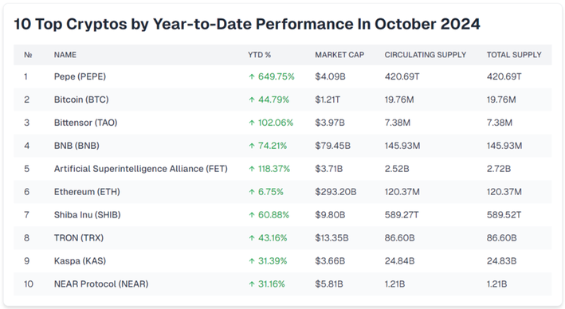

## Table of Contents

## What is a cryptocurrency exchange?

A cryptocurrency exchange is a platform where people can buy, sell, or trade different cryptocurrencies, like Bitcoin or Ethereum. It's kind of like a marketplace where you can exchange one type of digital money for another, or for regular money like dollars or euros. You need to create an account on the exchange and usually have to go through a verification process to start trading.

These exchanges can be different in how they work. Some are centralized, meaning they are run by a company that manages the platform. Others are decentralized, where the trading happens directly between users without a central authority. Each type has its own advantages and risks. It's important to choose a reputable exchange to keep your money safe and to make sure your trades go smoothly.

## How do I choose the right cryptocurrency exchange for beginners?

Choosing the right cryptocurrency exchange as a beginner can feel a bit overwhelming, but it's easier if you focus on a few key things. First, look for an exchange that is easy to use. A good beginner-friendly exchange will have a simple layout and clear instructions on how to buy, sell, and trade cryptocurrencies. It should also have good customer support, so you can get help if you run into any problems. Another important thing to consider is security. Make sure the exchange has strong security measures in place to protect your money and personal information. Look for exchanges that use two-factor authentication and have a good track record of keeping user funds safe.

Also, think about the fees the exchange charges. Some exchanges have high fees that can eat into your profits, especially if you're just starting out. Look for an exchange with low trading fees and no hidden costs. It's also a good idea to check if the exchange supports the cryptocurrencies you're interested in. Not all exchanges offer the same coins, so make sure the one you choose has the ones you want to trade. Finally, reading reviews from other users can give you a good idea of how reliable and user-friendly an exchange is. By considering these factors, you can find an exchange that's right for you as a beginner.

## What are the top cryptocurrency exchanges for October 2024?

In October 2024, some of the top [cryptocurrency](/wiki/cryptocurrency) exchanges are Coinbase, Binance, and Kraken. Coinbase is really popular with beginners because it's easy to use and has a lot of educational resources. It also has strong security measures like two-[factor](/wiki/factor-investing) authentication and insurance for your digital money. Binance is known for having a lot of different cryptocurrencies you can trade and it has low fees, which is great if you're trading a lot. Kraken is another good choice because it's been around for a long time and has a good reputation for security and customer service.

These exchanges are good for different reasons. Coinbase is great if you're new to crypto because it's simple and safe. Binance is better if you want to trade a lot of different coins and don't mind a bit more complexity. Kraken is a solid choice if you care a lot about security and want good support when you have questions. All three have their own apps, so you can trade on your phone, which is handy. Just remember to do your own research and pick the one that fits what you need.

## What features should I look for in a cryptocurrency exchange?

When looking for a cryptocurrency exchange, you should focus on how easy it is to use. A good exchange for beginners will have a simple design and clear instructions on how to buy, sell, and trade cryptocurrencies. It's also important that the exchange has good customer support, so you can get help if you have any problems. Another key feature to look for is security. Make sure the exchange uses strong security measures like two-factor authentication to keep your money and personal information safe. It's also a good idea to choose an exchange with a good reputation for keeping user funds secure.

You should also think about the fees the exchange charges. Some exchanges have high fees that can reduce your profits, especially if you're just starting out. Look for an exchange with low trading fees and no hidden costs. It's also important to check if the exchange supports the cryptocurrencies you're interested in trading. Not all exchanges offer the same coins, so make sure the one you choose has the ones you want. Finally, reading reviews from other users can give you a good idea of how reliable and user-friendly an exchange is. By considering these features, you can find an exchange that's right for you.

## How do cryptocurrency exchanges ensure the security of my assets?

Cryptocurrency exchanges use several ways to keep your money and information safe. One common way is two-factor authentication, which adds an extra step when you log in. You need to enter a code sent to your phone or generated by an app, making it harder for someone else to get into your account. Exchanges also use encryption to protect your data when it's being sent over the internet. They keep most of the money in "cold storage," which means it's not connected to the internet and is harder for hackers to reach. They also have insurance to cover losses if something goes wrong.

Another important thing exchanges do is regular security checks and audits. This means they have experts look at their systems to find and fix any weak spots before hackers can use them. Some exchanges also use something called multi-signature wallets, which need more than one person to approve a transaction, adding another layer of security. By using all these methods together, exchanges work hard to make sure your assets are as safe as possible.

## What are the fees associated with using cryptocurrency exchanges?

When you use a cryptocurrency exchange, you have to pay fees for different things. One common fee is the trading fee, which you pay every time you buy or sell a cryptocurrency. This fee can be a percentage of the amount you're trading, and it can be different depending on if you're a "maker" or a "taker." Makers add orders to the exchange's [order book](/wiki/order-book-trading-strategies), while takers take existing orders. Makers usually pay lower fees than takers. Some exchanges also charge a fee for withdrawing your money or cryptocurrencies from the exchange. These withdrawal fees can vary depending on the type of cryptocurrency you're withdrawing.

Another fee you might see is the deposit fee, though many exchanges don't charge for deposits. If they do, it's usually a small amount or a percentage of what you're depositing. There can also be fees for using certain features on the exchange, like using a special trading tool or getting customer support. It's important to look at all the fees an exchange charges before you start using it, so you know exactly how much it will cost you. Some exchanges have a fee schedule on their website that shows all the different fees, which can help you understand the costs better.

## How does liquidity affect my trading on cryptocurrency exchanges?

Liquidity is really important when you're trading on a cryptocurrency exchange. It means how easily you can buy or sell a cryptocurrency without changing its price too much. If an exchange has high [liquidity](/wiki/liquidity-risk-premium), it means there are a lot of people buying and selling, so you can quickly trade your cryptocurrencies at the price you want. This is good because it means you can get in and out of trades without waiting too long, and you don't have to worry about the price moving a lot while you're trying to trade.

On the other hand, if an exchange has low liquidity, it can be harder to trade. There might not be enough people buying or selling, so you might have to wait longer to make a trade, or you might have to accept a worse price than you wanted. This can be frustrating and might cost you more money. So, when you're choosing an exchange, it's a good idea to look at how much liquidity it has for the cryptocurrencies you want to trade.

## What are decentralized exchanges and how do they compare to centralized ones?

Decentralized exchanges, or DEXs, are different from centralized exchanges because they don't have a company running them. Instead, they let people trade directly with each other using smart contracts on a blockchain. This means you keep control of your money the whole time, and you don't have to give it to the exchange. DEXs are popular because they give you more privacy and security, since there's no central point that hackers can attack. But, they can be harder to use and might not have as many cryptocurrencies to trade.

Centralized exchanges, on the other hand, are run by a company that manages the platform. They're easier to use because they have a simple interface and often more customer support. You have to give your money to the exchange when you trade, which can be a bit risky if the exchange gets hacked. But, centralized exchanges usually have more liquidity, meaning it's easier to buy and sell quickly. They also offer more types of cryptocurrencies and sometimes other services like staking or lending. So, the choice between decentralized and centralized exchanges depends on what you value more: control and security, or ease of use and variety.

## What are some advanced trading features offered by leading exchanges?

Leading cryptocurrency exchanges offer advanced trading features that can help experienced traders make better decisions and manage their trades more effectively. One common feature is margin trading, which lets you borrow money from the exchange to trade more than you have. This can increase your profits, but it's also riskier because you could lose more than you started with. Another feature is futures trading, where you can bet on the future price of a cryptocurrency. This can be useful for hedging against price changes or for making money if you think the price will go up or down. Exchanges also offer stop-loss and take-profit orders, which automatically sell your cryptocurrencies when they reach a certain price, helping you lock in profits or limit losses.

Another advanced feature is advanced order types, like limit orders, which let you set the exact price you want to buy or sell at, and market orders, which let you buy or sell at the current market price. Some exchanges also have tools like trading bots, which can automatically trade for you based on certain rules you set. These bots can help you take advantage of market opportunities even when you're not watching the market. Additionally, leading exchanges often provide detailed charting and analysis tools, which can help you understand market trends and make more informed trading decisions.

## How can I use cryptocurrency applications to manage my portfolio?

Cryptocurrency applications can help you manage your portfolio by letting you keep track of all your cryptocurrencies in one place. These apps show you how much each coin is worth and how your total portfolio is doing. You can see the prices go up and down in real time, which helps you make decisions about when to buy or sell. Some apps also let you set up alerts, so you get a notification if a coin's price reaches a certain level. This way, you don't have to watch the market all the time.

Many of these apps also let you trade directly from your phone or computer. You can buy, sell, or trade different cryptocurrencies without having to go to a website. Some apps even have features like automatic trading, where the app can buy or sell for you based on rules you set. This can be really helpful if you want to take advantage of market changes but don't have time to watch the market all day. Overall, using a cryptocurrency app can make managing your portfolio easier and more convenient.

## What are the regulatory considerations for using cryptocurrency exchanges in different countries?

When you use cryptocurrency exchanges, the rules can be different depending on where you live. Some countries have strict laws about cryptocurrencies, and you need to follow them. For example, in the United States, exchanges have to follow rules set by the Securities and Exchange Commission (SEC) and the Financial Crimes Enforcement Network (FinCEN). They need to check who their users are and report any suspicious activity. In Europe, different countries have their own rules, but the European Union is working on making the rules more similar across all countries. It's important to know the rules in your country so you don't break any laws.

In other places, like Japan and South Korea, the government has clear rules for exchanges. They need to be registered and follow strict security rules to protect users' money. In some countries, like China, using cryptocurrencies can be very hard because the government has banned them or made them illegal. If you're thinking about using a cryptocurrency exchange, you should check the rules in your country first. This way, you can make sure you're doing everything right and stay safe while trading.

## How do I stay updated with the latest trends and technologies in cryptocurrency exchanges?

To stay updated with the latest trends and technologies in cryptocurrency exchanges, you should follow news websites and blogs that focus on cryptocurrencies. Websites like CoinDesk, CoinTelegraph, and CryptoSlate often have the newest information about what's happening in the world of crypto. You can also join online communities and forums like Reddit or specialized groups on social media platforms like X (formerly Twitter) or Discord. These places are great for talking to other people who are interested in cryptocurrencies and learning about new things that are happening.

Another good way to stay informed is by subscribing to newsletters from cryptocurrency exchanges and companies. Many of them send out regular updates about new features, technologies, and trends. Also, attending webinars, conferences, and workshops can help you learn more about the latest developments. These events often have experts who share their knowledge and insights. By using these different sources, you can keep up with the fast-changing world of cryptocurrency exchanges and make better decisions about your trading and investments.

## References & Further Reading

[1]: Bergstra, J., Bardenet, R., Bengio, Y., & Kégl, B. (2011). ["Algorithms for Hyper-Parameter Optimization."](https://papers.nips.cc/paper/4443-algorithms-for-hyper-parameter-optimization) Advances in Neural Information Processing Systems 24.

[2]: ["Advances in Financial Machine Learning"](https://www.amazon.com/Advances-Financial-Machine-Learning-Marcos/dp/1119482089) by Marcos Lopez de Prado

[3]: ["Evidence-Based Technical Analysis: Applying the Scientific Method and Statistical Inference to Trading Signals"](https://www.amazon.com/Evidence-Based-Technical-Analysis-Scientific-Statistical/dp/0470008741) by David Aronson

[4]: ["Machine Learning for Algorithmic Trading"](https://github.com/PacktPublishing/Machine-Learning-for-Algorithmic-Trading-Second-Edition) by Stefan Jansen

[5]: ["Quantitative Trading: How to Build Your Own Algorithmic Trading Business"](https://books.google.com/books/about/Quantitative_Trading.html?id=j70yEAAAQBAJ) by Ernest P. Chan