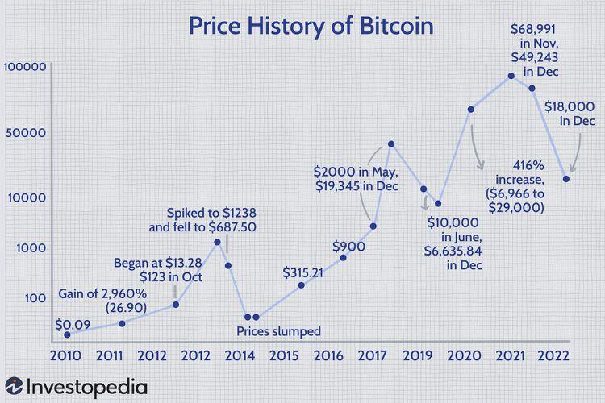

The landscape of cryptocurrency exchanges and blockchain technology has experienced significant transformation as of October 2024. Cryptocurrency exchanges serve as essential platforms within the digital economy, facilitating the trading of various digital assets and cryptocurrencies. These exchanges have evolved to meet the growing demands of security, transparency, and efficiency, integral to the ever-expanding blockchain ecosystem. The integration of robust blockchain technologies has enhanced the security and efficiency of exchanges, reinforcing their role as pivotal components in digital finance.

Simultaneously, crypto apps have become increasingly crucial in managing and trading digital assets. These applications, both mobile and desktop, have democratized access to cryptocurrency markets, allowing users to engage in trading activities, monitor portfolios, and manage digital assets seamlessly. The user-centric design of these apps, coupled with feature-rich services, has played a significant role in the adoption and engagement of a broader user base, encouraging participation in the crypto space from diverse demographics.

A notable trend in the cryptocurrency market is the rise of algorithmic trading, propelled by technological advancements. Algorithmic trading involves using computer programs and algorithms to execute trades at speeds and frequencies that are impossible for human traders. This form of trading leverages historical data, statistics, and mathematical models to optimize trading strategies, providing traders with a competitive edge in the highly volatile crypto market.

The interconnection between cryptocurrency exchanges, crypto apps, and algorithmic trading forms the core of this article’s exploration. These elements create a cohesive trading environment where trading efficiency is maximized, and user experience is prioritized. By understanding how exchanges, apps, and algorithmic trading are interwoven, stakeholders can better navigate the complexities of the crypto market.

In modern finance, the integration of these components signifies a shift towards more advanced, technology-driven financial services. As these technologies evolve, their impact on the global financial ecosystem is anticipated to be substantial, offering new opportunities while presenting challenges that require adaptation and innovation. This article will dissect these interconnected components, offering insights into their current state and future trajectory in the crypto landscape.

## Table of Contents

## Overview of Cryptocurrency Exchanges

Cryptocurrency exchanges are crucial platforms in the modern digital economy, facilitating the trading of digital assets like Bitcoin, Ethereum, and many others. They serve as intermediaries where buyers and sellers can transact cryptocurrencies, offering essential services such as pricing discovery, liquidity provision, and custodial storage. With the rise of digital currencies, these exchanges have become vital in providing access to a global marketplace that operates beyond traditional financial systems.

There are primarily three types of [cryptocurrency](/wiki/cryptocurrency) exchanges: centralized, decentralized, and hybrid. 

1. **Centralized Exchanges (CEXs):** These platforms act similarly to traditional stock exchanges, where an intermediary manages the exchange and holds custody of user assets. Users trust the exchange to execute their orders and store their funds securely. Notable examples include Binance, known for its extensive list of tradable cryptocurrencies, and Coinbase, which has gained prominence for its user-friendly interface and regulatory compliance.

2. **Decentralized Exchanges (DEXs):** Unlike CEXs, decentralized exchanges operate without a central authority, using smart contracts on blockchain networks to facilitate trades. These platforms, such as Uniswap and SushiSwap, offer users greater control over their funds and enhance privacy by eliminating the need for third-party custody.

3. **Hybrid Exchanges:** These platforms aim to integrate the benefits of both centralized and decentralized exchanges. They offer the liquidity and functionality of CEXs while incorporating the privacy and security features typical of DEXs. An example of this model is Huobi, which provides secure storage and quick transactions while allowing for decentralized features.

As of October 2024, leading exchanges have distinguished themselves through various unique attributes. Binance continues to dominate the exchange landscape due to its high [liquidity](/wiki/liquidity-risk-premium), innovative product offerings, and low trading fees. Coinbase maintains its position by prioritizing regulatory alignment, user education, and secure custody solutions. Another emerging leader is Kraken, which is recognized for its robust security protocols and comprehensive suite of financial products, including futures trading.

Cryptocurrency exchanges have significantly evolved to meet increased regulatory scrutiny and security concerns. Many exchanges have implemented rigorous Know Your Customer (KYC) and Anti-Money Laundering (AML) protocols to comply with global regulatory standards. Security enhancements, such as the use of cold storage, multi-signature wallets, and two-[factor](/wiki/factor-investing) authentication (2FA), have become standard practices to protect user assets against cyber threats.

In terms of user experience, recent technological advancements have drastically improved the interface and functionality of exchanges. Modern exchanges are now focusing on providing intuitive user interfaces that cater to both novice and seasoned traders. Features such as customizable dashboards, advanced charting tools, and seamless mobile experiences are now commonplace. Additionally, the integration of [artificial intelligence](/wiki/ai-artificial-intelligence) tools for predictive analytics and personalized trading insights enhances user engagement and decision-making.

Overall, cryptocurrency exchanges are pivotal in today’s digital economy, continuously adapting to technological innovations and regulatory landscapes. Their role in enabling efficient trading, coupled with advances in user experience and security, underscores their importance in the broader financial ecosystem.

## The Rise of Crypto Apps

Cryptocurrency applications have become instrumental in democratizing access to digital asset trading by offering users the convenience of managing their crypto portfolios directly from their mobile and desktop devices. These apps serve as gateways to the dynamic and often volatile world of cryptocurrencies, significantly lowering the barriers to entry for individual investors and traders.

The leading crypto apps on the market in 2024 not only facilitate buying and selling cryptocurrencies but also offer a suite of features designed to enhance user engagement and functionality. Prominent apps such as Binance, Coinbase, and Kraken provide robust security protocols, real-time market data, educational resources, and efficient customer support. Integrated wallets, token exchanges, and staking options are common services, allowing users to engage with the crypto ecosystem comprehensively.

Improved user interfaces (UI) and user experience (UX) designs play a crucial role in enhancing app interactions. By incorporating intuitive navigation, customizable dashboards, and personalized alerts, these apps cater to a diverse user base, from novices to seasoned traders. The focus on aesthetics and functionality ensures users can access critical information promptly and make informed trading decisions.

Furthermore, the integration of apps with cryptocurrency exchanges allows seamless transitions between mobile platforms and web services. Many applications offer API connectivity, enabling users to automate trades, set stop-loss orders, and perform technical analyses. This integration surpasses basic trading functionalities, providing access to advanced trading tools and analytics that were once exclusive to professional trading desks.

The advent of crypto applications has substantially impacted user adoption and engagement. By offering free educational materials and demo accounts, these apps play a pivotal role in onboarding new users and educating them about complex financial concepts in a simplified manner. As a result, they attract a broader demographic, including younger investors and technologically savvy individuals looking for alternative investment opportunities.

In summary, cryptocurrency apps have revolutionized the way individuals interact with digital assets by providing highly sophisticated yet accessible platforms for trading and investment. Their continual evolution will likely further facilitate the mainstream acceptance of cryptocurrencies, shaping the future of digital finance.

## Algorithmic Trading in the Crypto Market

Algorithmic trading, often referred to as algo trading, is the execution of trades in financial markets using automated pre-programmed trading instructions. These instructions account for variables such as timing, price, and [volume](/wiki/volume-trading-strategy), allowing for trades to be executed at speeds and frequencies that would be impossible for human traders. In modern finance, [algorithmic trading](/wiki/algorithmic-trading) is significant due to its ability to enhance liquidity, reduce transaction costs, and optimize the timing of trades for better price execution.

In the cryptocurrency markets, algorithmic trading strategies have been adapted to capitalize on the unique features of digital assets. These strategies involve [arbitrage](/wiki/arbitrage), [market making](/wiki/market-making), and [trend following](/wiki/trend-following), among others. Unlike traditional financial markets, cryptocurrencies operate 24/7, thus providing continual opportunities for algorithm-driven trades but also necessitating robust risk management.

As of October 2024, a myriad of tools and platforms facilitate algorithmic trading in cryptocurrency markets. Prominent among these platforms are MetaTrader, QuantConnect, and TradingView, which offer APIs and customizable trading environments for users to develop and test their algorithms. These platforms support various programming languages, with Python being especially popular due to its extensive libraries for data analysis and [machine learning](/wiki/machine-learning), such as NumPy, Pandas, and TensorFlow.

Algorithmic trading in volatile markets like cryptocurrency comes with significant opportunities and risks. It allows traders to exploit market inefficiencies and enact high-frequency trades that can capitalize on small price discrepancies. However, the [volatility](/wiki/volatility-trading-strategies) of crypto assets also poses risks; algorithms must be equipped to handle sudden price movements and potential slippage. Furthermore, the increasing prevalence of algo trading has sparked concerns about market manipulation and the creation of flash crashes when algorithms react inappropriately en masse.

The integration of artificial intelligence (AI) and machine learning (ML) continues to advance the development of sophisticated trading algorithms. Machine learning models are particularly valuable as they can learn and adapt to market patterns, enhancing predictive trading strategies. AI is utilized in sentiment analysis, processing vast amounts of social media and news data to predict market sentiment and potential movements. These developments not only improve the performance of existing algo trading strategies but also spur innovation in the creation of novel trading approaches.

The convergence of AI, ML, and algorithmic trading in cryptocurrencies signifies a transformative leap in trading technology, promising efficiency and profitability while highlighting the need for regulatory oversight to mitigate associated risks.

## Interconnection of Exchanges, Apps, and Algo Trading

The interconnection between cryptocurrency exchanges, apps, and algorithmic trading has fundamentally transformed the modern trading landscape, enabling more efficient and sophisticated trading environments. These components work together to create a seamless experience for traders and investors, offering a comprehensive ecosystem that enhances trading efficiency, accessibility, and precision.

Cryptocurrency exchanges serve as the foundational infrastructure where digital assets are bought and sold. They offer a platform for trade execution, liquidity provision, and market data aggregation. As the market matures, exchanges have started to integrate algorithmic trading features directly into their platforms. This integration allows traders to automate their strategies using built-in tools and APIs that facilitate the execution of high-frequency and complex trading strategies.

Crypto apps play a significant role in enhancing accessibility and user engagement. These apps provide real-time data, portfolio management tools, and trading functionalities on both mobile and desktop devices. By integrating algorithmic trading capabilities, apps like Binance and Coinbase Pro extend beyond simple trading interfaces to offer features such as customizable trading bots and script-based automation, empowering users to execute trades based on predefined algorithms and market conditions.

The seamless connectivity between exchanges, apps, and algorithmic trading contributes significantly to trading efficiency. Through APIs, exchanges and apps can communicate effortlessly, allowing for real-time data exchange and rapid trade execution. This connectivity ensures that traders can capitalize on market opportunities with minimal latency, especially in volatile markets where timing is crucial.

A notable example of successful integration is the platform by KuCoin, which provides an API connection for its users to implement algorithmic trading strategies using third-party software or the exchange's own feature-rich trading terminal. This integration has enabled traders to automate tasks such as arbitrage, trend following, and market making, demonstrating the enhanced capabilities achieved through interconnected systems.

Looking to the future, there are promising possibilities for further innovation within this interconnected framework. The development of advanced artificial intelligence and machine learning algorithms is likely to play a critical role in refining trading strategies and enhancing market prediction accuracy. Additionally, as blockchain technology evolves, the potential for decentralized exchanges with robust algorithmic trading features could disrupt traditional trading paradigms by offering improved security, privacy, and autonomy.

Overall, the interconnection of exchanges, apps, and algo trading has ushered in a new era of trading, characterized by efficiency, automation, and accessibility. As these technologies continue to advance, they hold the promise of reshaping financial markets and introducing new trading methodologies that will influence the future of digital asset management.

## Future Trends and Predictions

As of October 2024, the cryptocurrency ecosystem continues to be dynamic, with significant advancements anticipated in exchanges, applications, and algorithmic trading strategies. The future of cryptocurrency exchanges is expected to be heavily influenced by technological innovations and regulatory developments. Emerging technologies such as blockchain interoperability, quantum computing, and enhanced privacy solutions are likely to redefine the structural framework of exchanges. This could facilitate faster transaction processing times and improve scalability, addressing some of the current limitations faced by blockchain networks.

Furthermore, the global regulatory landscape for cryptocurrency exchanges is projected to become more harmonized. As more jurisdictions formulate comprehensive regulatory guidelines, exchanges will need to adapt to ensure compliance, adding layers of security and transparency in their operations. This could also pave the way for the integration of decentralized finance (DeFi) protocols into traditional exchange systems, making these platforms more robust and versatile.

The role of cryptocurrency apps is anticipated to expand significantly, focusing on enhancing user experience and market penetration. These apps are likely to incorporate advanced features such as voice recognition, augmented reality (AR) for visualizing market data, and AI-driven insights that personalize trading suggestions based on user behavior and market trends. Integration with Internet of Things (IoT) devices could also widen the scope of applications, facilitating a more interconnected and efficient digital asset management ecosystem.

Algorithmic trading within the cryptocurrency market is expected to evolve considerably in response to ongoing market volatility and technological enhancements. The adaptation of more sophisticated trading strategies, powered by artificial intelligence (AI) and machine learning (ML), will allow traders to harness real-time data and predictive analytics to optimize their portfolios. Python and other programming languages will continue to be leveraged to develop adaptive algorithms that can dynamically alter their strategies based on market signals.

The inherent uncertainty and volatility of cryptocurrency markets pose both challenges and opportunities. Regulatory risks, technological failures, and cybersecurity threats are potential challenges that could impact these technologies. However, these challenges also drive innovation, leading to the development of more resilient systems and practices.

Overall, the future developments in exchanges, apps, and algorithmic trading are poised to significantly impact the global financial ecosystem. By enhancing efficiency, security, and accessibility, these advancements will not only contribute to the maturation of the cryptocurrency industry but also influence traditional financial markets, heralding a transformative phase in modern finance.

## Conclusion

In summary, the landscape of cryptocurrency exchanges, crypto apps, and algorithmic trading has undergone significant transformations as of October 2024. Cryptocurrency exchanges serve as the nucleus of digital asset transactions, evolving through enhanced security measures and regulatory compliance, while offering diverse trading environments through centralized, decentralized, and hybrid models. As exchanges continue to innovate, their seamless integration with crypto applications represents a crucial development. These apps have not only democratized access to cryptocurrency markets but also offer comprehensive features beyond mere trading, thus enticing a broader user base.

Algorithmic trading, with its roots entrenched in traditional finance, has been adeptly adapted to the nuances of the cryptocurrency market. The symbiotic relationship between exchanges and algo trading platforms enhances market liquidity and efficiency. The potency of algorithmic trading is further amplified by advances in artificial intelligence and machine learning, which are pivotal in creating sophisticated trading strategies capable of navigating the volatile nature of crypto markets.

For traders, investors, and developers, these intertwined components present both opportunities and challenges. The interconnected nature of exchanges, apps, and algo trading fosters a comprehensive ecosystem that demands a keen understanding and adaptability to technological advancements and shifting market dynamics. It is imperative for stakeholders to remain vigilant and informed, embracing innovation while managing risk.

Casting a glance into the future, the trajectory of these technologies promises profound implications for the global financial system. As we witness further advancements in blockchain technologies and regulatory frameworks, the potential for transformative growth in the crypto industry is vast. With ongoing development, these components will likely redefine financial interactions and transactions, contributing to a more decentralized and technologically advanced economic landscape.

## References & Further Reading

[1]: Bergstra, J., Bardenet, R., Bengio, Y., & Kégl, B. (2011). ["Algorithms for Hyper-Parameter Optimization."](https://papers.nips.cc/paper/4443-algorithms-for-hyper-parameter-optimization) Advances in Neural Information Processing Systems 24.

[2]: ["Advances in Financial Machine Learning"](https://www.amazon.com/Advances-Financial-Machine-Learning-Marcos/dp/1119482089) by Marcos Lopez de Prado

[3]: ["Evidence-Based Technical Analysis: Applying the Scientific Method and Statistical Inference to Trading Signals"](https://www.amazon.com/Evidence-Based-Technical-Analysis-Scientific-Statistical/dp/0470008741) by David Aronson

[4]: ["Machine Learning for Algorithmic Trading"](https://github.com/PacktPublishing/Machine-Learning-for-Algorithmic-Trading-Second-Edition) by Stefan Jansen

[5]: ["Quantitative Trading: How to Build Your Own Algorithmic Trading Business"](https://books.google.com/books/about/Quantitative_Trading.html?id=j70yEAAAQBAJ) by Ernest P. Chan