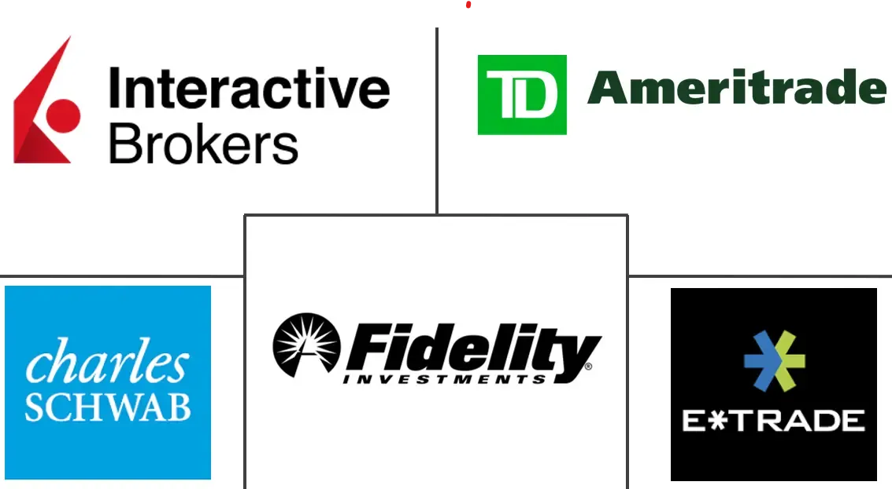

## Table of Contents

## What is a discount brokerage firm?

A discount brokerage firm is a company that helps people buy and sell stocks, bonds, and other investments for a lower fee than traditional brokers. These firms do not offer investment advice or manage your portfolio for you. Instead, they provide a platform where you can make your own investment decisions and execute trades at a lower cost.

Using a discount brokerage firm can save you money because their fees are much lower. This is great for people who know about investing and want to manage their own money. Popular discount brokerage firms include companies like Robinhood, E*TRADE, and Charles Schwab. They offer easy-to-use websites and apps that make it simple to buy and sell investments on your own.

## How do discount brokerage firms differ from full-service brokerages?

Discount brokerage firms and full-service brokerages both help people buy and sell investments, but they do it in different ways. Discount brokerages charge lower fees because they don't offer much advice or help with your investments. They give you a platform where you can make your own choices and do your own trades. This is good for people who know about investing and want to save money on fees.

On the other hand, full-service brokerages charge higher fees because they offer a lot more help. They have financial advisors who give you advice and can manage your investments for you. They look at your goals and help you make a plan. This is good for people who want more guidance and don't mind paying more for it.

So, the main difference is the level of service and the cost. Discount brokerages are cheaper but you do more on your own. Full-service brokerages are more expensive but they give you more help and advice.

## What are the key features to look for in a discount brokerage firm?

When looking for a discount brokerage firm, it's important to consider the fees they charge. Different firms have different prices for trading stocks, options, and other investments. Some might not charge any fees at all, while others might have small fees. Make sure to pick a firm with low fees so you can keep more of your money. Also, think about any other costs like account maintenance fees or fees for transferring money in and out of your account.

Another key feature is the platform and tools the firm offers. A good discount brokerage will have an easy-to-use website and app that lets you buy and sell investments quickly. They might also give you tools like research reports, stock charts, and calculators to help you make smart choices. It's a good idea to try out the platform before you start using it for real, to make sure it's easy for you to use.

Lastly, consider the customer service and support the firm provides. Even though discount brokerages don't offer investment advice, it's still important to have help available if you run into problems. Look for a firm that has good customer service, like phone support, live chat, or helpful FAQs. This way, you can get help when you need it without having to pay for full-service advice.

## Which discount brokerage firms are considered leaders in 2024?

In 2024, some of the top discount brokerage firms are Robinhood, Charles Schwab, and Fidelity. Robinhood is popular because it lets you trade stocks and options for free. It's easy to use and has a simple app that many people like. Charles Schwab is also a leader because it has low fees and a lot of tools to help you make good choices about your investments. They have been around for a long time and many people trust them. Fidelity is another big name in the industry, known for its low costs and good customer service. They offer a lot of different investments and have tools that can help you learn more about investing.

These firms stand out because they offer a mix of low fees, good tools, and easy-to-use platforms. Robinhood is great for beginners who want to start investing without spending a lot of money. Charles Schwab and Fidelity are good for people who want more tools and options but still want to keep their costs low. All three firms have strong customer service, which is important if you ever need help with your account or have questions about investing.

## What are the fee structures of the leading discount brokerage firms in 2024?

In 2024, Robinhood continues to offer commission-free trading for stocks, options, and ETFs. This means you don't have to pay any fees when you buy or sell these investments. However, Robinhood does charge a small fee for options contracts, which is about $0.65 per contract. They also have fees for things like wire transfers and account transfers, but these are pretty standard across the industry. Robinhood's simple fee structure makes it a good choice for people who want to start investing without worrying about a lot of extra costs.

Charles Schwab and Fidelity also offer very competitive fee structures. At Charles Schwab, you can trade stocks, options, and ETFs without paying a commission. They do have a fee of $0.65 per options contract, similar to Robinhood. Schwab also charges for services like wire transfers and account inactivity, but these fees are clear and easy to understand. Fidelity matches these offerings with commission-free trading for stocks, options, and ETFs, and a $0.65 fee per options contract. They also have fees for things like wire transfers and account transfers, but their overall costs remain low. Both firms are great options for people looking for low fees and a wide range of investment choices.

## How do the leading discount brokerage firms cater to beginner investors?

The leading discount brokerage firms like Robinhood, Charles Schwab, and Fidelity make it easy for beginners to start investing. Robinhood has a very simple app that's easy to use, even if you're new to investing. They offer a lot of educational content, like short videos and articles, to help you learn how to invest. They also let you trade stocks and options for free, which means you can start investing without spending a lot of money. Charles Schwab and Fidelity also have user-friendly platforms and apps. They provide a lot of tools and resources, like tutorials and guides, to help beginners understand investing better. Both firms let you trade stocks, options, and ETFs without paying a commission, which helps you keep more of your money.

These firms also offer features that help beginners feel more confident about investing. Robinhood has a feature called "Robinhood Snacks" that gives you daily news and insights about the market in a simple way. Charles Schwab and Fidelity offer demo accounts where you can practice trading with fake money before using real money. This helps you learn how the platform works and how to make trades without risking your own money. All three firms have good customer service, so if you have any questions or need help, you can easily get in touch with someone who can guide you. This support is really important for beginners who might feel a bit unsure about investing at first.

## What advanced trading tools do the leading discount brokerage firms offer?

The leading discount brokerage firms like Robinhood, Charles Schwab, and Fidelity offer several advanced trading tools to help you make smarter investment choices. Robinhood has a feature called "Robinhood Gold" that lets you trade on margin, which means you can borrow money to buy more stocks. They also offer real-time market data and advanced charting tools that help you see how stocks are doing and make better decisions. Charles Schwab provides tools like thinkorswim, a powerful trading platform with advanced charting, technical analysis, and the ability to create custom trading strategies. They also offer real-time data and the option to trade on margin, which can be useful for more experienced traders.

Fidelity also has advanced tools like Active Trader Pro, which gives you access to detailed market data, advanced charting, and options analysis. This platform helps you study the market in depth and make more informed trades. All three firms offer the ability to set up different types of orders, like stop-loss and limit orders, which can help you manage risk and control when you buy and sell stocks. These advanced tools are great for people who want to dive deeper into trading and take advantage of more sophisticated strategies.

## How do the leading discount brokerage firms ensure the security of client assets?

The leading discount brokerage firms like Robinhood, Charles Schwab, and Fidelity take many steps to keep your money and investments safe. They use strong encryption to protect your personal information when you log in or make trades. They also follow strict rules set by the government, like the Securities and Exchange Commission (SEC) and the Financial Industry Regulatory Authority (FINRA). These rules make sure that the firms keep your money separate from their own money, so if something goes wrong with the firm, your money is still safe.

Another way these firms protect your assets is through insurance. They have something called the Securities Investor Protection Corporation (SIPC) coverage, which can cover up to $500,000 if the firm goes bankrupt. Some firms, like Charles Schwab and Fidelity, also offer extra insurance on top of the SIPC coverage to give you even more protection. They also use two-[factor](/wiki/factor-investing) authentication to make sure that only you can access your account, adding another layer of security. All these measures help make sure that your investments are safe and secure.

## What are the customer support options available at the leading discount brokerage firms?

The leading discount brokerage firms like Robinhood, Charles Schwab, and Fidelity offer different ways to get help when you need it. Robinhood has a help center on their website with a lot of articles and FAQs that can answer your questions. They also have a live chat feature where you can talk to someone right away if you need help. If you prefer to talk on the phone, Robinhood has a customer service number you can call, but it's not available 24/7.

Charles Schwab and Fidelity also have strong customer support. Both firms have help centers with a lot of information and guides to help you solve problems on your own. They offer live chat support, so you can get quick answers to your questions. You can also call them on the phone, and they have customer service available for more hours than Robinhood. Both firms also let you visit a branch in person if you need to talk to someone face-to-face, which can be really helpful if you have a complicated issue or just feel more comfortable talking in person.

## How do the leading discount brokerage firms integrate with financial planning and robo-advisory services?

The leading discount brokerage firms like Robinhood, Charles Schwab, and Fidelity are finding ways to help you plan your finances better. They do this by offering robo-advisors, which are computer programs that can manage your money for you. These robo-advisors ask you about your goals and how much risk you're okay with, then they pick investments for you. Robinhood has something called Robinhood Retirement, which is a robo-advisor that helps you save for the future. Charles Schwab has Schwab Intelligent Portfolios, and Fidelity has Fidelity Go. These services make it easy for you to start investing without having to know a lot about it.

These firms also let you connect your accounts to other financial planning tools. For example, you can link your Charles Schwab or Fidelity account to apps like Mint or Personal Capital to see all your money in one place. This can help you make better plans for your money. Even though these firms don't give you personal advice like full-service brokers, they still offer tools and services that can help you plan your finances and reach your goals.

## What are the global expansion strategies of the leading discount brokerage firms in 2024?

In 2024, the leading discount brokerage firms like Robinhood, Charles Schwab, and Fidelity are working hard to grow their business around the world. Robinhood has been trying to get into new countries by getting the right licenses and making deals with local banks. They want to offer their easy-to-use app to people in places like Europe and Asia, so more people can start investing without paying a lot of money. Charles Schwab has been buying other companies in different countries to help them grow faster. They are focusing on places where people are already interested in investing, like Canada and the UK, to make it easier for their customers to invest in different markets.

Fidelity is also looking to expand globally by setting up offices in new countries and working with local partners. They want to offer their low-cost trading and robo-advisory services to people all over the world. By doing this, they hope to help more people manage their money and reach their financial goals. All these firms are using different ways to grow their business and reach more people, but they all want to make investing easier and cheaper for everyone, no matter where they live.

## How do the leading discount brokerage firms use AI and machine learning to enhance their services?

The leading discount brokerage firms like Robinhood, Charles Schwab, and Fidelity use AI and [machine learning](/wiki/machine-learning) to make their services better. They use these technologies to look at a lot of data and find patterns that can help them give you better advice and tools. For example, they can use AI to suggest stocks or other investments that might be good for you based on what you like and how you invest. They also use machine learning to make their trading platforms easier to use by learning from how people use them and making changes to make things simpler.

These firms also use AI to keep your account safe. They can spot strange activity that might mean someone is trying to get into your account without permission. By using machine learning, they can get better at finding these problems and stopping them before they cause trouble. This helps keep your money and investments safe. Overall, AI and machine learning help these firms give you a better experience, from [picking](/wiki/asset-class-picking) investments to keeping your account secure.

## References & Further Reading

[1]: Bergstra, J., Bardenet, R., Bengio, Y., & Kégl, B. (2011). ["Algorithms for Hyper-Parameter Optimization."](https://papers.nips.cc/paper/4443-algorithms-for-hyper-parameter-optimization) Advances in Neural Information Processing Systems 24.

[2]: ["Advances in Financial Machine Learning"](https://www.amazon.com/Advances-Financial-Machine-Learning-Marcos/dp/1119482089) by Marcos Lopez de Prado

[3]: ["Evidence-Based Technical Analysis: Applying the Scientific Method and Statistical Inference to Trading Signals"](https://www.amazon.com/Evidence-Based-Technical-Analysis-Scientific-Statistical/dp/0470008741) by David Aronson

[4]: ["Machine Learning for Algorithmic Trading"](https://github.com/stefan-jansen/machine-learning-for-trading) by Stefan Jansen

[5]: ["Quantitative Trading: How to Build Your Own Algorithmic Trading Business"](https://www.amazon.com/Quantitative-Trading-Build-Algorithmic-Business/dp/1119800064) by Ernest P. Chan