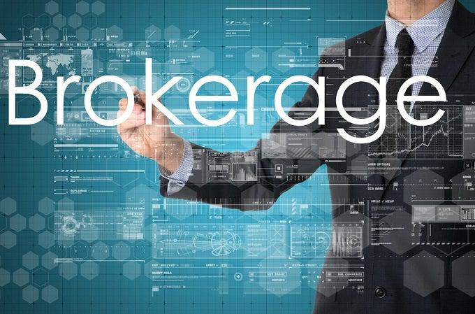

The landscape of brokerage firms has significantly transformed over the past few decades, primarily driven by technological advancements and a shift towards more cost-efficient financial services. Traditional brokerage firms, which historically charged high fees for trades and provided personal advisory services, are increasingly being overshadowed by the emergence of discount brokers. These discount brokers have gained prominence by offering trading services at significantly reduced costs, leveraging technology to automate processes and, consequently, make trading more accessible to individual and retail investors. This shift not only democratizes market access but also presents a fertile ground for technological innovations such as algorithmic trading.

Algorithmic trading, often referred to as algo trading, involves using computer algorithms to execute trading orders at a speed and frequency that is impossible for human traders. These algorithms make trading decisions based on pre-defined criteria, such as timing, price, or volume, enabling traders to capitalize on market opportunities swiftly and efficiently. In modern financial markets, algorithmic trading plays a crucial role due to its capacity to enhance decision-making efficiency, minimize human error, and execute trades at optimal prices.

Selecting the right brokerage firm is critical for traders who wish to optimize their algorithmic trading strategies. The brokerage firm chosen not only influences the cost-effectiveness of trades but also determines the access traders have to advanced trading tools, data feeds, and technical support. An ideal brokerage for algorithmic trading should provide robust platforms capable of integrating sophisticated trading algorithms, offer competitive transaction fees, and maintain a high level of reliability and security.

As we look towards 2024, several key trends are anticipated to shape the landscape of algorithmic trading and brokerage firms. These include the integration of artificial intelligence and machine learning in trading algorithms, advancements in trading platform technologies, and evolving regulatory frameworks that aim to ensure market integrity and protect investor interests. Being informed about these trends is invaluable for traders seeking to maintain a competitive edge and optimize their trading strategies in an ever-evolving financial landscape.

## Table of Contents

## What are Discount Brokers?

Discount brokers are financial institutions that offer investors the ability to buy and sell securities at a reduced commission rate compared to traditional brokerage firms. These brokers primarily provide a platform for executing transactions, without extensive supplementary services such as investment advice or in-depth market research, which are typically offered by full-service brokers.

A key characteristic of discount brokers is their focus on minimizing costs for their clients. They achieve this by leveraging online platforms and automated systems to streamline the trading process, thereby reducing the need for human intervention. This model contrasts with traditional brokerage firms that offer a wide-ranging suite of services, including personalized investment consultations, comprehensive research, and portfolio management, often at a higher cost due to the substantial infrastructural and personnel resources required.

The comparison between discount brokers and traditional brokerage firms can be further understood by examining their respective fee structures. Traditional brokers usually charge higher commissions, which may include a percentage of the assets managed or a fixed fee per transaction. Conversely, discount brokers typically employ a low, flat fee per trade structure, which is particularly advantageous for individual and retail investors seeking to maximize their returns by minimizing transaction costs.

Advantages of using discount brokers for individual and retail investors are manifold. Firstly, the cost-effectiveness of discount brokers enables investors to trade more frequently without the burden of prohibitive fees. This benefit is particularly significant for small-scale investors and those employing short-term trading strategies. Secondly, the accessibility facilitated by discount brokers—often through user-friendly online platforms and mobile applications—empowers investors to actively manage their portfolios from anywhere with an internet connection.

For algorithmic traders, discount brokers offer notable advantages. The cost-effectiveness of these brokers is crucial for algorithms that execute a large [volume](/wiki/volume-trading-strategy) of trades, where even small commission savings per trade can accumulate into substantial cost reductions. Moreover, the accessible technological infrastructure provided by discount brokers often includes APIs (Application Programming Interfaces) and direct market access, enabling algorithmic traders to implement their strategies seamlessly within the trading environment.

In the context of increasingly sophisticated financial markets, discount brokers have emerged as pivotal facilitators for investors who value autonomy and cost-efficiency over full-service brokerage models. As technology continues to democratize access to financial markets, discount brokers play an essential role in providing an affordable and efficient pathway for both individual and algorithmic traders to participate actively in securities trading.

## The Rise of Algorithmic Trading

Algorithmic trading, often referred to as algo trading, is the use of computer programs and algorithms to execute trading orders at high speed and frequency, optimizing based on a set of predetermined criteria. The central mechanism involves analyzing a vast array of market data and executing trades based on complex mathematical and statistical models. This facilitates executing orders more efficiently after identifying profitable opportunities, minimizing human intervention.

Historically, [algorithmic trading](/wiki/algorithmic-trading) emerged in the late 20th century, particularly gaining traction in the 1980s with the advent of more advanced electronic trading platforms. Initially, it was primarily utilized by institutional investors to execute large block trades while minimizing market impact and reducing transaction costs. The proliferation of high-frequency trading ([HFT](/wiki/high-frequency-trading-strategies)) in the 2000s marked another significant milestone, allowing trades to be executed in microseconds, representing a paradigm shift in trading activities.

Technological innovations have been pivotal in accelerating algorithmic trading practices. The integration of sophisticated software, enhanced computational power, and data accessibility has exponentially expanded the capabilities of trading algorithms. For instance, algorithms now incorporate real-time data feeds and can execute thousands of trades per second. The introduction of [machine learning](/wiki/machine-learning) and [artificial intelligence](/wiki/ai-artificial-intelligence) further aids the development of adaptive algorithms that learn and optimize trading strategies over time, responding dynamically to market conditions.

The benefits of algorithmic trading are manifold, with speed, efficiency, and precision standing out prominently. Algorithms can process vast amounts of information almost instantaneously, providing a competitive edge by acting on market movements faster than human traders. Efficiency is enhanced as these programs operate tirelessly, executing trades accurately, and without the susceptibility to emotional biases commonly observed in human trading. Precision is achieved through meticulously engineered algorithms that can tailor strategies to match specific market environments and trading objectives, reducing the likelihood of errors.

In conclusion, algorithmic trading has revolutionized the financial markets by providing unprecedented speed, efficiency, and precision in executing trades. Through continued technological advancement and innovation, its role is only poised to expand, further shaping the dynamics of trading.

## 2024 Trends in Algorithmic Trading and Discount Brokerage

Anticipated technological advancements in 2024 are poised to significantly influence algorithmic trading, primarily through enhancements in computing power, data analysis, and connectivity. Quantum computing is expected to play a transformative role, potentially offering exponential speed improvements over classical computing. These advancements could lead to the development of more sophisticated trading algorithms capable of processing vast datasets with unprecedented speed and accuracy. Such capabilities are likely to be leveraged by brokerage firms, which are adapting to these changes by integrating cloud-based solutions and API-driven platforms that facilitate seamless algorithmic trading.

Brokerage firms are increasingly catering to the needs of algorithmic traders by enhancing their platforms with advanced features like real-time data feeds, robust [backtesting](/wiki/backtesting) environments, and customizable algorithmic templates. The emphasis is shifting towards creating more user-friendly interfaces and providing high-speed connectivity to global financial markets. Some brokerages are also collaborating with fintech companies to offer more comprehensive data analytics tools and trading insights.

Artificial intelligence (AI) and machine learning (ML) are becoming integral to developing sophisticated trading strategies. AI models are being used to explore vast datasets to identify patterns and generate predictive insights, while machine learning techniques enable continuous improvement of trading algorithms based on historical performance data. For example, [reinforcement learning](/wiki/reinforcement-learning)—a subset of ML—allows trading algorithms to learn optimal strategies through trial and error within simulated environments. These technologies not only enhance decision-making precision but also enable automated adaptation to changing market conditions.

Regulatory updates and compliance considerations continue to be a crucial aspect of algorithmic trading. As technology evolves, regulators are focusing on ensuring market stability and protecting against systemic risks associated with high-frequency trading. In 2024, enhanced regulatory frameworks are anticipated, requiring traders and brokerage firms to implement stringent compliance measures. This includes the adoption of risk management systems capable of monitoring algorithm performance and detecting anomalies in real-time. Compliance with these regulations necessitates regular audits and ensuring transparency in trading operations, which can be facilitated through blockchain technology to maintain immutable records of transactions.

Overall, the convergence of technological advancements, evolving brokerage firm platforms, and regulatory updates is shaping the algorithmic trading landscape in 2024. These trends highlight the ongoing transformation of financial markets, emphasizing the need for stakeholders to adapt proactively.

## Selecting the Right Brokerage for Algo Trading in 2024

Selecting the right brokerage for algorithmic trading in 2024 involves several critical considerations, given the rapidly evolving technological landscape and the increasing demand for sophisticated trading strategies. Traders need a brokerage that provides not only competitive pricing but also robust technology, support, and educational resources.

**Factors to Consider:**

When choosing a brokerage firm for algorithmic trading, several factors stand out:

1. **Technology and Platform Features**: A brokerage firm must offer a platform that supports algorithmic trading tools and technologies such as APIs, integrated development environments, and backtesting capabilities. Features like advanced charting, real-time market data, and customizable interfaces are essential for developing and deploying algorithms effectively.

2. **Fees and Pricing Structure**: Cost is a crucial factor. Traders should assess the broker's pricing model, including commissions, spreads, and additional charges such as API access or data feed subscriptions. The goal is to minimize costs while maximizing trading efficiency, particularly since high-frequency strategies can be sensitive to transaction fees.

3. **Customer Support and Educational Resources**: Reliable customer support is vital for addressing any technical issues swiftly, ensuring minimal disruption to trading activities. Additionally, robust educational resources can help traders stay updated with market trends and improve their trading strategies.

4. **Security and Reliability**: The security of the trading platform is paramount. Traders must evaluate the broker's reputation for system reliability, cybersecurity measures, and data protection policies. Factors such as uptime guarantees and failover systems are crucial for ensuring seamless trading operations.

**Comparison of Popular Platforms**:

Several brokerage firms stand out for their algo-friendly trading platforms. For instance, [Interactive Brokers](/wiki/interactive-brokers-api) offers a comprehensive API suite and competitive costs, making it a popular choice among professional traders. Similarly, TD Ameritrade’s thinkorswim platform provides extensive educational resources and powerful backtesting capabilities. An emerging trend is the integration of machine learning tools, which platforms like Alpaca and QuantConnect are pioneering, thereby catering to traders seeking advanced analytical insights.

**Evaluating Trading Platforms**:

When evaluating trading platforms, security and reliability should be paramount considerations. Traders can assess this by reviewing the brokerage's history of system outages or data breaches and evaluating the technical specifications of their security infrastructure. Another critical aspect is the platform's scalability to handle growing trading volumes and more complex algorithmic strategies over time.

In summary, selecting the right brokerage in 2024 requires a balanced assessment of several key factors, including platform capabilities, fee structures, customer support, security, and additional features that enhance the trading experience. Being well-informed about these aspects will empower traders to make strategic choices that align with their algorithmic trading objectives.

## Challenges and Opportunities in Algorithmic Trading

Algorithmic trading has revolutionized the financial markets, yet it comes with its own set of challenges that traders must navigate to achieve success. One prominent challenge is the development and implementation of effective algorithmic strategies. Traders must ensure that their algorithms are robust and can adapt to rapidly changing market conditions. An algorithm that performs well in a static environment might struggle when confronted with unexpected market [volatility](/wiki/volatility-trading-strategies). Additionally, the high-frequency trading landscape means that even slight delays or inefficiencies in an algorithm can result in significant financial losses. Addressing these challenges often requires meticulous backtesting, where past market data is used to simulate potential strategy performance.

On the technology front, latency remains a critical concern. In algorithmic trading, latency refers to the delay between when a trading signal is generated and when the trade is executed. Even milliseconds of delay can severely impact the profitability of a trade, especially in high-frequency trading scenarios. To combat latency, traders can leverage co-location services where they place their trading servers close to exchange servers to minimize signal travel time. Additionally, optimizing code efficiency and employing advanced networking hardware can further reduce latency.

Market volatility poses another hurdle that algorithmic traders must overcome. Volatile markets can lead to unpredictable price movements, increasing the risk of trading strategies. To mitigate this, traders can implement risk management techniques such as setting stop-loss limits or designing algorithms that dynamically adjust their behavior based on market conditions.

The opportunities in algorithmic trading are vast, driven by continuous advancements in technology and data analytics. Machine learning and artificial intelligence are pioneering new ways to create sophisticated trading strategies that can learn from substantial datasets and identify patterns that traditional methods might miss. These technologies can help traders develop adaptive strategies that evolve with changing market dynamics, offering a significant competitive edge.

Continuous learning and strategy optimization are crucial in maintaining and boosting trading performance. Markets are constantly evolving, and what works today might not work tomorrow. Traders must stay informed about industry developments and continually optimize their strategies to ensure sustained success. This mindset of perpetual learning involves embracing new technologies, analyzing strategy performance, and refining algorithms to adapt to new market realities.

In summary, while algorithmic trading presents several challenges, it also offers abundant opportunities for those equipped with the right strategies and tools. By addressing latency issues, managing volatility, and harnessing emerging technologies, traders can not only navigate the complexities of algorithmic trading but thrive in its ever-evolving landscape.

## Conclusion

The evolving landscape of brokerage firms signifies a pivotal moment for both discount brokers and algorithmic trading, embracing technological advancement and cost-effective solutions. Discount brokers have democratized access to financial markets, making trading more accessible for individual and retail investors. They are distinguished from traditional brokerage firms by their lower fee structures, making them appealing for algorithmic traders focused on minimizing costs.

Algorithmic trading, driven by sophisticated models and computational power, enhances trading precision and efficiency. This confluence of discount brokerage and algorithmic trading offers a strategic advantage by optimizing transactional cost-effectiveness and technological robustness. As we anticipate 2024, staying informed about industry trends becomes crucial; technological advancements, especially in AI and machine learning, promise to refine and elevate trading strategies further.

Traders are encouraged to leverage these emerging technologies, making informed decisions to capitalize on the evolving landscape. As algorithmic trading firms adjust to new technologies and regulatory changes, the importance of selecting the right brokerage is underscored—balancing platform features, fees, and security is imperative.

In conclusion, the future of brokerage firms and algorithmic trading is poised for significant transformation. Those who adapt and harness these changes will likely achieve a strategic edge, underscoring the importance of proactive engagement with industry advancements.

## References & Further Reading

[1]: Bergstra, J., Bardenet, R., Bengio, Y., & Kégl, B. (2011). ["Algorithms for Hyper-Parameter Optimization."](https://papers.nips.cc/paper/4443-algorithms-for-hyper-parameter-optimization) Advances in Neural Information Processing Systems 24.

[2]: ["Advances in Financial Machine Learning"](https://www.amazon.com/Advances-Financial-Machine-Learning-Marcos/dp/1119482089) by Marcos Lopez de Prado

[3]: ["Evidence-Based Technical Analysis: Applying the Scientific Method and Statistical Inference to Trading Signals"](https://www.amazon.com/Evidence-Based-Technical-Analysis-Scientific-Statistical/dp/0470008741) by David Aronson

[4]: ["Machine Learning for Algorithmic Trading"](https://github.com/stefan-jansen/machine-learning-for-trading) by Stefan Jansen

[5]: ["Quantitative Trading: How to Build Your Own Algorithmic Trading Business"](https://www.amazon.com/Quantitative-Trading-Build-Algorithmic-Business/dp/1119800064) by Ernest P. Chan