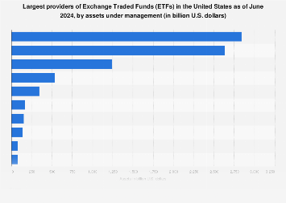

## Table of Contents

## What is an ETF and how does it work?

An ETF, or Exchange-Traded Fund, is a type of investment that works a lot like a mutual fund but trades on a stock exchange like a stock. It's a basket of securities, such as stocks, bonds, or commodities, that you can buy or sell throughout the trading day at market prices. This means you can trade ETFs whenever the market is open, unlike mutual funds which only trade once a day after the market closes.

ETFs are popular because they offer a way to diversify your investments without having to buy each security individually. For example, if you want to invest in the technology sector, you can buy an ETF that holds a collection of tech company stocks. This makes it easier and often cheaper to build a diversified portfolio. Additionally, ETFs typically have lower fees than mutual funds, making them an attractive option for many investors.

## Who are considered leading ETF fund managers?

Some of the leading ETF fund managers are companies like BlackRock, Vanguard, and State Street Global Advisors. BlackRock is known for its iShares brand, which offers a wide range of ETFs covering many different markets and sectors. Vanguard is famous for its low-cost ETFs and is a favorite among investors looking to keep their fees low. State Street Global Advisors manages the popular SPDR ETFs, including the well-known SPDR S&P 500 ETF, which tracks the S&P 500 index.

These companies are leaders because they manage a lot of money, have a wide variety of ETFs, and are trusted by many investors. They also focus on keeping costs low for investors, which is a big reason why they are so popular. By offering ETFs that track major indexes and sectors, they make it easy for people to invest in the market without having to pick individual stocks.

## What criteria are used to evaluate the performance of ETF fund managers?

Evaluating the performance of ETF fund managers involves looking at several key factors. One important criterion is the fund's returns compared to its benchmark index. If an ETF is supposed to track the S&P 500, for example, investors want to see how closely the ETF's performance matches the S&P 500's performance. Another factor is the expense ratio, which is the cost of managing the fund. Lower expense ratios are better because they mean more of your money stays invested and can grow over time.

Another aspect to consider is the fund's tracking error, which measures how much the ETF's performance deviates from its benchmark. A lower tracking error indicates that the fund manager is doing a good job of closely following the index. Additionally, liquidity is important, as it shows how easily you can buy or sell the ETF without affecting its price. High liquidity is generally better because it means the ETF is more popular and easier to trade.

Lastly, the fund manager's reputation and the overall stability of the management company can also play a role in evaluating performance. Investors often look at the company's history, its other offerings, and how well it has managed other funds. This gives a sense of trust and reliability, which are crucial for long-term investment decisions.

## How do leading ETF fund managers select their investments?

Leading ETF fund managers pick their investments by following a set of rules called an index. For example, if they are making an ETF that tracks the S&P 500, they will buy all the stocks that are in the S&P 500. They do this to make sure their ETF matches the performance of the index as closely as possible. Sometimes, they use computers to help them decide which stocks to buy and when to buy them. This helps them keep the ETF's performance in line with the index without too much effort.

Another way they select investments is by focusing on certain themes or sectors. For example, if they want to make an ETF that invests in technology companies, they will pick stocks from tech companies that fit certain criteria. These criteria might include the size of the company, how fast it is growing, or how much profit it makes. By sticking to these rules, the fund managers make sure the ETF stays true to its purpose and gives investors what they expect.

## What are the most popular ETFs managed by leading fund managers?

Some of the most popular ETFs managed by leading fund managers are the iShares Core S&P 500 ETF (IVV) from BlackRock, the Vanguard S&P 500 ETF (VOO) from Vanguard, and the SPDR S&P 500 ETF Trust (SPY) from State Street Global Advisors. These ETFs are popular because they track the S&P 500, which is a big group of the biggest companies in the U.S. This makes them a good choice for people who want to invest in the overall U.S. market without having to pick individual stocks.

Another popular ETF is the Vanguard Total Stock Market ETF (VTI), which also comes from Vanguard. This ETF tries to match the performance of the entire U.S. stock market, not just the biggest companies. It's a good option for investors who want to spread their money across many different kinds of companies. These ETFs are well-liked because they are easy to understand, have low costs, and are managed by trusted companies.

## How do fees and expenses impact the returns of ETFs managed by leading fund managers?

Fees and expenses can make a big difference in how much money you make from ETFs. When you buy an ETF, you have to pay a small fee every year, called the expense ratio. This fee is taken out of the ETF's total value, so the more you pay in fees, the less money you get to keep. For example, if an ETF has an expense ratio of 0.10%, that means you pay $10 in fees for every $10,000 you invest each year. Over time, even small fees can add up and eat into your returns, especially if the ETF doesn't grow very fast.

Leading fund managers like BlackRock, Vanguard, and State Street Global Advisors try to keep their fees low to help investors keep more of their money. For instance, popular ETFs like the Vanguard S&P 500 ETF (VOO) and the iShares Core S&P 500 ETF (IVV) have very low expense ratios, often around 0.03% to 0.04%. This means you pay less in fees, which can lead to higher returns over time. By choosing ETFs with low fees, you can save a lot of money and make your investments grow faster.

## What strategies do leading ETF fund managers use to outperform the market?

Leading ETF fund managers often use smart strategies to try to do better than the market. One way they do this is by using what's called "smart beta" ETFs. These ETFs don't just follow a simple index like the S&P 500. Instead, they pick stocks based on certain rules, like choosing companies that pay good dividends or have a low price compared to their earnings. By doing this, they hope to get better returns than if they just followed the whole market.

Another strategy is to focus on specific sectors or themes that they think will do well in the future. For example, they might create an ETF that invests in technology companies or clean energy. They believe that these areas will grow faster than the overall market, so their ETFs can do better. By picking the right sectors or themes, they aim to beat the market and give their investors higher returns.

## How do leading ETF fund managers handle risk management?

Leading ETF fund managers handle risk management by carefully choosing the investments in their ETFs. They use rules to pick stocks or other assets that fit certain criteria, which helps them manage risk. For example, if they're making an ETF that follows the S&P 500, they'll make sure to include all the stocks in that index. This way, the risk is spread out across many different companies, which can help protect the ETF from big losses if one company does poorly.

Another way they manage risk is by keeping an eye on how much the ETF's performance might differ from its benchmark. This is called tracking error, and a lower tracking error means the ETF is doing a good job of matching the index. They also look at how easy it is to buy and sell the ETF, which is called liquidity. High liquidity means the ETF is popular and can be traded without big price changes, which helps manage risk. By focusing on these things, leading ETF fund managers try to keep their ETFs safe and stable for investors.

## What role does technology play in the management of ETFs by leading fund managers?

Technology plays a big role in how leading ETF fund managers do their job. They use computers to help them pick the right stocks and keep track of how their ETFs are doing. For example, if they want to make an ETF that follows the S&P 500, they use software to automatically buy and sell the stocks in the index. This helps them make sure the ETF matches the index as closely as possible without having to do everything by hand.

Another way technology helps is by making it easier for investors to buy and sell ETFs. With online trading platforms and apps, people can trade ETFs anytime they want, as long as the market is open. This means they can react quickly to changes in the market. Technology also helps fund managers keep their costs low, which means they can offer ETFs with lower fees. This is good for investors because it means more of their money stays invested and can grow over time.

## How do leading ETF fund managers adapt to changing market conditions?

Leading ETF fund managers keep a close eye on the market and use different strategies to adapt to changes. They might change the mix of stocks in their ETFs to focus on sectors that are doing well or expected to grow. For example, if technology companies start doing better than other industries, they might put more money into tech stocks. They also use computer programs to help them make quick decisions about buying and selling stocks, so they can react fast to what's happening in the market.

Another way they adapt is by creating new ETFs that fit with current trends. If people start caring a lot about clean energy, for instance, they might make an ETF that invests in companies working on green technology. This way, they can offer investors new ways to make money from the latest market trends. By staying flexible and using technology, leading ETF fund managers can help their ETFs do well even when the market changes.

## What are the long-term performance trends of ETFs managed by leading fund managers?

Over the long term, ETFs managed by leading fund managers like BlackRock, Vanguard, and State Street Global Advisors have generally performed well. These ETFs often track major indexes like the S&P 500, which means they aim to match the overall performance of the market. Because these indexes include a wide range of big companies, the ETFs tend to grow steadily over time. For example, ETFs like the Vanguard S&P 500 ETF (VOO) and the iShares Core S&P 500 ETF (IVV) have shown strong growth over many years, making them popular choices for investors looking for long-term gains.

Another reason for their good long-term performance is that these ETFs have low fees. When you pay less in fees, more of your money stays invested and can grow over time. ETFs like the Vanguard Total Stock Market ETF (VTI) have very low expense ratios, which helps investors keep more of their returns. By sticking to their strategy of tracking indexes and keeping costs low, leading fund managers have been able to provide solid, reliable returns for their investors over the long run.

## How can investors access detailed performance data and analysis of ETFs managed by leading fund managers?

Investors can access detailed performance data and analysis of ETFs managed by leading fund managers through various online platforms and financial websites. Websites like Morningstar, Yahoo Finance, and the official sites of ETF providers like BlackRock (iShares), Vanguard, and State Street Global Advisors offer a lot of information. These platforms provide data on how the ETFs have performed over different time periods, like one year, three years, or even ten years. They also show important details like the expense ratio, the ETF's holdings, and how well it has tracked its benchmark index.

In addition to these websites, investors can use financial apps and tools that give real-time data and analysis. Apps like Bloomberg, Seeking Alpha, and even some trading platforms like E*TRADE or Charles Schwab have sections where you can look up ETFs and see their performance history. These tools often include charts, graphs, and analyst reports that help you understand how the ETFs are doing and what experts think about their future performance. By using these resources, investors can make smarter choices about which ETFs to buy and hold for the long term.

## What is the Role of Asset Managers?

Asset managers play a critical role in the financial markets by overseeing investment portfolios on behalf of individual or institutional clients. These professionals are tasked with making informed decisions to meet specific investment objectives, which often include achieving optimal returns while managing risk. Asset managers employ a variety of strategies and tools to ensure that portfolios are aligned with the clients' investment goals, time horizons, and risk tolerances.

### Portfolio Management and Risk Assessment

Asset managers create value for investors primarily through effective portfolio management. This involves selecting a mix of investment assets such as stocks, bonds, and alternative investments to diversify risk and maximize potential returns. Diversification is a key principle in portfolio management, aimed at minimizing unsystematic risk—risk that is specific to individual investments. The concept is rooted in the Modern Portfolio Theory, which was developed by Harry Markowitz. According to this theory, a diversified portfolio can achieve a higher expected return for a given level of risk compared to individual assets.

Risk assessment is another essential component of an asset manager's role. This process involves identifying, analyzing, and mitigating risks associated with the investment portfolio. Asset managers use quantitative models and financial metrics such as the Sharpe Ratio, Value at Risk (VaR), and beta to assess and compare the risk-adjusted performance of different portfolios. For instance, the Sharpe Ratio is calculated as:

$$
\text{Sharpe Ratio} = \frac{E[R_p] - R_f}{\sigma_p}
$$

where $E[R_p]$ is the expected portfolio return, $R_f$ is the risk-free rate, and $\sigma_p$ is the portfolio's standard deviation. A higher Sharpe Ratio indicates better risk-adjusted performance.

### Impact on Fund Performance

The decisions made by asset managers have a significant impact on the performance of investment funds. Effective asset allocation and timely adjustments to the portfolio can lead to improved returns even in volatile market conditions. Conversely, poor decision-making or failure to adapt to changing market dynamics can result in subpar performance. Notably, the skill and experience of an asset manager in analyzing market trends, economic indicators, and individual asset performance are pivotal in determining the efficacy of their strategies.

### Technology Adoption for Enhanced Decision-Making

In recent years, asset managers have increasingly adopted advanced technologies to augment their decision-making capabilities. Tools such as [artificial intelligence](/wiki/ai-artificial-intelligence) (AI), [machine learning](/wiki/machine-learning), and big data analytics are used to gain deeper insights into market trends and investor behavior. Algorithmic tools analyze vast datasets more efficiently than traditional methods, allowing asset managers to forecast market movements and identify potential investment opportunities with greater precision.

For example, AI-based algorithms can process real-time market data and adjust investment strategies dynamically to capture emerging trends. The use of robo-advisors has also become prevalent, providing automated, algorithm-driven financial planning services with minimal human intervention. This technological integration enhances the ability of asset managers to make data-driven decisions, optimize portfolio performance, and manage risks effectively.

In summary, asset managers are pivotal in shaping investment strategies through meticulous portfolio management, risk assessment, and strategic decision-making. Their adoption of technology further enhances their ability to deliver value, emphasizing the importance of staying abreast of technological advancements in the continuously evolving investment landscape.

## References & Further Reading

[1]: Bogle, J. C. (2017). ["The Little Book of Common Sense Investing: The Only Way to Guarantee Your Fair Share of Stock Market Returns."](https://www.amazon.com/Little-Book-Common-Sense-Investing/dp/1119404509) John Wiley & Sons.

[2]: Lopez de Prado, M. (2018). ["Advances in Financial Machine Learning."](https://books.google.com/books/about/Advances_in_Financial_Machine_Learning.html?id=oU9KDwAAQBAJ) John Wiley & Sons.

[3]: Poterba, J. M., & Shoven, J. B. (2002). ["Exchange-Traded Funds: A New Investment Option for Taxable Investors."](https://economics.mit.edu/sites/default/files/publications/Exchange-Traded%20Funds%20A%20New%20Investment%20Option.pdf) American Economic Review, 92(2), 422-427.

[4]: Rick Ferri. (2010). ["The ETF Book: All You Need to Know About Exchange-Traded Funds."](https://rickferri.com/books/the-etf-book/) Wiley.

[5]: Chan, E. P. (2009). ["Quantitative Trading: How to Build Your Own Algorithmic Trading Business."](https://github.com/ftvision/quant_trading_echan_book) John Wiley & Sons.

[6]: Knight, F., & Satchell, S. (2020). ["Forecasting Volatility in the Financial Markets."](https://www.sciencedirect.com/book/9780750669429/forecasting-volatility-in-the-financial-markets) Butterworth-Heinemann.

[7]: Jansen, S. (2020). ["Machine Learning for Algorithmic Trading: Predictive models to extract signals from market and alternative data for systematic trading strategies with Python."](https://www.amazon.com/Machine-Learning-Algorithmic-Trading-alternative/dp/1839217715) Packt Publishing.