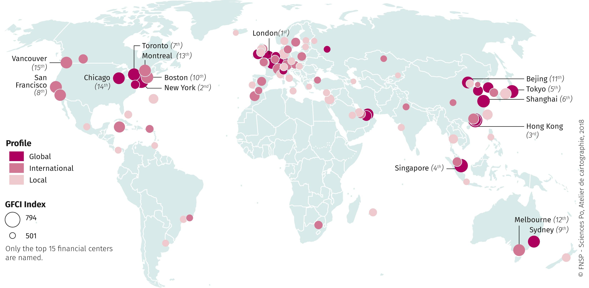

## Table of Contents

## What is a financial center?

A financial center is a place where a lot of money-related activities happen. It's like a hub where banks, investment firms, and other financial businesses work together. These centers are important because they help move money around the world and make it easier for people and companies to do business.

Big cities like New York, London, and Tokyo are famous financial centers. They have big stock exchanges where people buy and sell shares of companies. These cities attract a lot of smart people who work in finance, and they help the global economy grow by making it easier to invest and borrow money.

## Why are financial centers important for the global economy?

Financial centers are really important for the global economy because they help money move around the world easily. They are like big hubs where banks, investment firms, and other money-related businesses come together. This makes it easier for people and companies to do things like borrow money, invest in new projects, or trade with other countries. When money can move freely and quickly, it helps the economy grow because businesses can get the money they need to expand and create jobs.

Also, financial centers bring together a lot of smart people who know a lot about money and how to use it to make more money. These experts help make good decisions about where to invest and how to manage risks. This can lead to more stable and growing economies. When financial centers are strong and working well, they can help prevent big money problems and keep the global economy running smoothly.

## Which cities are considered the top financial centers in the world?

New York and London are the top financial centers in the world. New York is home to Wall Street and the New York Stock Exchange, which is one of the biggest stock markets. A lot of big banks and investment firms are based in New York, making it a key place for money and business. London is also very important because it has a long history of being a major financial center. It has the London Stock Exchange and many big banks and financial companies from around the world.

Tokyo is another important financial center. It has the Tokyo Stock Exchange, which is one of the largest in the world. Many big Japanese companies and banks are based in Tokyo, and it's a big hub for money in Asia. Other cities like Hong Kong and Singapore are also growing as financial centers. Hong Kong connects the East and West, and Singapore is known for being a stable and safe place for money.

These cities are important because they help move money around the world and make it easier for people and companies to do business. They bring together a lot of smart people who work in finance and help the global economy grow.

## What criteria are used to rank financial centers?

Financial centers are ranked based on several important things. One big thing is how much business happens there. This includes how much money is traded on stock exchanges, how many banks and investment firms are there, and how much money moves through the city. Another important thing is the rules and laws that help keep money safe and make it easy to do business. Cities with good rules and laws are seen as more trustworthy and attract more business.

Another thing that matters is how easy it is to get to the city and move around. Good airports, roads, and other ways to travel make it easier for people to come and do business. Also, having smart people who know a lot about money and finance is very important. Cities with good schools and universities that teach about finance attract these smart people. All these things together help decide which cities are the top financial centers.

Lastly, the overall health of the city's economy and its stability are also considered. Cities that have strong economies and are not likely to have big money problems are ranked higher. This makes people and companies feel more confident about doing business there. By looking at all these things, experts can figure out which cities are the best financial centers in the world.

## How does New York City stand as a financial center?

New York City is one of the top financial centers in the world. It's famous for Wall Street and the New York Stock Exchange, where a lot of money is traded every day. Many big banks and investment firms have their offices in New York, making it a busy place for money and business. The city's economy is strong, and it's easy for people to come and do business because of its good airports and transportation.

New York also has good rules and laws that help keep money safe and make it easy to do business. This makes people and companies feel confident about working there. The city is home to many smart people who know a lot about money and finance, thanks to its good schools and universities. All these things together make New York a very important financial center that helps move money around the world and helps the global economy grow.

## What role does London play in the global financial system?

London is a very important city in the global financial system. It has been a big financial center for a long time and is home to the London Stock Exchange, where a lot of money is traded every day. Many big banks and financial companies from around the world have offices in London. This makes it a busy place for money and business. The city's rules and laws help keep money safe and make it easy for people to do business, which makes London a trusted place for finance.

London also helps connect different parts of the world. It's a big hub where money can move easily between Europe, Asia, and the Americas. The city has good airports and transportation, making it easy for people to come and do business. London is also home to many smart people who know a lot about money and finance, thanks to its good schools and universities. All these things together make London a key player in the global financial system, helping the world's economy grow and stay stable.

## How has Hong Kong developed as a leading financial center in Asia?

Hong Kong has grown into a leading financial center in Asia because it is a special place where East meets West. It has a good mix of Chinese and international businesses. The city has strong rules and laws that help keep money safe and make it easy for people to do business. This makes Hong Kong a trusted place for finance. The Hong Kong Stock Exchange is one of the biggest in the world, and a lot of money is traded there every day. Many big banks and investment firms have offices in Hong Kong, making it a busy place for money and business.

Hong Kong also has good airports and transportation, which makes it easy for people to come and do business. The city is home to many smart people who know a lot about money and finance, thanks to its good schools and universities. Hong Kong's special position as a gateway between China and the rest of the world has helped it grow as a financial center. It helps money move easily between Asia and other parts of the world, making it an important part of the global financial system.

## What are the emerging financial centers and their potential impact?

Some cities that are becoming important financial centers are Dubai, Shanghai, and Mumbai. Dubai is growing because it's a safe place to do business and has good airports and roads. It also has rules that make it easy for people to move money around. Shanghai is getting bigger because China's economy is growing fast. It has the Shanghai Stock Exchange, which is one of the biggest in the world. Mumbai is important because India's economy is growing too. It has the Bombay Stock Exchange, which is also very big.

These new financial centers can change the global economy in big ways. They can help more money move around the world, especially in Asia and the Middle East. This can help businesses in these areas grow and create more jobs. As these cities get bigger, they might attract more smart people who know a lot about money and finance. This could make the global financial system stronger and more balanced, with more places where people can do business.

## How do regulations affect the competitiveness of financial centers?

Regulations are really important for financial centers because they help keep money safe and make it easier for people to do business. Good rules make people trust a financial center more. When people trust a place, they are more likely to do business there. This means more money moves through the city, and more banks and companies want to set up offices there. For example, cities like New York and London have strong rules that make them trusted places for finance, which helps them stay competitive.

But too many or too strict rules can also make it hard for financial centers to compete. If the rules are too tough, it can be harder for businesses to make money or start new projects. This might make some banks and companies move to other cities with easier rules. So, finding the right balance is key. Cities need rules that keep money safe but also let businesses grow and make money. This balance helps financial centers stay strong and competitive in the global economy.

## What technological advancements are influencing the operations of financial centers?

Technology is changing how financial centers work. One big change is the use of computers and the internet to do things faster and easier. Now, people can buy and sell stocks online without going to a stock exchange. This makes it quicker and cheaper to trade money. Also, banks and companies use special computer programs to look at a lot of information and make smart choices about where to invest money. This helps them make more money and do better in the market.

Another important change is the use of things like blockchain and cryptocurrencies. Blockchain is a special way to keep track of money that is very safe and hard to cheat. This makes people trust the system more. Cryptocurrencies, like Bitcoin, are new kinds of money that work on the internet. They can make it easier for people to move money around the world without using banks. These new technologies can make financial centers more competitive and help them grow by making money move faster and safer.

## How do financial centers contribute to or hinder financial stability?

Financial centers can help keep the economy stable by making it easier for money to move around the world. They have strong rules and laws that keep money safe and make people trust them. When people trust a financial center, they are more likely to do business there. This helps the economy grow because businesses can get the money they need to start new projects and create jobs. Also, financial centers bring together smart people who know a lot about money. These experts can help make good choices about where to invest and how to manage risks, which can keep the economy stable.

But financial centers can also cause problems if they are not careful. If too much risky business happens in a financial center, it can lead to big money problems. For example, if banks and companies take too many risks and lose a lot of money, it can hurt the whole economy. Also, if the rules in a financial center are too strict, it can make it hard for businesses to grow and make money. This can slow down the economy. So, financial centers need to find a good balance between helping the economy grow and keeping it stable.

## What future trends are expected to shape the landscape of global financial centers?

In the future, technology will keep changing how financial centers work. More and more, people will use computers and the internet to buy and sell money. This makes things faster and cheaper. Also, new kinds of money like Bitcoin and other cryptocurrencies will become more important. They can make it easier for people to move money around the world without using banks. Financial centers will need to use these new technologies to stay competitive and help the economy grow.

Another big trend is that more cities in Asia and the Middle East will become important financial centers. Cities like Shanghai, Mumbai, and Dubai are growing fast because their countries' economies are getting bigger. These new financial centers can help more money move around the world, especially in these regions. This can help businesses grow and create more jobs. As these cities get bigger, they might attract more smart people who know a lot about money and finance, making the global financial system stronger and more balanced.

## References & Further Reading

[1]: Bergstra, J., Bardenet, R., Bengio, Y., & Kégl, B. (2011). ["Algorithms for Hyper-Parameter Optimization."](https://dl.acm.org/doi/10.5555/2986459.2986743) Advances in Neural Information Processing Systems 24.

[2]: ["Advances in Financial Machine Learning"](https://www.amazon.com/Advances-Financial-Machine-Learning-Marcos/dp/1119482089) by Marcos Lopez de Prado

[3]: ["Evidence-Based Technical Analysis: Applying the Scientific Method and Statistical Inference to Trading Signals"](https://www.amazon.com/Evidence-Based-Technical-Analysis-Scientific-Statistical/dp/0470008741) by David Aronson

[4]: ["Machine Learning for Algorithmic Trading"](https://github.com/stefan-jansen/machine-learning-for-trading) by Stefan Jansen

[5]: ["Quantitative Trading: How to Build Your Own Algorithmic Trading Business"](https://www.amazon.com/Quantitative-Trading-Build-Algorithmic-Business/dp/1119800064) by Ernest P. Chan