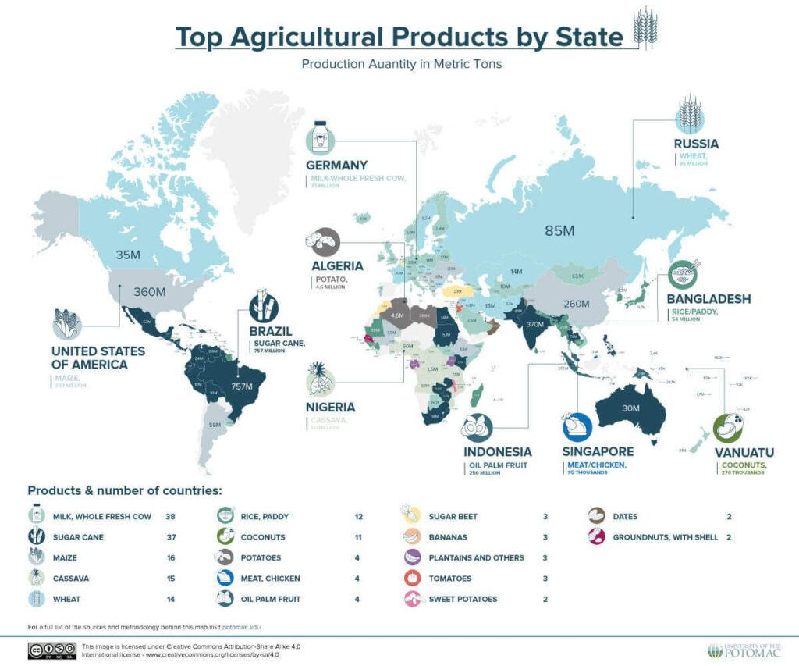

In a rapidly evolving world marked by technological advancements, agriculture has experienced significant transformation, propelled by the integration of algorithmic trading. This innovative approach to trading employs algorithms to automate decision-making in financial markets, including those for agricultural commodities, improving speed, efficiency, and accuracy. As the demand for food production continues to grow alongside the global population, algorithmic trading offers both new opportunities and complex challenges for the agricultural sector.

China, India, the United States, and Brazil are the four countries at the forefront of food production. Each plays a pivotal role in the global food security landscape due to their substantial outputs and unique agricultural profiles. China's focus on cereals, India’s diverse crop production, the United States' advanced agricultural exports, and Brazil’s rich resource base collectively contribute to meeting the world’s food demands. Understanding the dynamics of these leading food producers is crucial to appreciating their contributions to global food security and how algorithmic trading can enhance their agricultural markets.



Algorithmic trading is also being recognized for its potential to transform agricultural sustainability and efficiency. By leveraging data analytics and machine learning, algorithmic trading systems can predict market trends, optimize supply chain processes, and facilitate faster decision-making. This capability enables farmers and traders to make informed decisions, thereby improving production strategies and pricing mechanisms. These advancements in technology not only streamline operations but also reduce costs and foster sustainability within the agricultural industry.

Despite its advantages, the adoption of algorithmic trading is not without its challenges. Concerns about market volatility and inequitable access to technology can affect its implementation and impact. As such, balancing these challenges with the potential benefits is crucial to maximizing the positive outcomes of algorithmic trading in agriculture. Understanding the experiences and strategies of leading food producers provides insights into how these challenges might be addressed, paving the way for more sustainable and efficient global food systems.

## Table of Contents

## China: The Grain Powerhouse

China stands as a formidable force in global agriculture, manifesting the world's largest agricultural output. The nation's agrarian prowess is largely attributed to its focus on cereals, cotton, and meat. With food production representing a cornerstone of China’s economic and social structure, significant technological advancements have been imperative in overcoming challenges such as limited arable land. Indeed, the country faces persistent obstacles, including an increased dependency on food imports and constraints on available farming land, which have continually shaped its agricultural strategies.

Despite these challenges, China's embrace of technological innovations has been instrumental in propelling its agricultural capabilities. The integration of cutting-edge methods such as precision agriculture, genetic modification, and sustainable practices has optimized productivity levels. Moreover, China has increasingly adopted algorithmic trading within its agricultural markets as a means to enhance efficiency and overcome existing inefficiencies. Algorithmic trading, characterized by the use of complex algorithms to make trading decisions at high speeds, offers numerous advantages: it allows traders to respond rapidly to market conditions, automate transactions, and efficiently manage large volumes of data.

By employing [algorithmic trading](/wiki/algorithmic-trading), China aims to address its prevailing challenges in the agricultural sector. Through sophisticated data analytics and modeling, this technology helps forecast market trends, thereby informing better crop production strategies and supply chain management. For instance, algorithms can analyze historical data and current market variables to predict future commodity prices and demand patterns, aiding farmers in making informed decisions about crop planting and harvest timing.

Moreover, algorithmic trading has the potential to mitigate the impact of China's reliance on food imports by optimizing resource allocation and leveraging market opportunities more effectively. By facilitating more precise market predictions and efficient transaction processes, algorithmic trading enhances competitive advantages, which are crucial for maintaining China's leading position in global food production.

In conclusion, as China continues to evolve technologically, the embedding of algorithmic trading in agriculture underscores a significant transformation aimed at increasing market efficiency and sustainability despite existing challenges.

## India: From Subsistence to Major Exporter

India's agricultural landscape is characterized by its diverse array of crops, ranging from staples like rice and wheat to cash crops such as sugarcane. This diversity not only contributes to the country's food security but also positions India as a significant player in the global agricultural export market. Despite the predominant subsistence-based nature of its agriculture, India has managed to become a leading exporter of certain commodities, including spices, tea, and specific grains like basmati rice and non-basmati rice.

However, India's agricultural sector faces persistent challenges that hinder its full potential. One major issue is the inadequacy of infrastructure, which affects storage, transportation, and distribution. Inefficient resource utilization further compounds these challenges, leading to post-harvest losses and diminished productivity. For example, the lack of modern cold storage facilities results in substantial spoilage of perishable commodities. 

In response to these challenges, India is gradually embracing algorithmic trading to bolster its agricultural markets. Algorithmic trading can optimize supply chains by using advanced algorithms to predict demand, adjust pricing, and manage inventory in real-time. These systems harness large datasets and employ predictive analytics to enhance decision-making, thus helping traders and farmers to better align supply with market demand.

Moreover, algorithmic trading offers sophisticated market prediction capabilities, allowing stakeholders to anticipate market trends and price fluctuations. This technology can analyze historical data, weather patterns, and global market signals to forecast future price movements with greater accuracy. By leveraging such insights, Indian farmers and traders can minimize risks and maximize returns, contributing to increased agricultural efficiency and competitiveness on the global stage.

The adoption of algorithmic trading in Indian agriculture, therefore, presents a transformative opportunity to address the sector's longstanding infrastructure and resource inefficiencies while enhancing its export potential. Through technology-driven solutions, India is poised to strengthen its role in the global food market and ensure the sustainability of its agricultural sector.

## United States: Leader in Agricultural Exports

The United States stands at the forefront of global agricultural exports, leveraging a combination of advanced technology and robust agricultural infrastructure. This success is primarily attributed to the country's efficient production of key commodities such as corn, soybeans, and wheat. In 2021, the U.S. produced approximately 15.1 billion bushels of corn and 4.4 billion bushels of soybeans, underscoring its capacity to meet both domestic and international demands. The high crop yields are a result of sophisticated farming techniques, advanced machinery, and a strong emphasis on research and development.

Technological innovations have been pivotal in enhancing the efficiency and productivity of the U.S. agricultural sector. Among these innovations, algorithmic trading has emerged as a transformative tool. Algorithmic trading uses complex algorithms to automate trading decisions, allowing for rapid execution of trades based on real-time data analysis. This technology assists U.S. farmers and traders in managing risks by enabling them to anticipate market fluctuations and respond accordingly. It helps in price discovery and ensures smoother market operations by reducing human intervention and potential errors.

Algorithmic trading's capacity to process vast amounts of market data swiftly ensures that traders can make informed decisions, thereby optimizing their investment strategies. For example, predictive analytics, a component of algorithmic trading, uses historical data to predict future price movements. Consider a simple linear regression model in Python:

```python
from sklearn.linear_model import LinearRegression
import numpy as np

# Sample data: past prices and future prices
past_prices = np.array([[1], [2], [3], [4], [5]])
future_prices = np.array([2, 3, 5, 7, 11])

# Train the model
model = LinearRegression().fit(past_prices, future_prices)

# Predict the future price
future_price_prediction = model.predict(np.array([[6]]))
print(f"Predicted future price: {future_price_prediction[0]}")
```

This example demonstrates how historical price data can be utilized to predict future market trends, aiding farmers and traders in securing advantageous positions in the market.

Furthermore, algorithmic trading facilitates real-time supply chain management, ensuring that agricultural products reach global markets more efficiently. By providing instant access to complex market dynamics, it enables stakeholders to optimize logistics and storage, reduce waste, and align supply with demand.

Despite its advantages, algorithmic trading also presents challenges, such as potential market [volatility](/wiki/volatility-trading-strategies) and the need for significant investment in technology. However, the United States continues to capitalize on its technological prowess, maintaining its leadership in the global agricultural export market through continued innovation and investment in cutting-edge technologies.

## Brazil: Rich in Resources but Import-Dependent

Brazil's agricultural sector plays a pivotal role in the nation's economy, with soybeans and sugar being key components of its significant output. According to the Food and Agriculture Organization of the United Nations (FAO), Brazil is one of the world's top producers of soybeans, with this crop being integral to both domestic use and export markets. The country is also one of the leading producers of sugarcane, bolstering its status as a prominent player in global agricultural markets.

Despite its robust production capabilities, Brazil remains heavily reliant on imports, particularly from China. This dependency can be attributed to several factors, including the need for fertilizers, pesticides, and technology that are not produced in sufficient quantities locally. Furthermore, Brazil's infrastructural challenges, such as inadequate transportation and storage facilities, exacerbate this dependency by increasing logistical costs and hindering efficient trade.

To address these challenges and strengthen its global position, Brazil's agricultural sector is progressively adopting integrated trading systems. These systems aim to streamline the supply chain, reduce costs, and enhance market reach. A key component of this transition is the adoption of algorithmic trading, which has the potential to significantly boost Brazil's competitiveness in the agricultural sector.

Algorithmic trading utilizes complex algorithms to analyze market data, predict trends, and execute trades with minimal human intervention. In the context of agriculture, this technology can optimize resource allocation and improve market timing, ensuring that Brazilian agricultural products are sold at peak prices. By harnessing data analytics, algorithmic trading provides insights into price fluctuations, demand patterns, and supply chain disruptions, enabling farmers and traders to make informed decisions rapidly.

The implementation of algorithmic trading in Brazil's agricultural practices could lead to enhanced efficiency and sustainability. By automating trades and minimizing human error, the technology helps reduce transaction costs and mitigate risks associated with market volatility. Moreover, the predictive capabilities of algorithmic systems can improve yield forecasting, allowing for better inventory management and resource deployment.

In conclusion, while Brazil's agricultural sector is rich in resources and essential to its economy, challenges such as import dependency and infrastructural inadequacies persist. The transition to integrated trading systems, bolstered by algorithmic trading, offers a promising avenue to overcome these hurdles. By optimizing resource use and market strategies, Brazil can enhance its agricultural output's global competitiveness and maintain its vital role in the international food production landscape.

## Global Impact of Algorithmic Trading in Agriculture

Algorithmic trading is increasingly becoming a transformative force in agriculture, redefining how agricultural markets and supply chains operate. As a method that utilizes computer algorithms to manage trading strategies, algorithmic trading is adding layers of efficiency and analytical precision that were previously unreachable.

One of the primary advantages of algorithmic trading in agriculture is its ability to streamline decision-making processes. Traditional trading often involves manual analysis and data processing, which can be time-consuming and subject to human error. In contrast, algorithmic trading systems process vast amounts of data at unprecedented speeds, facilitating real-time decision-making. This capability is especially crucial in agriculture, where market conditions can change rapidly due to factors such as weather variations, geopolitical events, and changes in consumer demand.

The optimization of supply chains is another significant contribution of algorithmic trading. By analyzing patterns in data sets that include climatic conditions, historical yield data, and real-time market prices, these systems optimize logistics and distribution strategies. This optimization results in reduced waste and improved timing in getting produce to market. The ability to forecast demand with greater accuracy improves inventory management and decreases the likelihood of overproduction or stock shortages.

Algorithmic trading also enhances market predictions through advanced analytics. By using [machine learning](/wiki/machine-learning) algorithms, traders and farmers can better understand complex variables that influence market trends. This predictive capability offers unprecedented insights into pricing strategies, allowing producers to maximize revenue potential by strategically timing market entry and [exit](/wiki/exit-strategy) points.

Despite these advantages, algorithmic trading is not without its challenges. One significant concern is market volatility, as the high-frequency nature of algorithmic trading can exacerbate price swings in agricultural markets. This volatility can be detrimental to farmers, particularly small-scale producers, who may not have the resources to manage sudden market shifts. Additionally, access disparities pose a challenge; smaller producers and farmers in developing regions may lack access to the necessary technology and infrastructure to benefit from algorithmic trading.

In conclusion, while algorithmic trading is poised to revolutionize the agricultural industry by enhancing efficiency and accuracy in market operations, care must be taken to mitigate its potential negative impacts. Ensuring equitable access and managing market volatility are critical to harnessing the full potential of this technology.

## The Bottom Line

The integration of algorithmic trading in the agricultural sector offers transformative opportunities for enhancing productivity and sustainability while simultaneously presenting a range of challenges. Countries like China, India, the United States, and Brazil, which are at the forefront of agricultural production, are increasingly adopting these technological advancements to bolster their positions in the global food markets. By employing algorithmic trading, these nations can optimize supply chains, mitigate risks, and make more informed market decisions. This technological progression facilitates efficiency improvements by analyzing vast sets of data, enabling predictive insights into market trends.

As algorithmic systems develop further, they possess the potential to make significant contributions to global food security and sustainability. These systems can enhance crop yield predictions, streamline logistics, and create more resilient agricultural practices. Algorithms can process real-time weather, soil, and market data, allowing farmers and traders to react swiftly to changing conditions, improving both yield and profitability.

However, the widespread implementation of algorithmic trading in agriculture necessitates ongoing research and innovation to tackle emerging challenges. Issues such as market volatility and unequal access to technology need addressing to ensure that all participants in the agricultural sector can benefit uniformly. Addressing these disparities is crucial for fostering an equitable food production landscape where emerging and developed markets can thrive.

Furthermore, the continuous evolution of algorithmic systems requires robust frameworks to manage the data they rely on, ensuring data accuracy, security, and privacy. Balancing these considerations while unlocking the full potential of algorithmic trading remains a critical aspect of future advancements. Investments in developing these frameworks will be essential in achieving sustainable agricultural practices and ensuring the equitable distribution of technological benefits across different regions.

## References & Further Reading

[1]: Bergstra, J., Bardenet, R., Bengio, Y., & Kégl, B. (2011). ["Algorithms for Hyper-Parameter Optimization."](https://papers.nips.cc/paper/4443-algorithms-for-hyper-parameter-optimization) Advances in Neural Information Processing Systems 24.

[2]: ["Advances in Financial Machine Learning"](https://www.amazon.com/Advances-Financial-Machine-Learning-Marcos/dp/1119482089) by Marcos Lopez de Prado

[3]: ["Evidence-Based Technical Analysis: Applying the Scientific Method and Statistical Inference to Trading Signals"](https://www.amazon.com/Evidence-Based-Technical-Analysis-Scientific-Statistical/dp/0470008741) by David Aronson

[4]: ["Machine Learning for Algorithmic Trading"](https://github.com/stefan-jansen/machine-learning-for-trading) by Stefan Jansen

[5]: ["Quantitative Trading: How to Build Your Own Algorithmic Trading Business"](https://www.amazon.com/Quantitative-Trading-Build-Algorithmic-Business/dp/1119800064) by Ernest P. Chan