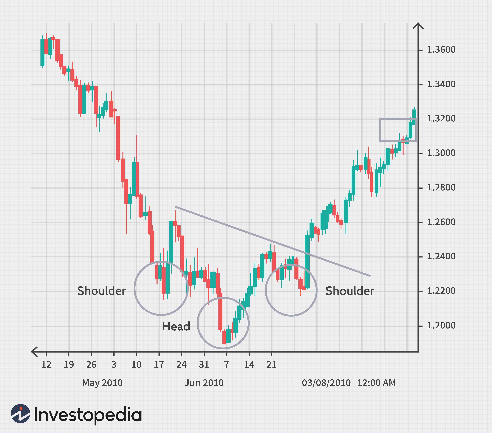

The domain of currency trading is continually advancing, with forex brokers persistently evolving to integrate new technologies and methods. As of October 2024, a significant trend among traders is the emphasis on algorithmic trading to amplify their forex operations. Algorithmic trading employs complex algorithms to automate trading activities, offering improved speed and efficiency over traditional trading methods. This article focuses on the crucial attributes that define forex brokers who provide solid platforms for algorithmic trading. It is critical to understand the advantages of algorithmic trading, its influence on the forex market, and identify the top brokers that are essential for an optimal trading experience. These brokers not only facilitate seamless trading activities but also empower traders by minimizing emotional bias and maximizing execution speed.

## Table of Contents



## Understanding Currency Trading and Forex Brokers

Currency trading, commonly referred to as forex (foreign exchange) trading, is the process of buying and selling currency pairs in a global market that operates without a centralized exchange. Unlike traditional stock markets, the forex market is decentralized, meaning trading occurs directly between parties, typically over-the-counter (OTC) via electronic networks. This structure enables the forex market to operate 24 hours a day, five days a week, across major financial centers in different time zones, making it one of the most accessible and liquid markets.

Forex brokers play a pivotal role by acting as intermediaries between traders and the market. They provide trading platforms where participants can execute trades, access timely market data, and utilize various analytical tools to inform their decision-making processes. A robust trading platform typically offers features such as real-time price feeds, charting software, technical analysis tools, and order execution services.

Among the essential services a forex broker provides, regulatory compliance is paramount. Brokers must adhere to regulations set by financial authorities to ensure fair and transparent trading practices. For instance, brokers in the United States are regulated by the National Futures Association (NFA) and the Commodity Futures Trading Commission (CFTC). In Europe, brokers often comply with the European Securities and Markets Authority (ESMA) and are subject to local regulatory bodies such as the UK's Financial Conduct Authority (FCA) or Cyprus Securities and Exchange Commission (CySEC).

Selecting a reliable forex broker involves evaluating several key factors aside from regulatory compliance. The quality of the trading platform, the execution speed, fee structures, customer support, and available educational resources are crucial considerations. Additionally, it is important to assess whether the broker offers a demo account to test the trading platform and develop strategies without financial risk.

As the forex market continues to evolve with technological advancements and increased competition, brokers that offer cutting-edge tools and comprehensive services are likely to attract a more extensive client base. Thus, traders must conduct thorough research to identify brokers that align with their trading objectives and offer the necessary tools and support to optimize their trading strategies.

## The Rise of Algorithmic Trading in Forex

Algorithmic trading, commonly referred to as algo trading, has become increasingly popular in the foreign exchange ([forex](/wiki/forex-system)) market due to its substantial benefits in terms of efficiency and precision. This innovative approach employs computer programs designed to automatically execute trades based on a set of predetermined criteria, which may include timing, price, quantity, or other mathematical models. By automating the trading process, algo trading significantly reduces the likelihood of human error, allowing for more consistent and unbiased trade execution.

One of the core advantages of [algorithmic trading](/wiki/algorithmic-trading) in the forex market is the reduction of emotional bias. Human traders are often influenced by emotions, which can lead to impulsive and irrational decisions. In contrast, algorithmic systems execute trades based purely on logic and data, adhering strictly to the pre-established trading strategy. This leads to more disciplined trading practices and can potentially increase profitability by avoiding mistakes driven by fear or greed.

Another key benefit of algo trading is the speed of execution. Algorithms can analyze multiple markets and instruments at once, identifying trading opportunities in fractions of a second. This rapid processing capability is especially critical in the forex market, where currency values can fluctuate rapidly in response to geopolitical events, economic releases, and other market-moving factors. By leveraging such speed, traders can capitalize on small price movements that might be unexploitable through manual trading.

Additionally, algorithmic trading allows for the efficient back-testing of trading strategies. Traders can use historical data to simulate how their algorithm would have performed in past market conditions. This provides valuable insights, enabling traders to refine and optimize their strategies before deploying them in the live market. For instance, a simple moving average crossover strategy could be tested with historical EUR/USD data to determine its viability.

The process of algorithmic trading can be exemplified through a basic Python script that performs a simple moving average crossover strategy:

```python
import pandas as pd

# Load historical data
data = pd.read_csv('historical_data.csv')
data['SMA50'] = data['Close'].rolling(window=50).mean()
data['SMA200'] = data['Close'].rolling(window=200).mean()

# Signal generation
data['Signal'] = 0
data.loc[data['SMA50'] > data['SMA200'], 'Signal'] = 1
data.loc[data['SMA50'] < data['SMA200'], 'Signal'] = -1

# Define trades based on signals
data['Position'] = data['Signal'].shift()

# Calculate returns
data['Return'] = data['Close'].pct_change()
data['StrategyReturn'] = data['Return'] * data['Position']

# Strategy performance
strategy_performance = data['StrategyReturn'].cumsum()
print(strategy_performance)
```

This script illustrates a simple moving average crossover strategy, where trades are triggered based on the crossover of two different period moving averages (SMA50 and SMA200). The strategy enters a long position when the shorter moving average crosses above the longer moving average and exits or goes short when it crosses below.

While algorithmic trading offers numerous advantages, it also presents challenges such as the need for robust infrastructure and the potential for technical failures. Ensuring the reliability of both hardware and software is crucial to mitigate risks. Despite these challenges, the continued advancements in technology and methodology in algorithmic trading are likely to reshape the landscape of the forex market, aiding traders in executing strategies with enhanced efficiency and precision.

## Essential Features of a Good Forex Broker for Algo Trading

When selecting a forex broker for algorithmic trading, examining the technology and tools they provide is imperative. One of the primary considerations is the robustness of the trading platform offered. A robust platform should not only handle high-frequency trading but also offer minimal latency. Latency, or lag time, can significantly impact trading outcomes since delays in trade execution can lead to missed opportunities or unfavorable price changes. An optimal platform should have latency measured in milliseconds, ensuring trades are executed almost instantaneously.

Furthermore, the platform should support a variety of programming languages and libraries that facilitate the development and testing of trading algorithms. Python is a popular choice due to its extensive libraries such as pandas for data analytics and NumPy for numerical computing. For example, traders could use a simple moving average (SMA) strategy with the following Python snippet:

```python
import pandas as pd

# Load your historical price data
data = pd.read_csv('price_data.csv')

# Calculate the 50-day and 200-day moving averages
data['50_SMA'] = data['Close'].rolling(window=50).mean()
data['200_SMA'] = data['Close'].rolling(window=200).mean()

# Generate trading signals
data['Signal'] = 0
data.loc[data['50_SMA'] > data['200_SMA'], 'Signal'] = 1
data.loc[data['50_SMA'] < data['200_SMA'], 'Signal'] = -1
```

This strategy signals a buy when the short-term average crosses above the long-term average and a sell when it crosses below.

Additionally, the availability of educational resources plays a crucial role in helping traders navigate and implement algorithmic strategies effectively. Brokers should provide comprehensive tutorials, webinars, and support materials that aid in understanding both the tools at their disposal and the intricacies of algorithmic trading. These resources should cater to different skill levels, from beginners to advanced traders, ensuring accessibility to all traders.

Customer support is another critical feature. Traders often require immediate assistance, especially when they encounter technical issues or have questions regarding platform functionalities. A broker with round-the-clock customer service, available through various channels, such as live chat, phone, and email, ensures traders receive timely support to maintain uninterrupted trading operations.

In summary, selecting a forex broker for algorithmic trading involves assessing the robustness of trading platforms, ensuring they offer minimal latency, support for high-frequency trading, and compatibility with popular programming languages. Additionally, educational resources and efficient customer support are indispensable components that facilitate a conducive environment for successful algorithmic trading.

## Top Forex Brokers for Algo Trading in October 2024

In 2024, the landscape of forex trading is particularly notable for the prominence of specific brokers excelling in algorithmic trading offerings. IC Markets is frequently highlighted for its exceptional range of platforms and robust support for diverse trading strategies. Known for its commitment to providing traders with cutting-edge technology, IC Markets facilitates both beginners and professional traders in executing complex algorithmic strategies efficiently. Their platforms offer low latency execution and access to various trading instruments, ensuring traders can capitalize on market opportunities promptly.

FXCM remains a prominent choice for traders looking to leverage advanced trading tools and extensive market access. With a strong focus on bridging the gap between technology and trading, FXCM provides a suite of APIs that enable seamless integration with algorithmic trading systems. This flexibility allows traders to deploy bespoke trading algorithms efficiently while accessing a wide array of financial markets.

[Interactive Brokers](/wiki/interactive-brokers-api) stands out due to its comprehensive algorithmic trading capabilities. The broker is renowned for its sophisticated trading platforms, which support an impressive range of order types and algorithms. Furthermore, Interactive Brokers provides its clientele with research tools and educational resources, empowering traders with the necessary knowledge to develop and implement successful trading algorithms.

Pepperstone and FP Markets excel by offering exceptional support for third-party trading platforms like MetaTrader and cTrader. These platforms are particularly popular in the algo trading community due to their compatibility with custom scripts and automated trading software. Pepperstone and FP Markets ensure that their clients benefit from stable, reliable trading environments that can handle the demands of high-frequency trading without compromising on execution speed or order accuracy. 

In conclusion, the top forex brokers of 2024 for algorithmic trading are distinguished by their commitment to technological innovation, comprehensive platform offerings, and robust support frameworks, all of which empower traders to optimize their algorithmic strategies.

## Pros and Cons of Algorithmic Trading

Algorithmic trading offers a significant advantage by automating the trading process. Automation minimizes the potential for human error, which can occur due to emotional and psychological biases that affect decision-making. Algorithms can execute trades at speeds and frequencies impossible for human traders, taking advantage of even the most fleeting market opportunities. 

However, developing a profitable algorithmic trading strategy is neither simple nor quick. It requires a deep understanding of trading principles, statistical analysis, and programming. The complexity increases as traders attempt to incorporate sophisticated models, such as [machine learning](/wiki/machine-learning) algorithms, to predict and respond to market movements. For instance, designing an efficient algorithm might involve statistical methods such as linear regression or moving averages, alongside code written in languages like Python:

```python
import pandas as pd
import numpy as np

# Sample code for a simple moving average crossover strategy
def moving_average(data, window):
    return data.rolling(window=window).mean()

def sma_crossover_strategy(data, short_window, long_window):
    signals = pd.DataFrame(index=data.index)
    signals['price'] = data
    signals['short_mavg'] = moving_average(data['price'], short_window)
    signals['long_mavg'] = moving_average(data['price'], long_window)
    signals['signal'] = 0
    signals['signal'][short_window:] = np.where(signals['short_mavg'][short_window:] > signals['long_mavg'][short_window:], 1, 0)

    return signals['signal']
```

Risk management is another critical aspect when deploying algorithmic trading. Over-optimization, also known as curve-fitting, is a common pitfall where the algorithm is tweaked to perform exceptionally well on historical data but fails to perform in live market conditions. This occurs because the algorithm has essentially memorized past patterns that may not recur. Another risk is slippage, which refers to the difference between expected prices of trades and the actual prices. In highly volatile markets, slippage can be exacerbated, leading to unanticipated losses.

While algorithmic trading provides a means to remove some of the psychological barriers associated with manual trading, it introduces technical challenges and risks that must be managed. Properly balancing the efficiency of automation with diligent risk management is crucial for traders looking to leverage the benefits of algorithmic trading successfully.

## Conclusion and Future Outlook

As we look towards the future, the role of algorithmic trading in forex is set to expand further. With advancements in technology, algorithmic trading is becoming increasingly sophisticated, integrating [artificial intelligence](/wiki/ai-artificial-intelligence) and machine learning algorithms to offer enhanced predictive capabilities. This evolution allows traders to develop more refined strategies, automate complex trading decisions, and execute transactions with unprecedented speed and accuracy. According to a report by Research and Markets, the global algorithmic trading market is projected to grow at a CAGR of over 10% from 2021 to 2026, indicating its rising significance in the trading ecosystem (source: Research and Markets).

Forex brokers that adapt to these changes by offering advanced tools and platforms will lead the way. In particular, brokers that provide robust infrastructure supporting high-frequency trading systems, low-latency execution, and comprehensive APIs for algorithm customization are likely to attract more professional traders. Furthermore, these brokers often invest in advanced security measures and regulatory compliance to protect traders' interests and build trust. 

For traders, staying informed and choosing the right broker is essential to leverage the full potential of algo trading. The selection of a broker with cutting-edge technology and reliable customer support can significantly influence trading outcomes. As algorithmic trading continues to grow, traders should consider brokers that offer educational resources to help them stay updated with the latest tools and strategies. Engaging with community forums and expert webinars can also provide valuable insights into optimizing algorithmic trading systems.

In conclusion, algorithmic trading is poised to revolutionize the forex market further. Traders and brokers who embrace technological advancements and continue to adapt to market changes will position themselves favorably in what promises to be a dynamically evolving landscape.

## References & Further Reading

[1]: Bergstra, J., Bardenet, R., Bengio, Y., & Kégl, B. (2011). ["Algorithms for Hyper-Parameter Optimization."](https://papers.nips.cc/paper/4443-algorithms-for-hyper-parameter-optimization) Advances in Neural Information Processing Systems 24.

[2]: ["Advances in Financial Machine Learning"](https://www.amazon.com/Advances-Financial-Machine-Learning-Marcos/dp/1119482089) by Marcos Lopez de Prado

[3]: ["Evidence-Based Technical Analysis: Applying the Scientific Method and Statistical Inference to Trading Signals"](https://www.amazon.com/Evidence-Based-Technical-Analysis-Scientific-Statistical/dp/0470008741) by David Aronson

[4]: ["Machine Learning for Algorithmic Trading"](https://github.com/PacktPublishing/Machine-Learning-for-Algorithmic-Trading-Second-Edition) by Stefan Jansen

[5]: ["Quantitative Trading: How to Build Your Own Algorithmic Trading Business"](https://books.google.com/books/about/Quantitative_Trading.html?id=j70yEAAAQBAJ) by Ernest P. Chan