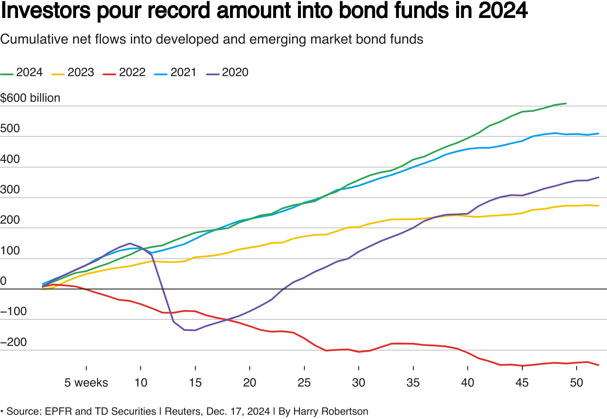

## Table of Contents

## What is a bond fund?

A bond fund is a type of investment fund that mainly invests in bonds. Bonds are like loans that you give to a company or government, and in return, they pay you interest over time. When you invest in a bond fund, your money is pooled with money from other investors to buy a variety of bonds. This helps spread out the risk because if one bond doesn't do well, the others might make up for it.

Bond funds can be a good choice if you want to earn steady income from your investments. They usually pay out interest to investors regularly, which can be monthly, quarterly, or yearly. Bond funds can also be less risky than investing in stocks, but they might not grow as much in value over time. It's important to look at the specific bond fund's goals and what kinds of bonds it invests in to see if it fits with your investment plans.

## Why should someone invest in global bond funds?

Investing in global bond funds can help you spread your risk. When you put your money into bonds from different countries, you're not relying on just one place's economy. If one country's economy is doing badly, bonds from other countries might still do well. This can make your investment safer because it's less likely that all your bonds will lose value at the same time.

Global bond funds can also give you a chance to earn more money. Different countries have different interest rates, and sometimes you can find higher rates in other parts of the world. By investing in global bond funds, you can take advantage of these higher rates and possibly get more income from your investments. Plus, it's a way to learn about and be part of the global economy, which can be exciting and educational.

## What are the different types of global bond funds?

Global bond funds come in different types, and each type focuses on different things. One type is called government bond funds. These funds invest in bonds that are issued by governments from around the world. These are usually seen as safe because governments are less likely to go bankrupt. Another type is corporate bond funds. These invest in bonds from companies all over the world. Corporate bonds can pay more interest than government bonds, but they can also be riskier because companies can go out of business.

Another type of global bond fund is called emerging market bond funds. These funds invest in bonds from countries that are still growing their economies, like some countries in Asia, Latin America, and Africa. These bonds can offer high returns, but they can also be very risky because these countries' economies can change a lot. There are also high-yield bond funds, which invest in bonds that pay high interest rates but are riskier because they are from companies or countries that might have a harder time paying back their debts.

Lastly, there are diversified global bond funds. These funds mix different types of bonds from around the world, like government bonds, corporate bonds, and emerging market bonds. By spreading the money across different types of bonds, these funds try to balance the risk and reward. This can be a good choice if you want to invest in global bonds but don't want to focus too much on one type of bond.

## How do global bond funds differ from domestic bond funds?

Global bond funds and domestic bond funds are different mainly because of where they invest their money. A global bond fund puts money into bonds from many different countries around the world. This can include bonds from places like the United States, Japan, Germany, and even smaller countries. On the other hand, a domestic bond fund only invests in bonds from one country, usually the country where the investor lives. For example, if you live in the United States, a domestic bond fund would only buy bonds from the U.S. government or U.S. companies.

The other big difference is the level of risk and potential reward. Global bond funds can help spread out risk because they invest in many different countries. If one country's economy is not doing well, the bonds from other countries might still do okay. This can make your investment safer. But, global bond funds can also be riskier because they might invest in countries with unstable economies. Domestic bond funds, on the other hand, might be less risky because they focus on one country's economy, which you might know more about. But, they also miss out on the chance to earn more money from higher interest rates in other countries.

## What are the risks associated with investing in global bond funds?

Investing in global bond funds can be riskier than sticking to bonds from just one country. One big risk is that the value of the money from different countries can change. This is called currency risk. If the currency of a country where the fund has invested goes down compared to your own country's money, you could lose money even if the bond itself is doing well. Another risk is that some countries might have unstable economies or political problems. If a country's economy gets worse or if there's a big political change, the bonds from that country could lose value quickly.

There's also something called [interest rate](/wiki/interest-rate-trading-strategies) risk. When interest rates go up in a country, the value of the bonds from that country can go down. Since global bond funds invest in many different countries, they can be affected by interest rate changes all over the world. This makes it harder to predict what will happen to your investment. Finally, global bond funds can be more expensive to manage because the people running the fund need to keep track of what's happening in many different countries. These higher costs can eat into the money you earn from the fund.

## How can one evaluate the performance of a global bond fund?

To evaluate the performance of a global bond fund, you should first look at its total return. This tells you how much money the fund has made or lost over a certain time, like a year or five years. Total return includes both the interest payments from the bonds and any changes in the value of the bonds themselves. You can compare the total return of the fund to other similar global bond funds to see if it's doing better or worse. Also, it's good to compare it to a benchmark, like a global bond index, which shows how the overall market is doing.

Another thing to consider is the fund's risk-adjusted return. This means looking at how much risk the fund took to get its returns. A common way to measure this is by looking at the fund's Sharpe ratio, which shows how much extra return you get for each bit of risk you take. A higher Sharpe ratio is better because it means the fund is giving you more return for the risk you're taking. You should also check the fund's [volatility](/wiki/volatility-trading-strategies), which shows how much the fund's value goes up and down. A fund with less volatility might be a safer choice, even if its total return is a bit lower.

Lastly, it's important to look at the fund's expenses. This includes the management fee, which is what you pay the people running the fund, and any other costs. These expenses can eat into your returns, so a fund with lower costs might give you more money in the end. You can also read the fund's prospectus to understand its investment strategy and see if it matches what you want. Talking to a financial advisor can help you make sense of all this information and choose the right global bond fund for you.

## Which are the top-rated global bond funds currently available?

Some of the top-rated global bond funds right now are the PIMCO Global Bond Fund (USD-Hedged), the Vanguard Global ex-U.S. Real Estate Index Fund, and the BlackRock Strategic Global Bond Fund. These funds are known for their strong performance and good management. The PIMCO Global Bond Fund is popular because it tries to protect investors from changes in currency values. The Vanguard fund focuses on real estate bonds from outside the U.S., which can be a good way to spread your risk. The BlackRock fund is liked because it mixes different types of bonds from around the world to balance risk and reward.

These funds have been doing well because they are run by experienced managers who know a lot about global markets. They also have lower fees than many other funds, which means more of the money you earn stays with you. It's always a good idea to check the latest ratings and reviews from places like Morningstar or Lipper, as these can change over time. Remember, even the best-rated funds come with risks, so make sure to read up on each fund and maybe talk to a financial advisor before you invest.

## What factors should be considered when choosing a global bond fund?

When choosing a global bond fund, it's important to think about your own goals and how much risk you're okay with. Different funds have different levels of risk. Some might focus on safer government bonds, while others might go for riskier corporate or emerging market bonds. You should pick a fund that matches what you want to achieve with your money. If you want steady income with less risk, a fund with mostly government bonds might be good. But if you're okay with more risk for the chance to earn more money, a fund with a mix of different types of bonds could be better.

Another thing to look at is how well the fund has done in the past and what it costs to invest in it. Check the fund's total return over different periods like one year, three years, and five years. This will show you if the fund has been doing well. Also, compare the fund's performance to a benchmark like a global bond index to see if it's beating the market. Don't forget to look at the fees. Funds with lower fees can save you money over time because you get to keep more of your returns. Talking to a financial advisor can help you understand all these factors and choose the right global bond fund for you.

## How do interest rates and currency fluctuations impact global bond funds?

Interest rates and currency fluctuations can have a big impact on global bond funds. When interest rates go up in a country, the value of the bonds from that country usually goes down. This is because new bonds will be issued with higher interest rates, making the older bonds with lower rates less attractive to investors. Since global bond funds invest in bonds from many different countries, they can be affected by interest rate changes all over the world. This makes it harder to predict what will happen to the value of the fund, because it depends on what's happening in many different economies.

Currency fluctuations are another important [factor](/wiki/factor-investing). When the value of one country's money changes compared to another country's money, it can affect the returns of a global bond fund. For example, if the fund has invested in bonds from a country whose currency gets weaker, the value of those bonds in your own country's money will go down, even if the bonds themselves are doing well. This is called currency risk. Some global bond funds try to protect against this by using strategies like currency hedging, but it's still something to think about when you're choosing a fund.

## What is the role of diversification in global bond fund investments?

Diversification is really important when you invest in global bond funds. It means spreading your money across different types of bonds from many countries. When you do this, you're not putting all your eggs in one basket. If one country's economy has problems, the bonds from other countries might still do well. This can help keep your investment safer because it's less likely that all your bonds will lose value at the same time.

By investing in global bond funds, you can take advantage of different interest rates around the world. Some countries might have higher interest rates than your own country, so by investing globally, you can earn more money from those higher rates. Diversification also lets you learn about and be part of the global economy, which can be exciting and educational. Overall, diversification in global bond funds can help balance the risk and reward of your investments.

## How do global economic conditions affect the performance of global bond funds?

Global economic conditions play a big role in how well global bond funds do. When the world economy is doing well, countries might have stronger currencies and lower interest rates, which can make bonds from those countries more valuable. But if the global economy is struggling, some countries might raise interest rates to fight inflation, which can make the value of their bonds go down. Also, if a country's economy is in trouble, it might be harder for them to pay back their debts, making their bonds riskier.

Currency changes are another way global economic conditions affect global bond funds. If the money from one country gets weaker compared to other countries' money, the value of bonds from that country can drop when you change it back to your own country's money. This can happen if a country's economy is not doing well or if there are big political changes. On the other hand, if a country's currency gets stronger, the value of its bonds can go up. So, when you invest in global bond funds, you need to keep an eye on what's happening in economies all around the world.

## What advanced strategies can be used to optimize returns from global bond funds?

One advanced strategy to optimize returns from global bond funds is to use currency hedging. This means using special financial tools to protect against changes in the value of different countries' money. If you think the value of a country's money might go down, you can use currency hedging to lessen the risk. This can help keep your returns more stable, even if the currency changes a lot. Another strategy is to focus on bonds from countries with high interest rates. By investing in bonds from these countries, you can earn more money from the interest payments, but you need to be careful because high interest rates can also mean higher risk.

Another way to optimize returns is to use a strategy called duration management. This means adjusting how long you hold onto the bonds based on what you think will happen with interest rates. If you think interest rates will go up, you might choose shorter-term bonds because they are less affected by interest rate changes. If you think rates will go down, longer-term bonds might be better because they can give you higher returns. Lastly, you can also use a strategy called sector rotation, where you move your money between different types of bonds, like government bonds, corporate bonds, and emerging market bonds, based on which ones are doing well at the time. This can help you take advantage of different opportunities around the world and potentially earn more money.

## What are the challenges and considerations?

Adopting global bond funds and [algorithmic trading](/wiki/algorithmic-trading) as part of an investment strategy involves navigating a complex web of market dynamics and inherent risks. A critical aspect of managing global bond funds is understanding how macroeconomic factors such as interest rate fluctuations can significantly affect bond prices. For example, an increase in interest rates tends to depress bond prices, which can subsequently impact the overall yield of a global bond fund. This is quantified by the bond's duration, a measure of sensitivity to interest rate changes. Investors must be aware of the relationship:

$$
\Delta P \approx -D \times \Delta y
$$

where $\Delta P$ is the price change, $D$ is the bond's duration, and $\Delta y$ is the change in yield. This equation highlights the inverse relationship between bond prices and interest rates, serving as a foundational concept for managing interest rate risk.

Geopolitical events also pose significant risks to the performance of global bond funds. Political instability, changes in government policies, or international conflicts can lead to market volatility and impact currency valuations, which are critical for bond returns denominated in foreign currencies. Such volatility can necessitate adjustments in a portfolio, emphasizing the need for continuous market monitoring and risk assessment.

Algorithmic trading, while enhancing trading efficiency and decision-making speed, introduces its own set of ethical and operational challenges. Algorithms are designed to exploit market inefficiencies, but they may inadvertently contribute to market volatility if not carefully monitored and controlled. The "flash crash" of 2010, where rapid algorithmic trades led to a dramatic stock market drop, exemplifies the potential for disruption.

Moreover, algorithmic trading raises ethical considerations related to transparency and fairness. These systems operate on pre-set criteria, which might inadvertently favor certain market participants over others. Ensuring fairness and mitigating risks of market manipulation are essential issues that investors need to address.

The complexity of these issues underscores the importance of a thorough understanding of the market and well-crafted strategies to counter risks. Investors must ensure that risk management strategies are robust, incorporating stress testing and scenario analysis to account for potential shocks. Regulations and compliance frameworks play a critical role in guiding ethical and efficient use of technology in trading, thereby helping to maintain market integrity. 

In conclusion, while global bond funds and algorithmic trading offer sophisticated avenues for enhancing portfolio returns, careful planning and a nuanced understanding of market dynamics are crucial to mitigating associated risks.

## References & Further Reading

[1]: López de Prado, M. (2018). ["Advances in Financial Machine Learning."](https://www.amazon.com/Advances-Financial-Machine-Learning-Marcos/dp/1119482089) Wiley.

[2]: Aronson, D. R. (2007). ["Evidence-Based Technical Analysis: Applying the Scientific Method and Statistical Inference to Trading Signals."](https://onlinelibrary.wiley.com/doi/book/10.1002/9781118268315) Wiley.

[3]: Chan, E. P. (2008). ["Quantitative Trading: How to Build Your Own Algorithmic Trading Business."](https://github.com/ftvision/quant_trading_echan_book) Wiley.

[4]: Jansen, S. (2020). ["Machine Learning for Algorithmic Trading."](https://github.com/stefan-jansen/machine-learning-for-trading) Packt Publishing.

[5]: Powell, A. (2014). ["Global Bond Funds: Investment Options and Strategies."](https://www.morningstar.com/best-investments/global-bond-funds) CFA Institute.