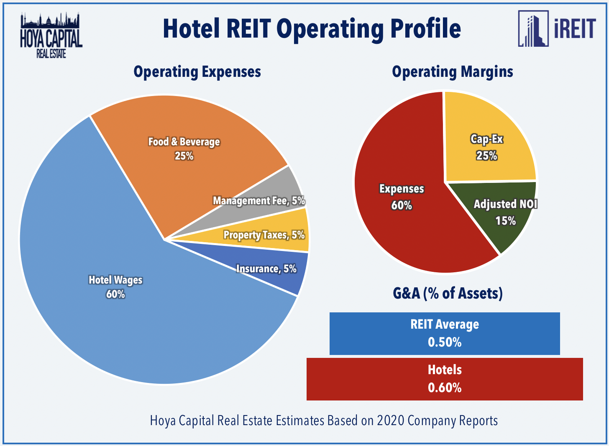

## Table of Contents

## What is a REIT and how does it function in the hotel industry?

A REIT, or Real Estate Investment Trust, is a company that owns, operates, or finances income-generating real estate. It's like a big pool of money from many investors that is used to buy properties. REITs are popular because they allow people to invest in real estate without having to buy a whole building themselves. They also have to pay out most of their income as dividends to shareholders, which can be attractive for people looking for regular income.

In the hotel industry, a REIT might own several hotels and lease them to hotel operators who run the day-to-day business. This way, the REIT earns money from the rent paid by the hotel operators. The hotel operators, on the other hand, focus on providing great service to guests without worrying about owning the building. This setup can be good for both sides because the REIT gets steady rental income, and the hotel operators can use their skills to make the hotels successful.

## What are the key differences between HPT and INN as hotel REITs?

HPT, or Hospitality Properties Trust, and INN, or Summit Hotel Properties, are both hotel REITs, but they have some key differences. HPT owns a diverse portfolio of hotels and also invests in travel centers and wellness centers. This means HPT spreads its investments across different types of properties, which can help balance risk. On the other hand, INN focuses mainly on owning upscale hotels in the upper midscale and upscale segments. INN's strategy is to target specific markets and hotel types that they believe will perform well.

Another difference is how they manage their properties. HPT often leases its hotels to third-party operators who run the day-to-day operations. This means HPT earns money from rent and doesn't have to worry about managing the hotels directly. INN, however, tends to have more hands-on management. They work closely with hotel brands and management companies to ensure their properties are run efficiently and meet high standards. This approach can lead to better control over the guest experience and potentially higher profits, but it also means more direct involvement in operations.

## How did HPT perform financially in 2020?

In 2020, HPT faced big challenges because of the global health crisis. The hotel industry was hit hard as fewer people traveled, and many hotels had to close or operate with fewer guests. HPT's revenue dropped a lot that year. They had to work with their hotel operators to adjust leases and find ways to keep their business going. Despite these challenges, HPT tried to keep paying dividends to its investors, but the amount was lower than in previous years.

Even with the difficulties, HPT managed to keep its business running. They focused on taking care of their properties and working closely with their tenants. HPT also looked for new ways to make money, like investing more in travel centers and wellness centers. By the end of 2020, HPT was still standing, but it was clear that the road to recovery would take time and effort.

## What was the financial performance of INN in 2020?

In 2020, INN, like many hotel REITs, faced tough times because of the global health crisis. With fewer people traveling, their hotels saw a big drop in guests and revenue. INN had to close some hotels and operate others with limited services. This led to a sharp decrease in their income for the year. To handle this, INN worked with hotel brands and management companies to cut costs and find new ways to bring in money.

Despite these challenges, INN managed to keep going. They focused on taking good care of their properties and making sure they were ready for when travel picked up again. INN also tried to keep paying dividends to their investors, but the amount was much lower than before. By the end of 2020, INN was still in business, but it was clear that recovering would take time and effort.

## What are the primary assets owned by HPT?

HPT owns a bunch of different kinds of properties. They have a lot of hotels, which are their main thing. These hotels are all over the United States and can be big or small, fancy or more budget-friendly. HPT doesn't just stick to hotels though. They also own travel centers, which are like big rest stops where truck drivers and travelers can stop to rest, eat, and get gas. 

Besides hotels and travel centers, HPT also has wellness centers. These are places where people go to get medical treatments or relax and take care of their health. By having a mix of hotels, travel centers, and wellness centers, HPT tries to make sure they have different ways to make money. This can help them stay strong even if one type of property isn't doing so well.

## What types of properties does INN focus on?

INN focuses on owning hotels that are a bit nicer than the average hotel. They call these "upscale" and "upper midscale" hotels. These hotels are usually in good spots where people like to travel, like near airports or in busy cities. INN tries to pick hotels that they think will do well and make money.

INN doesn't just buy any hotel though. They work with big hotel brands like Marriott and Hilton. This helps them make sure their hotels are run well and that guests have a good time. By sticking to these kinds of hotels and working with trusted brands, INN tries to keep their business strong and make sure their hotels are always in good shape.

## How did the COVID-19 pandemic impact HPT and INN in 2020?

The COVID-19 pandemic hit HPT hard in 2020. Because people stopped traveling, HPT's hotels had fewer guests and made a lot less money. HPT had to work with their hotel operators to change lease agreements and find ways to keep going. They also had to close some hotels and cut back on services in others. Even though things were tough, HPT tried to keep paying dividends to their investors, but the amount was a lot smaller than before. By the end of the year, HPT was still around, but they knew it would take time to get back to normal.

INN also struggled a lot because of the pandemic in 2020. With travel down, their hotels saw a big drop in guests and revenue. INN had to close some hotels and run others with fewer services. They worked with hotel brands and management companies to cut costs and find new ways to make money. INN also tried to keep paying dividends to their investors, but the amount was much lower than usual. By the end of 2020, INN was still in business, but like HPT, they knew recovering would take time and effort.

## What strategies did HPT employ to mitigate the effects of the 2020 economic downturn?

In 2020, HPT faced a tough time because of the economic downturn caused by the global health crisis. To handle this, HPT worked closely with their hotel operators to change lease agreements. This helped both HPT and the operators deal with the drop in guests and income. HPT also tried to find new ways to make money by focusing more on their travel centers and wellness centers. These places were still useful for people even if they weren't traveling as much.

Despite the challenges, HPT kept going. They made sure to take good care of their properties so they would be ready when things got better. HPT also tried to keep paying dividends to their investors, even if the amount was smaller than before. By the end of the year, HPT was still standing, but they knew that getting back to normal would take time and a lot of effort.

## How did INN adapt its business model in response to 2020's challenges?

In 2020, INN had to make big changes because of the global health crisis. They worked closely with big hotel brands like Marriott and Hilton to cut costs and keep their hotels running. INN had to close some hotels and run others with fewer services because fewer people were traveling. They also looked for new ways to make money, like offering special deals to attract guests who still wanted to travel.

Even though things were tough, INN tried to keep paying dividends to their investors, but the amount was a lot smaller than usual. They focused on taking good care of their properties so they would be ready when travel picked up again. By the end of 2020, INN was still in business, but they knew it would take time and effort to get back to normal.

## What are the future growth prospects for HPT based on 2020 data?

Looking at the data from 2020, HPT's future growth prospects seem tough but hopeful. The global health crisis hit the hotel industry hard, and HPT had to deal with a big drop in income. They had to close some hotels and change how they worked with their operators. But HPT didn't give up. They started focusing more on their travel centers and wellness centers, which helped them keep making money even when fewer people were traveling.

Even though 2020 was a hard year, HPT is still in a good spot for the future. They took care of their properties and worked hard to keep their business going. As travel starts to pick up again, HPT can use their diverse mix of hotels, travel centers, and wellness centers to grow. It might take some time, but with smart planning and hard work, HPT has a chance to do well in the future.

## How does INN plan to expand or improve its portfolio post-2020?

After 2020, INN plans to grow and make its hotels better. They want to keep buying more upscale and upper midscale hotels in places where people like to travel. INN will work closely with big hotel brands like Marriott and Hilton to make sure their hotels are run well and guests have a good time. They also want to make their hotels nicer by fixing them up and adding new things that guests will like.

Even though 2020 was a hard year, INN thinks they can do well in the future. They will keep a close eye on what people want when they travel and try to meet those needs. By taking good care of their hotels and [picking](/wiki/asset-class-picking) the right places to buy new ones, INN hopes to bring in more guests and make more money. It might take some time, but with smart planning and hard work, INN believes they can keep growing and improving.

## What are the expert opinions on the investment potential of HPT and INN as of the end of 2020?

At the end of 2020, experts had mixed feelings about HPT's investment potential. The global health crisis had hit HPT hard, causing a big drop in their income. But some experts thought HPT could still be a good investment because they own a mix of hotels, travel centers, and wellness centers. This mix could help HPT make money even if one type of property isn't doing well. Experts also liked that HPT was working hard to keep their business going and taking care of their properties. But they warned that it might take some time for HPT to get back to normal, so investors needed to be patient.

For INN, experts also had different opinions at the end of 2020. The hotel industry was struggling, and INN's income had dropped a lot. But some experts thought INN could still be a good investment because they focus on nicer hotels in good spots. INN's close work with big hotel brands like Marriott and Hilton could help them run their hotels well and attract more guests. Experts liked that INN was trying to cut costs and find new ways to make money. But they also said that investors should be ready for a slow recovery, as it might take time for INN to get back on track.

## What is a comparative overview of INN and HPT?

Both Summit Hotel Properties (INN) and Hospitality Properties Trust (HPT) are significant entities within the hotel REIT sector, each characterized by diverse property portfolios that cater to different market segments.

Summit Hotel Properties (INN) specializes in owning upscale and upper-midscale hotels, strategically located in densely populated urban areas that attract significant business and leisure visitors. Their properties are typically found in cities or regions with robust economic activity, where there is a consistent high demand for hotel accommodation. This strategic positioning allows INN to capitalize on both business and leisure travel, thereby ensuring steady revenue streams and maximizing occupancy rates. INN’s portfolio consists of properties under well-regarded brands, contributing to their credibility and attracting a loyal customer base, thus enhancing their market presence and growth potential.

Hospitality Properties Trust (HPT), known today as Service Properties Trust (SVC), differentiates itself with a broader investment strategy that encompasses a wide variety of property types. HPT focuses on high-end franchises, including globally recognized brands such as Marriott and Hyatt. This diversification reduces risk and vulnerability to market fluctuations, as it spreads exposure across various geographic locations and market segments. HPT thrives on luxury and high-quality services, leveraging brand reputation to achieve higher prices per available room (RevPAR) and maintaining a competitive edge in the hospitality sector.

Performance analysis of INN and HPT often employs key metrics like Funds from Operations (FFO) and market occupancy rates. FFO is a critical measure used by REITs to evaluate operating performance, reflecting the cash generated from their real estate operations. It is calculated by adjusting net income for depreciation and amortization, which are non-cash expenses, and also typically excludes gains or losses on property sales. The formula is as follows:

$$
\text{FFO} = \text{Net Income} + \text{Depreciation} + \text{Amortization} - \text{Gains on Sale of Property}
$$

Market occupancy rates provide insights into the utilization levels of their hotel properties and are indicative of revenue potential. High occupancy rates usually mean strong demand and effective pricing strategies, which can translate into robust financial performance.

Together, these metrics offer a comprehensive view of each entity’s growth strategies and potential. While INN capitalizes on strategically placed urban properties to meet high tourism and business demands, HPT benefits from a diverse asset base across premium hotel brands, allowing flexibility and resilience in changing market conditions. Both approaches underscore their respective strengths in navigating the complexities of the hotel real estate investment landscape.

## References & Further Reading

[1]: Bergstra, J., Bardenet, R., Bengio, Y., & Kégl, B. (2011). ["Algorithms for Hyper-Parameter Optimization."](https://dl.acm.org/doi/10.5555/2986459.2986743) Advances in Neural Information Processing Systems 24.

[2]: ["Advances in Financial Machine Learning"](https://www.amazon.com/Advances-Financial-Machine-Learning-Marcos/dp/1119482089) by Marcos Lopez de Prado

[3]: ["Evidence-Based Technical Analysis: Applying the Scientific Method and Statistical Inference to Trading Signals"](https://www.amazon.com/Evidence-Based-Technical-Analysis-Scientific-Statistical/dp/0470008741) by David Aronson

[4]: ["Machine Learning for Algorithmic Trading"](https://github.com/stefan-jansen/machine-learning-for-trading) by Stefan Jansen

[5]: ["Quantitative Trading: How to Build Your Own Algorithmic Trading Business"](https://www.amazon.com/Quantitative-Trading-Build-Algorithmic-Business/dp/1119800064) by Ernest P. Chan