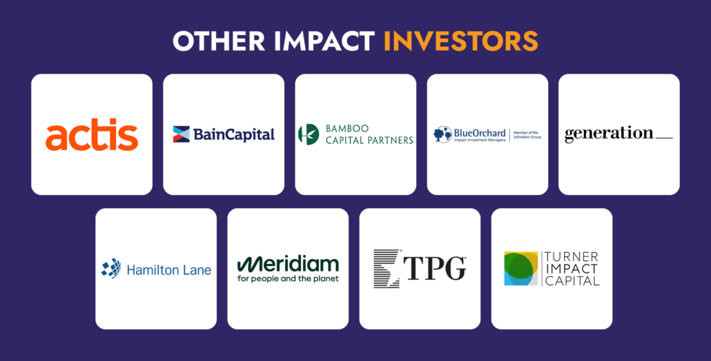

## Table of Contents

## What is impact investing?

Impact investing is when people or organizations invest money into companies, projects, or funds with the goal of making a positive impact on society or the environment, while also earning a financial return. It's different from traditional investing, where the main focus is just on making money. With impact investing, the investors care about both making money and making a difference.

For example, someone might invest in a company that builds affordable housing or one that develops clean energy technology. By doing this, they help address important issues like homelessness or climate change, but they also expect to get their money back with some profit. Impact investing is becoming more popular as more people want their investments to reflect their values and contribute to a better world.

## How does impact investing differ from traditional investing?

Impact investing is different from traditional investing because it focuses on two goals at the same time: making money and making a positive impact on the world. Traditional investing is mainly about earning the highest financial return possible. People who do traditional investing usually pick stocks, bonds, or other investments based on how much money they think they can make, without thinking much about the social or environmental effects of their choices.

On the other hand, impact investors care about both [earning](/wiki/earning-announcement) money and helping solve problems like poverty, climate change, or poor health care. They might choose to invest in a company that builds affordable homes or one that creates renewable energy solutions. While they still want to see a financial return, their investments are also chosen to support specific social or environmental goals. This dual focus sets impact investing apart from the single-minded profit focus of traditional investing.

## What are the main goals of impact investing firms?

Impact investing firms aim to make money while also making the world a better place. They want their investments to help solve big problems like poverty, climate change, and poor health care. These firms look for companies or projects that are working on these issues and invest in them. By doing this, they hope to support positive changes in society and the environment.

At the same time, impact investing firms still need to earn a profit. They can't just focus on helping others; they also have to make sure their investors get their money back with some extra. This means they have to carefully choose investments that both do good and make good financial sense. Balancing these two goals—earning money and making an impact—is what makes impact investing unique.

## Can you name some leading impact investing firms?

Some leading impact investing firms are The Rise Fund, managed by TPG, and Bain Capital's Double Impact. The Rise Fund focuses on investments that can improve education, health, and the environment. They look for companies that can grow and make a big difference in these areas. Bain Capital's Double Impact also aims to support businesses that create positive social and environmental outcomes. They invest in areas like health care, education, and sustainable living.

Another well-known firm is Generation Investment Management, co-founded by Al Gore. They focus on sustainable investing and try to find companies that can help fight climate change and other global issues. They believe that companies that are good for the planet can also be good for their investors' wallets. These firms show that it's possible to make money and make the world a better place at the same time.

## What sectors do leading impact investing firms typically focus on?

Leading impact investing firms often focus on sectors like health care, education, and the environment. They choose these areas because they can make a big difference in people's lives. For example, investing in health care can help more people get the care they need. Education investments can help more kids learn and grow. And by focusing on the environment, these firms can help fight climate change and protect our planet.

Some firms also look at sustainable living and affordable housing. They want to support businesses that help people live better lives while using fewer resources. Affordable housing investments can help more people find a good place to live without spending too much money. All these sectors are important because they help solve big problems and make the world a better place. By choosing to invest in these areas, impact investing firms show that they care about both making money and making a difference.

## How do impact investing firms measure their impact?

Impact investing firms measure their impact by looking at how their investments help solve big problems. They use something called "impact metrics" to see if their money is making a difference. These metrics can be things like how many people got better health care, how many kids learned to read, or how much less pollution there is because of their investments. By keeping track of these numbers, firms can see if they are meeting their goals of making the world a better place.

To make sure they are measuring impact the right way, many impact investing firms follow standards set by groups like the Global Impact Investing Network (GIIN). These standards help firms use the same methods to measure their impact, so they can compare their results with others. This also makes it easier for investors to see how their money is being used to help people and the planet. By using these standards, impact investing firms can show that they are serious about making a difference, not just making money.

## What are the financial returns like for investments made by leading impact investing firms?

The financial returns for investments made by leading impact investing firms can be pretty good. They aim to make money while also helping the world, so they look for companies that can do both. Studies show that impact investments can give returns that are similar to, or sometimes even better than, traditional investments. For example, a report by the Global Impact Investing Network (GIIN) found that many impact investors see returns that meet or beat their targets.

But, the returns can vary depending on what kind of impact investment it is. Some investments, like those in clean energy or affordable housing, might take longer to pay off but can still be profitable in the long run. Other investments, like those in health care or education, might see quicker returns. Impact investing firms work hard to find the right balance between making money and making a difference, and they use their expertise to choose investments that can achieve both goals.

## What challenges do impact investing firms face?

Impact investing firms face some tough challenges. One big problem is finding the right balance between making money and making a difference. They need to find investments that help solve big problems like poverty or climate change, but these investments also have to make money for their investors. This can be hard because sometimes the best way to help the world might not be the best way to make money quickly.

Another challenge is measuring the impact of their investments. Impact investing firms need to show that their money is really making a difference. They use special tools and standards to measure this, but it can be tricky. Different people might have different ideas about what "making a difference" means, and it can be hard to agree on the best way to measure it. Plus, some of the changes they want to see, like better education or less pollution, can take a long time to happen, which makes it even harder to measure the impact right away.

## How do leading impact investing firms select their investments?

Leading impact investing firms choose their investments by looking at both how much money they can make and how much good they can do. They start by finding companies or projects that are working on big problems like health care, education, or the environment. They want to invest in businesses that can make a real difference in these areas. But they also need to make sure these investments will give their investors a good return on their money. So, they carefully study the business plans and financial health of these companies to see if they can both help the world and make money.

To make their choices, these firms use a lot of research and data. They look at things like how much impact an investment could have, how likely it is to succeed, and how much profit it might make. They often use special tools and standards to measure the impact, like those from the Global Impact Investing Network (GIIN). This helps them compare different investments and pick the ones that best meet their goals. By doing all this homework, impact investing firms try to find the best balance between making money and making a difference.

## What role do leading impact investing firms play in sustainable development?

Leading impact investing firms play a big role in sustainable development. They help by putting money into companies and projects that work on important issues like health care, education, and the environment. These firms want to make the world a better place, so they choose investments that can help solve big problems. For example, they might invest in a company that builds affordable homes or one that makes clean energy. By doing this, they help more people live better lives and protect the planet.

At the same time, these firms need to make money for their investors. They look for businesses that can both do good and make good financial sense. This means they have to be smart about where they put their money. They use a lot of research and special tools to pick the best investments. By balancing the need to make money with the goal of helping the world, impact investing firms show that it's possible to do both. This helps push forward sustainable development by supporting projects that can last a long time and make a real difference.

## How can someone invest in leading impact investing firms?

To invest in leading impact investing firms, you can start by looking at well-known firms like The Rise Fund, Bain Capital's Double Impact, or Generation Investment Management. These firms manage funds that focus on making a positive impact on the world while also earning a profit. You can visit their websites to learn more about their investment strategies and the kinds of companies they support. Many of these firms have minimum investment amounts, so you'll need to check if you can meet those requirements.

Once you've picked a firm, you'll need to go through their investment process. This usually involves filling out an application and talking with someone from the firm about your goals and how much you want to invest. They will explain how your money will be used and what kind of returns you might expect. It's important to ask questions and make sure you understand everything before you invest. By putting your money into these firms, you can help support projects that make the world a better place while also earning a financial return.

## What future trends are expected in the field of impact investing?

In the future, impact investing is expected to grow a lot. More and more people want to put their money into things that help the world, not just make money. This means more money will go into areas like clean energy, health care, and education. Big companies and governments might also start using impact investing more to solve big problems. As more people learn about impact investing, it will become a normal part of how people think about their money.

Another trend is that technology will play a bigger role in impact investing. New tools and data will help investors see exactly how their money is making a difference. This will make it easier to pick the best investments and show others what works. Also, new kinds of investments, like those in space or new technology, might become popular. Overall, impact investing will keep growing and changing to help make the world a better place.

## References & Further Reading

[1]: Global Sustainable Investment Review 2020, Global Sustainable Investment Alliance. [Link](http://www.gsi-alliance.org/wp-content/uploads/2021/08/GSIR-20201.pdf)

[2]: Principles for Responsible Investment - PRI. [Link](https://www.unpri.org/about-us/what-are-the-principles-for-responsible-investment)

[3]: EU Sustainable Finance Disclosure Regulation (SFDR). [Link](https://finance.ec.europa.eu/sustainable-finance/disclosures/sustainability-related-disclosure-financial-services-sector_en)

[4]: The Global Reporting Initiative (GRI) Standards. [Link](https://www.globalreporting.org/standards)

[5]: International Renewable Energy Agency (IRENA) Reports. [Link](https://www.irena.org/Publications/2024/Jul/Renewable-energy-statistics-2024)

[6]: Impact Reporting and Investment Standards (IRIS+). [Link](https://iris.thegiin.org/)

[7]: "Algorithmic Trading and Sustainable Finance", FinTech Journal. [Link](https://link.springer.com/chapter/10.1007/978-3-031-74050-3_9) 

[8]: "Sustainable Investing: Revolutions in Theory, Practice, and Policy", by Cary Krosinsky and Sophie Purdom. [Link](https://thailandreopening.tourismthailand.org/files/virtual-library/Documents/offshore_busineb_sourcing_special_report_on_law_strategy_ian_springsteel.pdf)