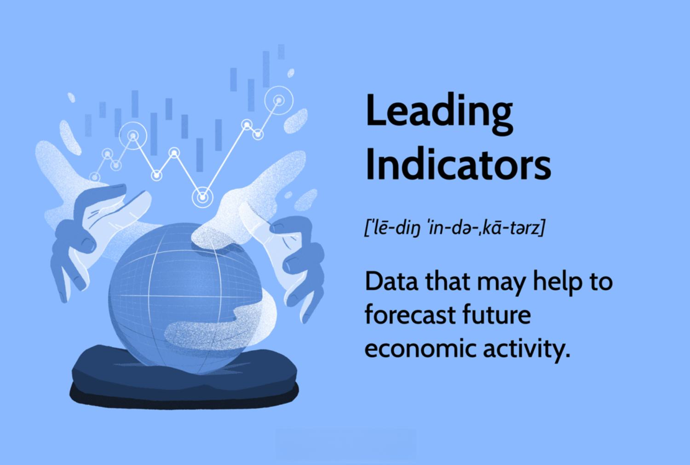

Investment strategies in today's volatile economic landscape require a comprehensive understanding of key economic indicators. These indicators are pivotal in helping investors make informed decisions by anticipating future market movements. By analyzing economic indicators, investors can gain insights into potential market trends, allowing them to adjust their investment strategies proactively. This article examines various investment strategies, the role played by leading economic indicators, and the impact of algorithmic trading on investment decisions. 

Algorithmic trading, which employs predefined computer algorithms to execute trades, leverages these economic indicators to optimize investment outcomes. This synergy between economic indicators and algorithmic trading creates an opportunity for investors to refine their strategies for better returns. Understanding how to interpret and apply these indicators effectively can provide a significant competitive advantage. 



This section provides an overview of the crucial interplay between economic indicators and investment strategies, with a focus on how algorithmic trading can be utilized to enhance investment decisions. Through strategic integration of these elements, investors can navigate the complexities of the market with greater precision and confidence.

## Table of Contents

## Understanding Economic Indicators

Economic indicators serve as essential tools for comprehending the financial and economic environment. These indicators are systematically categorized into three types: leading, lagging, and coincident indicators, each serving distinct analytical purposes.

Leading indicators are forward-looking metrics that offer predictions about future economic activities. Two notable examples are the Consumer Confidence Index (CCI) and the Purchasing Managers’ Index (PMI). The CCI gauges the degree of optimism that consumers feel about the overall state of the economy and their personal financial situations. High consumer confidence usually suggests future economic growth, as assured consumers are more inclined to spend money. The PMI, on the other hand, is a survey-based indicator that gives insights into business conditions in the manufacturing and service sectors. It is derived from monthly surveys of private-sector companies and is often considered a reliable indicator of economic health, with values above 50 signaling expansion and below 50 indicating contraction.

Lagging indicators, such as the unemployment rate or corporate profits, provide insight into the economy's past performance. These indicators confirm trends and are typically used to highlight the long-term nature of economic movements. They are essential for understanding the overall economic cycle after changes occur.

Coincident indicators, including metrics like industrial production, provide real-time data reflecting current economic conditions. These indicators move simultaneously with the economy and can validate the accuracy of leading indicators by confirming ongoing developments.

Investors rely heavily on these indicators to anticipate market trends and subsequently tailor their investment strategies. By analyzing these metrics, investors can gain foresight into potential economic expansions or contractions, allowing them to reallocate their portfolios to mitigate risks and capitalize on growth opportunities. This proactive approach offers a strategic advantage in forecasting economic trends and securing a competitive edge over peers in the investment domain.

In summary, comprehending economic indicators provides invaluable insights, enabling investors to identify and capitalize on future market trends effectively. This knowledge acts as a cornerstone for strategic investment decisions, ultimately enhancing potential returns and securing a sustainable investment journey.

## Leading Indicators and Their Significance

Leading indicators are a critical tool for forecasting economic activity, providing insights into future performance and guiding strategic financial decisions. These indicators, such as durable goods orders, jobless claims, and yield curves, have the ability to signal potential economic upturns or downturns before they occur.

Durable goods orders measure the demand for products expected to last at least three years. A rise in these orders typically indicates more robust economic activity, suggesting that businesses and consumers are investing in long-term assets. Conversely, a decrease might signal economic contraction as investment wanes. Monitoring trends in durable goods orders can help investors anticipate shifts in sectors sensitive to economic cycles, such as manufacturing and industrials.

Jobless claims, specifically initial claims for unemployment insurance, serve as another essential leading indicator. When claims increase, it often reflects a weakening job market, potentially heralding a slowdown in consumer spending. Conversely, declining claims suggest labor market improvements, potentially spurring economic growth as consumer confidence and spending increase. For investment strategy, tracking jobless claims can guide decisions related to consumer-focused equities or sectors tied to employment trends.

The yield curve, which plots interest rates across different maturity dates, is a well-known predictor of economic activity. An inverted yield curve, where short-term rates exceed long-term rates, has historically preceded recessions. This inversion suggests that investors expect economic conditions to worsen, leading them to favor long-term bonds. Conversely, a steepening yield curve often indicates economic expansion, predicting higher inflation and interest rates in the future, encouraging shifts towards growth-oriented stocks.

Although leading indicators possess predictive power, their accuracy and reliability can vary due to unexpected economic shifts or data anomalies. Relying on a single indicator may not provide a holistic view; thus, investors often use a composite of multiple indicators to strengthen predictions. For instance, combining durable goods orders with other metrics like consumer sentiment indexes can yield a broader picture of economic health.

The strategic use of leading indicators in investment decisions allows for proactive measures, such as reallocating assets or adjusting portfolio weightings in anticipation of economic changes. By acting on these signals, investors can better position themselves to capitalize on emerging opportunities or mitigate potential risks posed by economic downturns.

## Investment Strategies Leveraging Economic Indicators

Investment strategies that integrate economic indicators are designed to enhance decision-making processes by providing insights into market conditions and identifying potential growth sectors. By carefully analyzing these indicators, investors can tailor their strategies to maximize returns and minimize risks.

Economic indicators, such as GDP growth rates, inflation rates, and unemployment figures, offer valuable information about the current and future state of the economy. For instance, a rising Consumer Confidence Index may suggest increased consumer spending, indicating growth opportunities in consumer-driven sectors. Conversely, an inverted yield curve might signal an impending recession, prompting a shift toward more conservative investments.

Growth investing focuses on identifying companies or sectors poised for significant revenue or earnings growth. Investors may look at specific indicators such as the Purchasing Managers’ Index (PMI) to gauge manufacturing sector performance, using this information to invest in companies likely to benefit from an economic expansion.

Value investing, on the other hand, seeks undervalued stocks that may be trading at a price lower than their intrinsic value. Economic indicators like interest rates and inflation can influence valuations, providing clues about which sectors or stocks may be undervalued.

Tactical asset allocation is a strategy where investors adjust their portfolio weights to take advantage of current market conditions, often guided by economic indicators. For example, during economic downturns, investors might increase allocations in defensive sectors like utilities or consumer staples.

Implementing these strategies requires a keen understanding of both current and projected economic indicators. For example, to optimize portfolios, investors can use leading indicators such as new housing starts or jobless claims to predict economic expansions or recessions. Incorporating these indicators allows for strategic adjustments, aiming at capitalizing on market opportunities and avoiding potential pitfalls.

A well-rounded investment strategy also considers diversification to mitigate risk. By spreading investments across different asset classes, sectors, or geographies, investors can reduce exposure to market-specific risks. This approach ensures that the portfolio remains resilient against unexpected economic shifts.

Python code can be employed for more sophisticated analysis of economic indicators. Below is an example of how investors might use Python to analyze GDP growth rates and adjust their investment strategies accordingly:

```python
import pandas as pd
import numpy as np
import matplotlib.pyplot as plt

# Mock GDP data
dates = pd.date_range(start='2010-01-01', periods=120, freq='M')
gdp_growth = np.random.normal(loc=2.0, scale=0.5, size=len(dates))  # Example GDP growth rates

# Creating a DataFrame
gdp_df = pd.DataFrame({'Date': dates, 'GDP Growth': gdp_growth})

# Plotting GDP Growth
plt.figure(figsize=(10, 6))
plt.plot(gdp_df['Date'], gdp_df['GDP Growth'], label='GDP Growth Rate')
plt.axhline(y=0, color='r', linestyle='--', label='Zero Growth Line')
plt.title('Simulated GDP Growth Over Time')
plt.xlabel('Date')
plt.ylabel('GDP Growth Rate (%)')
plt.legend()
plt.grid(True)
plt.show()

# Strategy Decision
average_growth = gdp_df['GDP Growth'].mean()
if average_growth > 2.0:
    print("Consider growth investing due to a generally expanding economy.")
else:
    print("Consider value investing or conservative strategies due to slower growth.")
```

This code simulates GDP growth rates and helps investors decide when to adopt growth investing strategies based on average economic expansion. Integrating economic indicators with such analytical tools can improve investment strategy outcomes, aligning decisions with both current data and future projections.

## Role of Algorithmic Trading

Algorithmic trading involves the use of sophisticated computer algorithms to automate the process of executing trades based on pre-established criteria. These algorithms analyze vast amounts of historical data, market trends, and real-time information to devise and execute optimal trading strategies. This automated approach allows for rapid decision-making and trade execution, which is crucial in today’s fast-paced financial markets.

The primary advantage of [algorithmic trading](/wiki/algorithmic-trading) lies in its ability to process and react to data far more quickly than a human can. By leveraging historical data, algorithms can identify patterns and trends that inform future trading decisions. Additionally, they utilize real-time information to adapt trading strategies on-the-go, taking advantage of market opportunities as they arise. 

A key feature of algorithmic trading is its ability to integrate specific economic indicators into its decision-making process. For example, algorithms can be programmed to execute trades based on changes in indicators such as interest rates, unemployment rates, or consumer confidence indexes. This capability allows for precise timing and pricing, optimizing the overall effectiveness of investment strategies.

Moreover, algorithmic trading minimizes human error and eliminates emotions from the trading process, which can often lead to suboptimal decisions. By relying on data-driven algorithms, traders can maintain objectivity and discipline, enhancing the overall efficiency and reliability of their investment strategies.

Algorithmic trading also complements traditional investment strategies by providing a data-driven edge in market analysis. While traditional methods may rely heavily on human judgment and intuition, algorithmic trading offers a systematic approach grounded in data analysis. This integration can lead to more informed decision-making and improved portfolio performance.

Algorithmic trading is not without its challenges, such as the risks of over-relying on historical data, which may not always accurately predict future market behavior. However, when balanced with a solid understanding of the market and continuous strategy evaluation, it presents a powerful tool for traders looking to optimize their investment outcomes.

## Combining Leading Indicators with Algorithmic Trading

Integrating leading economic indicators with algorithmic trading strategies holds the potential to significantly enhance forecasting accuracy and optimize investment decisions. Algorithms, with their capability to process vast amounts of economic data, can effectively identify trends and execute trades at precisely the right moments. By leveraging the predictive nature of leading indicators, such as changes in the Consumer Confidence Index or fluctuations in the Purchasing Managers’ Index, investors can improve the timing and accuracy of their trading decisions.

Algorithms are inherently adept at handling large data sets, enabling them to sift through economic indicators and extract actionable insights. For example, a [machine learning](/wiki/machine-learning) model could be trained to predict stock market performance based on historical and real-time economic data. The model can be programmed to recognize patterns associated with economic upswings or downturns.

```python
# Example Python code snippet for a simple moving average crossover strategy using leading indicators
import pandas as pd
import numpy as np

# Function to calculate moving average
def moving_average(data, window_size):
    return data.rolling(window=window_size).mean()

# Sample data: hypothetical leading indicators
data = pd.DataFrame({
    'time': pd.date_range(start='1/1/2022', periods=100, freq='D'),
    'leading_indicator': np.random.randn(100).cumsum()  # Simulated data
})

# Calculate moving averages
data['MA_short'] = moving_average(data['leading_indicator'], window_size=5)
data['MA_long'] = moving_average(data['leading_indicator'], window_size=20)

# Trading signal: Buy when short MA crosses above long MA, sell when short MA crosses below long MA
data['signal'] = np.where(data['MA_short'] > data['MA_long'], 1, 0)

print(data.tail())
```

This synergy between leading indicators and algorithmic trading fosters the development of adaptive strategies that can respond to shifting market conditions. Automated systems continuously monitor economic indicators, allowing them to dynamically adjust investment strategies. This adaptability is crucial for navigating economic cycles and periods of market [volatility](/wiki/volatility-trading-strategies), providing investors with a more resilient trading approach.

Furthermore, by implementing such models, investors can mitigate the risks associated with human emotion and bias, enhancing the precision and efficiency of their trades. The convergence of these technologies enables a proactive approach to managing investments, ensuring strategies are aligned with current and potential market trends. This integration represents a strategic advantage in achieving successful investment outcomes amid economic shifts and uncertainties.

## Challenges and Considerations

The integration of economic indicators and algorithmic trading presents several challenges and considerations that investors must address to optimize their strategies effectively. Data accuracy is a critical [factor](/wiki/factor-investing), as predictive models rely heavily on the integrity and timeliness of economic data. Inaccurate or delayed data can lead to erroneous insights, affecting trading decisions. Moreover, market anomalies and unforeseen economic shifts can disrupt standard models, leading to potential losses.

Another significant concern is the risk of overfitting algorithms to historical data. Overfitting occurs when a model is tailored too closely to past events, capturing noise rather than underlying trends. This can result in weak performance on new, unseen data. To mitigate this, investors should employ techniques such as cross-validation, where data is split into training and testing subsets to ensure the model's robustness. A Python example of this could be:

```python
from sklearn.model_selection import train_test_split
from sklearn.linear_model import LinearRegression
from sklearn.metrics import mean_squared_error

# Example economic indicators data
X = ... # Features such as GDP, unemployment rates, etc.
y = ... # Target variable, such as stock prices

# Split data into training and testing sets
X_train, X_test, y_train, y_test = train_test_split(X, y, test_size=0.2, random_state=42)

# Train a model
model = LinearRegression()
model.fit(X_train, y_train)

# Predict and evaluate
predictions = model.predict(X_test)
error = mean_squared_error(y_test, predictions)
print(f'Mean Squared Error: {error}')
```

Regulatory considerations also impose significant challenges, especially in algorithmic trading. Regulatory bodies like the SEC in the United States impose rules to ensure market fairness and prevent manipulative trading practices. Compliance with these regulations is crucial, requiring investors to maintain transparency and adhere to ethical standards.

Lastly, the dynamic nature of financial markets demands continuous monitoring and adjustment of strategies. Algorithms must be designed to adapt to new information and changing conditions swiftly. This constant evaluation ensures that strategies remain effective and aligned with current market realities. Therefore, maintaining a flexible and adaptive approach is essential to navigate the complexities introduced by combining economic indicators and algorithmic trading.

## Conclusion

Investment strategies are greatly enhanced by understanding and leveraging economic indicators, as these tools offer critical insights into market dynamics. Leading indicators, which anticipate market trends, provide investors with the foresight needed to navigate economic cycles efficiently. These indicators include metrics such as the Consumer Confidence Index and the Purchasing Managers’ Index, which help predict economic upturns or downturns. By interpreting these signals, investors can make proactive decisions, adjusting their portfolios to align with anticipated market conditions.

Algorithmic trading complements the use of economic indicators by offering precise execution and timing. This approach utilizes computer algorithms to process vast amounts of economic data, quickly identifying trends and executing trades based on predefined criteria. The real-time processing capabilities of such algorithms minimize human error and remove emotional bias from trading decisions, thus enhancing the efficiency of investment strategies. By incorporating both historical data and current market trends, algorithmic trading can create adaptive strategies that adjust to new information swiftly.

The integration of leading indicators with algorithmic trading creates robust strategies that can adapt to volatile market conditions. Investors stand to benefit from this synergy by continuously learning and adjusting their strategies. As markets evolve, so too must the models and algorithms that guide investment decisions. This requires an ongoing commitment to understanding new economic data and refining algorithms to better predict outcomes.

To harness the full potential of these tools, investors should prioritize ongoing education and strategy refinement. By leveraging the predictive power of leading indicators and the precise execution capabilities of algorithmic trading, investors are positioned to achieve more informed and successful investment outcomes. Emphasizing adaptability and continuous improvement will ensure that investment strategies remain relevant and effective in an ever-changing economic landscape.

## References & Further Reading

[1]: Bergstra, J., Bardenet, R., Bengio, Y., & Kégl, B. (2011). ["Algorithms for Hyper-Parameter Optimization."](https://papers.nips.cc/paper/4443-algorithms-for-hyper-parameter-optimization) Advances in Neural Information Processing Systems 24.

[2]: ["Advances in Financial Machine Learning"](https://www.amazon.com/Advances-Financial-Machine-Learning-Marcos/dp/1119482089) by Marcos Lopez de Prado

[3]: ["Evidence-Based Technical Analysis: Applying the Scientific Method and Statistical Inference to Trading Signals"](https://www.amazon.com/Evidence-Based-Technical-Analysis-Scientific-Statistical/dp/0470008741) by David Aronson

[4]: ["Machine Learning for Algorithmic Trading"](https://github.com/stefan-jansen/machine-learning-for-trading) by Stefan Jansen

[5]: ["Quantitative Trading: How to Build Your Own Algorithmic Trading Business"](https://www.amazon.com/Quantitative-Trading-Build-Algorithmic-Business/dp/1119800064) by Ernest P. Chan