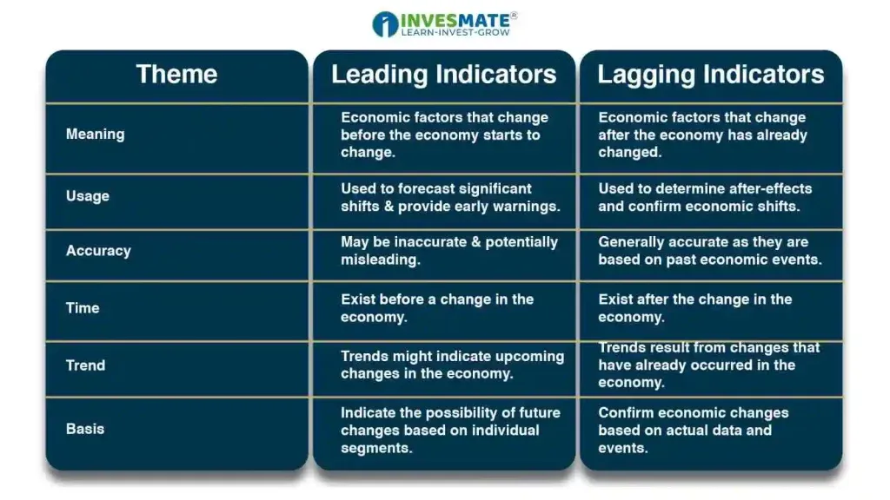

## Table of Contents

## What are leading indicators?

Leading indicators are signals that help predict future events or trends. They are used in different fields like economics, business, and healthcare to make decisions before something happens. For example, in economics, if more people are applying for jobs, it might mean the economy will grow soon.

These indicators are important because they give people and organizations a chance to prepare or make changes. If a company sees a leading indicator that their sales might go down, they can start working on new products or marketing plans. However, leading indicators are not always perfect and can sometimes be wrong, so it's good to use them along with other information.

## How do leading indicators differ from lagging indicators?

Leading indicators and lagging indicators are both important, but they tell us different things. Leading indicators are like early warnings. They give us clues about what might happen in the future. For example, if more people start buying building materials, it could mean that construction will increase soon. This helps businesses and governments plan ahead.

On the other hand, lagging indicators tell us about things that have already happened. They are like looking in the rearview mirror. For example, unemployment rates are a lagging indicator because they show how the economy has been doing, not how it will do. Lagging indicators are useful for confirming trends and understanding past performance, but they don't help with predicting the future.

Both types of indicators are useful, but in different ways. Leading indicators help with making plans and preparing for what's coming, while lagging indicators help us learn from what has already happened. Using both together gives a fuller picture of what's going on and what might happen next.

## What are some common examples of leading indicators used in economic analysis?

In economic analysis, leading indicators are used to predict future economic trends. Some common examples include stock market performance, the number of new building permits, and changes in manufacturing orders. If the stock market is doing well, it might mean that people are feeling good about the future of the economy. When more building permits are issued, it can show that construction activity will increase soon. And if companies are getting more orders for their products, it might mean that people are planning to spend more money.

Another leading indicator is the average workweek length. If businesses start asking their workers to work longer hours, it might mean that they expect more demand for their products or services. Also, consumer confidence surveys can be a leading indicator. If people feel confident about their financial future, they are more likely to spend money, which can help the economy grow. These indicators help economists and policymakers make decisions before changes happen in the economy.

## How can investors use leading indicators to predict market trends?

Investors can use leading indicators to get a sense of where the market might be heading. For example, if the stock market is going up, it might mean that people are feeling good about the economy. This can encourage investors to buy more stocks because they think prices will keep rising. Another useful leading indicator is the number of new building permits. If more permits are being issued, it can signal that construction will pick up, which is good for companies in the building industry. Investors might then decide to invest in those companies before their stock prices go up.

Another important leading indicator for investors is changes in manufacturing orders. If companies are getting more orders, it might mean that people are planning to buy more things in the future. This can be a sign for investors to buy stocks in manufacturing companies before everyone else does. Consumer confidence surveys also help. If people feel good about their money and the economy, they are more likely to spend, which can boost the market. By watching these leading indicators, investors can make smarter choices about when to buy or sell stocks.

## What are the limitations of using leading indicators for investment decisions?

Leading indicators can help investors guess what might happen in the market, but they are not perfect. One big problem is that they can be wrong sometimes. Just because a leading indicator says the market will go up, it doesn't mean it will for sure. For example, if people start buying more building materials, it might look like construction will grow, but other things like bad weather or economic problems could stop it. So, investors need to be careful and not rely only on one leading indicator.

Another limitation is that leading indicators can be hard to understand and use correctly. They need to be looked at along with other information to make good guesses about the future. If an investor only looks at one leading indicator without thinking about other things like what's happening in the world or other economic signs, they might make a bad decision. It's important for investors to use leading indicators as just one part of their overall plan and not the only thing they look at.

## How can leading indicators be integrated into a broader investment strategy?

Leading indicators can be a helpful part of a bigger investment plan. They give investors early signs about what might happen in the market. For example, if more people are buying building materials, it might mean construction will grow soon. Investors can use this information to decide when to buy or sell stocks in construction companies. But, it's important not to rely only on leading indicators. They should be used with other information like what's happening in the world and other economic signs. This way, investors can make smarter choices and not just follow one signal.

Using leading indicators in a broader investment strategy means looking at them as one piece of the puzzle. For instance, an investor might see that manufacturing orders are going up, which could mean more people will buy things in the future. But, they should also check news about the economy, listen to what experts say, and maybe even look at lagging indicators to see what has already happened. By putting all this information together, investors can get a fuller picture of where the market might be heading and make better decisions about their investments.

## What are the key leading indicators to watch for different sectors of the economy?

In the construction sector, one key leading indicator to watch is the number of new building permits issued. If more permits are being given out, it usually means that construction activity will increase soon. This can be good news for companies that build houses or other buildings. Another important indicator is the price of building materials like lumber or steel. If these prices start going up, it might mean that demand for construction is going up too.

For the manufacturing sector, changes in manufacturing orders are a big leading indicator. If companies are getting more orders, it can mean that people are planning to buy more products in the future. This can be a sign that the economy is doing well. Another thing to watch is the length of the average workweek. If factories start asking workers to work longer hours, it might mean they expect more demand for their products.

In the retail sector, consumer confidence surveys are a key leading indicator. If people feel good about their money and the future, they are more likely to spend on things like clothes or electronics. Another important sign is the level of retail sales. If sales are going up, it might mean that people are buying more things and the economy is growing. Watching these indicators can help businesses and investors make smart choices about where to put their money.

## How do leading indicators influence monetary policy decisions?

Leading indicators help people who make decisions about money, like central bankers, figure out what might happen to the economy in the future. If they see that more people are buying building materials, it might mean that construction will grow soon. This can make them think that the economy will get better. They might decide to keep interest rates the same or even lower them to help the economy grow more. But, if leading indicators show that things might slow down, like if fewer manufacturing orders are coming in, they might decide to raise interest rates to stop the economy from growing too fast and causing inflation.

These indicators are not perfect, so central bankers look at a lot of different signs before they make decisions. For example, if consumer confidence surveys show that people feel good about their money, it might mean they will spend more. This could make the central bank think about keeping interest rates low to encourage spending. But, they also look at other things like what's happening in the world and other economic signs to make sure they're making the right choice. By using leading indicators along with other information, they can make better decisions about how to manage the economy.

## Can leading indicators be used effectively in short-term trading strategies?

Leading indicators can be used in short-term trading strategies, but it's tricky. They give clues about what might happen next in the market. For example, if the stock market is going up, it might mean that people feel good about the economy and stock prices will keep rising. Traders can use this information to decide when to buy or sell stocks quickly. But, leading indicators can be wrong sometimes, so traders need to be careful and not rely only on them. They should also look at other things like news and what other traders are doing.

Using leading indicators for short-term trading means watching them closely and being ready to act fast. If a trader sees that manufacturing orders are going up, it might mean that more people will buy things soon. This could be a sign to buy stocks in manufacturing companies before everyone else does. But, because leading indicators can be off sometimes, it's important for traders to use them with other information. This way, they can make better guesses about what will happen in the market and make smarter trading choices.

## What advanced statistical methods can be used to analyze leading indicators?

Advanced statistical methods can help us understand leading indicators better. One way is using time series analysis. This method looks at how leading indicators change over time and can help predict future trends. For example, if we see that the number of new building permits goes up every spring, we can use time series analysis to guess when it might happen again next year. Another method is regression analysis. This helps us see how different leading indicators are related to each other. If we find that consumer confidence goes up when the stock market does well, regression analysis can show us how strong that connection is.

Another useful method is [machine learning](/wiki/machine-learning). This can take a lot of data about leading indicators and find patterns that are hard for people to see. For example, machine learning can look at lots of different leading indicators at the same time and figure out which ones are the best at predicting the economy. This can help traders and investors make better decisions. But, even with these advanced methods, it's important to remember that leading indicators are not perfect. They should be used with other information to make the best guesses about the future.

## How do global leading indicators impact investment decisions in a domestic market?

Global leading indicators can have a big impact on investment decisions in a domestic market. For example, if the global stock market is doing well, it might make investors in a country feel more confident about their own market. They might decide to buy more stocks because they think prices will go up. On the other hand, if global leading indicators show that the world economy might slow down, like if fewer manufacturing orders are coming in from other countries, investors might worry about their own economy. They might decide to sell stocks or move their money to safer investments.

Another way global leading indicators affect domestic markets is through things like interest rates and exchange rates. If leading indicators show that other countries might raise their interest rates, it could make investors move their money to those countries to get better returns. This can affect the value of the domestic currency and make it harder for local businesses to sell their products abroad. So, investors need to keep an eye on global leading indicators to understand how they might change the domestic market and make smart investment choices.

## What are the future trends in the development and use of leading indicators?

In the future, leading indicators are likely to become even more important and useful for people making decisions about the economy and investments. With more and more data available, new technology like [artificial intelligence](/wiki/ai-artificial-intelligence) and machine learning will help us find better leading indicators. These technologies can look at huge amounts of information from all over the world and find patterns that are hard for people to see. This means that leading indicators might become more accurate and help us predict the future better. For example, AI could look at social media data to see what people are thinking about the economy and use that to predict what might happen next.

Also, as the world becomes more connected, global leading indicators will play a bigger role in how we understand our own economies. Things like global trade data, international consumer confidence, and worldwide manufacturing orders will be more important for making decisions at home. This means that investors and policymakers will need to pay more attention to what's happening in other countries. By using these global leading indicators along with local ones, they can get a fuller picture of what might happen and make smarter choices about where to put their money or how to guide the economy.

## References & Further Reading

[1]: Bergstra, J., Bardenet, R., Bengio, Y., & Kégl, B. (2011). ["Algorithms for Hyper-Parameter Optimization."](https://papers.nips.cc/paper/4443-algorithms-for-hyper-parameter-optimization) Advances in Neural Information Processing Systems 24.

[2]: ["Advances in Financial Machine Learning"](https://www.amazon.com/Advances-Financial-Machine-Learning-Marcos/dp/1119482089) by Marcos Lopez de Prado

[3]: ["Evidence-Based Technical Analysis: Applying the Scientific Method and Statistical Inference to Trading Signals"](https://www.amazon.com/Evidence-Based-Technical-Analysis-Scientific-Statistical/dp/0470008741) by David Aronson

[4]: ["Machine Learning for Algorithmic Trading"](https://github.com/stefan-jansen/machine-learning-for-trading) by Stefan Jansen

[5]: ["Quantitative Trading: How to Build Your Own Algorithmic Trading Business"](https://www.amazon.com/Quantitative-Trading-Build-Algorithmic-Business/dp/1119800064) by Ernest P. Chan