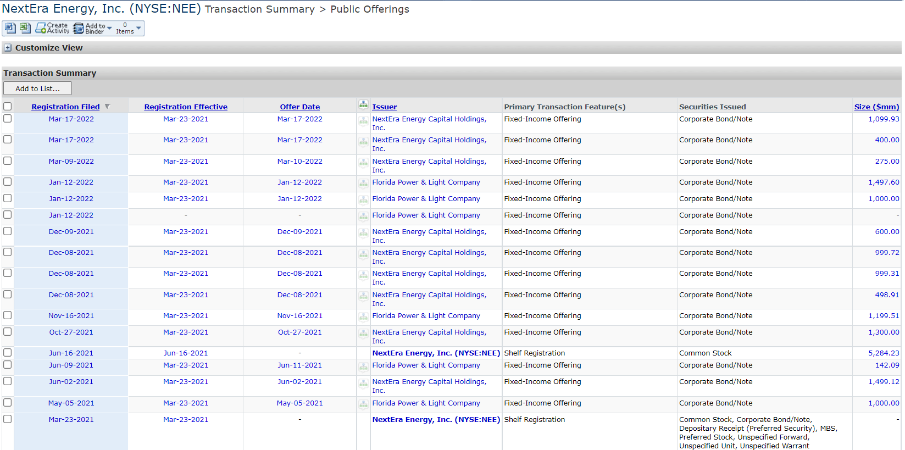

## Table of Contents

## What is an investment bank?

An investment bank is a type of financial institution that helps companies, governments, and other organizations raise money by issuing and selling securities like stocks and bonds. They also provide advice on financial strategies, mergers, and acquisitions. Investment banks act as a middleman between the organizations that need capital and the investors who want to buy securities. They help their clients figure out the best way to raise money and then handle the process of selling those securities to investors.

In addition to helping with raising capital, investment banks offer other services like underwriting, where they guarantee a certain price for the securities they help sell. They also provide research and analysis to help clients make informed decisions about investments. Investment banks can be involved in trading securities for their own profit, which is different from commercial banks that focus on everyday banking services like savings accounts and loans. Overall, investment banks play a crucial role in the financial markets by helping to move money from investors to businesses and governments that need it.

## How do investment banks operate in the energy sector?

Investment banks play an important role in the energy sector by helping energy companies raise money. They do this by helping these companies issue stocks or bonds. For example, if an oil company wants to build a new refinery, it might need a lot of money. The investment bank can help the oil company sell bonds to investors, who give the company money in exchange for a promise to pay them back with interest. This way, the oil company gets the money it needs, and the investors get a chance to earn money from their investment.

Besides raising money, investment banks also give advice to energy companies. They help these companies decide if they should buy another company or sell part of their own business. This is called mergers and acquisitions. For instance, if a solar energy company wants to grow bigger, the investment bank might suggest buying a smaller company that makes solar panels. The bank helps figure out if this is a good idea and how much the solar energy company should pay. Investment banks also do research to help energy companies understand the market and make smart decisions about where to invest their money.

## What are the main services provided by investment banks to energy companies?

Investment banks help energy companies get the money they need to grow and do big projects. They do this by helping these companies sell stocks or bonds to investors. For example, if a wind farm company wants to build more wind turbines, it might need a lot of money. The investment bank can help the company sell bonds. Investors buy these bonds and give the company money, and in return, the company promises to pay them back with interest. This way, the wind farm company gets the money it needs to build more turbines, and the investors get a chance to earn money from their investment.

Investment banks also give advice to energy companies. They help these companies decide if they should buy another company or sell part of their own business. This is called mergers and acquisitions. For example, if a gas company wants to expand, the investment bank might suggest buying a smaller company that has gas wells. The bank helps figure out if this is a good idea and how much the gas company should pay. Investment banks also do research to help energy companies understand the market better and make smart choices about where to spend their money.

## Who are the leading investment banks globally?

The biggest investment banks in the world are well-known names like Goldman Sachs, JPMorgan Chase, and Morgan Stanley. These banks are leaders because they handle a lot of money and help big companies with their financial needs. Goldman Sachs is famous for giving advice on big deals and helping companies raise money. JPMorgan Chase is huge and does a lot of different things, including helping companies with their money and trading securities. Morgan Stanley is also very important and helps with big mergers and raising money through stocks and bonds.

Other important investment banks include Bank of America Merrill Lynch, Citigroup, and Barclays. Bank of America Merrill Lynch is part of a big bank that helps with many financial services, including investment banking. Citigroup is another giant that helps companies all over the world with their money needs. Barclays, based in the UK, is a big player in Europe and helps companies with their financial strategies. These banks all play a big role in helping companies get the money they need and giving them advice on how to grow.

## Which investment banks are most active in the energy sector?

Some of the most active investment banks in the energy sector are Goldman Sachs, JPMorgan Chase, and Morgan Stanley. These banks help energy companies raise money by selling stocks and bonds. For example, if a company wants to build a new power plant, these banks can help find investors who will give the company money in exchange for stocks or bonds. Goldman Sachs is known for its deep knowledge of the energy market and often advises companies on big deals. JPMorgan Chase, being a huge bank, has a lot of resources and helps many energy companies with their financial needs. Morgan Stanley also plays a big role, helping with mergers and acquisitions in the energy industry.

Other important banks in the energy sector include Citigroup and Bank of America Merrill Lynch. Citigroup helps energy companies around the world with their money needs, including raising capital and advising on big projects. Bank of America Merrill Lynch is part of a big bank that provides a wide range of financial services, including investment banking for energy companies. These banks work hard to help energy companies grow and make smart financial decisions.

## What criteria are used to evaluate the leading investment banks in the energy sector?

People look at several things to decide which investment banks are the best in the energy sector. One big thing is how much money the bank helps energy companies raise. If a bank helps a lot of energy companies sell stocks or bonds and raise a lot of money, it's seen as a leader. Another thing people check is how good the bank is at giving advice on big deals, like when one energy company wants to buy another. Banks that help energy companies make smart choices about mergers and acquisitions are highly valued.

Another important thing is the bank's knowledge of the energy market. Banks that understand the energy industry well and can give good advice are seen as leaders. People also look at how much the bank helps with big projects, like building new power plants or oil refineries. If a bank helps a lot with these projects, it's seen as important in the energy sector. Overall, the best banks in the energy sector are those that help companies raise a lot of money, give smart advice on big deals, and know a lot about the energy market.

## How do leading investment banks support renewable energy projects?

Leading investment banks help renewable energy projects by helping companies raise money. If a company wants to build a new solar farm or wind turbine, they need a lot of money. Investment banks like Goldman Sachs, JPMorgan Chase, and Morgan Stanley help these companies sell stocks or bonds to investors. The investors give the company money, and in return, the company promises to pay them back with interest or give them part of the company. This way, the renewable energy company gets the money it needs to build new projects, and the investors get a chance to earn money from their investment.

Investment banks also give advice to renewable energy companies. They help these companies decide if they should buy another company or sell part of their own business. For example, if a solar energy company wants to grow bigger, the investment bank might suggest buying a smaller company that makes solar panels. The bank helps figure out if this is a good idea and how much the solar energy company should pay. Investment banks also do research to help renewable energy companies understand the market and make smart decisions about where to invest their money. This way, these companies can grow and help the world use more clean energy.

## What role do investment banks play in energy sector mergers and acquisitions?

Investment banks help energy companies when they want to buy or sell other companies. This is called mergers and acquisitions. When an energy company wants to grow bigger, it might want to buy another company. The investment bank gives advice on if this is a good idea and how much the company should pay. They look at things like how much money the company makes, what it owns, and what it might be worth in the future. The bank helps the energy company make a smart choice and get the best deal.

Investment banks also help when an energy company wants to sell part of its business. They help the company figure out how much the part they want to sell is worth and find buyers who might be interested. The bank works to make sure the energy company gets a good price for what it's selling. By helping with these big deals, investment banks play a big role in helping energy companies grow and change.

## How have leading investment banks adapted to the transition from fossil fuels to sustainable energy?

Leading investment banks have changed a lot to help with the move from fossil fuels to sustainable energy. They used to help oil and gas companies a lot, but now they are helping more companies that use clean energy like solar and wind. These banks help these companies raise money by selling stocks or bonds to investors. For example, if a company wants to build a big solar farm, the bank can help them find investors who will give them money in return for a piece of the company or a promise to pay them back with interest. This way, the clean energy company gets the money it needs to build new projects, and the investors get a chance to earn money from their investment.

Investment banks also give advice to clean energy companies. They help these companies decide if they should buy another company or sell part of their own business. For example, if a wind energy company wants to grow bigger, the bank might suggest buying a smaller company that makes wind turbines. The bank helps figure out if this is a good idea and how much the wind energy company should pay. They also do research to help clean energy companies understand the market and make smart decisions about where to spend their money. By doing these things, investment banks are helping the world use more clean energy and move away from fossil fuels.

## What are some case studies of successful energy sector deals facilitated by leading investment banks?

One example is when Goldman Sachs helped NextEra Energy buy a big solar company called First Solar. NextEra wanted to grow its solar business, and Goldman Sachs advised them on the deal. They looked at how much First Solar was worth and helped NextEra decide how much to pay. In the end, NextEra bought First Solar for a good price, and now they can make more solar energy. This deal helped NextEra become a bigger player in the clean energy market.

Another example is when JPMorgan Chase helped ExxonMobil sell some of its oil and gas assets to focus more on other energy projects. ExxonMobil wanted to sell some of its oil fields to another company, and JPMorgan Chase helped them find a buyer and get a good price. The bank did a lot of research and talked to many companies before finding the right one. After the deal, ExxonMobil had more money to spend on new projects, and the buyer got some good oil fields to use.

Morgan Stanley also played a big role in helping Shell buy a company called BG Group. Shell wanted to grow its natural gas business, and Morgan Stanley advised them on the deal. They helped Shell figure out how much BG Group was worth and how to pay for it. The deal was very big and helped Shell become a bigger player in the natural gas market. These examples show how investment banks help energy companies make big changes and grow.

## How do leading investment banks manage risks associated with energy sector investments?

Leading investment banks manage risks in the energy sector by doing a lot of research before they help a company with a deal. They look at things like how much money the company makes, what it owns, and what might happen in the future. This helps them figure out if the deal is a good idea or if it might be too risky. They also talk to experts who know a lot about energy to get more information. By understanding the risks, the banks can give better advice to the energy companies and help them make smart choices.

Investment banks also use different ways to lower the risks. One way is by spreading the money they invest across many different projects and companies. This way, if one project does not go well, it does not hurt them too much because they have other projects that might do better. They also use special agreements called hedges to protect against big changes in prices, like if the price of oil goes up or down a lot. By using these methods, investment banks can help energy companies grow while keeping the risks under control.

## What future trends are expected to influence the role of investment banks in the energy sector?

In the future, investment banks will have to change a lot because of new trends in the energy sector. One big trend is the move to more clean energy like solar and wind power. This means investment banks will help more companies that use renewable energy to raise money and grow. They will also need to learn more about clean energy markets and give good advice to these companies. Another trend is the use of new technology, like [artificial intelligence](/wiki/ai-artificial-intelligence) and big data, to make better decisions about investments. Investment banks will use these tools to understand the energy market better and help their clients make smart choices.

Another important trend is the focus on being more environmentally friendly. Governments and people are asking for companies to be more sustainable, so investment banks will help energy companies follow these new rules and meet these goals. This might mean helping companies find new ways to use less energy or make less pollution. Also, there will be more deals where big energy companies buy smaller ones that have new, green technology. Investment banks will play a big role in these deals, helping the big companies find the right smaller companies to buy and making sure they pay a fair price. By adapting to these trends, investment banks will continue to be important in the energy sector.

## References & Further Reading

[1]: Lopez de Prado, Marcos. ["Advances in Financial Machine Learning"](https://www.amazon.com/Advances-Financial-Machine-Learning-Marcos/dp/1119482089). Wiley, 2018.

[2]: Chan, Ernest P. ["Quantitative Trading: How to Build Your Own Algorithmic Trading Business"](https://github.com/ftvision/quant_trading_echan_book). Wiley, 2009.

[3]: Aronson, David R. ["Evidence-Based Technical Analysis: Applying the Scientific Method and Statistical Inference to Trading Signals"](https://www.amazon.com/Evidence-Based-Technical-Analysis-Scientific-Statistical/dp/0470008741). Wiley, 2006.

[4]: Jansen, Stefan. ["Machine Learning for Algorithmic Trading"](https://github.com/stefan-jansen/machine-learning-for-trading). Packt Publishing, 2020.

[5]: Bergstra, James, Bardenet, Rémi, Bengio, Yoshua, & Kégl, Balázs. ["Algorithms for Hyper-Parameter Optimization."](https://proceedings.neurips.cc/paper/2011/file/86e8f7ab32cfd12577bc2619bc635690-Paper.pdf) Advances in Neural Information Processing Systems 24, 2011.