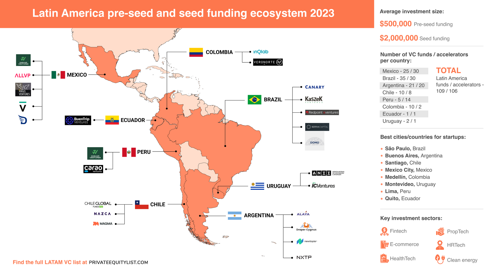

The landscape of economic investment in Latin America has undergone significant transformation in recent years. Once characterized by political instability and hyperinflation, several countries in the region now present themselves as attractive hubs for investment. Countries such as Chile, Colombia, Peru, and Mexico have made strategic economic reforms that bolster investor confidence, positioning them as key players in the global market.

This article explores the economic opportunities within this dynamic region, with particular emphasis on the emerging role of algorithmic trading in enhancing investment strategies. Algorithmic trading, which uses computer programs to execute trades based on pre-defined criteria, has become a powerful tool for investors looking to optimize returns in volatile markets. By analyzing massive datasets quickly and accurately, algorithmic trading can significantly reduce risks while exploiting market inefficiencies.



As Latin America continues to stabilize economically and politically, understanding how digital trading technologies can maximize returns is crucial for investors targeting this promising region. This article will investigate the economic prospects and inherent opportunities in countries like Chile, Colombia, Peru, and Mexico, and how algorithmic trading can facilitate access to these investments. By leveraging these technologies in conjunction with traditional investment wisdom, investors can navigate the complexities of these markets more efficiently, harnessing their growth potential.

## Table of Contents

## Economic Potential in Latin America

Latin America, characterized by its diverse economies and abundance of natural resources, holds substantial investment potential. The region is home to some of the world's largest reserves of essential commodities, including copper, silver, and agricultural produce, making it a pertinent player in global markets. Countries such as Chile, Colombia, Peru, and Mexico have implemented economic reforms and policies conducive to attracting foreign investments. 

Chile, renowned for its political stability and robust economic policies, has been influential in drawing global investors. The nation's strategic trade agreements, including those with the European Union and Asia-Pacific countries, enhance its market access significantly. Such agreements facilitate the seamless exchange of goods and services, promoting economic growth. Similarly, Colombia has introduced tax incentives that foster foreign direct investment (FDI), particularly in its resource-rich sectors, such as petroleum exports.

Peru, despite pandemic-related setbacks, continues to exhibit strong investment prospects. Its extractive industries, especially mining, remain a cornerstone of its economic framework. The Peruvian government has focused on modernizing its legal frameworks to bolster investor confidence, ensuring economic resilience. Meanwhile, Mexico, the second-largest economy in Latin America, benefits from its participation in trade agreements like the United States-Mexico-Canada Agreement (USMCA), which enhances its competitive edge in manufacturing and export sectors.

Strategic trade agreements and tax incentives across the region further strengthen its economic potential. These policies reduce trade barriers and create a favorable business environment, encouraging global investments. Moreover, burgeoning industries such as mining, agriculture, and manufacturing provide fertile ground for growth. These sectors continue to attract substantial FDI, crucial for technological advancements and infrastructure development.

The COVID-19 pandemic posed significant challenges to Latin American economies, disrupting supply chains and reducing demand for exports. However, many countries in the region have shown remarkable resilience and recovery. Economic data indicate a rebound driven by robust policy responses and diversified economic activities, presenting renewed opportunities for investors.

In summary, Latin America's rich resource base, coupled with progressive economic policies and strategic international partnerships, presents a diverse array of investment opportunities. For investors, understanding these dynamic factors is key to capitalizing on the region's economic potential.

## Role of Algorithmic Trading

Algorithmic trading is the process by which computer programs automatically execute or modify trades based on predefined criteria, employing sophisticated algorithms to analyze market conditions. In the context of emerging markets such as those found in Latin America, [algorithmic trading](/wiki/algorithmic-trading) provides several notable advantages that enhance trading efficiency and effectiveness.

Firstly, the speed and accuracy offered by algorithmic trading are paramount in rapidly changing markets. Algorithms can process vast amounts of data and execute trades in fractions of a second, far surpassing the capabilities of human traders. This speed is advantageous in capturing fleeting market opportunities and executing trades before price conditions change. High-frequency trading ([HFT](/wiki/high-frequency-trading-strategies)) strategies are an example where milliseconds can mean significant profit or loss.

Secondly, algorithmic trading systems allow for the simultaneous analysis of numerous market conditions. Complex algorithms can integrate data from multiple sources, including real-time economic indicators, historical patterns, and advanced technical analyses. This multi-faceted approach provides a comprehensive understanding of market dynamics, enabling more informed decision-making. 

The ability of algorithmic trading to mitigate risk is also crucial, particularly in the volatile environments often seen in emerging markets. Algorithms are programmed to respond instantaneously to trading signals, which means they can quickly adjust positions in response to unexpected market shifts. This responsiveness helps in minimizing potential losses and optimizing profitability. For instance, an algorithm might be set to automatically rebalance a portfolio upon reaching certain risk thresholds, thus protecting against adverse market movements.

Moreover, algorithmic trading democratizes access to sophisticated investment strategies. By lowering transaction costs and removing many barriers traditionally associated with trading, algorithmic systems enable a wider range of participants to engage in active market strategies. Retail traders benefit from the reduced costs and increased access to complex trading techniques, which were previously reserved for large institutional investors.

To illustrate a simple algorithmic trading example in Python, consider the following code snippet that utilizes the Moving Average Crossover strategy:

```python
import numpy as np
import pandas as pd

# Sample market data
data = pd.DataFrame({
    'close': [100, 101, 102, 99, 98, 100, 105, 107]
})

# Calculate moving averages
short_window = 3
long_window = 5

data['short_mavg'] = data['close'].rolling(window=short_window, min_periods=1).mean()
data['long_mavg'] = data['close'].rolling(window=long_window, min_periods=1).mean()

# Generate trading signals
data['signal'] = 0
data['signal'][short_window:] = np.where(data['short_mavg'][short_window:] > data['long_mavg'][short_window:], 1, 0)

# Generate trading orders
data['position'] = data['signal'].diff()

print(data)
```

This code calculates short and long moving averages of the market data and generates buy signals when the short moving average crosses above the long one, and sell signals for the opposite scenario. Such automated strategies allow for quick responses to market conditions, a core benefit of algorithmic trading.

In conclusion, algorithmic trading significantly enhances investment strategies in Latin America's emerging markets by providing speed, accuracy, risk mitigation, and democratized access to advanced techniques. As digital trading technologies continue to evolve, they offer promising avenues for maximizing returns while managing potential risks in these dynamic financial landscapes.

## Country-Specific Opportunities

### Chile

Chile stands out due to its stable economic policies and proactive stance in international trade agreements, providing extensive market access. As a member of the Pacific Alliance and various bilateral free trade agreements, including with major economies like the United States (U.S.) and the European Union (E.U.), Chile ensures a favorable environment for foreign investors. The country is renowned for its mining sector, particularly copper, which makes up a significant portion of its export revenues. Investors are attracted to Chile's transparent regulatory environment, low corruption levels, and a consistent track record of economic growth.

### Colombia

Colombia presents a dynamic investment environment bolstered by tax incentives designed to attract foreign direct investment (FDI). The country benefits from a wealth of natural resources, particularly petroleum, which remains a primary driver of its economy. Recent reforms aimed at improving infrastructure and business environments have made Colombia more appealing to investors. The petroleum sector, coupled with nascent sectors like renewable energy, provides promising avenues for growth. Tax regimes in Special Economic Zones further enhance Colombia's investment potential by offering reduced tariffs and duties.

### Peru

Although impacted by the COVID-19 pandemic, Peru retains its appeal for investors largely due to its robust extractive industries. The country's mining industry, a global leader in the production of copper, gold, and silver, continues to attract significant foreign capital. Economic reforms and policies focused on improving infrastructure and promoting private sector participation have been central to Peru's rebound. Continued investment in the mining sector and burgeoning opportunities in agriculture and fisheries provide a solid foundation for future growth, appealing to investors seeking long-term returns.

### Mexico

As the second-largest economy in Latin America, Mexico plays a pivotal role in regional and global trade dynamics. Its participation in the United States-Mexico-Canada Agreement (USMCA) underscores its commitment to open markets and economic integration. This agreement enhances Mexico’s position as a manufacturing powerhouse, particularly in the automotive and electronics sectors. Mexico's diversified economy presents numerous investment opportunities, from its advanced manufacturing industry to burgeoning sectors like fintech and renewable energy. Strategic geographic location and an extensive network of free trade agreements (FTAs) make Mexico an attractive destination for investors seeking access to North America and beyond.

## Investment Strategies and Challenges

Identifying investment sectors with significant growth potential in Latin America, such as renewable energy, technology, and infrastructure, is essential for maximizing returns. Renewable energy is particularly promising due to the region's abundant solar and wind resources, which align well with global trends towards sustainable development. In technology, rising internet penetration and digital transformation initiatives create ample opportunities for innovation and market expansion. Infrastructure investments are vital, given the need for modernized transport, energy, and telecommunication systems to support economic growth.

While these sectors offer substantial potential, investors must also consider macroeconomic and political factors that could affect their investments. Political stability is a critical consideration, as changes in government can lead to regulatory shifts that impact business environments and investment returns. Understanding regulatory changes is equally crucial; investors should stay informed about reforms and legislation that could influence market conditions or sector-specific policies. Inflation trends are another key [factor](/wiki/factor-investing), as high inflation can erode returns and purchasing power, affecting both local and international investments.

Algorithmic trading offers significant advantages in managing investments efficiently by using automated processes to execute trades with precision. However, it is essential to complement algorithmic systems with human oversight. Human judgment is crucial to navigate unexpected market anomalies and to make informed decisions that algorithms might not fully capture. This combined approach ensures that investments are not solely dependent on automated processes and can adapt to sudden market changes.

Moreover, ongoing investment in technology and training is vital to stay competitive in the fast-evolving landscape of digital trading. Technological advancements such as [machine learning](/wiki/machine-learning) and [artificial intelligence](/wiki/ai-artificial-intelligence) continue to reshape trading strategies, making it necessary for investors and firms to continuously update their skills and tools. Ensuring access to the latest technology and fostering a culture of continuous learning can equip investors to leverage algorithmic trading effectively and remain agile in a rapidly changing investment environment.

## Conclusion

Latin America presents a wealth of economic opportunities for investors willing to embrace modern trading technologies. Algorithmic trading is pivotal in navigating the complex yet rewarding landscape of Latin American investments. By automating trade executions and capitalizing on market inefficiencies, algorithmic trading provides investors with tools to enhance decision-making accuracy and speed. This integration facilitates informed trading strategies that can adjust swiftly to market dynamics.

By leveraging technology in conjunction with traditional investment wisdom, investors can maximize potential returns while mitigating risks. Incorporating algorithmic systems allows for real-time data analysis, offering insights that are critical for optimizing investment portfolios. However, a balanced approach that combines algorithmic insights with human judgment ensures more comprehensive risk assessment and strategic planning.

As the global economy continues to evolve, staying informed and adaptable is crucial for investment success in this dynamic region. Investors must remain vigilant to changes in economic policy, technology advancements, and regional market conditions to harness the inherent potential of Latin America's investment landscape effectively. By continuously updating strategies and technological tools, investors can maintain a competitive edge in these emerging markets.

## References & Further Reading

[1]: Kearney, C., & Lombra, R. E. (2008). ["The Changing Nature of International Financial Markets."](https://www.sciencedirect.com/science/article/pii/S1062976908000793) In Finance in an Age of Austerity: The Power of Customer-owned Banks.

[2]: Lopez de Prado, M. (2018). ["Advances in Financial Machine Learning."](https://www.amazon.com/Advances-Financial-Machine-Learning-Marcos/dp/1119482089) Wiley.

[3]: Harvey, C. R., Liu, Y., & Zhu, H. (2016). ["… and the Cross-Section of Expected Returns."](https://people.duke.edu/~charvey/Research/Published_Papers/P118_and_the_cross.PDF) The Review of Financial Studies, 29(1), 5–68.

[4]: Jansen, S. (2020). ["Machine Learning for Algorithmic Trading."](https://github.com/stefan-jansen/machine-learning-for-trading) 2nd Edition. Packt Publishing.

[5]: Chan, E. P. (2008). ["Quantitative Trading: How to Build Your Own Algorithmic Trading Business."](https://github.com/ftvision/quant_trading_echan_book) Wiley.