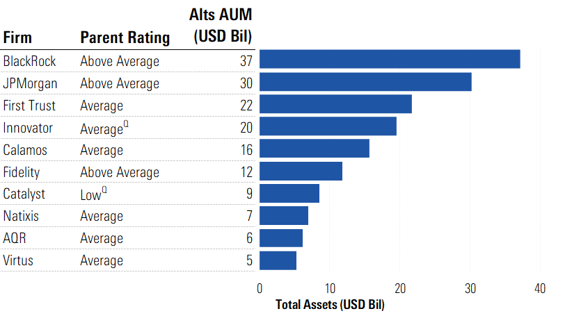

## Table of Contents

## What is an investment fund family?

An investment fund family is a group of mutual funds or exchange-traded funds (ETFs) managed by the same company. These funds are often designed to meet different investment goals and risk levels, so investors can choose the ones that fit their needs. For example, a fund family might offer a mix of stock funds, bond funds, and money market funds, each with its own strategy and focus.

Having a variety of funds within one family can be helpful for investors. It makes it easier to move money between different funds without dealing with multiple companies. Also, since the funds are managed by the same company, it can be simpler to keep track of performance and fees. This can make managing investments less complicated and more convenient.

## What are the most well-known investment fund families?

Some of the most well-known investment fund families are Vanguard, Fidelity, and BlackRock. Vanguard is famous for its low-cost index funds and ETFs, which are popular among people who want to invest without paying high fees. Fidelity is known for its wide range of mutual funds and tools that help people manage their money. BlackRock, through its iShares brand, offers a lot of ETFs that cover many different types of investments, from stocks to bonds.

These fund families are trusted by many investors because they have been around for a long time and have a good reputation. Vanguard started in 1975, Fidelity in 1946, and BlackRock in 1988. They each have different strengths, but they all aim to help people grow their money over time. Choosing a fund from one of these families can be a smart move for someone looking to invest.

## How do investment fund families differ from individual funds?

An investment fund family is a group of different funds managed by the same company. Each fund in the family has its own goal and way of investing. For example, one fund might focus on tech stocks, while another might invest in government bonds. This variety lets investors pick the funds that fit their needs. On the other hand, an individual fund is just one specific fund with its own investment strategy. If someone invests in an individual fund, they are putting their money into that one fund's approach, like investing in a single stock or bond fund.

The main difference between an investment fund family and an individual fund is the choice and flexibility they offer. With a fund family, investors can easily switch between different funds within the same company. This can be helpful if someone wants to change their investment strategy without dealing with different companies. An individual fund, though, does not offer this flexibility because it's just one fund. But, it can be a good choice for someone who knows exactly what they want and likes a straightforward investment.

## What criteria are used to evaluate the performance of investment fund families?

To evaluate the performance of investment fund families, people look at how well the funds are doing compared to others in the same category. They check the returns, which is how much money the funds are making over time. They also look at the risk, which is how much the value of the funds can go up and down. Another important thing is the fees, because lower fees can mean more money in the investor's pocket. People also consider how well the fund managers are doing their job and if they are sticking to the fund's goals.

Another way to judge investment fund families is by looking at how easy they are to use. This includes how simple it is to buy and sell the funds, and if the company offers good tools and information to help investors make choices. People also care about the company's reputation and how long it has been around. A fund family that has been successful for a long time might be seen as more trustworthy. All these things together help people decide if a fund family is a good choice for their money.

## How do leading investment fund families manage risk?

Leading investment fund families manage risk by spreading their investments across different types of assets, like stocks, bonds, and cash. This is called diversification. By not putting all their money in one place, they can lower the chance that a big drop in one investment will hurt the whole fund. They also use something called asset allocation, which means they decide how much money to put into each type of investment based on how risky it is and how much return they expect. This helps them balance the risk and reward.

Another way they manage risk is by doing a lot of research and keeping a close eye on the markets. They use tools and data to predict what might happen and make changes to their investments if needed. Some funds also use strategies like hedging, which means they take steps to protect against losses. For example, they might buy insurance-like products that pay off if the market goes down. By being proactive and using these methods, leading investment fund families try to keep their investors' money safe while still aiming for good returns.

## What are the typical fee structures associated with top investment fund families?

Top investment fund families usually have different kinds of fees. The main ones are expense ratios and sales loads. An expense ratio is a yearly fee that covers the costs of running the fund, like paying the managers and doing research. This fee is a percentage of the money you have in the fund. For example, if a fund has an expense ratio of 0.5%, you pay $5 for every $1,000 you have invested each year. Some funds also have sales loads, which are fees you pay when you buy or sell the fund. These can be front-end loads, which you pay when you buy, or back-end loads, which you pay when you sell.

Different fund families have different fee structures. Vanguard is known for having low expense ratios, often around 0.1% to 0.2% for their index funds. This is because they focus on keeping costs low for investors. Fidelity also offers competitive fees, but they might be a bit higher, around 0.5% to 1% for some of their actively managed funds. BlackRock's iShares ETFs usually have expense ratios between 0.03% and 0.50%, depending on the type of fund. It's important for investors to look at these fees because they can affect how much money they make over time. Lower fees mean more money stays in your pocket.

## How do investment fund families adapt to changing market conditions?

Investment fund families adapt to changing market conditions by keeping a close eye on what's happening in the world and the economy. They use a lot of information and tools to predict what might happen next. If they see something big coming, like a change in interest rates or a new law, they might change what they invest in. For example, if they think the stock market might go down, they might move more money into safer investments like bonds. This helps them protect the money their investors have given them.

Another way they adapt is by changing their investment strategies. They might decide to focus more on certain types of companies or industries that they think will do well in the new market conditions. They also talk to their investors and might offer new funds that fit the current situation. By being flexible and ready to make changes, investment fund families can try to keep their investors' money safe and still aim for good returns, even when the market is changing.

## What role do investment fund families play in portfolio diversification?

Investment fund families help people spread their money across different types of investments, which is called diversification. This is important because it can make their money safer. If one type of investment does badly, the other types might do well and balance things out. A fund family has many different funds, like ones that invest in stocks, bonds, or even things like real estate. By choosing funds from the same family, investors can easily put their money into different areas without having to deal with many different companies.

When someone wants to diversify their portfolio, they can pick funds from a fund family that fit their goals. For example, they might choose a stock fund, a bond fund, and an international fund all from the same family. This makes it easier to manage their investments because everything is in one place. Plus, moving money between different funds in the same family is often simpler and can be done without extra fees. This way, investors can keep their money spread out and adjust their strategy as needed, all while working with a company they trust.

## Can you explain the governance structure of leading investment fund families?

Leading investment fund families have a clear way of making decisions and running their business, which is called their governance structure. At the top, there is usually a board of directors. This board is made up of people who are chosen to look after the interests of the investors. They make big decisions about the company, like who should be the CEO and what the main goals should be. The board also keeps an eye on how the company is doing and makes sure it follows the rules.

Below the board, there are different teams that handle the day-to-day work. There's a team that manages the funds, deciding what to invest in and how to do it. Another team takes care of things like marketing and customer service. These teams report to the top managers, who then report to the board. This setup helps make sure everyone knows what they're supposed to do and that the company runs smoothly. It also helps keep the investors' money safe and well-managed.

## How do leading investment fund families integrate ESG (Environmental, Social, and Governance) factors into their investment strategies?

Leading investment fund families are paying more attention to [ESG](/wiki/esg-investing) factors because more and more investors want their money to help the world, not just make a profit. ESG stands for Environmental, Social, and Governance. These fund families look at how companies treat the environment, how they treat their workers and the community, and how well they are run. They use this information to decide which companies to invest in. For example, they might choose companies that use clean energy or have good rules about how they treat their employees. This helps them find companies that are not just good for making money but also good for the planet and people.

To make sure they are considering ESG factors, these fund families often have special teams that focus on this. These teams do research and keep track of how companies are doing with ESG. They might also talk to the companies to learn more about their plans and actions. Some fund families even create special funds that focus only on ESG, so investors can easily put their money into companies that match their values. By doing this, these fund families can help their investors feel good about where their money is going, while still trying to make good returns.

## What advanced strategies do leading investment fund families use to outperform the market?

Leading investment fund families use smart strategies to do better than the market. One way they do this is by using something called active management. This means their fund managers are always looking at the market and [picking](/wiki/asset-class-picking) the best stocks or bonds to invest in. They use a lot of research and data to find companies that they think will do well. They might also use special tools like computer programs to help them make decisions. By being active and always on the lookout, they try to find opportunities that other investors might miss.

Another strategy they use is called tactical asset allocation. This means they change how much money they put into different types of investments based on what's happening in the market. For example, if they think the stock market is going to go up, they might put more money into stocks. If they think it's going to go down, they might move money into safer investments like bonds. This helps them adjust to changes and try to make the most money possible. By being flexible and ready to change their plans, these fund families aim to stay ahead of the market and give their investors good returns.

## How do leading investment fund families leverage technology and data analytics in their investment decisions?

Leading investment fund families use technology and data analytics to make smarter investment choices. They gather a lot of information from different places, like stock prices, news, and company reports. Then, they use special computer programs to look at all this data and find patterns or trends. These programs can help them see things that people might miss, like small changes in the market that could mean big opportunities. By using technology, they can make decisions faster and with more confidence. They might also use tools like [artificial intelligence](/wiki/ai-artificial-intelligence) to predict what might happen next in the market, helping them stay one step ahead.

Another way they use technology is by making their work easier and more efficient. They have systems that help them keep track of all their investments and see how they are doing at any time. This means they can quickly change their plans if they need to. They also use technology to talk to their investors better, like through apps or websites where people can see their money and make changes. By using data analytics and technology, these fund families can manage their funds better, find new ways to invest, and give their investors the best service possible.

## References & Further Reading

[1]: Marcos Lopez de Prado. ["Advances in Financial Machine Learning"](https://www.amazon.com/Advances-Financial-Machine-Learning-Marcos/dp/1119482089). Wiley.

[2]: David Aronson. ["Evidence-Based Technical Analysis: Applying the Scientific Method and Statistical Inference to Trading Signals"](https://www.amazon.com/Evidence-Based-Technical-Analysis-Scientific-Statistical/dp/0470008741). Wiley.

[3]: Stefan Jansen. ["Machine Learning for Algorithmic Trading"](https://github.com/stefan-jansen/machine-learning-for-trading). Packt Publishing.

[4]: Ernest P. Chan. ["Quantitative Trading: How to Build Your Own Algorithmic Trading Business"](https://www.amazon.com/Quantitative-Trading-Build-Algorithmic-Business/dp/0470284889). Wiley.

[5]: ["Algorithms for Hyper-Parameter Optimization"](https://papers.nips.cc/paper/4443-algorithms-for-hyper-parameter-optimization.pdf). Bergstra, J., Bardenet, R., Bengio, Y., & Kégl, B. Advances in Neural Information Processing Systems, 24, (2011).