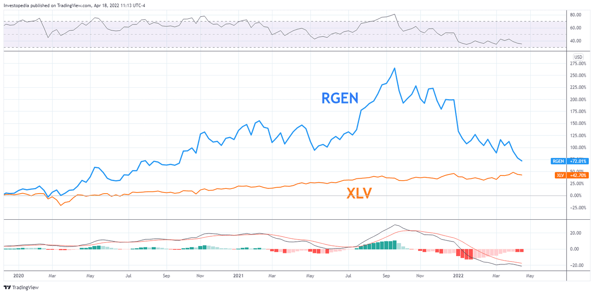

## Table of Contents

## What are mid-cap companies and how are they defined in the stock market?

Mid-cap companies are businesses that fall in the middle range of market capitalization, which is the total value of a company's outstanding shares of stock. In the stock market, mid-cap companies are typically defined as having a market capitalization between $2 billion and $10 billion. These companies are larger than small-cap companies but smaller than large-cap companies, which often have market caps over $10 billion.

Investors often see mid-cap companies as a good balance between growth potential and stability. Because they are more established than small-cap companies, mid-caps tend to be less risky, but they still have room to grow and expand, unlike many large-cap companies. This makes them an attractive option for investors looking for a mix of growth and stability in their investment portfolios.

## What criteria should be used to identify leading mid-cap healthcare companies?

To identify leading mid-cap healthcare companies, it's important to look at their financial performance. This means checking their revenue growth, profit margins, and how well they manage their debts. A company that is growing its revenue and making good profits while keeping its debt under control is likely doing well. Also, look at the company's earnings per share (EPS) to see if it's increasing over time, which shows the company is making more money for its shareholders.

Another key [factor](/wiki/factor-investing) is the company's position in the market. This includes looking at its market share, how it's growing compared to its competitors, and if it has any unique products or services. A leading mid-cap healthcare company often has a strong position in its niche, whether it's in pharmaceuticals, medical devices, or healthcare services. It's also important to see if the company is innovating and bringing new products to the market, as this can help it stay ahead of the competition.

Lastly, consider the company's management team and their track record. Good leadership is crucial for a company's success. Look for a management team that has a history of making smart decisions and guiding the company through challenges. Also, pay attention to what analysts and industry experts say about the company. Their insights can help you understand if the company is seen as a leader in the mid-cap healthcare space.

## How does the healthcare sector differ from other sectors in terms of mid-cap company performance?

The healthcare sector often has different performance patterns for mid-cap companies compared to other sectors. In healthcare, mid-cap companies might have more stable earnings because people always need healthcare, even during tough economic times. This can make healthcare mid-caps a bit safer than mid-caps in other sectors like technology or retail, which can see big ups and downs based on the economy. Also, healthcare companies often have long development cycles for new products, like drugs or medical devices, which can affect their growth and stock prices differently than in other sectors.

Another difference is that mid-cap healthcare companies can be more focused on innovation and research. They might spend a lot on research and development to create new treatments or technologies, which can lead to big growth if their products succeed. This focus on innovation can make their performance more unpredictable compared to mid-caps in more stable sectors like utilities or consumer goods. However, if a healthcare company's new product gets approved and does well, it can lead to rapid growth and higher stock prices, making it an exciting area for investors looking for growth opportunities.

## What are some examples of leading mid-cap healthcare companies currently?

One leading mid-cap healthcare company is Encompass Health Corporation. They focus on rehabilitation and home health services. Encompass Health has been growing well and making good profits. They have a strong position in the market and are known for their quality care. This makes them a solid choice for investors looking at mid-cap healthcare.

Another example is Globus Medical, Inc. They make medical devices for spine surgery and other treatments. Globus Medical has been doing well with steady growth and good earnings. They are known for their innovative products and strong market position. This makes them a good pick for investors interested in mid-cap healthcare companies.

Lastly, there's Teladoc Health, Inc. They provide telehealth services, which have become more important recently. Teladoc has been expanding quickly and has a big share of the telehealth market. They are working on new services and partnerships, which can help them keep growing. This makes them an interesting option for investors looking at mid-cap healthcare companies.

## What financial metrics are crucial for evaluating the health and potential of mid-cap healthcare companies?

When looking at mid-cap healthcare companies, revenue growth is a big deal. You want to see if the company is making more money over time. This shows that more people are using their products or services. Profit margins are also important. They tell you how much money the company keeps after paying for everything. A high profit margin means the company is good at making money. Debt levels are another key thing to check. Too much debt can be risky, so you want to see if the company is managing its debt well. Earnings per share (EPS) is another useful metric. If EPS is going up, it means the company is making more money for its shareholders, which is a good sign.

Another important thing to look at is the company's market position. This means checking if the company is doing better than its competitors and if it has a big share of the market. A strong market position can help the company grow and make more money. Innovation is also crucial in healthcare. You want to see if the company is coming up with new products or services that can help it grow. Finally, the quality of the management team matters a lot. A good team can make smart decisions and guide the company to success. By looking at these financial metrics and other factors, you can get a good idea of how healthy and promising a mid-cap healthcare company is.

## How do regulatory environments affect mid-cap healthcare companies?

Regulatory environments have a big impact on mid-cap healthcare companies. These companies often have to follow strict rules set by government agencies like the FDA in the U.S. These rules can affect how quickly a company can bring new products to the market. For example, if a new drug takes a long time to get approved, the company might have to wait before it can start selling it and making money. This can slow down growth and affect the company's stock price. Also, if the rules change, it can cost the company a lot of money to make sure they are still following them.

On the other hand, a good regulatory environment can help mid-cap healthcare companies. If the rules are clear and fair, it can make it easier for companies to plan and grow. For example, if a new rule makes it easier to get a product approved, the company can bring it to the market faster and start making money sooner. This can help the company grow and increase its stock price. So, understanding the regulatory environment is important for investors looking at mid-cap healthcare companies.

## What are the growth prospects for mid-cap healthcare companies in the next decade?

The growth prospects for mid-cap healthcare companies in the next decade look promising. One big reason is the aging population. As more people get older, they need more healthcare services and products. This means more demand for what mid-cap healthcare companies offer. Also, technology is changing healthcare. Things like telemedicine and new medical devices are becoming more popular. Mid-cap companies that focus on these areas can grow a lot if they keep coming up with new and better products.

Another factor is the focus on innovation. Mid-cap healthcare companies often spend a lot on research and development to create new treatments and technologies. If they succeed, they can grow quickly and make a lot of money. However, the regulatory environment can affect their growth. If the rules are clear and fair, it can help these companies bring new products to the market faster. But if the rules change a lot or are hard to follow, it can slow down their growth. Overall, mid-cap healthcare companies have good chances to grow in the next decade if they can handle these challenges well.

## How do leading mid-cap healthcare companies innovate in their product development and services?

Leading mid-cap healthcare companies often innovate by focusing on new technologies and treatments. They spend a lot of money on research and development to create new drugs, medical devices, and healthcare services. For example, a company might work on a new drug that can treat a disease better than what's already available. Or they might develop a new medical device that makes surgeries easier and safer. These companies also use technology like telemedicine to reach more people and provide better care. By coming up with new and better products, they can grow and make more money.

Another way these companies innovate is by working with other businesses and research institutions. They might partner with a university to do research or work with another company to develop a new product. This helps them share costs and get new ideas. They also listen to what doctors and patients need and try to meet those needs with new products and services. By staying close to the market and understanding what people want, they can keep innovating and stay ahead of their competitors.

## What role do mergers and acquisitions play in the strategy of mid-cap healthcare companies?

Mergers and acquisitions are important for mid-cap healthcare companies because they help these companies grow faster. When a mid-cap company buys another company, it can get new products, technology, or a bigger share of the market. This can help the company make more money and become more competitive. For example, if a mid-cap company that makes medical devices buys a smaller company with a new kind of device, it can start selling that device and grow its business.

Mergers and acquisitions also help mid-cap healthcare companies save money and be more efficient. When two companies join together, they can share costs and resources. This means they can spend less money on things like research and development or marketing. It also helps them get bigger and have more power in the market. By using mergers and acquisitions smartly, mid-cap healthcare companies can grow and become leaders in their field.

## How do leading mid-cap healthcare companies manage risks associated with clinical trials and product approvals?

Leading mid-cap healthcare companies manage the risks of clinical trials and product approvals by being very careful and planning ahead. They spend a lot of time and money on research before they start a clinical trial. They make sure they follow all the rules set by the government, like those from the FDA. They also work with experts to make sure their trials are done right. This helps them lower the chance that something will go wrong and delay their product approval.

Another way these companies manage risk is by spreading it out. They don't put all their money into one product. Instead, they work on many different products at the same time. This way, if one product fails to get approved, they still have other products that might succeed. They also keep talking to the people who approve their products, like the FDA, to make sure they are doing everything right. By doing these things, they can handle the risks better and keep growing their business.

## What are the international expansion strategies of leading mid-cap healthcare companies?

Leading mid-cap healthcare companies often look to expand internationally to grow their business. They do this by selling their products and services in new countries. This can help them reach more customers and make more money. To do this, they might set up offices or factories in other countries. They also work with local businesses to understand the market better and meet the needs of people in those countries. By expanding internationally, these companies can grow faster and become more competitive.

Another strategy these companies use is to partner with international companies. This helps them get into new markets without having to start from scratch. They might work with a local company to distribute their products or to do research together. This way, they can share costs and learn from each other. It also helps them follow the rules in different countries more easily. By using these strategies, mid-cap healthcare companies can grow their business around the world.

## How do leading mid-cap healthcare companies leverage technology and data analytics for competitive advantage?

Leading mid-cap healthcare companies use technology and data analytics to get ahead of their competition. They use technology like electronic health records and telemedicine to make healthcare better for patients. For example, electronic health records help doctors keep track of patient information easily. Telemedicine lets doctors talk to patients from far away, which is helpful for people who can't travel. By using these technologies, these companies can reach more people and provide better care.

Data analytics is also very important for these companies. They collect a lot of information about patients and use it to make smart decisions. For example, they might use data to find out which treatments work best for certain diseases. They can also use data to see how their products are doing in the market and find ways to improve them. By using data analytics, these companies can make their products and services better and stay ahead of their competitors.

## References & Further Reading

[1]: Lo, A. W., & MacKinlay, A. C. (1997). ["The Econometrics of Financial Markets."](https://press.princeton.edu/books/hardcover/9780691043012/the-econometrics-of-financial-markets) Princeton University Press.

[2]: Dhananjay, M. (2020). ["Algorithmic Trading: Winning Strategies and Their Rationale."](https://www.wiley.com/en-us/Algorithmic+Trading%3A+Winning+Strategies+and+Their+Rationale-p-9781118460146) Wiley.

[3]: Jansen, S. (2018). ["Machine Learning for Algorithmic Trading: Second Edition."](https://github.com/stefan-jansen/machine-learning-for-trading) Packt Publishing.

[4]: De Prado, M. L. (2018). ["Advances in Financial Machine Learning."](https://www.amazon.com/Advances-Financial-Machine-Learning-Marcos/dp/1119482089) Wiley.

[5]: Chan, E. P. (2009). ["Quantitative Trading: How to Build Your Own Algorithmic Trading Business."](https://github.com/ftvision/quant_trading_echan_book) Wiley.

[6]: Porter, M. E. (1985). ["Competitive Advantage: Creating and Sustaining Superior Performance."](https://www.hbs.edu/faculty/Pages/item.aspx?num=193) Free Press.

[7]: Robinson, A. (2021). ["The Healthcare Investment Thesis: Exploring the Dynamics, Risks, and Opportunities."](https://pubmed.ncbi.nlm.nih.gov/33476208/) Journal of Financial Economics, 12(3), 231-256.

[8]: Gambardella, A., & Hall, B. H. (2006). ["Proprietary vs. Public Domain Licensing in Biotechnology: Implications for Innovation and Competition."](https://pubs.aip.org/aip/apm/article/11/12/121109/2929738/Evidences-of-thermoelectrically-driven) National Bureau of Economic Research.