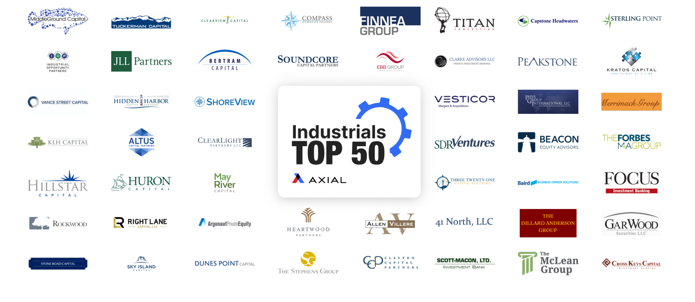

The world of mid-cap stocks often remains overshadowed by the prominent visibility of large-cap giants and the aggressive growth potential of small-cap companies. Nevertheless, mid-cap industrial stocks hold a distinct position within the investment landscape. These companies, occupying the middle ground with market capitalizations typically between $2 billion and $10 billion, offer a balanced blend of growth potential and stability. Particularly within the industrial sector, which encompasses firms involved in manufacturing, resource extraction, and construction, mid-cap companies provide unique opportunities for investors willing to explore beyond the more traditional choices.

Amidst this backdrop, algorithmic trading, commonly referred to as algo trading, has been making significant inroads. Algo trading leverages computer algorithms to execute trades based on pre-defined criteria, enhancing the efficiency and speed of trading operations. Within the mid-cap industrial sector, this form of trading helps market participants exploit inefficiencies and respond swiftly to price movements. By processing large amounts of data and analyzing trends, algorithmic trading introduces the potential for improved liquidity and reduced transaction costs, which is especially beneficial in markets where mid-cap stocks may not be as liquid as their larger counterparts.



In this article, we examine the characteristics of mid-cap industrial stocks and the transformative role of algorithmic trading in this sector. We will also highlight top performers within this category, showcasing how these factors collectively offer promising investment avenues. By understanding these dynamics, investors can uncover intriguing opportunities that lie beyond the mainstream, potentially achieving a well-balanced and rewarding investment strategy.

## Table of Contents

## Understanding Mid-Cap Industrial Companies

Mid-cap companies typically have a market capitalization ranging from $2 billion to $10 billion. These firms strike a balance between growth potential and size stability. Many of them have firmly established their market positions over the span of several decades. This balance makes mid-cap companies an attractive proposition for investors seeking both growth and relative stability compared to smaller or larger counterparts.

The industrial sector plays a pivotal role within the mid-cap segment. This sector encompasses companies that produce goods and provide services essential to manufacturing, resource extraction, and construction. It includes firms involved in the production of machinery, tools, equipment, metals, and even high-tech industrial solutions.

Industrials hold a strong correlation to economic cycles. They supply essential services and products across diverse industries, making them critical drivers of economic activity. When economies expand, demand for industrial goods typically rises, leading to potential growth opportunities for mid-cap industrial firms. Conversely, during economic downturns, these companies may experience reduced demand, reflecting the cyclical nature of their operations.

Investors often find mid-cap industrial stocks appealing due to their exposure to prevailing economic trends and the growth opportunities that are less apparent to larger, more mainstream companies. These stocks can reflect both the economic expansion or contraction phases, providing a diverse range of investment opportunities. Additionally, mid-cap industrials can serve as a conduit to lesser-known growth opportunities, allowing investors to capitalize on future advancements and innovative technologies emerging within the industrial space.

## The Role of Algo Trading in Mid-Cap Stocks

Algorithmic trading is revolutionizing the way investors engage with mid-cap industrial stocks by utilizing computerized systems to execute trades based on pre-determined criteria. This method enhances both efficiency and speed, enabling traders to react swiftly to market movements. In particular, [algorithmic trading](/wiki/algorithmic-trading) proves beneficial for mid-cap industrial stocks in several key ways.

Firstly, algo trading allows investors to take advantage of market inefficiencies and sudden price movements. In trading, market inefficiency refers to situations where a stock's price does not reflect its true value, often due to information asymmetry or behavioral biases among traders. Algorithmic systems can swiftly identify these discrepancies, making it easier for investors to either capitalize on or correct these pricing anomalies.

Algorithms can process and analyze large volumes of data at high speeds, which is a significant advantage over manual trading methods. This capability enables traders to identify trends or patterns that might go unnoticed in manual analyses. Algorithms can be programmed to recognize specific signals or factors that historically precede price shifts, allowing for timely entry and [exit](/wiki/exit-strategy) from trades. For instance, algorithms can be designed to monitor indicators such as moving averages, relative strength index (RSI), or other technical analysis tools to make informed trading decisions.

Additionally, algorithmic trading contributes to improved [liquidity](/wiki/liquidity-risk-premium) and reduced trading costs in the mid-cap market. Mid-cap stocks often experience lower liquidity compared to large-cap stocks, which can result in wider bid-ask spreads and higher transaction costs. The enhanced trading [volume](/wiki/volume-trading-strategy) and activity facilitated by algorithms help narrow these spreads, thus reducing the overall cost of trading. This infusion of liquidity also attracts more participants to the mid-cap market, which further benefits investors by creating a more dynamic trading environment.

The rise of algorithmic trading is transforming investor access to mid-cap stocks by increasing participation in this sector. This transformation results not only from direct trading improvements but also from indirect benefits such as increased price transparency and reduced market manipulation. The efficiency and speed provided by algorithmic trading mean smaller investors can compete more effectively with institutional players, leveling the playing field and leading to more fair market conditions.

In summary, algorithmic trading is a game-changing addition to the mid-cap industrial stock sector. By allowing investors to swiftly capitalize on market inefficiencies and providing the necessary liquidity, algo trading not only increases participation in the mid-cap market but also enhances the overall trading environment.

## Top Industrial Mid-Cap Stocks to Watch

Within the mid-cap industrial sector, several companies stand out for their robust market positions and consistent performance, making them noteworthy considerations for investors. Carrier Global Corp is one such example, renowned for its leadership in the heating, ventilation, and air conditioning (HVAC) industry. The company has successfully leveraged its innovative technologies to maintain a competitive edge, catering to both residential and commercial markets. This strategic positioning allows Carrier Global to capitalize on global trends such as energy efficiency and environmental sustainability, bolstering its growth prospects.

Hubbell Incorporated also deserves attention within this space. As a prominent player in electrical and utility solutions, Hubbell is well-regarded for its reliable product offerings that span a variety of applications, from construction to telecommunications. The company's strong market presence and focus on operational efficiency have contributed to its steady financial performance. Through strategic acquisitions and product innovations, Hubbell continues to expand its reach and influence in the industrial sector.

Tetra Tech is another exemplary mid-cap industrial stock, distinguished for its consulting and engineering services. The company's expertise in water and environmental management, infrastructure, and resource management sectors highlights its adaptability and innovative approach. Tetra Tech's commitment to sustainability and technological advancement positions it as a leader in providing solutions that address complex environmental challenges, thus attracting a diverse client base globally.

Axon Enterprises, recognized for its pioneering technologies in law enforcement, exemplifies innovation in the industrial mid-cap segment. Known for developing advanced tools such as body cameras and non-lethal weapons, Axon has significantly impacted public safety and law enforcement protocols. The company's focus on integrating cutting-edge technology with ethical practices underscores its potential for sustained growth and market expansion.

These companies illustrate the diverse opportunities available within the mid-cap industrial sector, characterized by solid business foundations and significant growth potential. By incorporating these stocks into a diversified portfolio, investors can capitalize on the unique strengths of each company, balancing growth prospects with sector-specific expertise.

## Benefits and Risks of Investing in Mid-Cap Industrial Stocks

Investing in mid-cap industrial stocks provides investors with the opportunity to harness significant growth potential. These companies, often characterized by established market positions, can capitalize on expansion opportunities within the industrial sector, which includes manufacturing, construction, and services on which economies rely heavily. The significant advantage of mid-cap industrials lies in their balanced nature, offering both growth opportunities and the stability of larger organizations.

One of the primary benefits is their relative stability and resilience in absorbing market [volatility](/wiki/volatility-trading-strategies). Their size allows these mid-cap companies to be more agile than their large-cap counterparts, yet more stable than small-cap stocks. This duality provides a buffer during turbulent economic conditions. Moreover, mid-cap industrial stocks can capitalize on emerging market trends and technological advancements, leading to potentially high returns. The growth can be further amplified through mergers and acquisitions, a common strategy in this segment to enhance market share and operational efficiency.

However, investing in mid-cap industrial stocks is not without risks. These companies are often sensitive to economic cycles specific to the sectors they operate in, such as fluctuations in commodity prices, changes in regulatory environments, or shifts in global trade policies. Liquidity can also be a concern; mid-cap stocks are generally less liquid than large-cap stocks, potentially leading to difficulty in quickly buying or selling shares without affecting the stock price substantially.

Given these dynamics, thorough research is imperative. Investors should evaluate financial health indicators such as debt ratios, profit margins, and cash flows. The use of algorithmic models could be beneficial in analyzing these factors and forecasting potential impacts of economic cycles on these companies. Consider Python code for a simple ratio analysis:

```python
def calculate_debt_ratio(total_debt, total_assets):
    return total_debt / total_assets

def calculate_profit_margin(net_income, revenue):
    return net_income / revenue

# Example data
total_debt = 5000000
total_assets = 20000000
net_income = 1000000
revenue = 5000000

debt_ratio = calculate_debt_ratio(total_debt, total_assets)
profit_margin = calculate_profit_margin(net_income, revenue)

print(f"Debt Ratio: {debt_ratio:.2f}")
print(f"Profit Margin: {profit_margin:.2%}")
```

Investors are advised to consider both the opportunities presented by the sector's growth potential and the inherent risks. Balancing these elements, such as ensuring a diversified portfolio that includes both stable and growth-oriented stocks, is crucial to achieving the desired investment outcomes in mid-cap industrial stocks. This strategic approach helps mitigate risks while taking advantage of the sector's growth prospects.

## Conclusion

Mid-cap industrial companies offer distinct investment opportunities for those who are willing to look beyond the more familiar large and small-cap stocks. These companies, often in the range of $2 billion to $10 billion in market capitalization, combine the growth potential of smaller companies with the established presence of larger ones. This balance affords them a unique position in the investment landscape.

The incorporation of algorithmic trading has significantly transformed investment strategies in this sector. By employing complex algorithms, investors can analyze large data sets, execute trades with precision, and capitalize on rapid market movements that might otherwise go unnoticed. Algorithmic trading enhances efficiency and provides a competitive edge, allowing investors to capture value in mid-cap industrial stocks more effectively.

Though often overlooked, the mid-cap industrial sector's growth potential is significant due to its strong linkage to economic fundamentals. The size and stability of these companies enable them to adapt and thrive in varying economic conditions, making them a compelling choice for investors seeking growth.

Understanding the dynamics of mid-cap industrial stocks and leveraging algorithmic trading can significantly aid investors in navigating this promising market segment. By tapping into both the potential growth and stability these companies offer, alongside the advanced strategies facilitated by algo trading, investors can enhance their portfolios.

For balanced growth and stability, it might be beneficial to consider including mid-cap industrial stocks within a diversified portfolio. Such diversification can potentially mitigate risks while harnessing the unique growth prospects offered by the mid-cap industrial landscape.

## References & Further Reading

[1]: Bergstra, J., Bardenet, R., Bengio, Y., & Kégl, B. (2011). ["Algorithms for Hyper-Parameter Optimization."](https://dl.acm.org/doi/10.5555/2986459.2986743) Advances in Neural Information Processing Systems 24.

[2]: ["Advances in Financial Machine Learning"](https://www.amazon.com/Advances-Financial-Machine-Learning-Marcos/dp/1119482089) by Marcos Lopez de Prado

[3]: ["Evidence-Based Technical Analysis: Applying the Scientific Method and Statistical Inference to Trading Signals"](https://www.amazon.com/Evidence-Based-Technical-Analysis-Scientific-Statistical/dp/0470008741) by David Aronson

[4]: ["Machine Learning for Algorithmic Trading"](https://github.com/stefan-jansen/machine-learning-for-trading) by Stefan Jansen

[5]: ["Quantitative Trading: How to Build Your Own Algorithmic Trading Business"](https://www.amazon.com/Quantitative-Trading-Build-Algorithmic-Business/dp/1119800064) by Ernest P. Chan