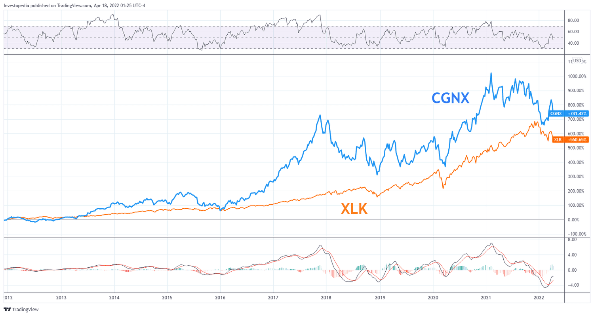

The technology sector stands as a cornerstone of innovation and an engine driving global economic growth. This ever-evolving field is often associated with large-cap technology giants such as Apple and Microsoft, whose expansive reach and financial strength capture much of the investment spotlight. However, mid-cap technology companies, defined by market capitalizations typically ranging from $2 billion to $10 billion, offer significant growth potential that should not be overlooked by discerning investors.

These mid-cap companies occupy a strategic position in the market. They are large enough to access vital resources and compete on a substantial scale, yet small enough to retain the agility needed to adapt swiftly to technological advancements and shifting market demands. Their operations often center on specialized niches, such as advanced semiconductors, industrial software, and other integral segments that support and complement the broad tech ecosystem.



This article underscores the importance of mid-cap technology companies in the tech sector, highlighting their unique growth potential and the strategic advantage they present for investors aiming to diversify their portfolios effectively. Additionally, we will explore the role of algorithmic trading as a tool for maximizing investment returns in these companies. Algorithmic trading, by leveraging cutting-edge computer programs, can optimize trading performance, minimize human error, and swiftly identify lucrative opportunities through sophisticated market data analysis and predictive analytics.

Understanding the dynamics and benefits of investing in mid-cap technology companies equips investors with the knowledge needed to navigate the challenges and opportunities in the tech sector. By blending the promise of mid-cap growth with the precision of algorithmic trading, investors can harness a potent combination that maximizes potential returns while deftly managing associated risks. As the tech landscape continues to evolve, staying informed and adaptable becomes essential for achieving successful investment outcomes.

## Table of Contents

## Understanding Mid-Cap Technology Companies

Mid-cap companies are generally defined as corporations with a market capitalization between $2 billion and $10 billion. This category of companies bridges the gap between small-cap and large-cap enterprises, offering a unique blend of stability and growth potential. In the technology sector, mid-cap firms often spearhead developments in niche segments such as specialized semiconductors and industrial software. These domains require innovation and adaptability, qualities that mid-cap companies inherently possess due to their size and focus.

Mid-cap technology companies operate within a sweet spot in the market: they are sufficiently large to access necessary resources, such as capital and talent, yet small enough to offer significant growth potential. This size allows them to invest in cutting-edge research and development without the burden of the bureaucratic inertia often found in larger corporations. 

Moreover, mid-cap firms can often adapt quickly to new technological changes and shifting market demands. Their relatively smaller scale enables them to pivot strategies and implement innovations with agility, potentially leading to disruptive advancements in their targeted industries. For instance, a mid-cap semiconductor company can swiftly adopt new fabrication technologies or materials that enhance performance, thus gaining a competitive edge.

The performance of mid-cap companies is often characterized by less [volatility](/wiki/volatility-trading-strategies) than small-cap firms, thus appealing to investors seeking a balanced portfolio. However, due to their focus on specific niches, they have the ability to achieve higher growth rates than their large-cap counterparts. This potential for substantial returns, combined with a moderate risk profile, makes mid-cap technology companies an attractive option for diversifying investment portfolios effectively.

Investors interested in the unique advantages of mid-cap tech companies recognize that these firms are at the forefront of innovation within defined market segments. Their position allows them to lead advancements while maintaining enough maneuverability to respond to industry changes efficiently. As such, understanding the dynamics of mid-cap technology firms is crucial for investors looking to capitalize on the growth opportunities presented by these dynamic and adaptable enterprises.

## Prominent Mid-Cap Tech Companies

TD SYNNEX Corporation is a crucial entity in the realm of IT hardware and cloud services. With a market capitalization nearing $9.48 billion, it serves as a key distributor and solutions provider in the information technology ecosystem. The company leverages its scale to offer comprehensive services and technological solutions that cater to various industries, facilitating businesses in their digital transformation journeys. This strategic positioning allows TD SYNNEX to capitalize on emerging technological trends and the increasing demand for advanced IT infrastructure and services.

Onto Innovation represents another standout mid-cap technology company, focusing primarily on metrology and data analysis systems. These systems are vital for the microelectronics industry, enabling precise measurement and inspection necessary for maintaining the high-quality standards of modern electronic components. With a market cap of around $8.31 billion, Onto Innovation strategically addresses the demand for advanced analytical solutions as manufacturers aim to scale production while maintaining stringent quality controls. Its technological prowess in data-driven insights positions it favorably in an industry poised for continuous growth, driven by the perpetual advancement of semiconductor technologies.

Universal Display Corporation is recognized as a leader in the organic light-emitting diode (OLED) technology sector, boasting a market cap of approximately $7.81 billion. OLED technology is widely used across various smart devices, including smartphones, TVs, and wearable devices, due to its superior display quality and energy efficiency. Universal Display's specialization in OLED materials and technologies grants it a competitive edge in developing high-performance displays with vibrant colors and improved efficiency. This position is further strengthened by the growing demand for cutting-edge display solutions in consumer electronics and other applications, making it a key player in fulfilling future technological needs.

## Algorithmic Trading in the Tech Sector

Algorithmic trading, or algo trading, employs sophisticated computer algorithms to automate financial trading processes. These algorithms enable rapid, efficient execution of trades by processing vast amounts of data at speeds beyond human capability. In the technology sector, particularly among mid-cap companies, algo trading can significantly enhance investment management by offering timely market insights and mitigating human error.

Algo trading systems are designed to analyze market data, evaluate historical trends, and employ predictive analytics to identify potentially profitable trading opportunities. This computational approach involves the employment of diverse strategies such as statistical [arbitrage](/wiki/arbitrage), [market making](/wiki/market-making), and [trend following](/wiki/trend-following), tailored to leverage the market conditions unique to tech stocks.

Typically, [algorithmic trading](/wiki/algorithmic-trading) systems rely on quantitative models for decision-making. These models utilize data science and [machine learning](/wiki/machine-learning) to forecast price movements and optimize trading strategies. For instance, a simple moving average (SMA) strategy might involve buying a stock when its short-term SMA crosses above its long-term SMA, indicating a potential upward trend, and selling when the opposite occurs.

Furthermore, algo trading reduces the risk of human emotions impacting trading decisions, which is particularly beneficial in the tech sector's often volatile environment. By methodically executing trades based on predefined parameters, algorithms contribute to a disciplined investment approach, enhancing risk management.

Overall, algorithmic trading stands out as a pivotal tool for managing portfolios comprising mid-cap tech stocks. Through its capability to process and interpret complex datasets accurately and swiftly, algo trading offers investors a method to capitalize on tech market dynamics while maintaining robust safeguards against risks.

## Benefits of Investing in Mid-Cap Tech Through Algo Trading

Algorithmic trading, or algo trading, leverages advanced computational techniques to significantly enhance the investment process, particularly in sectors characterized by volatility, such as technology. By integrating algo trading with investments in mid-cap technology companies, investors can optimize their strategies through several notable advantages.

Firstly, the efficiency and speed that algo trading introduces are paramount in the tech sector, where rapid market shifts can occur. Algorithims can process vast amounts of data in milliseconds, allowing for the swift execution of trades that might otherwise be missed by human traders. This speed is crucial for capturing time-sensitive market opportunities that are typical in mid-cap stocks, which might experience sudden price movements due to market news or technological breakthroughs.

Investors also gain the advantage of accessing intricate algorithms capable of processing and analyzing large datasets to support informed decision-making. For instance, machine learning algorithms can predict stock price movements by analyzing historical data trends, sentiment analysis from news and social media, and other market indicators. Python, a popular language in algorithmic trading, offers libraries such as `pandas` for data manipulation and `scikit-learn` for implementing learning algorithms. Here's a simple example of using Python for a predictive trading model:

```python
import pandas as pd
from sklearn.model_selection import train_test_split
from sklearn.ensemble import RandomForestRegressor

# Load historical stock price data
data = pd.read_csv('mid_cap_tech_stock_data.csv')

# Feature engineering and preprocessing
features = data[['feature1', 'feature2', 'feature3']]  # hypothetical features
target = data['stock_price']

# Split data into training and test sets
X_train, X_test, y_train, y_test = train_test_split(features, target, test_size=0.2, random_state=42)

# Train a predictive model
model = RandomForestRegressor(n_estimators=100, random_state=42)
model.fit(X_train, y_train)

# Predict stock prices
predictions = model.predict(X_test)
```

Algo trading also reduces transaction costs and improves market [liquidity](/wiki/liquidity-risk-premium). By automating the trade execution process, it minimizes manual intervention, thereby cutting down on brokerage fees and reducing the impact of human error. Additionally, algorithms can execute trades incrementally to prevent significant market impact, thus aiding in maintaining liquidity.

Moreover, algorithmic trading plays a crucial role in balancing risk and reward by quickly adapting to market changes. It can rapidly recalibrate investment strategies based on evolving market conditions, minimizing potential losses while maximizing returns. For example, risk management algorithms can implement stop-loss orders or adjust portfolio weights dynamically in response to unexpected price shifts.

In conclusion, integrating algo trading with investments in mid-cap tech companies offers a sophisticated approach that enhances efficiency, insight, and adaptability. This combination allows investors to navigate the complexities of the tech market effectively, ensuring they remain competitive and potent in their investment pursuits.

## Conclusion

Mid-cap technology companies present unique opportunities for growth that are often overlooked in favor of large-cap investments. These companies, typically characterized by their agile operations and focus on niche markets, hold the potential to deliver substantial returns. Their ability to quickly adapt to evolving technological landscapes and market demands positions them as attractive investments for those willing to explore beyond the behemoths of the tech sector.

The synergy between mid-cap tech stocks and algorithmic trading creates a powerful combination for investors aiming to maximize their returns while effectively managing risks. Algorithmic trading, with its capacity to process vast amounts of data and execute trades at high speed, provides a significant advantage in the fast-paced tech market. This automated approach ensures that investors can capitalize on fleeting opportunities and maintain a balanced portfolio by efficiently adjusting to market fluctuations.

As the technology sector continues to evolve at an unprecedented pace, staying informed and adaptable becomes crucial for investment success. Investors who recognize the potential within mid-cap tech companies and harness the analytical power of algorithmic trading are better positioned to navigate the complexities of modern markets. This strategic approach not only enhances prospects for profit but also cultivates resilience in the face of market uncertainties, offering a promising avenue for growth in the dynamic landscape of technology investments.

## References & Further Reading

[1]: Bergstra, J., Bardenet, R., Bengio, Y., & Kégl, B. (2011). ["Algorithms for Hyper-Parameter Optimization."](https://dl.acm.org/doi/10.5555/2986459.2986743) Advances in Neural Information Processing Systems 24.

[2]: ["Advances in Financial Machine Learning"](https://www.amazon.com/Advances-Financial-Machine-Learning-Marcos/dp/1119482089) by Marcos Lopez de Prado

[3]: ["Evidence-Based Technical Analysis: Applying the Scientific Method and Statistical Inference to Trading Signals"](https://www.amazon.com/Evidence-Based-Technical-Analysis-Scientific-Statistical/dp/0470008741) by David Aronson

[4]: ["Machine Learning for Algorithmic Trading"](https://github.com/PacktPublishing/Machine-Learning-for-Algorithmic-Trading-Second-Edition) by Stefan Jansen

[5]: ["Quantitative Trading: How to Build Your Own Algorithmic Trading Business"](https://books.google.com/books/about/Quantitative_Trading.html?id=j70yEAAAQBAJ) by Ernest P. Chan