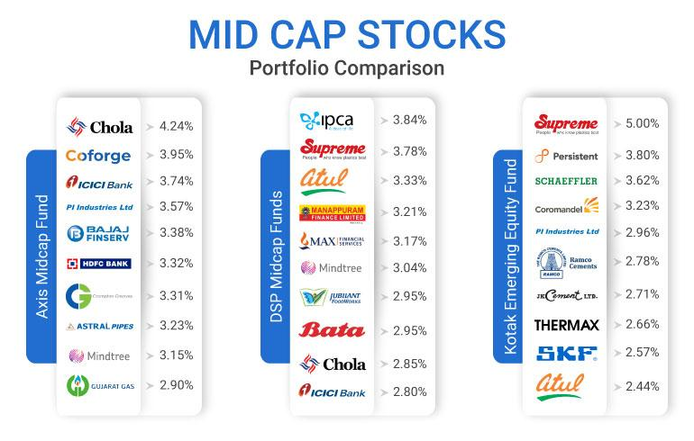

## Table of Contents

## What are mid-cap companies and how are they defined in the technology sector?

Mid-cap companies are businesses that have a market value, or market capitalization, that falls between small-cap and large-cap companies. In the stock market, mid-cap companies are usually defined as having a market capitalization between $2 billion and $10 billion. These companies are often seen as a good balance between growth potential and stability. They are typically more established than small-cap companies but still have room to grow, unlike many large-cap companies.

In the technology sector, mid-cap companies are those tech firms that fit within this market capitalization range. These companies might be involved in software development, hardware manufacturing, or providing tech services. They are often innovative and can grow quickly due to new technology or market trends. However, they might also face more risks compared to larger tech companies, which have more resources and established market positions. Investors might look at mid-cap tech companies for potential high returns, but they should also be aware of the increased risk.

## Why are mid-cap technology companies considered important in the market?

Mid-cap technology companies are important in the market because they often bring new ideas and products. These companies are not as big as the giants like Apple or Microsoft, but they are bigger than small start-ups. This size makes them good at trying new things without the heavy rules that big companies have. They can grow fast and bring new technology to the market. This can lead to big changes in how we use technology in our daily lives.

Also, mid-cap tech companies are important for investors. They offer a middle ground between the high risk of small companies and the slower growth of big companies. Investors can find good chances to make money with mid-cap tech companies. These companies can grow a lot if they do well with their new products or services. This makes the market more exciting and gives people more choices for where to put their money.

## Can you list some examples of leading mid-cap technology companies?

Some examples of leading mid-cap technology companies include Twilio, which helps businesses communicate with their customers through text messages and phone calls. Another example is Okta, a company that focuses on identity management and helps businesses keep their data safe. These companies are important because they provide services that many other businesses need to work well.

Another mid-cap tech company is Zscaler, which works on keeping internet traffic safe for companies. They help protect against hackers and other online dangers. Also, there's Crowdstrike, a company that uses [artificial intelligence](/wiki/ai-artificial-intelligence) to stop cyber attacks. These companies show how mid-cap tech firms can be leaders in keeping our digital world safe and secure.

Lastly, there's MongoDB, a company that helps businesses store and manage their data in a flexible way. They are known for their database technology that can handle a lot of information. These examples show that mid-cap tech companies can be at the forefront of innovation and growth in the technology sector.

## What are the key products or services offered by these mid-cap technology companies?

Twilio helps businesses talk to their customers easily. They offer services like sending text messages, making phone calls, and even sending videos. This makes it simple for companies to reach out to people and keep them updated. Okta focuses on keeping information safe. They help businesses manage who can see their data and make sure only the right people get access. This is important for companies that want to protect their information from hackers.

Zscaler works on keeping internet traffic safe for businesses. They check the data going in and out to make sure it's safe from online dangers. This helps companies stay secure when their employees use the internet. Crowdstrike uses smart technology to stop cyber attacks. They use artificial intelligence to find and stop threats quickly, which is crucial for keeping a company's digital stuff safe.

MongoDB helps businesses store and manage their data. They offer a type of database that can handle lots of different kinds of information. This makes it easier for companies to keep track of their data and use it in new ways. These mid-cap tech companies show how important their services are for making businesses run smoothly and safely.

## How do mid-cap technology companies differ from small-cap and large-cap companies in terms of growth and stability?

Mid-cap technology companies are different from small-cap and large-cap companies because they are in the middle. They are bigger than small-cap companies but smaller than large-cap ones. This middle size gives them a good balance between growth and stability. Mid-cap tech companies can grow faster than large-cap companies because they are not as big and can try new things more easily. They have more resources than small-cap companies, which helps them to grow and do well.

Small-cap technology companies are usually newer and smaller. They can grow very quickly if they come up with a great new idea or product. But they are also more risky because they might not have enough money or experience to handle problems. Large-cap technology companies are big and well-known. They grow more slowly because they are already very big. They are more stable and have less risk, but they might not have as much chance to grow a lot more.

So, mid-cap tech companies have a special place in the market. They can grow a lot like small-cap companies but are more stable like large-cap companies. This makes them interesting for people who want to invest in companies that can grow but are not too risky.

## What are the main challenges faced by mid-cap technology companies?

Mid-cap technology companies often face challenges with money. They need a lot of money to grow and keep up with new technology. But they are not as big as large-cap companies, so they might not have enough money to do everything they want. They also have to be careful with how they spend their money because they can't take as many risks as small companies. If they make a big mistake, it could hurt them a lot.

Another challenge is competition. Mid-cap tech companies have to compete with both small and large companies. Small companies might come up with new ideas that take customers away. Large companies have more money and can offer more things to customers. Mid-cap companies need to find a good place in the market where they can grow without being pushed out by others.

Lastly, mid-cap tech companies can have trouble finding and keeping good workers. They need smart people to help them grow and make new products. But they might not be able to pay as much as large companies or offer the same exciting opportunities as small start-ups. This makes it hard for them to build a strong team that can help them succeed.

## How do leading mid-cap technology companies typically fund their growth and expansion?

Leading mid-cap technology companies often use a mix of ways to fund their growth and expansion. One common way is by getting money from investors. They might do this through private investments, where people or companies give them money in return for a piece of the company. Another way is by selling shares of their company on the stock market through an initial public offering (IPO). This can bring in a lot of money quickly, but it also means they have to share their profits with more people.

Another important way mid-cap tech companies fund their growth is by using their own money, which is called using internal funds. They might save money from their profits and use it to grow their business. They can also borrow money from banks or other lenders. This can be a good way to get money, but they have to pay it back with interest. Sometimes, these companies also look for partnerships or joint ventures with other companies. This can help them share the costs and risks of growing their business.

## What role does innovation play in the success of mid-cap technology companies?

Innovation is very important for mid-cap technology companies to succeed. These companies are in the middle, not too big and not too small. This size lets them try new things without the heavy rules that big companies have. They can come up with new ideas and products that can change the market. If a mid-cap tech company makes something new and useful, it can grow quickly and take more of the market. This is how they can become bigger and more successful.

But innovation is not easy. Mid-cap tech companies need to spend a lot of time and money on research and development to come up with new ideas. They have to keep up with what customers want and what other companies are doing. If they can do this well, they can stay ahead of the competition. Innovation helps them not only to grow but also to stay important in the market. Without it, they might fall behind and lose their place.

## How do mid-cap technology companies impact the broader technology ecosystem?

Mid-cap technology companies have a big impact on the broader technology ecosystem. They bring new ideas and products that can change how we use technology. These companies are not as big as giants like Apple or Microsoft, but they are big enough to make a difference. They can try new things and take risks that big companies might not take. This helps to keep the technology world moving forward and growing.

These mid-cap companies also help smaller tech companies grow. They can show what works and what doesn't, giving smaller companies ideas to follow. They also create jobs and help the economy grow. When mid-cap tech companies do well, they can become big companies themselves, which makes the whole technology ecosystem stronger and more exciting.

## What are some case studies of successful strategies implemented by mid-cap technology companies?

Twilio is a mid-cap technology company that helps businesses talk to their customers easily. They grew by focusing on making it simple for companies to send text messages, make phone calls, and even send videos. Twilio's strategy was to make their service easy to use and flexible so that businesses of all sizes could use it. They also worked hard to build a community of developers who could create new ways to use Twilio's services. This helped them grow quickly and become a leader in their field. By listening to what their customers needed and keeping their service easy to use, Twilio was able to succeed and expand.

Another example is Okta, a mid-cap tech company that helps businesses keep their information safe. Okta's strategy was to focus on making identity management simple and secure. They made it easy for companies to control who can see their data and how to keep it safe from hackers. Okta also grew by buying other companies that offered similar services, which helped them offer more to their customers. By focusing on security and making their service easy to use, Okta was able to grow and become a leader in the identity management space. Their success shows how important it is for mid-cap tech companies to focus on what their customers need and to keep improving their services.

## How do market analysts evaluate the performance and potential of mid-cap technology companies?

Market analysts look at many things when they want to know how well mid-cap technology companies are doing and how much they might grow. They check the company's money to see if it is making a profit and if it has enough cash to keep growing. They also look at how fast the company is growing compared to other companies in the same field. Analysts pay attention to new products or services the company is making because these can help the company grow a lot. They also read what people say about the company in the news and what other experts think. All of these things help analysts decide if a mid-cap tech company is a good choice for people who want to invest their money.

Another important thing analysts do is look at the market where the company works. They want to know if the market is getting bigger or smaller and how much competition the company faces. If the market is growing and the company is doing well, it might be a good investment. Analysts also think about risks, like if the company might run out of money or if it might have trouble with new rules. By putting all of this information together, analysts can give a good idea of how well a mid-cap tech company might do in the future. This helps people decide if they should put their money into the company.

## What are the future trends and predictions for mid-cap technology companies in the evolving tech landscape?

Mid-cap technology companies are likely to play a big role in the future of technology. They are good at bringing new ideas and products to the market because they are not too big or too small. In the future, these companies might focus more on things like artificial intelligence, cloud computing, and cybersecurity. These are areas that are growing fast and where mid-cap tech companies can make a big difference. They might also work more with other companies to share costs and risks, which can help them grow even faster.

Another trend for mid-cap tech companies could be more use of data and analytics to make better decisions. They might use this information to understand what customers want and to find new ways to grow. As technology keeps changing, mid-cap companies will need to keep up with new rules and ways of doing things. If they can do this well, they might become big companies themselves. This will make the whole technology world more exciting and competitive, with lots of new ideas and products coming out all the time.

## References & Further Reading

[1]: Bergstra, J., Bardenet, R., Bengio, Y., & Kégl, B. (2011). ["Algorithms for Hyper-Parameter Optimization."](https://dl.acm.org/doi/10.5555/2986459.2986743) Advances in Neural Information Processing Systems 24.

[2]: ["Advances in Financial Machine Learning"](https://www.amazon.com/Advances-Financial-Machine-Learning-Marcos/dp/1119482089) by Marcos Lopez de Prado

[3]: ["Evidence-Based Technical Analysis: Applying the Scientific Method and Statistical Inference to Trading Signals"](https://www.amazon.com/Evidence-Based-Technical-Analysis-Scientific-Statistical/dp/0470008741) by David Aronson

[4]: ["Machine Learning for Algorithmic Trading"](https://github.com/PacktPublishing/Machine-Learning-for-Algorithmic-Trading-Second-Edition) by Stefan Jansen

[5]: ["Quantitative Trading: How to Build Your Own Algorithmic Trading Business"](https://books.google.com/books/about/Quantitative_Trading.html?id=j70yEAAAQBAJ) by Ernest P. Chan