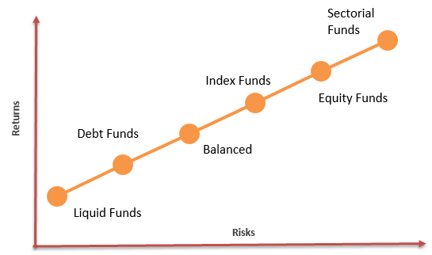

In the evolving world of finance, strategies such as sustainable investing and algorithmic trading are increasingly gaining prominence. These strategies represent a shift towards integrating ethical considerations and technological advancements within traditional finance to achieve broader economic and social goals. This article focuses on the growing influence of sustainable finance, mutual funds aimed at impact investing, and the role of algorithmic trading, exploring their interconnectedness and overall significance in modern finance.

Sustainable finance involves the integration of environmental, social, and governance (ESG) criteria into investment decisions. This approach encourages responsible economic growth by steering capital towards projects and companies that prioritize sustainable operations. ESG criteria help investors make informed decisions that align with longer-term societal goals, aiming to address issues such as climate change, human rights, and corporate governance.



Impact investing, which falls under the umbrella of sustainable finance, specifically targets investments that generate positive, measurable social and environmental outcomes alongside financial returns. Investors look for tangible benefits, such as reduced carbon emissions or improved social inclusion, making use of impact measurements to guide their allocation of funds towards entities that contribute to societal progress.

In parallel, algorithmic trading, which utilizes computer models to execute trades, influences sustainable finance by offering new methods to enhance both efficiency and efficacy. Algorithms enable the processing of large volumes of ESG data, facilitating rapid and informed investment decisions that align with sustainability goals. By automating trading strategies based on ESG factors, algorithmic trading can potentially reduce costs, improve transaction speeds, and provide greater market liquidity in sustainable investment sectors.

The increasing integration of sustainable finance principles and algorithmic technologies reflects a broader trend towards aligning financial practices with responsible growth and sustainability. These developments not only have the potential to deliver competitive financial returns but also contribute to building a more sustainable and equitable economic landscape.

## Table of Contents

## Understanding Sustainable Finance

Sustainable finance is characterized by the integration of environmental, social, and governance (ESG) considerations into financial services, playing a crucial role in facilitating sustainable economic growth. This approach centers on the idea that financial decisions should not solely focus on immediate financial returns but also consider the long-term impacts on the environment and society.

The increasing focus on sustainable finance arises from a heightened global consciousness regarding pressing environmental issues such as climate change, pollution, and resource depletion. These challenges underscore the need for financial systems that promote environmentally responsible behavior. Moreover, there is growing recognition of corporate social responsibility, which encompasses ethical business practices and equitable treatment of stakeholders.

Investor demand for sustainable investment options is on the rise as individuals seek to align their financial portfolios with personal values. According to various studies, a significant portion of investors now express a preference for investment opportunities that not only promise financial returns but also contribute positively to society and the environment. This trend is evident in the burgeoning market for green bonds, socially responsible investment funds, and other financial products that emphasize [ESG](/wiki/esg-investing) factors.

The implementation of ESG criteria in financial decision-making can take various forms, including direct investments in green technologies, sustainable infrastructure projects, or companies with strong ESG practices. By doing so, sustainable finance aims to address both the risks and opportunities associated with global sustainability challenges, ultimately supporting a transition toward a more resilient economy.

As [momentum](/wiki/momentum) builds, sustainable finance frameworks are supported by evolving regulatory landscapes and market standards. International initiatives, such as the United Nations' Principles for Responsible Investment (PRI), provide guidelines for integrating ESG factors into investment practices. These frameworks not only help standardize measurements and reporting in sustainable finance but also enhance transparency and accountability.

In summary, sustainable finance represents a shift towards investment strategies that are mindful of the planet and its inhabitants, offering investors the opportunity to participate in promoting economic systems that are both profitable and ethical.

## Mutual Funds and Impact Investing

Mutual funds that focus on impact investing target companies with strong environmental, social, and governance (ESG) ratings, which are indicative of their sustainable and ethical business practices. These mutual funds aim to achieve financial returns while simultaneously generating measurable positive social or environmental impacts. The concept of impact investing places equal importance on both financial performance and societal benefits, challenging traditional financial paradigms that prioritize profit maximization alone.

Impact investing involves the allocation of capital towards ventures that actively contribute to addressing global challenges such as climate change, resource scarcity, and social inequalities. Unlike traditional investments, where financial returns are often the sole metric of success, impact investing measures performance based on both economic gains and non-financial outcomes. Investors commit to tracking and reporting on the social and environmental impacts their investments make, thereby ensuring transparency and accountability.

Several mutual funds exemplify this approach by actively incorporating ESG considerations into their investment strategies. For instance, the Parnassus Endeavor Investor Fund seeks to invest in companies not involved in operations that could harm the environment or society. It prioritizes firms that demonstrate responsible business practices and ethical governance, all while striving for competitive financial returns. Similarly, the TIAA-CREF Core Impact Bond Retail Fund invests in fixed-income securities with a focus on positive societal impact. This fund allocates resources to projects and companies positively affecting community development, renewable energy, and sustainable agriculture.

Overall, impact investing and mutual funds that practice it represent a dynamic facet of sustainable finance. By aligning financial goals with ethical considerations, these funds allow investors to participate in the transition towards a more equitable and sustainable global economy.

## Algorithmic Trading in Impact Investing

Algorithmic trading, a method of executing orders using automated pre-programmed trading instructions, has become increasingly relevant in impact investing. It offers a number of benefits that align with the goals of sustainable finance, such as enhanced efficiency and reduced transaction costs. The integration of [algorithmic trading](/wiki/algorithmic-trading) into sustainable finance enables the execution of investment strategies that rigorously consider Environmental, Social, and Governance (ESG) criteria.

An important aspect of this integration is the utilization of ESG data. By incorporating ESG factors into trading algorithms, traders can systematically screen and select securities that meet specified sustainability criteria, thereby aligning investment portfolios with values-oriented objectives. For instance, a trading algorithm could be programmed to prioritize stocks of companies with high ESG scores or to exclude those involved in activities that harm the environment or social equity. This approach can be modeled through quantitative strategies, where one might use a scoring system for ESG factors as a filter in typical order execution commands.

Python, with its robust libraries like pandas for data manipulation and NumPy for numerical operations, can be effectively used to develop these trading algorithms. Consider a simplified example:

```python
import pandas as pd

# Suppose we have a DataFrame with ESG scores for companies
data = {'Company': ['A', 'B', 'C'],
        'ESG_Score': [85, 70, 90]}

df = pd.DataFrame(data)

# Filter companies based on ESG score above a threshold
esg_threshold = 80
filtered_companies = df[df['ESG_Score'] > esg_threshold]
print(filtered_companies)
```

This script filters out companies with an ESG score of 80 and below, thereby aligning investments with specific sustainability criteria.

However, the challenge lies in the accurate integration of ESG data into trading algorithms. The quality and consistency of ESG data are paramount, as disparities or inaccuracies could lead to misinformed decisions. ESG data collection and reporting must therefore be transparent and standardized to ensure that the impact of investments is genuine and not subject to "greenwashing" — the practice of conveying a false impression about how environmentally sound a company’s practices are.

Moreover, advancements in data analysis techniques such as Natural Language Processing (NLP) and [machine learning](/wiki/machine-learning) can further refine the processing of ESG information in algorithmic trading. These technologies enhance the ability to analyze large datasets, accurately extract relevant ESG indicators, and adapt to evolving definitions and standards in sustainability, thus promoting authentic and impactful investment decisions.

The role of algorithmic trading in impact investing continues to evolve, promising more nuanced and effective methodologies for sustainable investing. As the sector progresses, the integration of reliable ESG data into trading algorithms will remain a critical [factor](/wiki/factor-investing) in promoting meaningful financial and social returns.

## Benefits and Challenges

Sustainable finance and impact investing provide investors with the opportunity to align their investment portfolios with personal values centered on environmental, social, and governance (ESG) criteria. By incorporating these criteria, investors can pursue financial returns while simultaneously contributing to positive societal and environmental outcomes. This alignment allows investors to support ethical practices across industries, encouraging companies to prioritize sustainable operations and long-term sustainability goals.

The integration of algorithmic trading into sustainable finance offers significant advantages by enhancing decision-making efficiency. Algorithmic trading employs complex algorithms to process vast amounts of ESG data swiftly, facilitating quicker reactions to market changes and enabling investors to assess sustainability metrics in real-time. This technology-driven approach helps in maintaining competitive investment strategies while adhering to ESG standards, ultimately contributing to a more efficient allocation of capital towards sustainable ventures.

However, several challenges must be addressed to ensure the integrity and efficacy of sustainable finance. One of the main challenges is the risk of "greenwashing," where companies misrepresent or overstretch their sustainability credentials to attract investment. This risk can undermine the credibility of sustainable finance initiatives, misleading investors and eroding trust in the financial products marketed as sustainable.

Ensuring transparency and reliability in ESG reporting is another critical challenge. There is a need for standardized reporting frameworks and robust verification mechanisms to authenticate the ESG performance claims of companies. Investors rely on accurate and comprehensive ESG data to make informed decisions. Therefore, financial markets, regulators, and stakeholders are tasked with developing stringent disclosure standards and assurance practices to ensure that ESG information is reliable and comparable across different sectors.

In summary, while sustainable finance and impact investing offer the potential for alignment of financial goals with personal values, the integration of algorithmic trading enhances these possibilities through efficient decision-making. However, addressing challenges like greenwashing and improving ESG reporting will be crucial to fostering trust and transparency in sustainable investment practices.

## The Future of Sustainable Finance

As global awareness of sustainability continues to grow, the demand for responsible investment options is experiencing a parallel increase. This shift reflects a broadening understanding of environmental, social, and governance (ESG) factors as essential components of financial decision-making. The future of sustainable finance is set to be reshaped by advancements in technology and evolving regulatory frameworks, both of which will play pivotal roles in crafting a more sustainable economy.

Technological advancements, particularly in [artificial intelligence](/wiki/ai-artificial-intelligence) (AI) and big data, are poised to significantly enhance sustainable finance. AI algorithms can analyze vast datasets to identify ESG trends and patterns, enabling investors to make more informed decisions that align with their sustainability goals. For instance, machine learning models can be trained to predict the impact of ESG factors on financial performance, thereby integrating sustainability more deeply into investment strategies. Big data, on the other hand, provides the resources necessary to handle the extensive and complex information related to ESG metrics, facilitating a data-driven approach to sustainable investing.

```python
# Example of a simple AI model for predicting ESG impact
from sklearn.ensemble import RandomForestRegressor
from sklearn.model_selection import train_test_split
from sklearn.metrics import mean_squared_error
import pandas as pd

# Assume df is a pandas DataFrame containing past ESG data and corresponding financial performance
X = df.drop('financial_performance', axis=1)
y = df['financial_performance']

# Splitting data into training and test sets
X_train, X_test, y_train, y_test = train_test_split(X, y, test_size=0.2, random_state=42)

# Creating and training a random forest model
model = RandomForestRegressor(n_estimators=100, random_state=42)
model.fit(X_train, y_train)

# Making predictions and evaluating the model
predictions = model.predict(X_test)
mse = mean_squared_error(y_test, predictions)
print(f'Mean Squared Error: {mse}')
```

In addition to technological developments, regulatory and policy frameworks are continually evolving to support the growth of sustainable finance. Governments and agencies worldwide are implementing policies that encourage transparency and accountability in ESG reporting. These regulatory changes aim to standardize ESG data, making it more reliable and comparable for investors. For example, the European Union's Sustainable Finance Disclosure Regulation (SFDR) requires financial market participants to disclose how they integrate ESG factors in their processes, ensuring greater transparency and helping investors make well-informed decisions.

The convergence of these factors—technological innovation and improved regulatory oversight—suggests a future where sustainable finance is not only a niche market but a core component of the global financial system. As these trends continue, the integration of ESG considerations into all levels of investment decision-making is expected to become the norm, driving the financial sector toward a more sustainable and responsible future.

## Conclusion

Sustainable finance, mutual funds, and algorithmic trading collectively compose a robust framework that modern investors can leverage towards creating both financial returns and societal benefits. This dynamic amalgamation transcends traditional investment strategies by integrating environmental, social, and governance (ESG) criteria into the decision-making process. It enables investors to align their financial objectives with their personal values, promoting investment in initiatives that drive positive societal and environmental change. 

These strategies present a dual opportunity—not only do they promise potential profits but also contribute to advancing a more sustainable and just global economy. By aligning capital allocation with sustainable development goals, investors play a pivotal role in motivating corporations to adopt practices that are environmentally sound and socially responsible. 

Moreover, the synergy of these approaches fosters a more responsible form of capitalism, encouraging innovative solutions to global challenges while maintaining fiscal prudence. Embracing advancements in technology, such as algorithmic trading, allows for the seamless integration of ESG factors, enhancing investment efficiency and enabling timely, data-driven decision-making. This technological integration is crucial for keeping pace with the rapidly evolving market dynamics and ensuring that sustainability criteria are meticulously evaluated and incorporated.

As investments continue to shift towards sustainable avenues, the potential for redefining traditional financial paradigms becomes evident. Ultimately, comprehending and exploiting these integrated strategies will pave the way for a robust financial ecosystem that prioritizes long-term environmental sustainability and social equity—potentially reshaping the prevailing narratives of capitalism.

## References & Further Reading

[1]: Friede, G., Busch, T., & Bassen, A. (2015). ["ESG and Financial Performance: Aggregated Evidence from More than 2000 Empirical Studies."](https://www.tandfonline.com/doi/full/10.1080/20430795.2015.1118917) Journal of Sustainable Finance & Investment, 5(4), 210-233.

[2]: Brogaard, J., Hendershott, T., & Riordan, R. (2014). ["High-Frequency Trading and Price Discovery."](https://academic.oup.com/rfs/article-abstract/27/8/2267/1582754) The Review of Financial Studies, 27(8), 2267-2306.

[3]: Clark, G. L., Feiner, A., & Viehs, M. (2015). ["From the Stockholder to the Stakeholder: How Sustainability Can Drive Financial Outperformance."](https://papers.ssrn.com/sol3/papers.cfm?abstract_id=2508281) University of Oxford and Arabesque Partners.

[4]: Khuong, C., & Nguyen, A. (2019). ["The rise of ESG investing in institutional portfolios."](https://www.researchgate.net/profile/Khuong-Nguyen-Vinh/publication/334652197_Does_corporate_tax_avoidance_explain_cash_holdings_The_case_of_Vietnam/links/5d988414458515c1d3960962/Does-corporate-tax-avoidance-explain-cash-holdings-The-case-of-Vietnam.pdf) CFA Institute Research Foundation.

[5]: Statman, M. (2006). ["Socially Responsible Indexes: Composition, Performance and Tracking Error."](https://www.semanticscholar.org/paper/Socially-Responsible-Indexes-Composition%2C-and-Statman/f90829c18febcedb975deb12546ee6f7477d26da) The Journal of Portfolio Management, 32(3), 100-109.

[6]: Lopez de Prado, M. (2018). ["Advances in Financial Machine Learning."](https://www.amazon.com/Advances-Financial-Machine-Learning-Marcos/dp/1119482089) Wiley.

[7]: von Wallis, M., & Klein, C. (2015). ["Ethical requirement and financial interest: a literature review on socially responsible investing."](https://link.springer.com/article/10.1007/s40685-014-0015-7) Business Research, 8, 61–98.

[8]: Malkiel, B. G. (2003). ["A Random Walk Down Wall Street: The Time-Tested Strategy for Successful Investing."](https://yourknowledgedigest.org/wp-content/uploads/2020/04/a-random-walk-down-wall-street.pdf) W. W. Norton & Company.