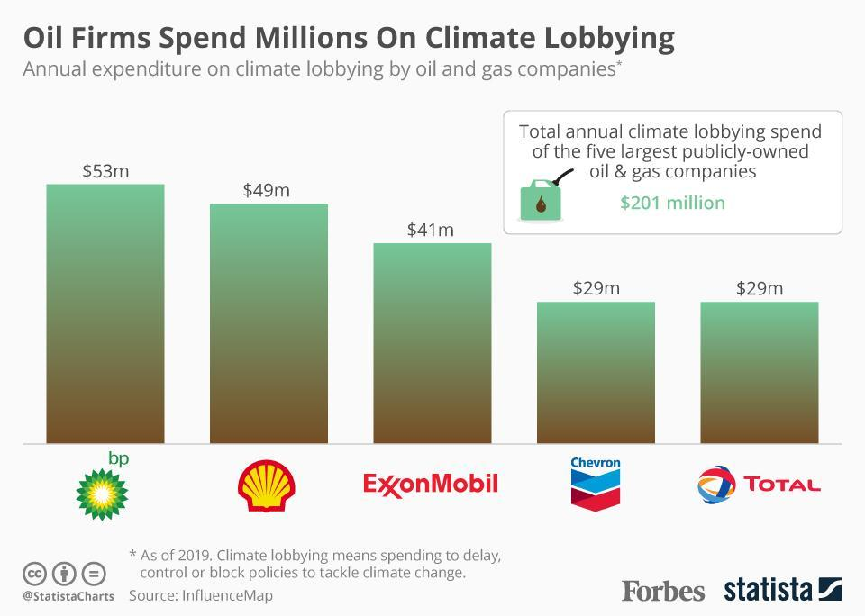

## Table of Contents

## What are the top oil companies in the world?

The top oil companies in the world include ExxonMobil, Shell, and Saudi Aramco. ExxonMobil, based in the United States, is one of the largest publicly traded oil and gas companies. It explores, produces, and sells oil and gas products all over the world. Shell, a British-Dutch company, is another giant in the industry. It operates in many countries and is involved in the exploration, production, and refining of oil and gas. Saudi Aramco, based in Saudi Arabia, is the world's largest oil producer and has the most proven oil reserves.

These companies are important because they help meet the world's energy needs. ExxonMobil, Shell, and Saudi Aramco produce a lot of oil and gas, which people use for transportation, heating, and electricity. They also invest in new technologies to find and produce oil and gas more efficiently. These companies are always working to improve their operations and find new ways to meet the growing demand for energy.

In addition to these three, other significant oil companies include BP from the United Kingdom, Chevron from the United States, and TotalEnergies from France. BP is known for its large-scale operations and efforts in renewable energy. Chevron, like ExxonMobil, is a major player in the U.S. and globally. TotalEnergies focuses on a broad range of energy solutions, including oil, gas, and renewables. Together, these companies play a crucial role in the global energy market.

## What is the basic definition of an environmental initiative?

An environmental initiative is a plan or action taken to help the environment. It can be started by people, groups, companies, or governments. The goal is to solve problems like pollution, climate change, or loss of nature. These initiatives can be big or small, but they all try to make the world a better place for everyone.

There are many kinds of environmental initiatives. Some focus on reducing waste, like recycling programs. Others aim to protect wildlife and their homes, like creating national parks. Many initiatives try to use less energy from dirty sources, like coal, and more from clean sources, like wind or solar power. By working together, these efforts can make a big difference in keeping our planet healthy.

## How do oil companies impact the environment?

Oil companies have a big effect on the environment. They drill for oil and gas, which can harm the land and water. When they drill, they might spill oil, which can hurt animals and plants. Oil spills can happen in the ocean or on land, and they are very bad for nature. Also, when oil companies build roads and pipelines to move the oil, they can destroy forests and other natural places.

Another way oil companies impact the environment is by burning oil and gas. When these fuels are burned, they release gases like carbon dioxide into the air. These gases trap heat and cause the Earth to get warmer, which is called climate change. Climate change can make the weather more extreme, like more storms or longer droughts. It can also make sea levels rise, which can harm coastal areas.

Oil companies are trying to be better for the environment. Some are using new technology to drill in a safer way and to find oil without causing as much harm. They are also looking into other kinds of energy, like wind and solar power, which do not harm the environment as much. But, there is still a lot of work to do to make sure oil companies are as good for the environment as possible.

## What are some common environmental initiatives undertaken by oil companies?

Oil companies are trying to be better for the environment. They do this by starting programs to reduce pollution and protect nature. One common thing they do is try to use less energy when they drill for oil. This helps lower the amount of harmful gases they release into the air. They also work on cleaning up oil spills faster and better, so they don't hurt animals and plants as much.

Another thing oil companies do is invest in new technology. They use this technology to find oil in ways that are less harmful to the environment. They also start programs to reduce waste and recycle more. Some oil companies are even looking into using more clean energy, like wind and solar power, to help fight climate change. By doing these things, they hope to make the world a better place while still providing the energy people need.

Overall, these environmental initiatives show that oil companies are trying to balance their business with taking care of the planet. They know that their work can harm the environment, so they are working hard to find ways to do it better. It's a big challenge, but by taking these steps, they are moving in the right direction.

## How do oil companies measure the success of their environmental initiatives?

Oil companies measure the success of their environmental initiatives by looking at different things. They check how much less pollution they are making. For example, they see if they are using less energy when they drill for oil, which means they are releasing fewer harmful gases into the air. They also look at how well they are cleaning up oil spills. If they can clean up spills faster and better, it means their initiatives are working.

Another way oil companies measure success is by seeing if they are using more clean energy, like wind and solar power. If they are, it shows they are helping to fight climate change. They also check if they are recycling more and making less waste. By looking at all these things, oil companies can tell if their efforts to be better for the environment are working.

## Can you provide examples of specific environmental initiatives by leading oil companies?

ExxonMobil has started a program called "Growing Equity." This program helps farmers in poor countries use less energy and make less pollution. ExxonMobil gives them new technology and ways to farm that are better for the environment. They also work on projects to capture carbon dioxide from the air and store it safely underground. This helps fight climate change by reducing the amount of harmful gases in the air.

Shell has a big plan called "Powering Progress." This plan aims to cut down on the pollution Shell makes and use more clean energy. They are investing a lot of money in wind and solar power, which don't harm the environment as much as oil and gas. Shell is also working on making their oil and gas operations cleaner and safer, so they cause less harm to nature.

Saudi Aramco is doing something called "iktva." This program helps make the oil industry in Saudi Arabia more sustainable. They focus on using new technology to drill for oil in ways that are less harmful to the environment. Saudi Aramco also works on reducing the amount of water they use and recycling more. By doing these things, they hope to make their operations better for the planet.

## What challenges do oil companies face in implementing environmental initiatives?

Oil companies face many challenges when they try to be better for the environment. One big challenge is money. It costs a lot to use new technology that is better for the environment. Oil companies need to spend a lot of money to change how they drill for oil and to use clean energy like wind and solar power. Sometimes, they worry that spending this money will make their business less profitable.

Another challenge is that oil companies need to keep making oil and gas to meet the world's energy needs. While they try to be more eco-friendly, they still have to produce a lot of oil and gas. This can make it hard to reduce pollution as much as they want. They also have to deal with rules from governments that tell them how to protect the environment. These rules can be different in every country, which makes it even harder to follow them all.

Lastly, oil companies face challenges from people and groups who want them to change faster. Some people think oil companies should stop using oil and gas altogether and switch to clean energy right away. This pressure can make it hard for oil companies to find the right balance between meeting energy needs and protecting the environment. They need to show that they are making progress, but it can be tough when everyone wants them to do more, faster.

## How do government regulations influence oil companies' environmental initiatives?

Government rules play a big role in what oil companies do to help the environment. These rules tell oil companies how much pollution they can make and what they need to do to clean up oil spills. If the rules are strict, oil companies have to spend more money and time to follow them. This can push them to use new technology and find ways to be less harmful to nature. But, if the rules are different in every country, it can be hard for oil companies to follow all of them. They have to change how they work in each place, which can be confusing and costly.

At the same time, government rules can also help oil companies show that they are trying to be better for the environment. When governments make strong rules, it shows that they care about the planet. This can make people and other companies trust oil companies more if they follow these rules well. But, if the rules are not strong enough, oil companies might not feel like they need to do as much to help the environment. So, the rules can both help and make things harder for oil companies as they try to be more eco-friendly.

## What role does technology play in enhancing the environmental initiatives of oil companies?

Technology helps oil companies be better for the environment. They use new tools to drill for oil in ways that cause less harm to nature. For example, they can use machines that make less noise and pollution. They also use technology to find oil without digging up big areas of land. This means they can leave more forests and wildlife habitats alone. Another important use of technology is in cleaning up oil spills. New machines and methods help oil companies clean up spills faster and better, so less harm comes to animals and plants.

Technology also helps oil companies reduce the pollution they make. They use special equipment to capture harmful gases like carbon dioxide and store them safely underground. This helps fight climate change by keeping these gases out of the air. Oil companies also use technology to make their operations more energy-efficient. This means they use less energy when they drill for oil, which cuts down on the amount of pollution they release. By using technology in these ways, oil companies can make their environmental initiatives more successful and help protect the planet.

## How do oil companies balance profitability with their environmental responsibilities?

Oil companies have a tough job balancing making money with being good to the environment. They need to make oil and gas to meet the world's energy needs, which helps them earn money. But, drilling for oil can harm the environment. So, they try to use new technology to drill in ways that cause less harm. They also invest in clean energy like wind and solar power, which doesn't pollute as much. But, all these things cost a lot of money. Oil companies need to find a way to spend money on being eco-friendly while still making enough profit to keep their business going.

It's a challenge for oil companies to show that they care about the environment while also keeping their shareholders happy. Shareholders want the company to make money, so oil companies need to be careful about how much they spend on environmental initiatives. They try to do things like reduce waste and use less energy in their operations, which can save them money and help the environment at the same time. But, they also face pressure from people and groups who want them to change faster. Oil companies need to find the right balance so they can meet energy needs, make a profit, and protect the planet.

## What are the future trends in environmental initiatives within the oil industry?

In the future, oil companies will focus more on using clean energy like wind and solar power. They know that the world needs to fight climate change, so they will spend more money on these new types of energy. Oil companies will also use better technology to drill for oil in ways that cause less harm to the environment. They will try to capture harmful gases and store them safely underground. This will help reduce pollution and make the air cleaner.

Oil companies will also work harder to use less energy in their operations. They will find new ways to save energy and make less waste. This can help them save money and be better for the environment at the same time. Governments will make stricter rules about pollution, which will push oil companies to do more to protect nature. Even though it will be hard, oil companies will try to balance making money with being eco-friendly. They know that the world is watching, and they need to show that they care about the planet.

## How do oil companies collaborate with environmental organizations to improve their initiatives?

Oil companies work with environmental groups to make their environmental plans better. They talk to these groups to learn what they can do to help the environment more. For example, they might work together on projects to clean up oil spills faster and better. They also share ideas on how to use less energy and make less pollution. By working with environmental groups, oil companies can find new ways to be eco-friendly and show that they care about the planet.

Sometimes, oil companies and environmental groups start big projects together. These projects can focus on things like protecting wildlife or using more clean energy. The oil companies bring money and technology, while the environmental groups bring knowledge and ideas. Together, they can make a bigger difference than they could alone. This teamwork helps oil companies improve their environmental efforts and build trust with people who care about nature.

## References & Further Reading

Investopedia's article "Top 4 Oil Companies That Protect the Environment" provides valuable insights into how major oil firms like Royal Dutch Shell, TotalEnergies, Repsol, and Equinor are incorporating sustainability into their operations. This resource is crucial for understanding how these companies aim to balance their business interests with ecological responsibility.

Morningstar offers comprehensive reports on the emissions challenges that oil companies face as they transition towards greener practices. These reports detail the hurdles and achievements of the industry in reducing carbon footprints while maintaining operational efficiency.

Research studies on [algorithmic trading](/wiki/algorithmic-trading) examine its profound influence on financial markets. They highlight how the adoption of algorithmic trading strategies is transforming trade executions, risk management, and overall market dynamics. Such studies provide an in-depth analysis of the efficiencies gained through technology in financial operations.

Technical papers on clean technology and renewable energy investments by major oil firms offer detailed accounts of advancements in sustainable tech. These documents discuss the methodologies implemented to harness wind, solar, and other renewable sources, alongside the economic and environmental benefits realized.

