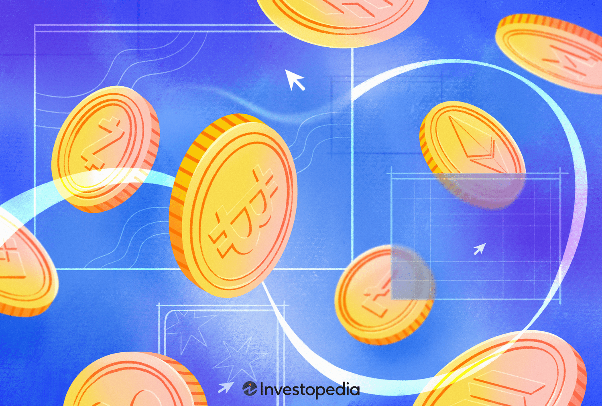

## Table of Contents

## What is cryptocurrency trading and why is it important in 2024?

Cryptocurrency trading is when people buy and sell digital currencies like Bitcoin and Ethereum on special online platforms called exchanges. It's a bit like trading stocks, but instead of company shares, you're trading digital money. People trade cryptocurrencies to try to make money by buying low and selling high, or they might use them to pay for things or send money to others quickly and cheaply.

In 2024, cryptocurrency trading is more important than ever because more people and businesses are using digital currencies. Governments and big companies are starting to accept and use cryptocurrencies, which makes them more mainstream. This means there are more opportunities for people to trade and make money, but it also means the market can be more unpredictable and risky. Understanding how to trade cryptocurrencies can help people take advantage of new financial opportunities and stay up-to-date with the changing world of money.

## What are the key features to look for in an online broker for cryptocurrency trading?

When choosing an online broker for cryptocurrency trading, it's important to look for a few key features. First, make sure the broker is secure and trustworthy. This means they should have strong security measures like two-factor authentication and insurance to protect your money. Also, check if they are regulated by a financial authority, which can give you more peace of mind. Another important feature is the variety of cryptocurrencies they offer. A good broker will let you trade many different types of digital currencies, not just the popular ones like Bitcoin and Ethereum.

The second thing to consider is the fees and costs. Some brokers charge high fees for trading or withdrawing money, which can eat into your profits. Look for a broker with low fees and clear pricing so you know exactly what you're paying. It's also helpful if the broker has good customer support. If you run into problems or have questions, you want to be able to get help quickly and easily. Finally, think about the user experience. The platform should be easy to use and have helpful tools like charts and indicators to help you make smart trading decisions.

## How do beginners start trading cryptocurrencies with online brokers?

To start trading cryptocurrencies as a beginner, first choose a reliable online broker that offers a user-friendly platform and supports a variety of digital currencies. Look for brokers that have good security, low fees, and helpful customer support. Once you've picked a broker, you'll need to sign up for an account. This usually involves filling out some personal information and verifying your identity, which might require you to upload a photo of your ID. After your account is set up, you'll need to add money to it, often by linking a bank account or using a credit card.

Once your account is funded, you can start trading. Most brokers have a simple interface where you can buy and sell cryptocurrencies. You can start by choosing which [cryptocurrency](/wiki/cryptocurrency) you want to trade, like Bitcoin or Ethereum, and then decide how much you want to buy. It's a good idea to start small and learn as you go. Many brokers also offer practice accounts where you can trade with fake money to get the hang of it without risking your own cash. Remember, trading cryptocurrencies can be risky, so always do your research and only invest money you can afford to lose.

## What are the top 5 online brokers for cryptocurrency trading in 2024?

In 2024, some of the best online brokers for trading cryptocurrencies are Coinbase, Binance, Kraken, eToro, and Gemini. Coinbase is really popular because it's easy to use and has strong security. They offer a lot of different cryptocurrencies and have good customer support. Binance is known for having a huge number of cryptocurrencies to trade and low fees, but it can be a bit more complicated for beginners. Kraken is another good choice, especially for people who want to trade a lot of different digital currencies. They have good security and are trusted by many users.

eToro is great for beginners because it lets you copy what other successful traders are doing, which can help you learn. They also have a lot of educational resources. Gemini is known for its focus on security and is regulated, which can make people feel safer when trading. Each of these brokers has its own strengths, so it's a good idea to think about what's most important to you, like ease of use, the number of cryptocurrencies, fees, or security, when picking the best one for you.

## How do fees and commissions vary among different online brokers for cryptocurrency trading?

Fees and commissions for cryptocurrency trading can be quite different from one online broker to another. Some brokers charge a flat fee for each trade, which means you pay the same amount no matter how much you're trading. For example, Coinbase might charge you $1 to $2 for each trade. Other brokers, like Binance, use a percentage-based fee, where the fee depends on how much you're trading. If you're trading a lot, this can add up quickly. Some brokers also have different fees depending on whether you're a beginner or an advanced trader, with lower fees for those who trade more often or in larger amounts.

Besides trading fees, there are other costs to think about. Some brokers charge fees for depositing or withdrawing money, especially if you're using a bank transfer or credit card. For instance, Kraken might charge you a small percentage to deposit money with a credit card. There can also be fees for converting one cryptocurrency to another, which is called a spread. This is the difference between the buying and selling price of a cryptocurrency. eToro, for example, might have a higher spread than other brokers. It's important to look at all these fees when choosing a broker so you can understand the total cost of trading and pick the one that's best for you.

## What security measures should be considered when choosing an online broker for cryptocurrency trading?

When choosing an online broker for cryptocurrency trading, it's important to think about security. One key thing to look for is two-[factor](/wiki/factor-investing) authentication (2FA). This means you need to enter a code sent to your phone or a special app to log in, which makes it harder for hackers to get into your account. Another important security measure is cold storage. This is when the broker keeps most of your cryptocurrencies offline, away from hackers. Also, make sure the broker is regulated by a financial authority. This means they have to follow strict rules to keep your money safe.

Another thing to consider is insurance. Some brokers offer insurance to protect your cryptocurrencies if something goes wrong. It's also a good idea to check if the broker has a good track record of keeping their platform safe from cyber attacks. Look for reviews and see if they've had any big security problems in the past. Lastly, make sure the broker uses strong encryption to protect your personal information and transactions. All these security measures can help you feel safer when trading cryptocurrencies online.

## How can traders use advanced tools and features offered by online brokers to enhance their trading strategies?

Traders can use advanced tools and features offered by online brokers to make better trading decisions and improve their strategies. Many brokers provide real-time charts and technical indicators that help traders see patterns and trends in cryptocurrency prices. For example, tools like moving averages, Relative Strength Index (RSI), and Bollinger Bands can help traders figure out when to buy or sell a cryptocurrency. Some brokers also offer advanced order types, like stop-loss and take-profit orders, which can help traders manage their risks better. A stop-loss order automatically sells a cryptocurrency if its price drops to a certain level, helping to limit losses. A take-profit order does the opposite, selling when the price reaches a target level to lock in profits.

In addition to these tools, some brokers offer features like trading bots and [algorithmic trading](/wiki/algorithmic-trading). Trading bots can automatically buy and sell cryptocurrencies based on rules set by the trader, which can save time and help take advantage of market opportunities quickly. Algorithmic trading uses computer programs to make trading decisions based on data analysis, which can be more accurate than making decisions by hand. Many brokers also provide demo accounts where traders can practice using these advanced tools without risking real money. This can be really helpful for learning how to use the tools and testing different strategies before using them with real money. By using these advanced tools and features, traders can make smarter decisions and potentially improve their trading performance.

## What are the regulatory considerations for trading cryptocurrencies with online brokers in different countries?

When you trade cryptocurrencies with online brokers, the rules you need to follow can be different depending on where you live. Some countries have strict rules about trading cryptocurrencies. For example, in the United States, the Securities and Exchange Commission (SEC) and the Commodity Futures Trading Commission (CFTC) watch over cryptocurrency trading. They make sure that brokers follow the rules to protect people's money. In Europe, the European Union has its own rules, like the Markets in Crypto-Assets (MiCA) regulation, which aims to make cryptocurrency trading safer and more transparent. It's important to know these rules because they can affect what you can do with your cryptocurrencies and which brokers you can use.

In other parts of the world, the rules can be very different. Some countries, like Japan, have their own rules that are very detailed and strict. They want to make sure that trading is safe and that people understand the risks. In contrast, some countries, like El Salvador, have made cryptocurrencies like Bitcoin legal money, which means there are fewer rules about trading them. Other places, like China, have banned cryptocurrency trading completely. So, if you're thinking about trading cryptocurrencies, it's a good idea to learn about the rules in your country. This can help you pick the right broker and stay out of trouble.

## How do online brokers support different types of cryptocurrencies and what are the implications for traders?

Online brokers support different types of cryptocurrencies by listing a variety of digital currencies on their platforms. Some brokers, like Coinbase, offer well-known cryptocurrencies like Bitcoin and Ethereum, while others, like Binance, provide a much wider range that includes lesser-known altcoins. This variety allows traders to diversify their portfolios and take advantage of different market opportunities. The number of cryptocurrencies a broker supports can affect a trader's choices, as more options can mean more chances to find profitable trades but can also make the market more confusing and harder to keep track of.

The implications for traders are significant. If a broker supports many types of cryptocurrencies, traders have more flexibility to explore and invest in different digital assets, which can lead to higher potential returns. However, trading a wide variety of cryptocurrencies also comes with increased risk because some of these assets might be less stable or more prone to scams. On the other hand, if a broker only supports a few major cryptocurrencies, it might be easier for beginners to start trading, but they might miss out on opportunities in other parts of the market. Traders need to balance the benefits of having more options against the complexity and risk that comes with trading a larger number of cryptocurrencies.

## What are the best practices for managing risk when trading cryptocurrencies through online brokers?

Managing risk when trading cryptocurrencies through online brokers is important to protect your money. One good practice is to only invest money you can afford to lose. Cryptocurrencies can be very unpredictable, and their prices can go up and down a lot. By only using money you don't need for important things like bills or rent, you can trade without worrying too much about losing it all. Another practice is to use stop-loss orders. These orders automatically sell your cryptocurrency if its price drops to a certain level, which can help limit how much money you lose on a trade.

Diversifying your investments is also a smart way to manage risk. Instead of putting all your money into one cryptocurrency, spread it out across different ones. This way, if one cryptocurrency's price goes down a lot, you won't lose everything because your other investments might still be doing well. It's also a good idea to keep learning about the cryptocurrency market. The more you know, the better you can understand the risks and make smarter trading decisions. By following these practices, you can trade cryptocurrencies more safely and confidently.

## How do online brokers facilitate the integration of cryptocurrency trading with other financial instruments?

Online brokers make it easier for people to trade cryptocurrencies along with other financial instruments like stocks, bonds, and commodities. They do this by offering all these options on one platform. This means you can switch between trading different types of investments without having to use different websites or apps. For example, if you want to buy some Bitcoin and also invest in a company's stock, you can do both on the same broker's platform. This can save time and make it simpler to manage your money.

Having everything in one place also helps traders see how their different investments are doing together. This is called portfolio management. By seeing all your investments at once, you can make better decisions about where to put your money. Some brokers even offer tools that help you understand how your cryptocurrencies and other investments might affect each other. This can be really helpful for planning your trading strategy and managing risk.

## What future trends are expected to impact online brokers for cryptocurrency trading beyond 2024?

In the years beyond 2024, one big trend that will affect online brokers for cryptocurrency trading is the use of new technology like [artificial intelligence](/wiki/ai-artificial-intelligence) (AI) and [machine learning](/wiki/machine-learning). These technologies can help brokers make trading easier and safer. AI can look at a lot of information quickly and find patterns that might be hard for people to see. This can help traders make better decisions about when to buy or sell cryptocurrencies. Also, AI can help brokers spot and stop fraud or scams, which makes trading safer for everyone.

Another trend to watch is more rules and laws about cryptocurrencies. As more people and businesses use digital money, governments will probably make more rules to keep things safe and fair. This could mean that online brokers will have to follow stricter rules about how they handle people's money and personal information. It might also mean that brokers will need to offer more ways to keep people's money safe, like better security systems. These changes could make trading more complicated for brokers, but they could also make it safer and more trusted for people who want to trade cryptocurrencies.

## References & Further Reading

[1]: Bergstra, J., Bardenet, R., Bengio, Y., & Kégl, B. (2011). ["Algorithms for Hyper-Parameter Optimization."](https://dl.acm.org/doi/10.5555/2986459.2986743) Advances in Neural Information Processing Systems 24.

[2]: ["Advances in Financial Machine Learning"](https://www.amazon.com/Advances-Financial-Machine-Learning-Marcos/dp/1119482089) by Marcos Lopez de Prado

[3]: ["Evidence-Based Technical Analysis: Applying the Scientific Method and Statistical Inference to Trading Signals"](https://www.amazon.com/Evidence-Based-Technical-Analysis-Scientific-Statistical/dp/0470008741) by David Aronson

[4]: ["Machine Learning for Algorithmic Trading"](https://github.com/stefan-jansen/machine-learning-for-trading) by Stefan Jansen

[5]: ["Quantitative Trading: How to Build Your Own Algorithmic Trading Business"](https://books.google.com/books/about/Quantitative_Trading.html?id=j70yEAAAQBAJ) by Ernest P. Chan