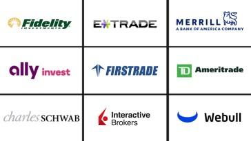

## Table of Contents

## What are online brokers and trading platforms?

Online brokers and trading platforms are services that let you buy and sell investments like stocks, bonds, and funds using the internet. They are like middlemen that help you trade without needing to call someone or go to a physical location. You can use a computer or a smartphone to access these services, making it easy and convenient to manage your investments from anywhere.

These platforms often have tools and features to help you make smart choices about your investments. You can see real-time prices, charts, and news, and some even offer research and analysis to guide your decisions. Many online brokers charge lower fees than traditional brokers, which can save you money. However, it's important to choose a reputable platform and understand the risks involved in trading.

## How do I choose the right online broker for my needs?

Choosing the right online broker depends on what you need and want. First, think about the costs. Some brokers charge a lot of fees, while others have low or no fees. You should look at how much they charge for trading, keeping your account open, and any other services you might use. Also, consider how easy the platform is to use. If you're new to trading, you might want a broker with a simple, user-friendly platform. But if you're more experienced, you might need more advanced tools and features.

Next, think about the types of investments you want to make. Some brokers let you trade a wide range of things like stocks, bonds, mutual funds, and even cryptocurrencies. Others might focus on just a few types of investments. Make sure the broker you choose offers the kinds of investments you're interested in. Also, look at the customer support. Good customer service can be really helpful, especially if you run into problems or have questions. Finally, check if the broker is trustworthy and well-regulated. This can help keep your money safe and make sure you're dealing with a reliable company.

## What are the key features to look for in a trading platform?

When choosing a trading platform, you should first look at how easy it is to use. A good platform should have a simple design that lets you quickly buy and sell investments. It should work well on both computers and smartphones, so you can trade from anywhere. You also want to make sure the platform loads fast and doesn't crash, because you don't want to miss out on trades because of technical problems.

Another important feature is the tools and information the platform offers. A good trading platform will give you real-time prices, charts, and news about the investments you're interested in. Some platforms also have tools that help you analyze the market and make better trading decisions. It's also good if the platform lets you set up alerts, so you know when it's time to buy or sell something.

Lastly, consider the customer support and security of the platform. You want a platform that has helpful customer service in case you have questions or run into problems. It's also important that the platform keeps your money and personal information safe. Look for platforms that use strong security measures and are regulated by a trusted authority.

## Which online brokers offer the lowest trading fees in October 2024?

In October 2024, some of the online brokers with the lowest trading fees are Robinhood, Webull, and E*TRADE. Robinhood is known for having no commission fees on stock and [ETF](/wiki/etf-trading-strategies) trades, making it a popular choice for people who want to trade without paying extra costs. Webull also offers commission-free stock and ETF trades and has low fees for options trading. E*TRADE charges no commissions on stock, ETF, and options trades, but it might have other fees for things like account maintenance or inactivity.

These brokers keep their fees low to attract more customers. Robinhood and Webull focus on a simple and user-friendly platform, which is great for people new to trading. E*TRADE offers more advanced tools and research, which might be better for experienced traders who want to do more in-depth analysis. When choosing a broker, it's important to look at all the fees, not just the trading commissions, to make sure you're really getting the best deal.

## What are the top-rated mobile trading apps for beginners in 2024?

In 2024, some of the best mobile trading apps for beginners are Robinhood and Webull. Robinhood is super popular because it's easy to use and doesn't charge any fees for trading stocks and ETFs. The app has a simple design that makes it easy for new traders to buy and sell investments without getting confused. It also offers educational resources to help beginners learn about trading. Webull is another great choice for beginners. It's also free to trade stocks and ETFs, and it has a user-friendly interface. Webull provides more advanced tools than Robinhood, but it's still easy enough for beginners to use.

Another good option for beginners is E*TRADE's mobile app. E*TRADE doesn't charge commissions on stock, ETF, and options trades, which is great for people just starting out. The app is designed to be easy to navigate, with clear menus and simple instructions. E*TRADE also offers a lot of educational content, like articles and videos, to help new traders learn the ropes. While it might have a few more fees than Robinhood or Webull, the extra resources and tools can be really helpful for beginners who want to learn more about trading.

## How do the account minimums vary among leading online brokers?

In 2024, the account minimums for leading online brokers can be quite different. Some brokers, like Robinhood and Webull, don't ask for any minimum amount to open an account. This means you can start trading with whatever money you have, even if it's just a little. These brokers are great for beginners or people who want to start small.

Other brokers, like E*TRADE and Charles Schwab, might ask for a minimum amount to open an account. For example, E*TRADE might need you to put in at least $500 to start, while Charles Schwab might ask for $1,000. These higher minimums can be good if you want to use their more advanced tools and services, but they might not be the best choice if you're just starting out or don't have a lot of money to invest right away.

## What types of investment products can I access through these platforms?

Through online trading platforms like Robinhood, Webull, and E*TRADE, you can access a wide range of investment products. These include stocks, which are shares in a company that you can buy and sell. You can also trade exchange-traded funds (ETFs), which are baskets of stocks or other assets that you can buy and sell like a single stock. Options are another type of investment you can trade, which give you the right to buy or sell a stock at a certain price in the future. Some platforms also let you invest in mutual funds, which are collections of stocks, bonds, or other assets managed by professionals.

In addition to these common investment products, some platforms offer more specialized options. For example, you might be able to trade bonds, which are loans you make to a company or government that pay you back with interest. Some brokers also let you invest in cryptocurrencies like Bitcoin and Ethereum, which are digital currencies that you can buy and sell. Depending on the platform, you might also have access to futures and [forex](/wiki/forex-system) trading, which involve betting on the future price of commodities or currencies. Each platform might offer a different mix of these products, so it's good to check what's available before you choose where to invest.

## Which platforms provide the best tools for advanced technical analysis?

For advanced technical analysis, TradingView is one of the best platforms. It has a lot of tools that help you look at charts and find patterns. You can draw on the charts, use different indicators, and even create your own custom indicators. TradingView also has a big community where people share their ideas and strategies, which can be really helpful if you're trying to get better at technical analysis.

Another great platform for advanced technical analysis is Thinkorswim by TD Ameritrade. This platform is known for its powerful tools and detailed charts. You can use a lot of different indicators and drawing tools to analyze the market. Thinkorswim also lets you backtest your strategies, which means you can see how they would have worked in the past. This can help you make better decisions about your trades.

Both of these platforms are a bit more complicated than some others, but they're worth it if you want to do advanced technical analysis. They give you the tools you need to really understand the market and make smart trading choices.

## How do the customer support services compare among top trading platforms?

Among top trading platforms, customer support services can vary a lot. Robinhood offers customer support through email and a help center with lots of articles and guides. They also have a phone line, but it's not always easy to get through to someone quickly. Webull provides support through email, phone, and live chat, which can be faster and more helpful if you need quick answers. They also have a good help center with lots of information. E*TRADE is known for its strong customer support, offering phone, email, and live chat options. They also have a lot of educational resources and a reputation for being quick to respond and helpful.

Thinkorswim by TD Ameritrade stands out for its excellent customer support. They offer phone support, email, and live chat, and they're known for being very responsive and knowledgeable. They also have a lot of educational content and in-person support at their branches. TradingView's customer support is mainly through email and a help center. They don't have phone support, but their community can be a big help if you have questions. Overall, if you want the best customer support, Thinkorswim and E*TRADE are good choices, while Robinhood and TradingView might take a bit longer to get help.

## What are the security measures implemented by leading online brokers?

Leading online brokers take security very seriously to keep your money and information safe. They use strong encryption to protect your data when you log in and make trades. This means your information is turned into a secret code that only the broker can read. They also have two-[factor](/wiki/factor-investing) authentication, which means you need to enter a special code sent to your phone or email, along with your password, to access your account. This makes it much harder for someone else to get into your account, even if they know your password. Brokers also keep your money in separate accounts from their own money, so if something goes wrong with the broker, your money is still safe.

In addition to these measures, leading brokers are regulated by government agencies like the SEC in the United States. This means they have to follow strict rules to protect customers. They also have insurance, like SIPC in the U.S., which can help you get your money back if the broker goes out of business. Many brokers also use technology to watch for strange activity in your account, like if someone is trying to log in from a new place or if there are a lot of trades happening quickly. If they see something unusual, they can stop it and contact you to make sure everything is okay. These security steps help keep your investments safe and give you peace of mind.

## How do the educational resources and tools differ across these platforms?

The educational resources and tools on trading platforms can be quite different. Robinhood has a lot of simple guides and videos that help beginners learn about trading. They explain things like what stocks are and how to buy them. Robinhood also has a feature called "Snacks" that gives you quick news about the market. Webull offers more detailed resources, like webinars and a trading simulator where you can practice trading without using real money. They also have a lot of articles and videos that go deeper into trading strategies and market analysis.

E*TRADE and Thinkorswim by TD Ameritrade have even more advanced educational tools. E*TRADE has a lot of articles, videos, and even live events where you can learn about trading. They also have a tool called "E*TRADE 360" that helps you see all your investments in one place. Thinkorswim is known for its detailed courses and webinars, which are great for people who want to learn a lot about trading. They also have a paper trading feature where you can practice trading with fake money. TradingView focuses more on community learning, where people share their ideas and strategies. They have a lot of charts and tools that help you analyze the market, but you might need to look elsewhere for basic guides if you're new to trading.

## What are the latest trends and innovations in online trading platforms for 2024?

In 2024, online trading platforms are seeing a lot of new trends and innovations. One big trend is the use of [artificial intelligence](/wiki/ai-artificial-intelligence) (AI) to help traders make better decisions. AI can look at a lot of data really fast and find patterns that humans might miss. Some platforms are using AI to give traders tips and suggestions about what to buy or sell. Another trend is making trading easier on mobile devices. More and more people are using their phones to trade, so platforms are working hard to make their apps better and easier to use. They're adding more features to mobile apps, like being able to do more advanced analysis right from your phone.

Another innovation is the focus on social trading, where you can see what other people are doing and even copy their trades. This is helpful for beginners who want to learn from more experienced traders. Some platforms are also adding more types of investments, like cryptocurrencies and even things like real estate or art through fractional ownership. This means you can invest in a piece of a big asset, even if you don't have a lot of money. Overall, these trends and innovations are making trading easier, more accessible, and more interesting for everyone.

## How can investment services broaden opportunities for investors?

Today's investment landscape has evolved significantly, featuring a vast array of products and services that extend well beyond traditional stock trading. These innovative offerings provide investors with diverse options to build and optimize their portfolios, leading to greater risk diversification and potentially enhanced returns. 

One of the primary innovations is the availability of a broad range of asset classes through online brokers. Investors can now access exchange-traded funds (ETFs), options, mutual funds, and, increasingly, alternative assets such as cryptocurrencies and commodities. ETFs have grown immensely popular due to their low expense ratios and tax efficiency compared to mutual funds. They allow investors to gain exposure to various sectors, geographies, and investment strategies. Options trading enables sophisticated strategies that can provide downside protection or leverage for potential gains, albeit with increased complexity and risk.

In addition to these asset classes, many brokers have embraced automated investing solutions, such as robo-advisors. These platforms utilize algorithms to provide low-cost portfolio management based on an individual's risk tolerance and investment goals. Robo-advisors appeal particularly to passive investors who prefer a hands-off approach to their investments. By automating the rebalancing of portfolios to maintain target asset allocations, these robo-advisors aim to optimize returns over the long term while minimizing risks.

The availability of diverse investment services carries significant benefits, primarily in risk diversification and maximizing potential returns. Through a well-diversified portfolio, investors can reduce unsystematic risk or the risk associated with individual investments. Consider the formula for total risk ($\sigma$), which is composed of systematic ($\sigma_m$) and unsystematic risk ($\sigma_u$):

$$

\sigma^2 = \sigma_m^2 + \sigma_u^2 
$$

By holding a variety of asset classes, the unsystematic risk ($\sigma_u$) can be minimized, leaving primarily systematic risk ($\sigma_m$) which is inherent to the market. This balanced approach enables individuals to manage their investments more effectively.

Moreover, platforms' ability to offer these varied services encourages investors to exploit new opportunities, potentially leading to favorable returns. However, these opportunities also necessitate careful consideration and understanding, as each investment type carries its own risks and rewards. 

In summary, the expansion of investment services through online brokers has empowered investors by providing accessible tools for sophisticated financial strategies, fostering a landscape of diversified, informed, and automated investing.

## References & Further Reading

[1]: Bergstra, J., Bardenet, R., Bengio, Y., & Kégl, B. (2011). ["Algorithms for Hyper-Parameter Optimization."](https://proceedings.neurips.cc/paper/2011/file/86e8f7ab32cfd12577bc2619bc635690-Paper.pdf) Advances in Neural Information Processing Systems 24.

[2]: ["Advances in Financial Machine Learning"](https://www.amazon.com/Advances-Financial-Machine-Learning-Marcos/dp/1119482089) by Marcos Lopez de Prado

[3]: ["Evidence-Based Technical Analysis: Applying the Scientific Method and Statistical Inference to Trading Signals"](https://www.amazon.com/Evidence-Based-Technical-Analysis-Scientific-Statistical/dp/0470008741) by David Aronson

[4]: ["Machine Learning for Algorithmic Trading"](https://github.com/PacktPublishing/Machine-Learning-for-Algorithmic-Trading-Second-Edition) by Stefan Jansen

[5]: ["Quantitative Trading: How to Build Your Own Algorithmic Trading Business"](https://books.google.com/books/about/Quantitative_Trading.html?id=j70yEAAAQBAJ) by Ernest P. Chan