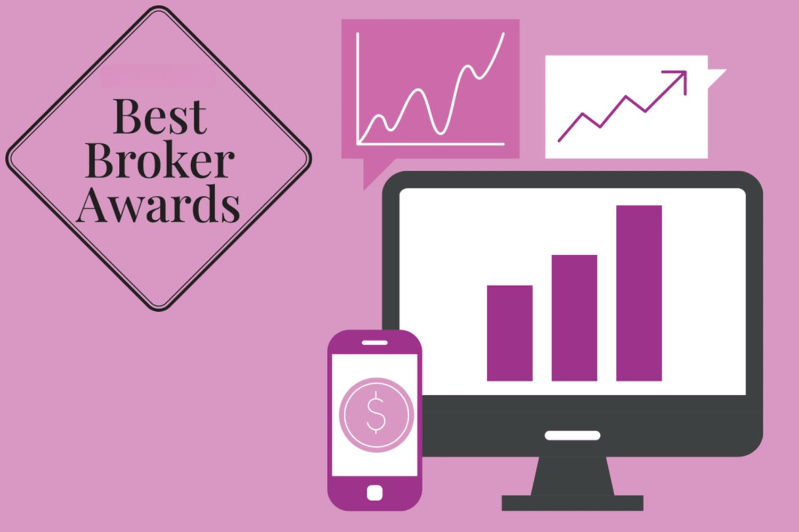

The digital era has profoundly transformed investment practices for both individuals and institutions, centralizing online brokers in this rapid evolution. Online platforms grant unprecedented access to financial markets, enabling a broader demographic to participate in trading and investing. This article illuminates the extensive array of online brokers, trading platforms, and investment services that have emerged, each offering unique functionalities and services tailored to various types of investors.

As we navigate this comprehensive landscape, it's essential to address the distinct advantages and potential hurdles posed by these modern financial tools for both beginners and seasoned investors. Online platforms offer unparalleled convenience and accessibility, allowing instant trading and portfolio management from anywhere with internet access. However, they also require users to adapt to a more digital approach, which might present challenges in understanding and utilizing complex features effectively.

Beyond mere access to markets, algorithmic trading, known as algo trading, has become an integral component of contemporary trading strategies. Algo trading leverages computer programs to execute trades at speeds and efficiencies unachievable by human traders. This technological advancement has redefined trading by removing emotional biases and optimizing execution times, although it does introduce its own set of risks and complexities.

By examining these components, this article aims to provide a cogent understanding of how online brokers and related technologies fit within the broader realm of personal finance and investment. This exploration will highlight how these tools empower investors, the strategic possibilities they open, and the careful considerations necessary for their successful application. Ultimately, the digital transformation in investment not only broadens opportunities but also underscores the need for ongoing awareness and education among investors as the industry continues to evolve.

## Table of Contents

## The Rise of Online Brokers and Trading Platforms

Online brokers have become the linchpin in the democratization of the financial markets, providing a wider spectrum of investors—ranging from novice to seasoned traders—with unprecedented ease in trading and investing. The advent of these platforms has been characterized by several key features that have significantly lowered the barriers to entry, most notably low fees, a wide array of asset options, and user-friendly interfaces.

One of the primary advantages of modern online brokers is their cost efficiency. With fierce competition among brokers, trading fees have substantially decreased, often allowing investors to buy and sell securities with minimal to no transaction costs. This shift enables investors to manage portfolios with higher frequency and efficiency without worrying about prohibitive costs cutting into their returns.

Furthermore, these platforms typically offer access to a diverse range of asset options including stocks, bonds, ETFs (Exchange-Traded Funds), mutual funds, and even more novel investment vehicles such as cryptocurrencies and fractional shares. This variety empowers investors to devise well-rounded portfolios tailored to their unique financial goals and risk appetites, a flexibility that was historically reserved for institutional investors or those with significant capital.

The intuitive design of trading platforms plays a crucial role in their appeal. Most platforms offer sleek, user-friendly interfaces that accommodate traders of all experience levels. This usability is complemented by rich educational resources that provide users with market insights, tutorials, and analytical tools—essentials for making informed trading decisions.

The robust nature of these platforms is further exemplified by the range of tools they offer to enhance trading precision and strategy. Market research tools, real-time data feeds, and advanced charting capabilities are just a few of the resources available, allowing users to conduct thorough technical and fundamental analyses.

To illustrate, leading platforms like Fidelity, Charles Schwab, and [Interactive Brokers](/wiki/interactive-brokers-api) each offer distinct strategies and services tailored to their target audiences. Fidelity is known for comprehensive research offerings and exceptional customer service, appealing primarily to long-term investors and those needing comprehensive financial guidance. Charles Schwab, with its broad suite of investment options and strong educational content, targets investors looking for both simplicity and depth. Interactive Brokers, on the other hand, is favored by active traders and professionals due to its advanced trading tools and low-cost margin trading, catering to those who require sophisticated analytics and vast market access.

The rise of online brokers represents a paradigm shift in how individuals engage with financial markets. Through their commitment to reducing fees, broadening asset access, and providing robust analytical tools, these platforms have not only democratized trading but also equipped investors with the tools necessary for success in the financial markets.

## Investment Services: Broadening Opportunities for Investors

Today's investment landscape has evolved significantly, featuring a vast array of products and services that extend well beyond traditional stock trading. These innovative offerings provide investors with diverse options to build and optimize their portfolios, leading to greater risk diversification and potentially enhanced returns. 

One of the primary innovations is the availability of a broad range of asset classes through online brokers. Investors can now access exchange-traded funds (ETFs), options, mutual funds, and, increasingly, alternative assets such as cryptocurrencies and commodities. ETFs have grown immensely popular due to their low expense ratios and tax efficiency compared to mutual funds. They allow investors to gain exposure to various sectors, geographies, and investment strategies. Options trading enables sophisticated strategies that can provide downside protection or leverage for potential gains, albeit with increased complexity and risk.

In addition to these asset classes, many brokers have embraced automated investing solutions, such as robo-advisors. These platforms utilize algorithms to provide low-cost portfolio management based on an individual's risk tolerance and investment goals. Robo-advisors appeal particularly to passive investors who prefer a hands-off approach to their investments. By automating the rebalancing of portfolios to maintain target asset allocations, these robo-advisors aim to optimize returns over the long term while minimizing risks.

The availability of diverse investment services carries significant benefits, primarily in risk diversification and maximizing potential returns. Through a well-diversified portfolio, investors can reduce unsystematic risk or the risk associated with individual investments. Consider the formula for total risk ($\sigma$), which is composed of systematic ($\sigma_m$) and unsystematic risk ($\sigma_u$):

$$

\sigma^2 = \sigma_m^2 + \sigma_u^2 
$$

By holding a variety of asset classes, the unsystematic risk ($\sigma_u$) can be minimized, leaving primarily systematic risk ($\sigma_m$) which is inherent to the market. This balanced approach enables individuals to manage their investments more effectively.

Moreover, platforms' ability to offer these varied services encourages investors to exploit new opportunities, potentially leading to favorable returns. However, these opportunities also necessitate careful consideration and understanding, as each investment type carries its own risks and rewards. 

In summary, the expansion of investment services through online brokers has empowered investors by providing accessible tools for sophisticated financial strategies, fostering a landscape of diversified, informed, and automated investing.

## Algorithmic Trading: Transforming the Trading Landscape

Algorithmic trading, commonly known as algo trading, employs advanced computer programs and algorithms to conduct financial trading activities based on a set of predetermined instructions or criteria, such as timing, price, and [volume](/wiki/volume-trading-strategy). By harnessing the power of technology, algo trading systems can execute trades with high speed and frequency, which is typically unattainable for human traders.

One of the primary advantages of [algorithmic trading](/wiki/algorithmic-trading) is its ability to enhance market efficiency and profitability by reducing the emotional bias inherent in human decision-making. Algorithms are designed to be emotionless, following logical steps without deviation, thus optimizing decision-making processes and fostering consistent trading results.

Platforms like TradeStation and Interactive Brokers have capitalized on this technological advancement, offering robust algo trading capabilities tailored to traders with varying levels of expertise. TradeStation, for instance, provides users with access to its EasyLanguage programming platform, which allows traders to create and customize their own trading strategies. Similarly, Interactive Brokers offers its API (Application Programming Interface) that facilitates algorithmic trading through various programming languages, empowering users to build sophisticated, automated trading systems.

The advantages of algorithmic trading are manifold. By automating trades, it minimizes the need for constant monitoring, freeing traders to focus on strategy development and refinement. Additionally, the [high frequency](/wiki/high-frequency-trading) of trades executed by algorithms can secure better prices and reduce transaction costs. Algorithms also allow for back-testing on historical data, enabling traders to evaluate the potential success of a strategy before deploying it in the live market.

However, algo trading is not without its risks. One major concern is the reliance on technology, which makes the system susceptible to technical failures and market anomalies. Incorrectly programmed algorithms can lead to significant financial losses. Moreover, the rapid pace and high volume of trades may inadvertently outpace regulatory frameworks, posing systemic risks to market stability.

To integrate algorithmic trading into a trading strategy successfully, several considerations are essential:

1. **Thorough Testing and Validation**: Prior to live deployment, extensive testing on historical and real-time data ensures the algorithm performs as expected under various market conditions.

2. **Continuous Monitoring and Refinement**: Although algorithms automate the trading process, human oversight is critical to adapt strategies to evolving market dynamics and rectify any anomalies.

3. **Risk Management Practices**: Implementing stop-loss orders and position size limits can mitigate potential losses and protect capital.

4. **Technological Infrastructure**: High-quality hardware and reliable internet connectivity are crucial to minimize latency and reduce the risk of execution errors.

By combining these strategies, traders can harness the power of algo trading while managing its inherent challenges effectively. As technology continues to advance, algorithmic trading will likely remain a pivotal force in shaping the trading landscape.

## Choosing the Right Platform: Factors to Consider

Selecting the right trading platform is a critical decision for any investor, as it can significantly impact one's trading experience and financial success. Several factors should be taken into consideration when choosing a broker, including investment goals, user experience, fees, and the tools available.

One of the primary considerations for investors, particularly beginners, is the educational resources offered by the platform. Brokers like Charles Schwab are known for providing extensive educational materials, tutorials, and research tools that help new investors understand market dynamics and develop sound investment strategies. These educational resources can empower users to make informed decisions, reducing the likelihood of costly mistakes in the early stages of investment.

For traders with more experience, advanced platforms such as Interactive Brokers may be more suitable. These platforms typically provide sophisticated analytical tools, comprehensive charting software, and robust capabilities for algorithmic trading. Advanced features can include [backtesting](/wiki/backtesting) of trading strategies, integration with third-party analytic tools, and access to a broader range of asset classes. Such features cater to seasoned traders who require in-depth market analysis and automated trading functionalities.

In addition to educational resources and advanced analytics, the practicality of mobile accessibility is an increasingly important [factor](/wiki/factor-investing) for many investors. With the proliferation of smartphones and tablets, the ability to trade and monitor investments anytime and anywhere is invaluable. Most leading brokers now offer mobile apps that are optimized for seamless user experience, allowing investors to execute trades on the go.

Customer support and security measures are also crucial elements to consider. Reliable customer support ensures that investors can get assistance promptly in case of any issues or emergencies. Brokers that offer 24/7 support through multiple channels, including phone, email, and live chat, are often preferred.

Security is paramount in protecting sensitive personal and financial information. Investors should look for platforms with robust security protocols, such as two-factor authentication, encryption, and regular security audits, to safeguard their accounts from potential threats.

In summary, the choice of an appropriate trading platform depends on the individual needs and objectives of the investor. For beginners, platforms rich in educational resources like Charles Schwab can provide the foundation needed to build investment skills. Advanced traders, on the other hand, may benefit from the sophisticated tools offered by platforms like Interactive Brokers. Additionally, considering factors such as mobile accessibility, reliable customer support, and stringent security measures can ensure a positive and secure trading experience.

## The Future of Online Brokering and Investment Services

The investment landscape is undergoing continuous transformation, primarily driven by rapid advancements in technology. Innovations in [artificial intelligence](/wiki/ai-artificial-intelligence) (AI), [machine learning](/wiki/machine-learning) (ML), and big data analysis stand at the forefront of this evolution, offering the potential to immensely improve broker services and the efficiency of trading operations.

AI and ML are becoming central to refining investment strategies and optimizing trading algorithms. The power of AI lies in its ability to process and analyze massive datasets swiftly, uncovering patterns and insights that human analysts might miss. Machine learning models can adapt and evolve by learning from new data, thereby enhancing predictive accuracy. This capability allows brokers to tailor investment recommendations more precisely to individual investor profiles, thus offering a more personalized investment experience.

Moreover, big data analytics facilitates better risk management and informed decision-making. By harnessing vast amounts of market data, sophisticated algorithms can forecast trends and evaluate market conditions with greater precision. This predictive insight allows traders to make more timely and strategic trades, potentially leading to better returns while minimizing risk.

Looking forward, a significant trend is the increased customization of investment plans. Brokers are employing AI to offer highly personalized recommendations that align with individual financial goals, risk appetites, and investment horizons. As financial technologies become more integrated, platforms aim to offer seamless experiences, merging various aspects of personal finance management, such as banking, budgeting, and investing.

Expanding global market access is another anticipated development. As digital platforms become more accessible, investors are provided with opportunities to explore international markets that were previously out of reach. This access not only diversifies investment portfolios but also introduces investors to emerging markets that might offer higher growth prospects.

Staying abreast of technological advancements is crucial for investors. The integration of cutting-edge technologies will continue to redefine investment strategies and practices. Concurrently, regulatory environments are also evolving to adapt to these technological changes, often impacting how these services are delivered and consumed. Awareness of both technological and regulatory changes will enable investors to leverage opportunities effectively while navigating potential risks.

In conclusion, the future of online brokering and investment services is promising, offering enhanced personalization, integrated financial solutions, and expanded market access. As technology continues to drive this evolution, remaining informed about these developments will be essential for investors seeking to optimize their strategies in this dynamic landscape.

## Conclusion

Online brokers and trading platforms have dramatically reshaped the investment landscape, empowering individuals like never before. By providing unprecedented access to financial markets, these platforms have dismantled barriers traditionally faced by retail investors. The advent of algorithmic trading has further enhanced the landscape, enabling sophisticated trading strategies that were once exclusive to institutional investors. Algorithmic trading offers the potential for more efficient and potentially profitable trading, with its ability to execute complex strategies quickly and without the emotional biases inherent in human decision-making.

However, the key to capitalizing on these opportunities lies in selecting the right platform. Each investor's needs are unique, and choosing a broker that aligns with one's financial goals, technological proficiency, and investment strategy is crucial. Platforms vary widely in terms of fees, available tools, and educational resources, making careful evaluation essential for optimizing trading outcomes.

As the industry evolves, staying informed about technological advancements and service expansions will be essential for investors seeking to maintain a competitive edge. Developments in artificial intelligence, machine learning, and big data analysis promise to further enhance trading efficiency and customization of investment services. These technological advancements, alongside changes in regulation and market structure, will continue to shape the future of digital trading.

The blend of accessibility, innovative tools, and investor education signals an exciting future for digital trading and investments. Investors now have the tools to harness global markets' potential, with technology acting as the great equalizer. Embracing these developments while maintaining a prudent approach to platform selection will be critical for adapting to and thriving in this dynamic and ever-evolving investment environment.

## References & Further Reading

[1]: Bergstra, J., Bardenet, R., Bengio, Y., & Kégl, B. (2011). ["Algorithms for Hyper-Parameter Optimization."](https://proceedings.neurips.cc/paper/2011/file/86e8f7ab32cfd12577bc2619bc635690-Paper.pdf) Advances in Neural Information Processing Systems 24.

[2]: ["Advances in Financial Machine Learning"](https://www.amazon.com/Advances-Financial-Machine-Learning-Marcos/dp/1119482089) by Marcos Lopez de Prado

[3]: ["Evidence-Based Technical Analysis: Applying the Scientific Method and Statistical Inference to Trading Signals"](https://www.amazon.com/Evidence-Based-Technical-Analysis-Scientific-Statistical/dp/0470008741) by David Aronson

[4]: ["Machine Learning for Algorithmic Trading"](https://github.com/PacktPublishing/Machine-Learning-for-Algorithmic-Trading-Second-Edition) by Stefan Jansen

[5]: ["Quantitative Trading: How to Build Your Own Algorithmic Trading Business"](https://books.google.com/books/about/Quantitative_Trading.html?id=j70yEAAAQBAJ) by Ernest P. Chan