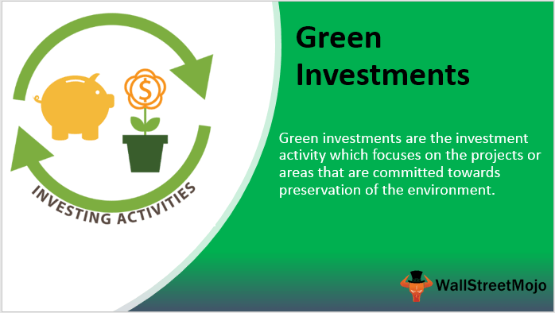

In recent years, the intersection of finance and environmental sustainability has gained significant traction. As global awareness about climate change and environmental degradation increases, investors are increasingly motivated to align their financial goals with environmental responsibility. This growing trend underscores the importance of sustainable finance, which offers a promising avenue for reconciling economic growth with the principles of environmental stewardship.

Sustainable finance encompasses a range of investment strategies that incorporate environmental, social, and governance (ESG) considerations into financial decision-making. These strategies seek to support not only economic development but also the well-being of communities and ecosystems. This dual focus reflects a broader shift within the financial industry, where institutions are increasingly integrating sustainability metrics into their portfolios as part of their corporate responsibility and long-term risk management strategies.



Eco-friendly investments, green investing, and algorithmic trading are key components within this paradigm. Eco-friendly investments channel capital towards companies and projects that have a tangible positive environmental impact, such as those reducing carbon footprints or promoting renewable energy solutions. Green investing takes this a step further by focusing on initiatives that support the conservation of natural resources, pollution reduction, and the advancement of clean energy technologies.

Algorithmic trading is a disruptive force in this field, transforming how sustainable investments are managed and executed. Advanced algorithms enable real-time assessment of ESG data, facilitating swift and informed investment decisions that enhance both the efficiency and profitability of sustainable portfolios. This fusion of fintech and sustainability promises to create more agile and responsible financial markets.

Through these innovative strategies, sustainable finance is not only changing the landscape of modern finance but also contributing to a healthier planet. This transformative shift emphasizes the role of conscious investing as a mechanism for addressing some of the most pressing environmental challenges of our time. As these concepts continue to evolve, they hold the potential for substantial positive change, propelling us towards a future where finance and environmental sustainability are intrinsically linked.

## Table of Contents

## Understanding Sustainable Finance

Sustainable finance is an investment approach that incorporates environmental, social, and governance (ESG) criteria into financial decision-making. This approach seeks to minimize the long-term risks associated with environmental degradation, such as climate change, resource scarcity, and biodiversity loss, while fostering positive social and governance outcomes.

The increasing importance of sustainable finance is often attributed to its potential for addressing systemic risks to both economic stability and environmental integrity. As climate change poses significant threats to global markets, understanding and mitigating these risks has become critical. The integration of [ESG](/wiki/esg-investing) factors allows investors to evaluate aspects of a company's operations that could affect financial performance or contribute to economic instability, such as carbon emissions, labor practices, diversity, and corporate governance structures.

Financial institutions worldwide are gradually incorporating sustainability metrics into their portfolios, recognizing the dual benefits of financial returns and positive societal impact. For instance, many investment firms are adopting the United Nations-supported Principles for Responsible Investment (PRI), an initiative encouraging investors to incorporate ESG issues into investment analysis and decision processes. By adhering to these principles, institutions can contribute to sustainable development while potentially outperforming traditional investment strategies in the long run.

The role of sustainable finance is becoming an essential facet of corporate responsibility, as companies face mounting pressure from stakeholders to demonstrate environmental and social accountability. This shift is evident in the growth of ESG reporting, where corporations disclose their sustainability initiatives, thus maintaining transparency and accountability to investors and the public. As a result, integrating ESG considerations is not only a strategic advantage but also an expectation in today's investment landscape.

Furthermore, sustainable finance is key to global investment strategies as investors increasingly recognize the need for resilience against climate-related disturbances. The transition towards a low-carbon economy requires substantial capital investments, prompting financial markets to align their practices with global sustainability targets. By prioritizing ESG factors, investors contribute to a frameworks that seeks to balance economic growth with the well-being of communities and ecosystems – a crucial tenet for long-term sustainable development.

## The Rise of Eco-Friendly Investments

Eco-friendly investments prioritize companies and projects that provide positive environmental impacts. These investments aim to reduce carbon footprints and bolster sectors such as renewable energy, waste management, and sustainable agriculture. The attractiveness of eco-friendly investments hinges on their dual capability to offer financial returns alongside environmental advancements.

Sustainable practices in eco-friendly investments are evident in the increasing focus on renewable energy sources, such as solar, wind, and hydroelectric power. According to the International Energy Agency (IEA), renewables are expected to account for nearly 95% of the increase in global power capacity through 2026.[^1] This shift is driven by technological advancements and policy incentives favoring clean energy adoption.

Waste management is another sector seeing a surge in eco-friendly investments. Innovations in recycling processes, waste-to-energy technologies, and bioplastics are attracting investor attention. The Ellen MacArthur Foundation reports that transitioning to a circular economy could generate $4.5 trillion in economic output by 2030, highlighting the significant potential for financial gain.[^2]

Sustainable agriculture investments focus on practices like organic farming, precision agriculture, and agroforestry. These methods aim to increase productivity while minimizing environmental impacts. The Food and Agriculture Organization (FAO) emphasizes that sustainable agriculture is key to meeting the needs of a growing global population amidst climate change challenges.[^3]

Corporations and investors are increasingly adopting environmentally responsible business practices. This shift is partly driven by consumer preferences and regulatory pressures. A report by the Global Sustainable Investment Alliance (GSIA) indicates that global sustainable investment reached $35.3 trillion in 2020, a 15% increase from 2018.[^4]

Key trends in the eco-friendly investment landscape include the rise of ESG (Environmental, Social, and Governance) criteria, green bonds, and impact investing. ESG criteria help investors assess the ethical implications of their portfolios. Green bonds, which fund projects with environmental benefits, have seen remarkable growth. Bloomberg's New Energy Finance reports the issuance of green bonds is expected to exceed $1 trillion annually by the mid-2020s.[^5]

Impact investing goes beyond financial returns to achieve measurable societal and environmental objectives. This approach aligns investment portfolios with broader global challenges, such as the United Nations' Sustainable Development Goals (SDGs).

The eco-friendly investment sector presents significant opportunities for innovation and growth. As awareness of environmental issues expands, the demand for investments that align with sustainable development will likely continue to rise, paving the way for a more resilient and environmentally conscious financial sector.

[^1]: International Energy Agency. (2021). Renewables 2021: Analysis and Forecast to 2026.
[^2]: Ellen MacArthur Foundation. (2019). Completing the Picture: How the Circular Economy Tackles Climate Change.
[^3]: Food and Agriculture Organization of the United Nations. (2017). The Future of Food and Agriculture – Trends and Challenges.
[^4]: Global Sustainable Investment Alliance. (2021). Global Sustainable Investment Review 2020.
[^5]: Bloomberg New Energy Finance. (2021). Sustainable Finance Market Outlook.

## Green Investing: A Closer Look

Green investing is focused on channeling capital towards projects and companies making positive contributions to the conservation of natural resources, pollution reduction, and the advancement of clean energy technologies. The fundamental principles of green investing involve assessing an investment’s environmental impact and potential for sustainable development, alongside traditional financial metrics. Investors evaluate environmental, social, and governance (ESG) criteria to ensure their portfolios contribute to ecological preservation while also generating financial returns.

Prominent sectors in green investing include solar energy, electric vehicles (EVs), and sustainable forestry. Solar energy represents a cornerstone of the transition towards sustainable energy, with investments supporting the development and deployment of photovoltaic technologies and large-scale solar farms. The electric vehicle sector focuses on reducing carbon emissions from transportation, with investments driving innovations in battery technology and charging infrastructure. Sustainable forestry, another key area, involves managing forest resources to meet current needs without compromising the health of ecosystems for future generations.

In recent years, green bonds have emerged as a popular vehicle within green investing. These bonds are specifically earmarked for environmental projects, offering investors the dual benefit of stable returns and contributing to ecological sustainability. Impact investing takes these efforts further by targeting investments that directly address social or environmental issues, often incorporating community development or conservation efforts that deliver measurable social outcomes alongside financial performance.

Balancing financial gains with ecological responsibility involves structured evaluation and strategic asset allocation. Investors typically employ diversified strategies incorporating both green bonds and equity investments in environmentally focused companies to mitigate risks and maximize returns. Tools like the Global Reporting Initiative (GRI) and the Carbon Disclosure Project (CDP) provide frameworks for evaluating environmental impacts, facilitating informed investment decisions.

In summary, green investing is an evolving sector driven by the quest to align financial success with environmental stewardship. The integration of thorough ESG assessments, alongside traditional financial analysis, empowers investors to make responsible choices that benefit the planet and its inhabitants, ensuring sustainability remains at the forefront of financial markets.

## Algorithmic Trading in the Context of Sustainable Investments

Algorithmic trading is increasingly integral to the management and execution of sustainable investments. This technology utilizes complex algorithms to analyze vast datasets swiftly, enabling investors to make well-informed decisions that enhance the efficiency and profitability of their sustainable portfolios. The use of [algorithmic trading](/wiki/algorithmic-trading) in this sector facilitates the real-time assessment of Environmental, Social, and Governance (ESG) data, which is crucial for achieving desired investment outcomes while adhering to ethical standards.

The speed and precision offered by algorithmic trading are transformative for sustainable finance. Traditional investment strategies may struggle to keep pace with the rapid influx of ESG data. In contrast, algorithms can process this data to identify patterns and trends that inform sustainable investment strategies. For example, a Python-based algorithm might be designed to analyze news sentiment and ESG scores by leveraging natural language processing (NLP) and [machine learning](/wiki/machine-learning) to predict stock performance linked to sustainable practices.

```python
import pandas as pd
from nltk.sentiment.vader import SentimentIntensityAnalyzer
from sklearn.linear_model import LinearRegression

# Example code snippet for analyzing ESG sentiment
def analyze_sentiment(news_data):
    sia = SentimentIntensityAnalyzer()
    news_data['sentiment'] = news_data['headline'].apply(lambda x: sia.polarity_scores(x)['compound'])
    return news_data

def integrate_esg_scores(stock_data, esg_scores):
    merged_data = pd.merge(stock_data, esg_scores, on='company_id')
    return merged_data

def predict_performance(merged_data):
    model = LinearRegression()
    X = merged_data[['sentiment', 'esg_score']]
    y = merged_data['stock_return']
    model.fit(X, y)
    predictions = model.predict(X)
    return predictions
```

Fintech innovations are key drivers in aligning algorithmic trading with sustainable finance practices, leading to more agile and responsible financial markets. By integrating fintech solutions, investors can better navigate the complexities of sustainable investment frameworks, thereby overcoming traditional barriers associated with ESG data interpretation.

Algorithmic trading also plays a role in mitigating risks and enhancing transparency, which are critical components of sustainable finance. Through the automation of trading and data analysis, investors are equipped to consistently monitor ESG compliance and adjust their strategies accordingly. This not only ensures that capital is directed toward sustainable ventures but also bolsters investor confidence by maintaining accountability and transparency.

As fintech continues to evolve, its integration with algorithmic trading is expected to further revolutionize sustainable investments. By fostering innovation and enhancing market responsiveness, this convergence has the potential to fundamentally alter the landscape of sustainable finance, ultimately fostering a more sustainable and ethically conscious financial ecosystem.

## Challenges and Opportunities

Sustainable finance and green investing are increasingly popular as society becomes more environmentally conscious. However, these sectors encounter several challenges that need addressing to foster further development and trust among investors.

One primary challenge is the absence of standardized metrics for evaluating sustainability. Without a unified framework, investors face difficulties comparing the sustainability performance of different assets. This lack of standardization often leads to inconsistent reporting and evaluation methods, making it challenging for investors to make informed decisions. To overcome this, creating transparent and reliable frameworks for measuring the sustainability impact is crucial. Uniform metrics would allow investors to compare different projects objectively, increasing confidence in sustainable investments.

Another significant challenge is greenwashing, where companies present themselves as more environmentally friendly than they are. This can mislead investors seeking to support genuinely sustainable projects. The practice diminishes trust in the market and hinders genuine sustainability efforts. Addressing greenwashing requires implementing rigorous verification processes and disclosure requirements that hold companies accountable for their sustainability claims.

Balancing profitability with sustainability goals is another challenge faced by investors. While sustainable finance aims to support projects that benefit the environment, investors also seek satisfactory financial returns. This balance can be difficult to achieve, as some green investments may not generate immediate economic benefits. However, this challenge also presents opportunities. As technological advancements and innovations continue, new sustainable products and processes can emerge, potentially offering both high returns and environmental benefits.

The sustainable finance sector can gain investor trust by developing transparent and reliable metrics and frameworks. Initiatives such as the Task Force on Climate-related Financial Disclosures (TCFD) and the Sustainable Accounting Standards Board (SASB) are working towards standardizing how companies disclose sustainability information, which could improve market transparency and investor confidence.

Despite these challenges, the potential for growth and innovation in sustainable finance is substantial. By overcoming hurdles associated with greenwashing, standardization, and profitability, sustainable finance can continue to attract more investors looking to contribute positively to the environment while achieving their financial goals. This evolution represents a promising step toward a more sustainable future in global finance.

## Conclusion

Sustainable finance and eco-friendly investments have marked a pivotal change in how financial markets operate, emphasizing the symbiosis between financial prosperity and environmental stewardship. By adopting conscious investment strategies, both individuals and institutions can actively participate in fostering a sustainable future while achieving economic returns. This approach encourages stakeholders to consider not merely the financial bottom line but also the broader impact on our planet’s health.

The introduction of algorithmic trading into the domain of sustainable finance has further amplified the efficiency and responsiveness of investment strategies. Advanced algorithms facilitate swift, data-driven decision-making, allowing investors to navigate complex markets with a focus on ESG criteria. This technological integration ensures a seamless alignment of financial activities with ethical standards, enhancing the adaptability and reach of sustainable investments.

As these concepts continue to mature, they promise a future where economic growth and environmental responsibility are not mutually exclusive but rather, complementary. The evolution of such investment paradigms projects a financial landscape that not only prioritizes profit but also champions sustainability. The ongoing development of this sustainable financial ecosystem carries the potential for transformative global impact, steering us toward a reality where fiscal ambitions and ecological obligations are harmoniously balanced.

## References & Further Reading

[1]: International Energy Agency. (2021). ["Renewables 2021: Analysis and Forecast to 2026."](https://www.iea.org/reports/renewables-2021)

[2]: Ellen MacArthur Foundation. (2019). ["Completing the Picture: How the Circular Economy Tackles Climate Change."](https://www.ellenmacarthurfoundation.org/completing-the-picture)

[3]: Food and Agriculture Organization of the United Nations. (2017). ["The Future of Food and Agriculture – Trends and Challenges."](https://www.fao.org/agrifood-economics/publications/detail/en/c/1475516/)

[4]: Global Sustainable Investment Alliance. (2021). ["Global Sustainable Investment Review 2020."](http://www.gsi-alliance.org/wp-content/uploads/2021/08/GSIR-20201.pdf)

[5]: Bloomberg New Energy Finance. (2021). ["Sustainable Finance Market Outlook."](https://about.bnef.com/blog/sustainable-debt-issuance-breezed-past-1-6-trillion-in-2021/)