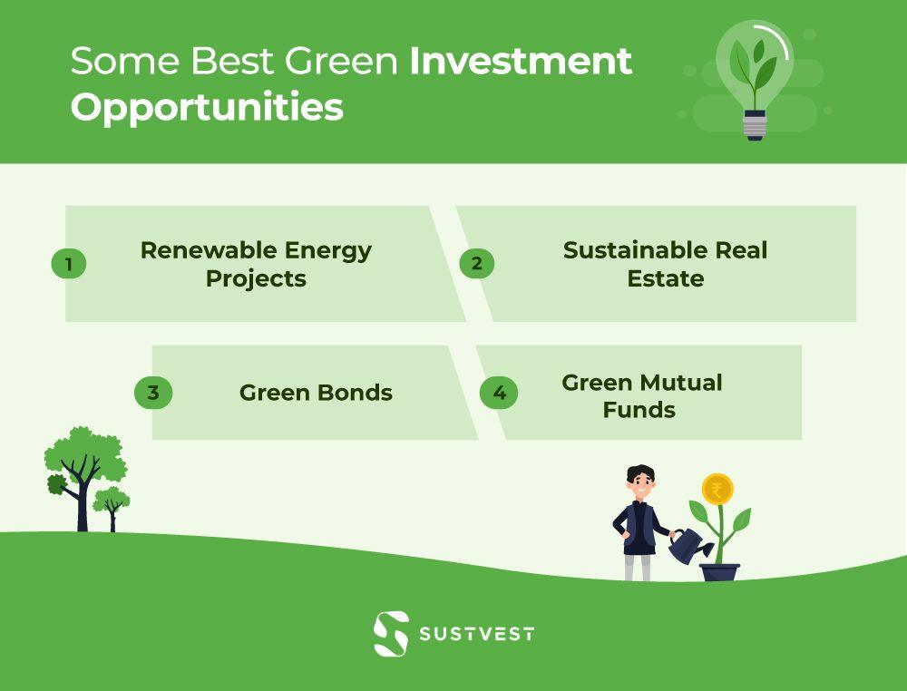

## Table of Contents

## What is eco-friendly investment?

Eco-friendly investment, also known as green investment, means putting money into things that help the environment. This can include buying shares in companies that make clean energy, like wind or solar power, or supporting businesses that work to reduce pollution and waste. The idea is to use money to make the world a better place by supporting efforts that protect nature and fight climate change.

People choose eco-friendly investments because they want to make a positive impact on the planet. By investing in green projects, they can help create a more sustainable future. At the same time, these investments can also be good for their wallets, as many green companies are growing and can offer good returns. This way, people can feel good about their money helping the environment while also possibly making more money.

## Why should someone consider eco-friendly investments?

Someone should consider eco-friendly investments because they can help make the planet a better place. By putting money into green companies or projects, you support efforts to fight climate change, reduce pollution, and protect nature. It's a way to use your money to make a positive impact on the environment, which is important for everyone's future.

Also, eco-friendly investments can be good for your wallet. Many green companies are growing fast because more people want clean energy and sustainable products. This means that investing in them can lead to good financial returns. So, you can feel good about helping the planet while also possibly making more money.

In short, eco-friendly investments let you do well financially while doing good for the environment. It's a way to be part of the solution to big problems like climate change, and it can also be a smart financial move.

## What are the basic types of eco-friendly investments available to beginners?

Eco-friendly investments for beginners can start with green mutual funds or ETFs. These are like baskets of different eco-friendly stocks. By investing in them, you spread your money across many green companies. This can be safer than [picking](/wiki/asset-class-picking) just one company because if one does poorly, the others might do well. These funds often focus on things like clean energy, green technology, or sustainable practices.

Another simple way to start is by investing in green bonds. These are like loans to companies or governments that promise to use the money for eco-friendly projects, like building wind farms or improving energy efficiency. Green bonds can give you regular interest payments, making them a bit like saving money in a bank but with the added benefit of helping the environment.

Lastly, you can also look into community solar projects. These let you invest in a part of a solar farm, even if you don't have a place to put solar panels yourself. By doing this, you help create more clean energy and can often get credits on your electricity bill. It's a way to support renewable energy and save some money at the same time.

## How can eco-friendly investments impact the environment positively?

Eco-friendly investments help the environment by putting money into things that make it better. When people invest in green companies, like those that make wind or solar power, they help create more clean energy. This means less pollution from dirty energy like coal or oil. Also, when money goes to businesses that recycle or reduce waste, it helps keep our planet cleaner. By supporting these kinds of projects, eco-friendly investments make a big difference in fighting climate change and keeping nature healthy.

These investments also encourage more people and companies to think about the environment. When green businesses get more money, they can grow and do more good work. This can inspire other companies to start being eco-friendly too. As more people see the benefits of green investments, it can create a cycle where more money goes into protecting the environment. In the end, this can lead to a healthier planet for everyone.

## What are the financial risks associated with eco-friendly investments?

Eco-friendly investments can have financial risks just like any other type of investment. One risk is that green companies might not do as well as expected. They might be new and still figuring things out, so they could have problems making money or growing as fast as hoped. If a lot of people want to invest in green companies at the same time, their prices might go up a lot, and then if the excitement goes away, the prices could drop quickly. This can make your investment worth less than you paid for it.

Another risk is that the rules and laws about the environment can change. If a government decides to make new rules or stop supporting green projects, it could hurt the companies you've invested in. Also, green investments can sometimes be in new areas that we don't know much about yet. This means there's a chance they might not work out as planned. So, while eco-friendly investments can be good for the planet and your wallet, it's important to know these risks and be ready for them.

## How do government policies and regulations affect eco-friendly investments?

Government policies and regulations can have a big impact on eco-friendly investments. When governments make rules that support green projects, like giving tax breaks or subsidies for renewable energy, it can make these investments more attractive. For example, if a government offers money to people who buy electric cars or set up solar panels, more people might want to invest in companies that make these things. This can help green companies grow and make your investment more valuable.

On the other hand, if governments change their minds and stop supporting green projects, it can hurt eco-friendly investments. If new rules make it harder for green companies to do business, or if they take away the money they used to give, these companies might struggle. This could make your investment worth less. So, it's important to keep an eye on what governments are doing because their policies can make a big difference in how well your eco-friendly investments do.

## What are some advanced strategies for maximizing returns in eco-friendly investments?

One advanced strategy for maximizing returns in eco-friendly investments is to diversify your portfolio across different types of green assets. Instead of putting all your money into one kind of investment, like solar energy, you can spread it out over many areas, like wind power, green bonds, and sustainable agriculture. This way, if one area doesn't do well, the others might help balance it out. Also, by staying informed about new technologies and trends in the green industry, you can find new opportunities that others might not see yet. For example, investing in companies that are developing new ways to store renewable energy can be a smart move if those technologies become popular.

Another strategy is to use impact investing, which focuses on both making money and making a positive impact on the environment. This means choosing investments that not only promise good financial returns but also have a clear plan for helping the planet. By working with financial advisors who specialize in eco-friendly investments, you can get advice on the best ways to balance your goals of [earning](/wiki/earning-announcement) money and supporting green initiatives. Keeping an eye on government policies and regulations is also important because changes in these areas can affect which green investments are likely to do well. By staying informed and flexible, you can adjust your investment strategy to take advantage of new opportunities as they arise.

## How can investors assess the true 'green' credentials of an investment?

To assess the true 'green' credentials of an investment, investors need to look closely at what the company or project actually does. They should check if the company has clear goals for helping the environment and if they are doing things like using less energy, making less pollution, or helping nature. It's also good to see if the company gets checked by outside groups that make sure they are really being green. These groups can give the company a special label or rating that shows they are doing well for the environment. Reading reports and news about the company can help too, to see if they are keeping their promises or if they are just saying they are green without doing much.

Another way to make sure an investment is really green is by looking at the company's plans for the future. Good companies will have a plan to keep getting better at helping the environment, not just staying the same. Investors can also talk to other people who know about green investments, like experts or other investors, to get their thoughts on which companies are truly doing good things for the planet. By doing all this, investors can feel more sure that their money is going to help the environment in a real way.

## What role do emerging technologies play in eco-friendly investment opportunities?

Emerging technologies are really important for eco-friendly investments because they create new ways to help the environment. For example, new types of batteries can store energy from the sun or wind better, which makes these kinds of energy more useful. Also, smart technology can help buildings use less energy by turning off lights or adjusting the heat when no one is around. When investors put money into companies that are working on these new technologies, they help them grow and make the world greener. This can also be a good way to make money because as these technologies become more popular, the companies that make them can do well.

These new technologies can also open up new kinds of investments that weren't possible before. For example, there are now ways to invest in things like carbon capture, which takes harmful gases out of the air, or in new ways to recycle things that used to be hard to recycle. By keeping an eye on what's new in the green technology world, investors can find opportunities to make their money work for the environment in new and exciting ways. This means they can help the planet while also possibly getting good returns on their investments.

## How can large-scale eco-friendly projects be funded and what are the investment models?

Large-scale eco-friendly projects can be funded through different ways. One way is through green bonds, which are like loans that companies or governments take to do eco-friendly things. People who buy these bonds get their money back with interest, and the money helps build things like wind farms or better public transport. Another way is through impact investing, where investors look for projects that will make money and also help the environment. This can include big projects like reforestation or building new kinds of clean energy plants. Governments can also help by giving money or tax breaks to these projects, making them more attractive to investors.

There are different investment models for these projects. One model is public-private partnerships, where the government and private companies work together. The government might help with some of the money or by making rules easier, and the private company does the work and shares the profits. Another model is crowdfunding, where lots of people give a little bit of money to help a project get started. This can be good for smaller projects that need community support. Lastly, there are venture capital and private equity models, where investors give money to new green companies in exchange for part of the company. If the company does well, the investors can make a lot of money, but it's also riskier because new companies can fail.

## What are the global trends in eco-friendly investments and how do they vary by region?

Global trends in eco-friendly investments show that more and more people around the world are putting their money into green projects. This is because people are worried about climate change and want to help the environment. In places like Europe, governments have made rules to help green investments, like giving money to people who use clean energy. This has made eco-friendly investments very popular there. In the United States, green investments are also growing, but sometimes it can be harder because the rules can change a lot. In Asia, countries like China are investing a lot in things like solar and wind power because they want to be leaders in clean energy.

The way eco-friendly investments work can be different in different parts of the world. In Europe, people might invest in green bonds or funds that focus on the environment. They have a lot of choices because many companies there are working on green projects. In the United States, some people might choose to invest in new green companies that are just starting out, hoping they will grow big. In Asia, especially in China, the government is putting a lot of money into big projects like building solar farms and wind turbines. Each region has its own way of doing things, but the main goal is the same: to help the environment and make money at the same time.

## How can an investor build a diversified portfolio focused on eco-friendly investments?

To build a diversified portfolio focused on eco-friendly investments, an investor should start by spreading their money across different types of green assets. This means not putting all your money into one thing, like solar energy, but instead investing in a mix of things like wind power, green bonds, and sustainable agriculture. By doing this, if one type of investment doesn't do well, the others might help balance it out. It's also a good idea to invest in both established green companies and newer ones that are just starting out. This way, you can have some steady returns from the bigger companies and also have the chance for bigger gains from the smaller ones.

Another way to diversify is by using different investment vehicles, like green mutual funds or ETFs. These funds hold a lot of different green stocks, so by investing in them, you automatically spread your money across many companies. This can be safer than picking just one or two companies because if one does poorly, the others might do well. It's also important to keep an eye on new trends and technologies in the green industry. By staying informed, you can find new opportunities to invest in, like companies working on new ways to store renewable energy or reduce waste. This can help keep your portfolio growing and doing well for both your wallet and the planet.

## References & Further Reading

[1]: International Energy Agency. (2021). ["Renewables 2021: Analysis and Forecast to 2026."](https://www.iea.org/reports/renewables-2021)

[2]: Ellen MacArthur Foundation. (2019). ["Completing the Picture: How the Circular Economy Tackles Climate Change."](https://www.ellenmacarthurfoundation.org/completing-the-picture)

[3]: Food and Agriculture Organization of the United Nations. (2017). ["The Future of Food and Agriculture – Trends and Challenges."](https://www.fao.org/agrifood-economics/publications/detail/en/c/1475516/)

[4]: Global Sustainable Investment Alliance. (2021). ["Global Sustainable Investment Review 2020."](http://www.gsi-alliance.org/wp-content/uploads/2021/08/GSIR-20201.pdf)

[5]: Bloomberg New Energy Finance. (2021). ["Sustainable Finance Market Outlook."](https://about.bnef.com/blog/sustainable-debt-issuance-breezed-past-1-6-trillion-in-2021/)