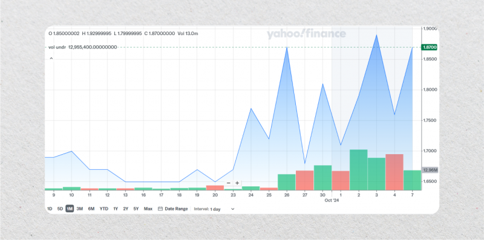

## Table of Contents

## What are penny stocks and why might someone be interested in trading them?

Penny stocks are stocks that trade at a very low price, usually less than $5 per share. They are often from small companies that are just starting out or are not doing very well. Because they are cheap, you can buy a lot of shares with a little bit of money. But, they can be risky because these companies might not make it and could go out of business.

People might be interested in trading penny stocks because they hope to make a lot of money quickly. If a small company does well, its stock price can go up a lot, and you could make a big profit. But, it's important to know that it's also easy to lose money because penny stocks can go down just as fast as they go up. So, people who trade penny stocks need to be ready to take big risks.

## What features should beginners look for in a penny stock trading app?

When beginners are looking for a penny stock trading app, they should focus on apps that are easy to use. A good app should have a simple design so it's not hard to buy and sell stocks. It should also have clear instructions and help sections that explain how to trade. This way, even if you're new to trading, you can learn quickly and not feel lost.

Another important feature is low fees. Penny stocks are cheap, so if the app charges a lot of money every time you trade, it can eat into your profits. Beginners should look for apps that have low or no fees for trading penny stocks. This helps keep more of the money you make from your trades.

Lastly, it's good to have access to research tools and real-time data. These tools can help you make better choices about which penny stocks to buy. The app should show you the latest prices and news about the companies you're interested in. This way, you can stay updated and make smart decisions about when to buy or sell your stocks.

## How do the fees and commissions of different penny stock trading apps compare?

Different penny stock trading apps have different fees and commissions. Some apps charge a flat fee every time you buy or sell a stock. For example, an app might charge $4.95 per trade, no matter how many shares you're buying or selling. Other apps might have a fee that changes based on how much you're trading. They might charge a percentage of the total amount of your trade, like 1% of the trade value. Some apps even offer free trades, but they might make money in other ways, like by charging for other services or getting paid by the companies whose stocks they offer.

It's important for beginners to understand these fees because they can add up quickly, especially with penny stocks. If you're trading a lot of small stocks, even a small fee per trade can take a big bite out of your profits. That's why it's a good idea to look for apps with low or no trading fees. For example, apps like Robinhood offer free trades, which can be great for people starting out with penny stocks. But remember, even if the trades are free, other costs like withdrawal fees or inactivity fees might still apply.

## What are the top penny stock trading apps recommended for beginners in 2024?

In 2024, some of the top penny stock trading apps for beginners are Robinhood, Webull, and E*TRADE. These apps are known for being easy to use, which is great for people who are new to trading. Robinhood is very popular because it offers free trades, so you don't have to worry about fees eating into your profits. Webull is also a good choice because it gives you free trades and some really helpful tools to learn about the stock market. E*TRADE is a bit more advanced, but it has a lot of resources to help beginners learn how to trade penny stocks.

These apps are good for beginners because they make it easy to start trading without getting too overwhelmed. Robinhood has a simple design that makes it easy to buy and sell stocks. Webull has a practice account where you can try trading without using real money, which is perfect for learning. E*TRADE offers a lot of educational content, like videos and articles, to help you understand the stock market better. All these apps have low fees or free trades, which is important when you're trading penny stocks because the fees can add up quickly if you're not careful.

## How can intermediate traders utilize advanced charting tools in penny stock trading apps?

Intermediate traders can use advanced charting tools in penny stock trading apps to make smarter trading choices. These tools show detailed charts of stock prices over time, which can help traders spot patterns and trends. For example, they might see that a penny stock's price goes up and down in a certain way, which could help them decide when to buy or sell. Some apps also let you add things like moving averages or [volume](/wiki/volume-trading-strategy) indicators to the charts. These extra lines and bars can give you more information about how the stock is doing and help you predict what might happen next.

Using these advanced features, intermediate traders can also set up custom alerts. If a stock's price reaches a certain level or if a pattern they're watching starts to form, the app can send them a notification. This way, they don't have to watch the market all the time and can still catch important changes. By understanding and using these tools well, intermediate traders can find better opportunities in penny stocks and manage their risks more effectively.

## What are the security measures implemented by leading penny stock trading apps to protect user data and funds?

Leading penny stock trading apps use strong security measures to keep user data and money safe. They use encryption to protect your personal information and money when you're using the app. Encryption is like a secret code that keeps your data safe from hackers. These apps also use two-[factor](/wiki/factor-investing) authentication, which means you need two ways to prove it's really you before you can log in. This could be a password and a code sent to your phone. This makes it much harder for someone else to get into your account.

Besides encryption and two-factor authentication, these apps also have something called secure socket layer (SSL) technology. SSL makes sure that the information you send and receive through the app stays private and safe. Many apps also have a special team that watches for anything suspicious all the time. If they see something that doesn't look right, they can stop it before it causes any harm. These security steps help make sure that your money and personal information are kept safe while you're trading penny stocks.

## How do real-time data and market news features in trading apps benefit penny stock traders?

Real-time data and market news features in trading apps help penny stock traders a lot. They show the latest prices of stocks right away, so traders can see what's happening in the market at that very moment. This is important for penny stocks because their prices can change quickly. If a trader sees that a penny stock's price is going up fast, they might decide to buy it right away to make a profit. On the other hand, if the price is dropping, they might sell it to avoid losing money. Having real-time data means traders can make quick decisions based on what's happening now, not what happened a few minutes ago.

Market news features are also very helpful. They give traders news about the companies they're interested in, like new products, earnings reports, or other important events. This news can affect the price of penny stocks a lot. For example, if a small company announces good news, its stock price might go up. Traders who see this news first can buy the stock before the price goes up too much. On the flip side, bad news can make the stock price drop, and traders can sell before it falls too far. By staying updated with market news, traders can make smarter choices and maybe make more money from their penny stock trades.

## What are the specific tools and indicators available in top apps that help in technical analysis for penny stocks?

Top trading apps offer a variety of tools and indicators that help with technical analysis for penny stocks. These tools include different types of charts like line charts, bar charts, and candlestick charts. Candlestick charts are especially useful because they show the opening, closing, high, and low prices of a stock in one picture, which can help traders see patterns more easily. Apps also provide indicators like moving averages, which smooth out price data to show trends over time. For example, a simple moving average can help traders see if a penny stock's price is generally going up or down. Another common indicator is the Relative Strength Index (RSI), which shows if a stock is overbought or oversold, helping traders decide when to buy or sell.

In addition to these basic tools, some apps offer more advanced indicators like Bollinger Bands, which show how much a stock's price is moving around its moving average. This can help traders see if a stock is becoming more or less volatile, which is important for penny stocks because they can be very unpredictable. Volume indicators are also important because they show how many shares of a stock are being traded. High volume can mean that a lot of people are interested in the stock, which might make its price move more. By using these tools and indicators, traders can get a better understanding of penny stock trends and make more informed decisions about when to trade.

## How can expert traders leverage algorithmic trading features within penny stock apps?

Expert traders can use [algorithmic trading](/wiki/algorithmic-trading) features in penny stock apps to make their trading faster and more efficient. These features let them set up rules for buying and selling stocks automatically. For example, they can tell the app to buy a penny stock if its price goes up by a certain amount or sell it if it goes down. This way, they don't have to watch the market all the time. The app does the work for them based on the rules they set. This is really helpful for penny stocks because their prices can change very quickly, and having an algorithm can help traders catch these changes without missing out.

Also, algorithmic trading can help expert traders test different trading ideas without risking a lot of money. They can use the app to run simulations and see how their strategies would work in the past. This is called [backtesting](/wiki/backtesting). If a strategy works well in the backtest, they might decide to use it for real trading. This can be a big advantage because penny stocks can be very unpredictable, and having a way to test strategies can help traders make better choices. By using these features, expert traders can manage their trades more effectively and possibly make more money from penny stocks.

## What are the integration capabilities of leading penny stock trading apps with other financial tools and platforms?

Leading penny stock trading apps often have ways to connect with other financial tools and platforms. This can help traders manage their money better. For example, some apps let you link your trading account to a budgeting app. This way, you can see all your money in one place and make sure you're not spending too much on trading. Other apps might connect to research platforms, which give you more information about the companies you're interested in. This can help you make smarter choices about which penny stocks to buy or sell.

Another useful feature is the ability to connect to other trading platforms. Some apps let you trade on different markets without having to switch between apps. This can be really helpful if you want to trade penny stocks on one exchange and other types of stocks on another. Also, some apps offer ways to connect to financial news services, so you get the latest updates right in your trading app. This helps you stay on top of what's happening in the market and make quick decisions based on the newest information.

## How do the customer support and educational resources of different apps cater to traders at various skill levels?

Different penny stock trading apps offer customer support and educational resources that cater to traders at different skill levels. For beginners, apps like Robinhood provide easy-to-understand guides and tutorials that explain how to start trading penny stocks. They also have customer support that can be reached through email or chat, making it simple for new traders to get help when they need it. Webull goes a step further by offering a practice account where beginners can trade without using real money, helping them learn the ropes without risking their savings. Both apps make sure that new traders have the support and knowledge they need to get started.

For intermediate and expert traders, apps like E*TRADE and Thinkorswim offer more advanced educational resources. E*TRADE has detailed articles, videos, and webinars that cover complex trading strategies and market analysis techniques. Their customer support includes phone support and live chat with experienced traders who can answer detailed questions. Thinkorswim, on the other hand, provides in-depth charting tools and a community forum where traders can share tips and learn from each other. These resources help more experienced traders refine their skills and stay updated with the latest market trends. By offering tailored support and education, these apps ensure that traders at all levels can improve and succeed in trading penny stocks.

## What future trends are expected in penny stock trading apps and how are current leaders preparing for these changes?

In the future, penny stock trading apps are expected to use more advanced technology like [artificial intelligence](/wiki/ai-artificial-intelligence) (AI) to help traders make better choices. AI can look at a lot of data very quickly and find patterns that humans might miss. This could make it easier for traders to know when to buy or sell penny stocks. Also, more apps might start to connect with other financial tools, like budgeting apps and research platforms, to give traders a fuller picture of their money. This can help traders manage their trading and their overall finances better.

Current leaders like Robinhood, Webull, and E*TRADE are getting ready for these changes by adding new features to their apps. For example, they are working on better AI tools and improving how their apps connect with other financial services. Robinhood is looking into ways to use AI to give personalized advice to users. Webull is focusing on making its research tools even better with AI. E*TRADE is working on making its educational resources more advanced so traders can learn about new technologies. By doing these things, these apps are trying to stay ahead and make sure they can help traders as the market changes.

## References & Further Reading

[1]: Bergstra, J., Bardenet, R., Bengio, Y., & Kégl, B. (2011). ["Algorithms for Hyper-Parameter Optimization."](https://papers.nips.cc/paper/4443-algorithms-for-hyper-parameter-optimization) Advances in Neural Information Processing Systems 24.

[2]: ["Advances in Financial Machine Learning"](https://www.amazon.com/Advances-Financial-Machine-Learning-Marcos/dp/1119482089) by Marcos Lopez de Prado

[3]: ["Evidence-Based Technical Analysis: Applying the Scientific Method and Statistical Inference to Trading Signals"](https://www.amazon.com/Evidence-Based-Technical-Analysis-Scientific-Statistical/dp/0470008741) by David Aronson

[4]: ["Machine Learning for Algorithmic Trading"](https://github.com/PacktPublishing/Machine-Learning-for-Algorithmic-Trading-Second-Edition) by Stefan Jansen

[5]: ["Quantitative Trading: How to Build Your Own Algorithmic Trading Business"](https://books.google.com/books/about/Quantitative_Trading.html?id=j70yEAAAQBAJ) by Ernest P. Chan