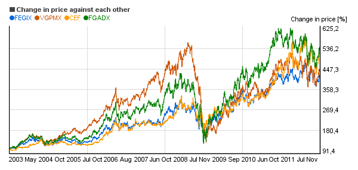

## Table of Contents

## What are precious metals mutual funds?

Precious metals mutual funds are investment funds that focus on buying and selling stocks of companies involved in mining, producing, or trading precious metals like gold, silver, platinum, and palladium. These funds allow investors to gain exposure to the precious metals market without having to buy the physical metals themselves. By investing in these mutual funds, you can benefit from the potential growth in the value of precious metals and the companies that work with them.

These funds can be a good choice for people who want to diversify their investment portfolio. Precious metals often have a different performance pattern compared to stocks and bonds, which can help balance out the risk in your investments. However, like any investment, precious metals mutual funds come with their own risks. The value of the fund can go up and down based on the performance of the companies it invests in and the overall market conditions for precious metals. It's important to do your research and consider your investment goals before putting money into these funds.

## Why should someone invest in precious metals mutual funds?

Someone might want to invest in precious metals mutual funds because they can help spread out the risk in their investment portfolio. Precious metals like gold and silver often do well when other investments, like stocks, are not doing so well. This means that if the stock market goes down, the value of precious metals might go up, which can help balance out your investments. By putting some money into these funds, you're not putting all your eggs in one basket, which is a smart way to manage risk.

Another reason to invest in these funds is that they make it easy to get into the precious metals market without having to buy the actual metals. When you invest in a mutual fund, you're buying shares in a fund that owns a bunch of different companies involved in precious metals. This can be simpler and less expensive than buying and storing physical gold or silver. Plus, the fund is managed by professionals who know a lot about the market, so you can benefit from their expertise without having to do all the work yourself.

## What are the different types of precious metals included in these funds?

Precious metals mutual funds usually invest in companies that deal with gold, silver, platinum, and palladium. Gold is the most common metal you'll find in these funds. It's often seen as a safe investment because it keeps its value well, especially during tough economic times. Silver is another popular choice. It's used in a lot of industries, like electronics and jewelry, so its price can go up when those industries are doing well.

Platinum and palladium are less common in these funds but still important. Platinum is used a lot in car parts, like catalytic converters, and in jewelry. Palladium is similar to platinum and is also used in cars. Both metals can be good investments, but their prices can be more unpredictable than gold and silver. By investing in a mutual fund that includes all these metals, you can spread out your risk and maybe benefit from the growth in any of them.

## How do precious metals mutual funds differ from other types of mutual funds?

Precious metals mutual funds are different from other mutual funds because they focus on companies that mine, produce, or trade precious metals like gold, silver, platinum, and palladium. Most other mutual funds invest in a mix of stocks, bonds, or other assets. For example, a stock mutual fund might invest in a variety of companies from different industries, while a bond fund might focus on government or corporate bonds. Precious metals funds, on the other hand, are all about the metals industry, which means they can be a good way to bet on the price of these metals going up.

Another big difference is how these funds perform compared to other types of mutual funds. Precious metals often move in the opposite direction of the stock market. When stocks are down, gold and silver might go up, which can help balance out your investments. This is why some people add precious metals funds to their portfolio - to spread out their risk. Other mutual funds might not give you this kind of protection against market ups and downs. So, if you're looking for a way to diversify your investments and protect against economic uncertainty, precious metals mutual funds could be a good choice.

## What are the risks associated with investing in precious metals mutual funds?

Investing in precious metals mutual funds comes with some risks you should know about. One big risk is that the value of the fund can go up and down a lot. This happens because the prices of precious metals like gold and silver can change quickly. If the price of these metals goes down, the value of the companies that mine or sell them will also go down, which means the value of your mutual fund will drop too. This can be a problem if you need to sell your investment when the market is down.

Another risk is that these funds can be more volatile than other types of mutual funds. This means they can have bigger swings in value. Precious metals funds often focus on a small part of the market, which makes them less diversified than funds that invest in a wide range of companies. If something goes wrong in the metals industry, like a big drop in demand or a problem at a major mine, it can affect your whole investment. It's important to think about how much risk you're okay with before you put your money into these funds.

## How can beginners start investing in precious metals mutual funds?

If you're new to investing and want to start with precious metals mutual funds, the first step is to do your homework. You should learn about different funds that invest in precious metals like gold and silver. Look for funds that have good track records and low fees. You can find this information on financial websites or by talking to a financial advisor. Once you've picked a fund, you'll need to open an investment account. You can do this through a brokerage firm, which is a company that helps people buy and sell investments. They will guide you through the process of setting up your account and making your first investment.

After you've set up your account and picked a fund, you can start investing. Decide how much money you want to put into the fund. It's a good idea to start small and see how it goes. You can usually set up automatic investments, which means you can have money taken out of your bank account and put into the fund on a regular basis, like every month. This can help you build your investment over time without having to think about it too much. Remember, investing in precious metals mutual funds can be risky, so make sure you're comfortable with the ups and downs that come with it.

## What are some of the top-performing precious metals mutual funds currently available?

Some of the top-performing precious metals mutual funds right now include the Franklin Gold and Precious Metals Fund (FKRCX) and the USAA Precious Metals and Minerals Fund (USAGX). These funds have done well because they invest in companies that mine gold and other precious metals. The Franklin Gold and Precious Metals Fund focuses on companies around the world that are involved in gold and other precious metals. The USAA Precious Metals and Minerals Fund also invests in companies that mine and process precious metals, and it has a good mix of different companies to help spread out the risk.

These funds have been doing well lately because the prices of gold and other precious metals have been going up. This is good news for investors because it means the value of their investments can go up too. But it's important to remember that past performance doesn't mean a fund will keep doing well in the future. Prices of precious metals can go up and down a lot, so these funds can be risky. If you're thinking about investing in them, make sure you're okay with the ups and downs and that you understand the risks.

## How do fees and expenses impact the returns of precious metals mutual funds?

Fees and expenses can really affect how much money you make from precious metals mutual funds. When you invest in a fund, you have to pay fees to the people who manage it. These fees can be a percentage of the money you have in the fund, and they can add up over time. If the fees are high, they can eat into your returns. For example, if a fund makes 10% in a year but charges a 2% fee, you only get to keep 8%. So, it's important to look at the fees before you invest and try to pick funds with lower fees if you can.

Another thing to think about is other expenses that come with the fund. These can include costs for buying and selling the stocks in the fund, as well as other operating costs. All these expenses can lower the amount of money you make from your investment. When you're looking at different precious metals mutual funds, make sure to check the expense ratio, which tells you how much you're paying in fees and expenses each year. A lower expense ratio means more of your money stays in your pocket, so it's a good idea to compare different funds and pick one that keeps costs down.

## What role do precious metals mutual funds play in a diversified investment portfolio?

Precious metals mutual funds can be a good way to spread out the risk in your investment portfolio. They invest in companies that mine or work with metals like gold and silver. These metals often do well when other investments, like stocks, are not doing so well. So, if the stock market goes down, the value of your precious metals might go up. This can help balance out your investments and protect you from big losses. By putting some of your money into these funds, you're not putting all your eggs in one basket, which is a smart way to manage risk.

These funds also make it easier to get into the precious metals market without having to buy the actual metals. When you invest in a mutual fund, you're buying shares in a fund that owns a bunch of different companies involved in precious metals. This can be simpler and less expensive than buying and storing physical gold or silver. Plus, the fund is managed by professionals who know a lot about the market, so you can benefit from their expertise without having to do all the work yourself. Just remember, like any investment, precious metals mutual funds come with risks, so it's important to think about how much risk you're okay with before you invest.

## How do economic conditions affect the performance of precious metals mutual funds?

Economic conditions can really change how well precious metals mutual funds do. When the economy is not doing well, like during a recession, people often start buying more gold and silver. They see these metals as safe places to put their money because they keep their value well. This means the price of gold and silver can go up, which is good for the companies that mine these metals. Since precious metals mutual funds invest in these companies, the value of the funds can go up too. But if the economy is doing great, people might not be as interested in gold and silver, so the prices might not go up as much, and the funds might not do as well.

Another thing to think about is inflation. When prices for things like food and gas go up a lot, that's called inflation. During times of high inflation, the value of money goes down, but the value of gold and silver often stays the same or goes up. This makes precious metals a good way to protect your money. So, if inflation is high, precious metals mutual funds can do well because the companies they invest in are doing well. But if inflation is low, the funds might not do as well because there's less interest in gold and silver. It's important to keep an eye on the economy and inflation when you're thinking about investing in these funds.

## What are the tax implications of investing in precious metals mutual funds?

When you invest in precious metals mutual funds, you need to think about taxes. If you make money from your investment, you have to pay taxes on it. There are two main ways you can make money from these funds: dividends and capital gains. Dividends are payments the fund makes to you from the profits it earns. These are usually taxed as regular income, which means you pay the same tax rate as you do on your salary. Capital gains happen when you sell your shares in the fund for more than you paid for them. If you hold the shares for less than a year, you pay short-term capital gains tax, which is the same as your regular income tax rate. If you hold them for more than a year, you pay long-term capital gains tax, which is usually lower.

Another thing to know is that some precious metals mutual funds might invest in companies that are based in other countries. If this is the case, you might have to pay foreign taxes on the dividends those companies pay out. But you can usually claim a credit for these foreign taxes on your U.S. tax return, which can help lower your overall tax bill. It's a good idea to talk to a tax advisor to understand all the tax rules and how they apply to your specific situation. They can help you figure out the best way to manage your taxes when investing in precious metals mutual funds.

## How can an investor use advanced strategies to optimize returns from precious metals mutual funds?

To optimize returns from precious metals mutual funds, an investor can use a strategy called dollar-cost averaging. This means putting a fixed amount of money into the fund at regular times, like every month. By doing this, you buy more shares when the price is low and fewer shares when the price is high. Over time, this can help you get a better average price for your investment. It's a good way to smooth out the ups and downs of the market and can lead to better returns in the long run.

Another strategy is to keep an eye on the market and adjust your investments based on what's happening. For example, if you think the price of gold is going to go up because of inflation or economic uncertainty, you might want to put more money into your precious metals mutual fund. On the other hand, if you think the price of gold is going to go down, you might want to take some money out of the fund. This kind of active management can help you make the most of your investment, but it takes time and knowledge about the market. It's also important to remember that trying to time the market can be risky, so it's a good idea to do your research and maybe talk to a financial advisor before making big changes to your investments.

## References & Further Reading

[1]: Bergstra, J., Bardenet, R., Bengio, Y., & Kégl, B. (2011). ["Algorithms for Hyper-Parameter Optimization."](https://papers.nips.cc/paper/4443-algorithms-for-hyper-parameter-optimization) Advances in Neural Information Processing Systems 24.

[2]: ["Advances in Financial Machine Learning"](https://www.amazon.com/Advances-Financial-Machine-Learning-Marcos/dp/1119482089) by Marcos Lopez de Prado

[3]: ["Evidence-Based Technical Analysis: Applying the Scientific Method and Statistical Inference to Trading Signals"](https://www.amazon.com/Evidence-Based-Technical-Analysis-Scientific-Statistical/dp/0470008741) by David Aronson

[4]: ["Machine Learning for Algorithmic Trading"](https://github.com/stefan-jansen/machine-learning-for-trading) by Stefan Jansen

[5]: ["Quantitative Trading: How to Build Your Own Algorithmic Trading Business"](https://www.amazon.com/Quantitative-Trading-Build-Algorithmic-Business/dp/1119800064) by Ernest P. Chan